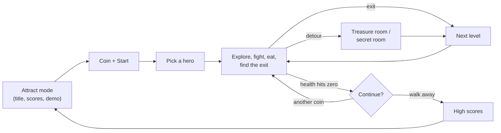

# Chapter 1 — Enter the Gauntlet (How the Game Plays)

**This chapter answers:** What is Gauntlet II, what does a player actually do
at the cabinet, and which rules make it feel like Gauntlet II and nothing else?

**By the end you will understand:** the controls and the handful of verbs they
drive, the four heroes and their broad tradeoffs, how health doubles as the
game's currency, the overall shape of a play session, and a working vocabulary
— maze, hero, monster, generator, item, info panel — that every later chapter
builds on.

**It builds on:** nothing. This is the front door of the book, and of the
dungeon.

---

## Four joysticks, one dungeon

Picture the machine first. A Gauntlet II cabinet is wide enough that four
people can stand at it shoulder to shoulder, each at their own control
station: one eight-way joystick and two buttons per person. The stations are
color-coded — red, blue, yellow, and green — and the game keeps that color
pairing everywhere. If you play at the blue station, your
hero is blue, your score column is blue, and when the cabinet talks about you
(it talks a lot), it calls you "Blue Warrior" or "Blue Elf."

Everyone shares a single screen. It shows a window onto a maze seen from
above: stone walls, floor, scattered food and treasure, doors, an exit
somewhere — and monsters. Usually a *lot* of monsters, because the maze is
seeded with **generators**, objects that continuously spawn new monsters until
someone destroys them. The pitch of the game in one sentence: walk into the
maze with up to three friends, fight through the crowd, grab what you can,
find the exit, and do it again one level deeper — for as long as your health
(and your pocket change) holds out.

There is no princess to rescue and no final boss. Gauntlet II is an endurance
game, and everything else in this chapter is about what "enduring" costs.

## The controls, and the eight verbs

> **[image needed]** `book/img/ch01_control_panel.png`: a simple labeled
> diagram of a single control station — one eight-way joystick (arrows showing
> all eight directions) flanked by the two buttons, labeled **Fire** and
> **Magic**, with a caption noting the four color-coded stations (red, blue,
> yellow, green). This can be drawn as a clean vector diagram, or cropped from
> a photograph of an actual Gauntlet II control panel with labels added; it is
> not producible from ROM data or MAME.

Each station has exactly three inputs — a stick and two buttons — and the
entire game is played through them:

| Input | What it does |
|-------|--------------|
| Joystick | Walk in any of eight directions; also swings your melee attack toward whatever you walk into |
| **Fire** | Shoot a projectile in the direction you're facing |
| **Magic** | Drink one of the potions you're carrying, damaging every monster in view |

Everything else the player does — collecting items, eating food, opening
doors, entering transporters, stepping onto the exit — happens by walking into
things. Keys are spent automatically when you touch a locked door; food is
eaten by walking over it; treasure leaps into your score. The game never asks
you to manage a menu. Its one moment of restraint.

Two warnings the cabinet itself will give you, so this book may as well too:
your shots destroy some food ("Someone shot the food!" is the machine's
best-known line of dialogue), and shooting one of your own potions sets it
off on the spot — a waste the game makes sure to announce. Both lessons are
usually learned the hard way, about four seconds apart.

## Choosing your hero

> **[image needed]** `book/img/ch01_four_heroes.png`: the four player
> characters — Warrior, Valkyrie, Wizard, Elf — each rendered as a single
> standing/walking-down sprite from the graphics ROMs using `python-gex`
> (e.g. the `gex` sprite names for each character's walk-down frame, scaled
> 3–4× with nearest-neighbor), arranged left to right with name labels
> underneath.

When you coin up, you pick one of four heroes by pointing the joystick: up
for the **Warrior**, left for the **Valkyrie**, down for the **Wizard**,
right for the **Elf**. Any station can pick any hero — four
Wizards is a legal, if chaotic, party — and your color still comes from where
you're standing.

The four differ in the ways you'd guess from their silhouettes:

- **Warrior** — hits hardest hand-to-hand; slow; weak magic.
- **Valkyrie** — the best armor, so everything hurts her less; middling
  elsewhere.
- **Wizard** — devastating potions and magic; practically allergic to being
  touched.
- **Elf** — fastest on his feet; his shots are quick but light.

That's deliberately vague, because the exact numbers live in tables in the
ROM — movement speed per character, shot damage per character, armor per
character — and Chapter 10 lays those tables out with proper labels. For now
it's enough to know the tradeoffs are real, data-driven, and noticeable within
your first minute of play.

## Health is money

Here is the rule that makes Gauntlet II *Gauntlet II*: your hero has no lives,
no shields, no timer. There is a single number under your name — health — and
it is always going down.

- **Time drains it.** Just standing around costs health, tick by tick. The
  dungeon meters your visit.
- **Damage drains it faster.** Every monster touch, fireball, and hazard
  subtracts from the same number.
- **Food restores it.** Each plate of food is worth a solid meal — one
  hundred points of health.
- **Coins restore it.** Dropping another coin into the slot while you play
  adds a chunk of health (how much is up to the arcade operator — it's a
  configurable setting, typically several hundred points).

When your health gets low the game starts a heartbeat sound that quickens as
the number falls, your health readout pulses on the panel, and the cabinet
announces, by color and class, that "your life force is running out!" — or
the blunter classic, "needs food, badly." At zero, your hero dies. If nobody else
is still standing, the game offers a countdown: *press start within so-many
seconds to continue at this level*. Another coin, and you're back where you
fell.

So health is simultaneously your life bar and the arcade's cash register, and
the game is refreshingly honest about it. It even scores you that way: the
high-score table doesn't rank raw points, it ranks **score per coin** — how
efficiently you spent your money — which may be the most honest scoreboard in
arcade history.

While health flows out, three other pockets fill up, and for now you only
need their names: your **score** (monsters and treasure), your **inventory**
(keys to open doors, potions for the Magic button — you can carry a pile of
each), and a **score multiplier** that can grow above one and makes everything
worth more. Where these live in memory, and who is allowed to change them, is
a story for Chapters 10 and 14.

## The shape of a game

A full session traces a loop that this book will keep returning to:

Left alone, the cabinet runs its **attract mode** on a cycle — high scores,
title screen, a self-playing demo (which, we'll see in Chapter 15, is a
recording of real inputs played back through the real game engine), and a
"legend" screen that explains the monsters and items. A coin and a start
button break the cycle and put a hero in the maze.

From there the loop is: explore and fight, find the exit, next level. Some
levels detour into a **treasure room** — a timed scramble to grab loot
before a spoken countdown runs out — and some hide the entrance requirements
for a **secret room**, a challenge stage with its own strange rules. Death
leads to the continue countdown; walking away leads to the score-per-coin
high-score ceremony and back to attract mode.

Two things about this loop are unusually friendly for 1986. First, **anyone
can join at any time**: a friend with a coin can drop into the middle of your
level, pick a hero, and appear beside you — no waiting for a game over.
Second, the loop has no bottom. The levels keep coming, remixing more than a
hundred stored maze layouts, for as long as the party lasts. Chapter 7 turns
this sketch into the game's actual state machine, and Chapter 9 explains
where levels really come from.

## What makes it Gauntlet II

If you've seen the original Gauntlet, everything so far sounds familiar — the
sequel's maze-crawling core is the same. What the 1986 sequel added is a layer
of mischief. A preview, with pointers to the chapters that dissect each trick:

- **Any hero, any station, any time.** Four Valkyries welcome. Join-in-progress
  multiplayer (Chapters 7 and 10).
- **Tag — you're IT.** A darting creature haunts some levels; touch it and
  you become IT. Monsters single you out, an "IT" label appears by your name,
  and the cabinet announces it aloud. Tag another hero to pass it on.
  Cooperative play, temporarily competitive (Chapter 10).
- **Levels that fight dirty.** Per-level hazard flags can make monsters
  faster or let them move at odd angles, make walls invisible, make the maze
  wrap around at its edges — walk off the left, arrive from the right — and,
  on the meanest levels, let players' shots stun or even hurt each other
  (Chapters 9 and 13).
- **Architecture with opinions.** Walls that shift on a cycle, walls that
  appear and disappear at random, walls you can push, walls you can shoot
  down, secret walls, exits that wander around the level, and exits that are
  lying to you (Chapter 13). Wait long enough on a level and the dungeon
  starts opening its own doors to hurry you along.
- **Transporters and forcefields.** Sparkling pads teleport whoever steps on
  them; blinking energy fences meter the corridors (Chapter 13).
- **The dragon.** A screen-filling, multi-part boss monster that sleeps until
  someone wanders close. It doesn't appear until you're a dozen levels deep
  (Chapter 12).
- **The thief and the mugger.** A thief studies which player is carrying the
  most valuable loot, sneaks in, steals an item, and sprints for the edge of
  the level. His cousin the mugger would rather rough you up and steal health
  instead (Chapter 12).
- **Treasure rooms that heckle you.** The timed bonus rooms count down out
  loud — and on deep levels, once in a while, the voice *lies about the
  numbers* and then says "just kidding" (Chapter 13). Someone at Atari put
  that in on purpose; Chapter 13 shows you the code that decides when to
  troll you.
- **Secret rooms and secret codes.** Every ordinary level hides an unmarked
  challenge — feats like "don't touch any treasure" or "shoot three secret
  walls." Pull one off and you earn a visit to a secret room; win *that* and
  the machine can print a cryptic six-character code that fed a real mail-in
  contest — the ROM still carries the entry-form text, deadline and all:
  "CONTEST ENDS 12/19/86" (Chapter 13 decodes the whole pipeline, including
  how to verify a code yourself).
- **Crowds.** Not five monsters. Not ten. Walls of ghosts deep enough that
  shooting into them is a form of digging. How a 1986 machine keeps that many
  actors moving is one of the central questions of this book (Chapters 8
  and 11).

## A visual vocabulary

One last piece of equipment for the road: names for what's on screen. Later
chapters will point back to this picture.

> **[image needed]** `book/img/ch01_gameplay_annotated.png`: a MAME screenshot
> of Gauntlet II mid-game with two or more active players, annotated with
> labeled callouts for: (1) the **maze** — walls and floor filling most of the
> screen; (2) two **heroes** with their station colors; (3) a crowd of
> **monsters** (ideally ghosts or grunts); (4) a **generator** actively
> spawning; (5) floor **items** — at least food, a key, a potion, and
> treasure; (6) the **exit**; (7) the **info panel** along the screen edge
> showing each player's score, health, and inventory icons; (8) a **text
> message** line (e.g. a hint or announcement); and (9) a note that the whole
> view is a **camera window** onto a larger maze that scrolls to follow the
> party. Produce by running Gauntlet II in MAME, starting a two-player game on
> an early level, pausing near a generator with items visible, taking a
> screenshot, and adding the labels in an image editor.

- The **maze** is the world: a grid of walls, floors, doors, and hazards.
  You see it through a **camera window** that scrolls to follow the party —
  all players share one screen, and the camera compromises when you spread
  out — past a point, the screen edge itself holds the party together
  (Chapter 8 explains the rubber-band).
- **Heroes** are the four player characters; **monsters** are everything
  trying to stop them; **generators** are the objects that mint new monsters.
- **Items** lie on the floor: food, keys, potions, treasure, and a family of
  special power-ups (invisibility, invulnerability, reflecting shots, super
  shots, and more — Chapter 10 has the full catalog).
- The **info panel** runs along the edge of the screen, one column per
  station: score, health, hero name in station color, inventory icons, and
  occasional labels like "IT." Floating score numbers pop up in the maze
  itself when you earn points.
- **Text messages** — hints, welcomes, warnings, the continue countdown —
  are drawn over the action on a separate text layer. And under everything,
  the cabinet's voice narrates: welcoming players, announcing who's IT,
  scolding whoever shot the food.

That's the game as the player meets it: three controls, one dwindling number,
and a dungeon that cheats affectionately. The rest of this book is about the
machine underneath — and the next chapter sets the ground rules for how we
know what we claim to know.

---

> **Under the hood**
>
> Everything in this chapter is grounded in the maintained technical docs;
> these are the load-bearing entry points if you want to dig now:
>
> - Joystick/button bit assignments: `doc/05_data_reference.md` §3.11; the
>   per-frame debounce that reads them is `input_debounce` (0x40644),
>   `doc/04_game_subsystems.md` §15.
> - Hero selection by joystick direction (up=Warrior, left=Valkyrie,
>   down=Wizard, right=Elf): `character_select_input_update` (0x42DF4),
>   `doc/04_game_subsystems.md` §22.
> - Station colors and speech: `player_color_name_ptrs` (0x57212) and
>   `speech_charname_tbl` (0x596F6, "RED WARRIOR" … "GREEN ELF"),
>   `doc/05_data_reference.md` §5.
> - Health drain, low-health heartbeat cadence, and the pulsing readout:
>   `main_health_countdown` (0x466F6), `doc/04_game_subsystems.md` §4.3 and
>   §14.2. Food's +100 health and other walk-into pickups:
>   `player_tile_interact` (0x511AC), §4.6.
> - Coins → health (operator-configurable table) and mid-game re-coining:
>   `coincheck` (0x42B6A), `doc/04_game_subsystems.md` §10.1; the setting
>   values are in `doc/05_data_reference.md` §3.10.
> - Score-per-coin high-score ranking: `highscore_check` (0x49D0E),
>   `doc/04_game_subsystems.md` §10.3. Score multiplier:
>   `player_add_score_with_mult` (0x5214C), §4.7.
> - The continue prompt ("PRESS START … TO CONTINUE GAME AT THIS LEVEL"):
>   `show_continue_prompt` (0x44C7E), `doc/04_game_subsystems.md` §10.5.
> - Join-in-progress: `player_join` (0x48BB6), `doc/04_game_subsystems.md`
>   §4.4. The IT label, speech, and IT-player variable (0x9049DC):
>   `player_it_label_set` (0x45866), §4.5.
> - Per-level hazard flags (fast/odd-angle monsters, invisible walls,
>   wraparound, shots-stun/shots-hurt friendly fire): the level-flags enums in
>   `doc/05_data_reference.md` §3.12.
> - Dragons are suppressed from maze data before level 12 in a normal game:
>   `maze_place_object` (0x45E40), `doc/04_game_subsystems.md` §5.4.
> - Treasure-room countdown, including the fake-countdown gag: 
>   `main_treasure_timer` (0x4D29E), `doc/04_game_subsystems.md` §16.
> - Idle-timer door opening ("Doors Open"): `open_timed_doors` via
>   `main_move_players`, `doc/04_game_subsystems.md` §4.1.
> - The 117 stored maze layouts: `doc/06_maze_catalog.md`.
