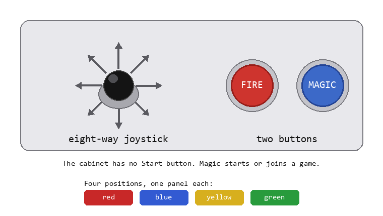
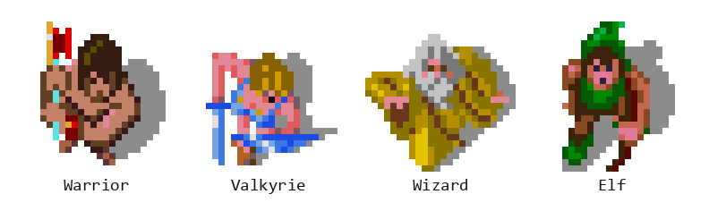
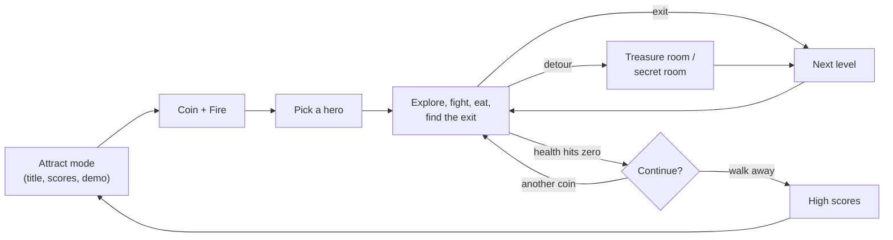
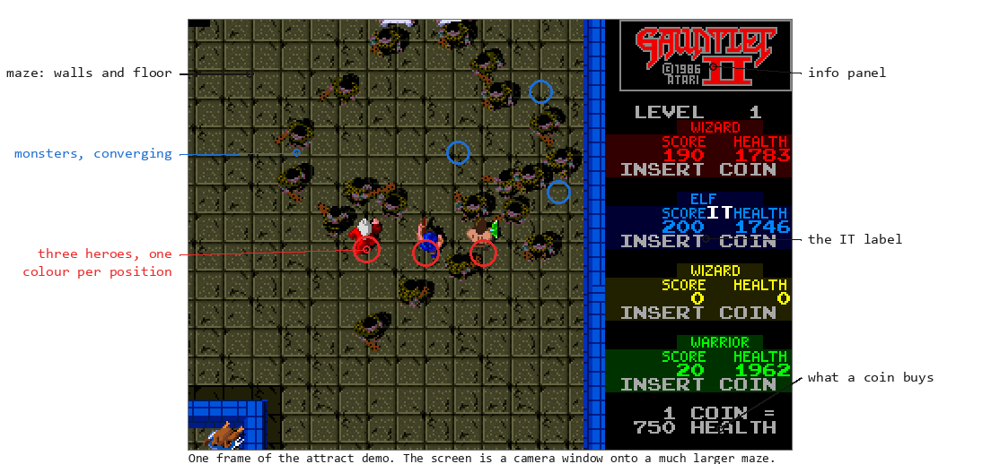

# Chapter 1 — Enter the Gauntlet (How the Game Plays)

**This chapter answers:** What is Gauntlet II, what does a player do at the
cabinet, and which rules give the game its particular character?

**By the end you will understand:** the controls and the actions they drive,
the four heroes and their broad tradeoffs, how health doubles as the game's
currency, the overall shape of a play session, and a working vocabulary (maze,
hero, monster, generator, item, info panel) that later chapters build on.

**It builds on:** nothing. This is the front door of the book, and of the
dungeon.

---

## Four joysticks, one dungeon

A Gauntlet II cabinet is wide enough for four people standing shoulder to
shoulder, each with an eight-way joystick and two buttons. The four player
positions are color-coded red, blue, yellow, and green, and the game carries
that color through everything it shows you. Play at the blue position and your
hero is blue, your score column is blue, and when the cabinet talks about you,
which it does constantly, it calls you "Blue Warrior" or "Blue Elf."

Everyone shares one screen, which looks down on a maze of stone walls and
floor, scattered food and treasure, doors, an exit somewhere, and monsters.
Usually a *lot* of monsters, because the maze is seeded with **generators**,
objects that keep spawning new ones until someone destroys them. Walk in with
up to three friends, fight through the crowd, grab what you can, reach the
exit, and start over one level deeper, for as long as your health and your
pocket change hold out. Gauntlet II is an endurance game, and its dungeon runs
deeper than any party can survive.

## The controls

*One player position. The stick reads eight directions, and the two buttons
are everything else you can do. Four of these panels sit side by side, one
per colour-coded position.*

A stick and two buttons per position, and the whole game is played through
them:

| Input | What it does |
|-------|--------------|
| Joystick | Walk in any of eight directions; also swings your melee attack toward whatever you walk into |
| **Fire** | Shoot a projectile in the direction you're facing |
| **Magic** | Drink one of the potions you're carrying, damaging every monster in view; it doubles as the start/join button between games |

Walking into things covers the rest of what a player does. You collect items,
eat food, open doors, step into transporters, and reach the exit by putting
your hero on top of them. A key spends itself the instant you touch a locked
door. No menu ever appears.

The cabinet issues two warnings early, so this book may as well repeat them.
Your shots destroy some kinds of food, and "Someone shot the food!" is the
machine's best-known line of dialogue. Shooting one of your own potions sets
it off where it lies, which the game also announces. Both lessons tend to
arrive within seconds of each other.

## Choosing your hero

*The four heroes as the game draws them, decoded from the graphics ROMs:
each is shown standing and facing the player, wearing a different
position's color (red Warrior, blue Valkyrie, yellow Wizard, green Elf).
The soft gray blob is the sprite's built-in shadow.*

Drop a coin, press Magic, and the game asks who you want to be. Point the
joystick up for the **Warrior**, left for the **Valkyrie**, down for the
**Wizard**, right for the **Elf**. Any position can pick any hero, so a party
of four Wizards is legal, and your color still comes from where you stand.

The four differ in ways their silhouettes suggest:

- **Warrior** hits hardest hand-to-hand. He is slow, and his magic is feeble.
- **Valkyrie** wears the best armor, so everything hurts her less. Her other
  numbers sit in the middle.
- **Wizard** turns a potion into a catastrophe for whatever stands nearby,
  and a single monster touch costs him dearly.
- **Elf** covers ground faster than the rest. His shots are quick and light.

Those descriptions stay vague on purpose. The exact numbers live in ROM tables
covering movement speed, shot damage, armor, and magic, one entry per
character, and Chapter 10 lays them out with proper labels. The tradeoffs show
up inside a minute of play.

## Health is money

Your hero carries one number, health, and it falls the whole time you play.
Everything another game might track with lives or shields collapses into that
single value.

- **Time drains it.** Standing still costs health, tick by tick. The dungeon
  meters your visit.
- **Damage drains it faster.** A monster's touch, a fireball, a floor hazard,
  a shot from a careless friend: it all comes off the same number.
- **Food restores it.** A plate of food is worth one hundred points of
  health.
- **Coins restore it.** Feeding the slot mid-game buys a chunk of health, in
  an amount the arcade operator configures. Several hundred points is
  typical.

Once health runs low the machine starts a heartbeat sound that quickens as the
number falls, your health readout pulses on the panel, and the cabinet
announces by color and class that "your life force is running out!" The
blunter classic, "needs food, badly," comes from the same warning system. At
zero your hero dies, and if nobody else is still standing you get a countdown
inviting one more coin to continue at the level where you fell.

Health works as your life bar and as the arcade's cash register, which the
game makes no attempt to disguise. The high-score table ranks players by
**score per coin**, a measure of how efficiently the money was spent.

Other quantities move upward while health drains. Score climbs when you kill
things and pocket treasure. Keys for doors and potions for the Magic button
pile up in an inventory with room for plenty of both, and a **score
multiplier** that can rise above one makes everything pay better while you
hold it. Where all this lives in memory, and which code may change it, waits
for Chapters 10 and 14.

## The shape of a game

A full session traces a loop that this book will keep returning to:

Left alone, the cabinet cycles through its **attract mode**: high scores, the
title screen, a self-playing demo, and a "legend" screen that explains the
monsters and items. That demo is a recording of real inputs played back
through the real game engine, as Chapter 15 shows. A coin and a press of Magic
break the cycle and put a hero in the maze.

After that you explore and fight until you find the exit, which drops you into
the next level. Some levels detour into a **treasure room**, a timed scramble
for loot under a spoken countdown. Others hide the requirements for entering a
**secret room**, a challenge stage with strange rules of its own. Dying leads
to the continue countdown, and walking away leads to the score-per-coin
high-score ceremony and back to attract mode.

Two parts of this loop were unusually friendly for 1986. Anyone can join at
any time, so a friend with a coin drops into the middle of your level, picks a
hero, and appears beside you without waiting for a game over. The loop also
has no bottom, remixing more than a hundred stored maze layouts for as long as
the party lasts. Chapter 7 turns this sketch into the game's actual state
machine, and Chapter 9 explains where levels come from.

## What makes it Gauntlet II

If you have seen the original Gauntlet, the maze-crawling core here will look
familiar. What the 1986 sequel added is a layer of mischief, previewed below
with pointers to the chapters that take each trick apart.

- **Any hero, any position, any time.** Four Valkyries are welcome, and
  players can join a game already in progress (Chapters 7 and 10).
- **Tag, and you're IT.** A darting creature haunts some levels. Touch it and
  you become IT: monsters single you out, an "IT" label appears by your name,
  and the cabinet announces the news aloud. Tagging another hero passes it on
  (Chapter 10).
- **Levels that fight dirty.** Per-level hazard flags can speed monsters up,
  let them move at odd angles, hide walls, and wrap the maze around at its
  edges so that walking off the left brings you in from the right. On the
  meanest levels, players' shots stun or wound each other (Chapters 9 and 13).
- **Architecture with opinions.** Walls shift on a cycle, appear and vanish at
  random, slide when pushed, and fall when shot. Exits wander around the
  level, and some of them are lying to you (Chapter 13). Wait long enough and
  the dungeon starts opening its own doors to hurry you along.
- **Transporters and forcefields.** Sparkling pads teleport whoever steps on
  them, and blinking energy fences meter the corridors (Chapter 13).
- **The dragon.** A screen-filling boss monster built from several pieces
  sleeps until somebody wanders close. A normal game keeps it out of sight
  until you are a dozen levels deep (Chapter 12).
- **The thief and the mugger.** A thief works out which player carries the
  most valuable loot, sneaks in, takes an item, and sprints for the edge of
  the level. His cousin the mugger prefers to rough you up and steal health
  (Chapter 12).
- **Treasure rooms that heckle you.** The timed bonus rooms count down out
  loud, and on deep levels the voice occasionally *lies about the numbers*
  before admitting "just kidding" (Chapter 13). Someone at Atari put that in
  on purpose, and Chapter 13 shows the code that decides when to troll you.
- **Secret rooms and secret codes.** Every ordinary level hides an unmarked
  challenge, with feats like "don't touch any treasure" or "shoot three
  secret walls." Pull one off and you earn a visit to a secret room; win
  *that* and the machine can print a cryptic six-character code that fed a
  real mail-in contest. The ROM still carries the entry-form text, deadline
  included: "CONTEST ENDS 12/19/86" (Chapter 13 decodes the whole pipeline,
  including how to verify a code yourself).
- **Crowds.** Ghosts arrive in walls thick enough that shooting into them
  amounts to digging. How a 1986 machine keeps that many actors moving is one
  of the central questions of this book (Chapters 8 and 11).

## A visual vocabulary

Names for what's on screen, which later chapters will point back to.

*A single frame with the vocabulary labelled: the maze the party walks
through, three heroes in their position colours, a crowd of grunts closing
in, and the info panel that reports on all of it. The frame comes from the
attract demo, which Chapter 15 shows is the real game engine playing back a
recording.*

- The **maze** is the world: a grid of walls, floors, doors, and hazards. You
  see it through a **camera window** that scrolls to follow the party. All
  players share one screen, so the camera compromises when you spread out,
  and past a certain distance the screen edge itself holds the party together
  (Chapter 8 explains the rubber-band).
- **Heroes** are the four player characters. Everything trying to stop them is
  a **monster**, and the objects that mint new monsters are **generators**.
- **Items** lie on the floor: food, keys, potions, treasure, and a family of
  special power-ups covering invisibility, invulnerability, reflecting shots,
  super shots, and more. Chapter 10 has the full catalog.
- The **info panel** runs along the edge of the screen with one column per
  player position: score, health, hero name in that position's color,
  inventory icons, and occasional labels like "IT." Floating score numbers pop
  up in the maze itself when you earn points.
- **Text messages** such as hints, welcomes, warnings, and the continue
  countdown are drawn over the action on a separate text layer. Underneath
  everything, the cabinet's voice narrates: welcoming players, announcing
  who's IT, scolding whoever shot the food.

Chapter 2 sets the ground rules for how this book knows what it claims about
the machine underneath.

---

> **Under the hood**
>
> Everything in this chapter is grounded in the maintained technical docs.
> These are the load-bearing entry points if you want to dig now:
>
> - Joystick/button bit assignments (Magic is bit 0, Fire bit 1, both active
>   low): `doc/05_data_reference.md` §3.11; the
>   per-frame debounce that reads them is `input_debounce` (0x40644),
>   `doc/04_game_subsystems.md` §15. The start/join press the game waits for
>   is a debounced edge on the Magic line, `doc/04_game_subsystems.md` §6.4.
> - Hero selection by joystick direction (up=Warrior, left=Valkyrie,
>   down=Wizard, right=Elf): `character_select_input_update` (0x42DF4),
>   `doc/04_game_subsystems.md` §22.
> - Player-position colors and speech: `player_color_name_ptrs` (0x57212) and
>   `speech_charname_tbl` (0x596F6, "RED WARRIOR" … "GREEN ELF"),
>   `doc/05_data_reference.md` §5.
> - Health drain, low-health heartbeat cadence, and the pulsing readout:
>   `main_health_countdown` (0x466F6), `doc/04_game_subsystems.md` §4.3 and
>   §14.2. Food's +100 health and other walk-into pickups:
>   `player_tile_interact` (0x511AC), §4.6.
> - Coins → health (operator-configurable table) and mid-game re-coining:
>   `coincheck` (0x42B6A), `doc/04_game_subsystems.md` §10.1; the setting
>   values are in `doc/05_data_reference.md` §3.10.
> - Score-per-coin high-score ranking: `highscore_check` (0x49D0E),
>   `doc/04_game_subsystems.md` §10.3. Score multiplier:
>   `player_add_score_with_mult` (0x5214C), §4.7.
> - The continue prompt ("PRESS START … TO CONTINUE GAME AT THIS LEVEL"):
>   `show_continue_prompt` (0x44C7E), `doc/04_game_subsystems.md` §10.5.
> - Join-in-progress: `player_join` (0x48BB6), `doc/04_game_subsystems.md`
>   §4.4. The IT label, speech, and IT-player variable (0x9049DC):
>   `player_it_label_set` (0x45866), §4.5.
> - Per-level hazard flags (fast/odd-angle monsters, invisible walls,
>   wraparound, shots-stun/shots-hurt friendly fire): the level-flags enums in
>   `doc/05_data_reference.md` §3.12.
> - Dragons are suppressed from maze data before level 12 in a normal game:
>   `maze_place_object` (0x45E40), `doc/04_game_subsystems.md` §5.4.
> - Treasure-room countdown, including the fake-countdown gag:
>   `main_treasure_timer` (0x4D29E), `doc/04_game_subsystems.md` §16.
> - Idle-timer door opening ("Doors Open"): `open_timed_doors` via
>   `main_move_players`, `doc/04_game_subsystems.md` §4.1.
> - The 117 stored maze layouts: `doc/06_maze_catalog.md`.
