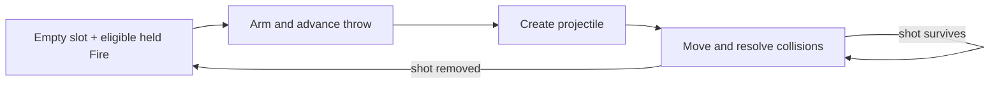

# 2. One arrow in the air

An Elf stands at one end of a clear corridor, firing at a generator. Hold
Fire and watch the arrows. Each travels down the passage before another
one can take its place. Now imagine making the same attack from nearer the
generator. The arrow has less distance to cover, and the next shot can
begin sooner.

The button has not changed. Neither has the character's weapon. The
distance to the target has become part of the firing rate.

The rule underneath is unusually direct: every player owns one projectile
record. While that record holds a live shot, the player cannot launch
another. A second arrow does not wait invisibly behind the first. There
is nowhere in the player's allocation to put it.

This is a small enough rule to understand without a memory map. Following
it through a fight will introduce several ideas that recur throughout the
game: reserved resources, frame timing, table-driven characters, and
collisions that do more than remove whatever they hit.

## A place reserved for your shot

The moving pictures on the screen are sprites. Atari's hardware calls
them motion objects, usually shortened to MOBs. A sprite is described by
numbers telling the display which artwork to use, where to put it, and how
to color it. Changing those numbers moves or changes the picture without
requiring the main processor to redraw every pixel.

The game reserves MOB slots 1 through 4 for the four players' shots. The
red player's projectile always uses the first of these, the blue player's
the second, and so on. A player does not borrow an empty neighbor's slot.
Playing alone leaves three reservations unused rather than giving one
hero four projectiles.

The shot's picture field also answers a useful software question. Zero
means that the slot is empty. A nonzero value means that a projectile is
already there. Before creating a shot, the routine we call
`player_create_shot` checks the relevant field.

Its essential allocation decision can be expressed this way:

```text
slot = this player's reserved projectile slot
if slot already contains a shot:
    do not create another
otherwise:
    install the shot's picture, position, color, and direction
```

This is explanatory pseudocode, not a transcription of the complete
routine. The important operation is the refusal at the beginning.
Producing a picture is conditional on a resource becoming available.

It is tempting to read a one-projectile limit as the maximum the hardware
could draw. The rest of the screen rules that out: many other motion
objects are visible, and enemy projectiles have their own reservations.
The shipped program has assigned this particular resource in this
particular way. That establishes the rule we play under, without telling
us all the reasons its authors chose it.

## Pressing Fire takes time

The empty slot does not by itself fire the weapon. The player's action
state has to reach the moment at which a projectile is created.

Gauntlet II normally advances in steps tied to the display, approximately
sixty updates each second. We will call one of those updates a frame.
During an eligible update, held Fire arms the shooting action and resets
an animation counter. The player update advances that counter. With the
shipped threshold of three, the creation call happens on the fourth
counter update, when the counter's previous value is three.

There is therefore a short wind-up between arming a throw and producing
its shot. The counter is also used to select the player's picture, so
the visible action and the launch share a piece of state. The four-count
launch delay should not be confused with playing four distinct drawings:
the artwork lookup has its own division of the counter.

The input path checks whether the projectile slot is busy before it arms
another throw. Holding Fire asks the system to repeat when it can; it
does not queue a pile of button presses or restart a throw every frame.



*The ordinary repeating cycle. Player state can prevent a new throw, and
a surviving collision can keep the same shot in flight.*

Two waits now contribute to the feel of the weapon: the launch sequence
and the lifetime of the shot after launch. A close target shortens the
second wait. It does not eliminate the first.

## Distance becomes part of the weapon

We can isolate travel from the other parts of a shot with a small
calculation. An ordinary Elf arrow travelling horizontally moves five
pixels per projectile update. Suppose we compare two unobstructed travel
distances, measured from the projectile's starting position:

| Distance travelled | Movement updates at five pixels each |
|--------------------|--------------------------------------|
| 30 pixels | 6 |
| 150 pixels | 30 |

These are illustrative distances, not measurements of two captured
attacks. They describe the motion term only. Actual impact timing also
depends on the launch offset, the target's collision geometry, update
order, and whether something else gets in the way.

Even with those qualifications, the difference is large enough to matter.
At the nominal frame rate, the longer flight occupies the shot record
for about half a second of motion. Throughout that interval, holding Fire
cannot create a second arrow. In the shorter case, the record can become
free much sooner.

This is why moving toward a generator can make an attack more productive.
The generator does not need to notice that you have moved closer or award
you a proximity bonus. A shorter flight frees the same resource earlier.

The route must remain clear for the comparison to hold. If a monster
steps between you and the generator, the ordinary arrow strikes that
monster instead. You may be firing regularly while making little progress
against the object that is producing the crowd. Removing the bodies in
front creates a temporary line through which the next shot can reach the
source.

At close range the line is shorter, but so is the space between you and
the new monsters. Approaching changes the risk as well as the waiting
time. Standing still at a distance and advancing under fire are different
ways of spending health to make progress.

## Four characters, several meanings of strength

The four heroes use the same broad shot machinery with different table
entries. The game's data distinguishes projectile speed from projectile
damage.

For a straight horizontal shot, the speed entries translate to:

| Hero | Ordinary pixels per update | With extra shot speed |
|------|----------------------------|-----------------------|
| Warrior | 3 | 4 |
| Valkyrie | 4 | 5 |
| Wizard | 4 | 5 |
| Elf | 5 | 7 |

Diagonal shots have their own horizontal and vertical entries; this table
is a comparison along one axis, not a claim that every direction uses the
same component.

A faster projectile reaches a fixed target sooner and frees its player's
slot sooner. Extra shot speed can therefore improve the rhythm of
repeated attacks as well as the speed at which a single projectile crosses
the screen. How much it helps depends on the flight distance and the
other delays in the cycle.

Damage uses a separate pair of tables:

| Hero | Ordinary shot damage | With extra shot power |
|------|----------------------|-----------------------|
| Warrior | 2 | 2 or 3 |
| Valkyrie | 1 | 2 |
| Wizard | 1 or 2 | 2 |
| Elf | 1 | 2 |

The variable entries add a random zero or one. Those draws belong to the
game's shared random stream; they are not a separate simulated die owned
by each player.

The Warrior's slower ordinary projectile can do more per hit than the
Elf's faster arrow. Which advantage matters depends on the target. If one
point is enough to finish it, extra damage contributes nothing to that
kill. Against a stronger target, removing another required hit can matter
more than shortening one flight.

The distinction also explains why two similarly named upgrades cannot be
treated as synonyms. Extra shot speed selects a different velocity row.
Extra shot power selects a different damage entry. One changes how soon
the collision occurs; the other changes what happens when it does.

## Follow the arrow into a grunt

Consider an ordinary, one-point Elf arrow hitting a full-strength grunt.
The grunt has three strength steps to lose. After the first hit it
survives in the second step. A second comparable hit leaves the weakest
step, and a third removes it.

The changes are visible because, for an ordinary grunt, the state used as
health is also the palette number used to color its sprite.


*Weakest at left, strongest at right. A one-point hit on the rightmost
grunt moves it one step left. The next hit moves it left again; the third
removes it. The drawing itself need not change to show the first two hits.*

A palette is a small set of colors that the display looks up while
drawing. The grunt's three live values are 2, 3, and 4. Combat subtracts
damage from this field. A result still in that range describes a surviving
grunt; a result below the range ends its life.

That joins two operations a modern implementation might keep separate.
Reducing the health field already changes the color selection the display
will read. There is no second health-to-color translation to forget.
Other ordinary monster families use different palette ranges, so palette
4 is not a universal statement that any object has three health.

An ordinary arrow is consumed by the collision whether the grunt survives
or dies. From the shooter's point of view, the projectile slot is
available again. From the target's point of view, a field has changed or
the object has been removed. One collision has consequences for two
independently updated actors.

Generators illustrate why it is worth following the target's rules rather
than assuming everything uses the grunt's representation. A generator
also has strength tiers, but damage that weakens it changes its object
type and updates its picture. It becomes a weaker generator.

For example, one point against a tier-three generator leaves tier two;
another leaves tier one; the next destroys it. A two-point shot can take
the same generator directly to tier one. A three-point hit can destroy
it outright. The visible progression resembles monster damage while the
stored representation is different.

The weakened generator remains a source of monsters. Its type determines
the family and strength it produces. A hit that does not finish the
generator can still reduce the strength of its future output.

## Some collisions let the shot continue

The collision routine must answer two separate questions: what happened
to the target, and whether the projectile survives.

Ordinary walls generally end an ordinary shot. With the reflecting-shot
power, a wall can instead change its direction. The same projectile then
continues, occupying the same player reservation. A bounce extends what
one shot can reach while also extending the time before a replacement
can be launched.

Supershots change the calculation more dramatically. They use a flat
damage value of three and pierce ordinary monsters. Removing a grunt no
longer necessarily releases the shot slot: the projectile can continue
toward the next body. Death and IT have their own handling, so piercing
should not be read as an unrestricted rule for every creature.

This gives two ways to benefit from the one-shot allocation. You can make
the slot turn over sooner, or make the shot that already occupies it
accomplish more. A supershot travelling through a line of monsters uses
the second approach.

The objects beyond the enemy also matter. A projectile that continues
after a kill may reach food, a potion, a wall, or another player. The
world does not stop being interactive because the shot has already done
something useful. On levels with player-shot stun or damage enabled,
positioning a friend behind the target adds another possible outcome.

These exceptions need not be memorized before playing. They do explain
why watching where a shot ends can be more informative than watching only
where it first hits.

## Try predicting the next shot

Return to the generator at the end of the corridor. Before looking at
the code, it was possible to describe the attack as holding a button
while arrows appeared. We now have a sequence of specific questions.

Is the player's projectile slot empty? Can the player arm a throw?
Has the counter reached the launch point? How fast does this character's
shot move in that direction? What is the first object its collision
tests find? Does that interaction consume the projectile?

Each answer accounts for a piece of what appears on screen. Together they
let us predict changes. Moving closer should shorten unobstructed flight
time. Extra shot power should reduce the number of hits needed for some
targets without changing velocity. Reflection should keep one shot alive
longer rather than producing another projectile at the bounce.

There is still more to learn about a fight. Nearby monsters choose
targets, generators get opportunities to produce replacements, and the
camera limits where the player can stand. But those systems can now be
added to a working explanation of one action instead of arriving as an
unrelated list of routines.

A second person joining the game brings another reserved shot, another
set of decisions, and another body that needs room in the corridor.
The next chapter follows what happens when those independent players
must move through one shared view.

### Sources and further reading

- Shot ownership and reservations:
  [Game subsystems](../doc/04_game_subsystems.md), section 1.2.
  The creation routine is `player_create_shot` (`0x53666`).
- Input arming and the four-count launch:
  the same reference, section 2.2; the input gate is at
  `0x47B72-0x47BF6`, and the animation/creation path at
  `0x4AB08-0x4AC2A`.
- Velocity tables `shot_velocity_x` (`0x576E2`) and
  `shot_velocity_y` (`0x57792`):
  [Data reference](../doc/05_data_reference.md).
- Damage, generator type changes, reflection, and piercing:
  [Game subsystems](../doc/04_game_subsystems.md), section 26,
  `resolve_shot_hit` (`0x4AF50`).
- Readable implementation counterparts:
  [`players.py`](../gauntpy/src/gauntpy/subsystems/players.py),
  `player_create_shot` and `_advance_player_sprite`;
  [`shots.py`](../gauntpy/src/gauntpy/subsystems/shots.py),
  `shot_velocity` and `resolve_shot_hit`. These are the project's Python
  reconstruction, not original Atari source.

[Previous: Enter the Gauntlet](01_how_to_play.md) |
[Contents](README.md) |
[Next: Three friends, one screen](03_four_players.md)
