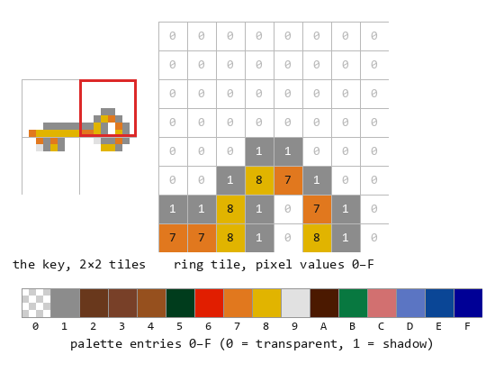
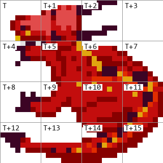
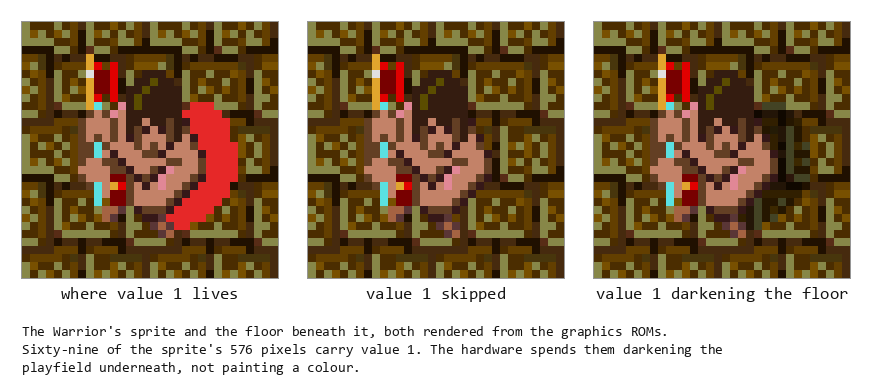
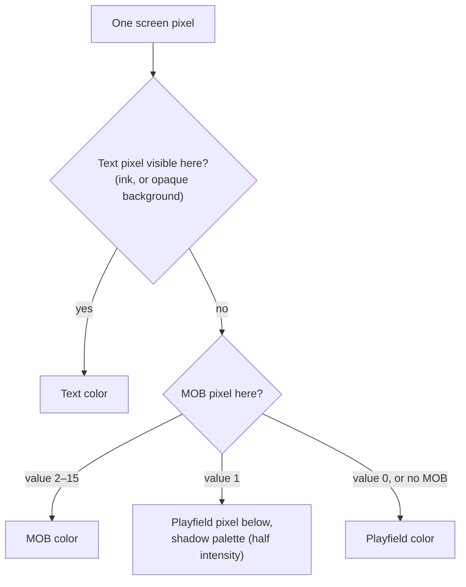

# Chapter 4 — Painting the Screen (The Display System)

**This chapter answers:** How do tables of numbers in video RAM become the
picture on the monitor?

**By the end you will understand:** tiles and palettes, the scrolling
playfield that shows the maze, the motion-object hardware that draws every
moving thing, the text layer above it all, and the priority rules that decide
which layer owns each pixel. You will also know exactly where rendering stops
and game logic begins.

**It builds on:** Chapter 3's division of labor, where the CPU maintains
tables describing the scene and dedicated video circuitry paints from them.
This chapter opens those tables.

---

## A curtain of spaces

Finish a level and watch the moment the last hero reaches the exit. The
screen drops to black, holds there while the next level is prepared, and
lights up again on fresh maze. It reads as the machine switching something
off.

The machine switched nothing off. That darkness is the display's topmost
layer, a grid of text characters, filled edge to edge with *opaque space
characters*: black rectangles with nothing printed on them. The monitor keeps
scanning, the video hardware keeps compositing all three of its layers at 60
frames a second, and behind the curtain the CPU is busily rewriting the maze.
When the new level is ready, the spaces revert to transparent and the world
is simply there, complete, with no drawing visible because all the drawing
happened backstage.

That trick uses every idea this chapter covers. The picture is built from
three layers, each layer is driven by a table in video RAM, and small edits
to those tables produce large visible effects. From bottom to top the layers
are the **playfield** (the maze), the **motion objects** (every moving
thing), and the **text layer** (scores, messages, and the occasional wall of
darkness). All three are assembled from the same raw material, so the tour
starts there.

## Tiles, the atoms of the picture

Every piece of art the machine can show is an 8×8-pixel **tile**, stored in
dedicated graphics ROMs that the video hardware reads directly. Chapter 3
mentioned that the CPU cannot see these chips at all; its entire artistic
vocabulary is the tile *number*. Writing picture word 0xA1E0 into the right
table makes the dragon's head appear: bit 15 is a software flag, so the actual
tile number is 0x21E0. Nothing in the address space lets the CPU find out what
the dragon's snout looks like.

Within a tile, each pixel is a 4-bit value from 0 to 15. The graphics ROMs
split those four bits across four chips, one bit-plane per chip, and the board
carries three such banks to cover the whole tile catalog. The video hardware
reads a bank's four chips in parallel and reassembles the values on the fly.

## Color by table

A pixel value of, say, 9 names no color by itself. It is an index into a
**palette**, a run of 16 color entries in the 2 KB of color RAM, and the same
tile drawn with two different palettes produces two different-looking
objects. Gauntlet II leans on this constantly: the red, blue, yellow, and
green versions of a hero are one set of tiles under four palettes, and
Chapter 11 will show monster strength tiers advertised the same way.

Each color entry is one 16-bit word holding four 4-bit fields: an intensity
value plus red, green, and blue levels. The hardware scales all three
channels by the intensity, which gives the software a single knob for
brightening or dimming a color without recomputing its hue. Color RAM holds
1,024 entries, of which 768 have assigned jobs: a bank for the text layer's
palettes, a bank of sixteen 16-color palettes for motion objects, a bank of
eight for the playfield, and a shadow bank described later in this chapter.

Here is the whole pipeline on one real sprite, the key from Chapter 1,
decoded straight from the graphics ROMs:

*The key is four tiles. Zooming into the ring tile shows the raw 4-bit
values; the strip below is the palette they index. Two values get special
treatment in sprites: 0 is transparent, and 1 (drawn gray here) is the
shadow effect explained later in this chapter.*

## The playfield

The bottom layer carries the maze. Its table is **playfield RAM**: a 64×64
grid of 16-bit words, one word per tile position, which at 8 pixels per tile
spans a 512×512-pixel world. Each word names a tile in its low 12 bits and
one of the eight playfield palettes in three higher bits, and that is the
whole format. Repainting a stone floor cell as acid means changing one word.

The screen is far smaller than the world. Of the 336×240 visible pixels, the
maze viewport gets a roughly 240×240 square, with the remaining strip along
the right given over to the score panel. Which part of the 512×512 world
appears in that viewport is set by two **scroll registers**, one horizontal
and one vertical. The camera work described back in Chapter 1, the view
gliding around to follow the party, is the game recomputing two numbers per
frame; the playfield itself never moves. Chapter 8 covers how the camera
decides where to look.

One more convention sits on top of this grid. The game's logical maze is
32×32 *cells*, each cell being 16×16 pixels: one wall segment, one door, one
slab of floor. A cell therefore covers a 2×2 block of playfield tiles, and
the game ROM carries a library of 8-byte **tile descriptors**, four tile
words each, that it stamps into playfield RAM whenever a cell changes.
Adjacent walls even get revisited after a change so their artwork stays
seamlessly joined, a detail Chapter 13 returns to when walls start moving on
their own.

## Motion objects

Anything that moves, and plenty that merely stands ready to move, is drawn
by the second layer: the **MOBs** (motion objects) introduced in Chapter 3.
The hardware provides 1,024 numbered slots. A slot is described by one word
in each of four parallel tables in video RAM, so MOB number *n* means "entry
*n* of all four":

| Table | What its word holds |
|-------|---------------------|
| Picture | Tile number for the sprite's top-left corner |
| Horizontal | X position (0–511) and which of the 16 MOB palettes to use |
| Vertical | Y position (0–511) plus width and height, in tiles |
| Link | The number of the next MOB for the hardware to consider |

The width and height fields run from 1 to 8 tiles each, so a single MOB can
cover anything from one tile to a 64×64-pixel block. For a multi-tile MOB
the hardware takes the picture word's tile number as the top-left corner and
reads subsequent tile numbers left to right, row by row, which means an
artist's big sprite is just a run of consecutive tiles in the graphics ROM.
A floor item such as the key or a potion is a 2×2-tile MOB, 16×16 pixels,
exactly one maze cell. Heroes and the common monsters run a size larger, 3×3
tiles for 24 pixels square, spilling a little past the edges of the cell
they occupy, which is part of why a dense crowd reads as a solid mass of
bodies. The dragon goes further still: its body is assembled from several
multi-tile MOBs working in concert, a construction Chapter 12 takes apart.

*A 4×4-tile block of the dragon's artwork, 32 pixels square. The hardware
is told one starting tile number T plus a width and height; consecutive
tiles fill the grid left to right, row by row.*

The link words are the interesting part. The hardware does no scanning of
all 1,024 slots; instead it follows chains of links from a set of 64 entry
points, one for every eight scanlines, visiting only the MOBs those chains
reach. That is how the machine can offer a thousand slots without paying
for a thousand lookups on every scanline. Atari called those entry points
**SLIPs**, for starting link points, and the name is worth learning now
because it turns up in the hardware documentation and in MAME. The software
arranges the chains the SLIPs point into, and it turns out to use the very
same links for its own purposes. That shared structure, one ordered chain
that both the display hardware and the game logic walk, is central to how
Gauntlet II manages crowds, and Chapter 8 gives it the full treatment.

## Transparency and shadows

Sprites are rarely rectangular, so two pixel values in every MOB get special
treatment instead of a palette lookup:

- **Value 0 is transparent.** The layer below shows through, which is what
  carves a ghost's silhouette out of its 16×16 block.
- **Value 1 is shadow.** The hardware draws the *underlying playfield
  pixel*, but looks its color up in a parallel **shadow palette** bank kept
  at half intensity. The floor shows through darkened, as if shaded.

Every walking character in the game carries a patch of value-1 pixels at its
feet, so heroes and monsters cast soft shadows on any floor they cross, with
the shading computed per pixel from whatever the floor beneath happens to
be. The cost is one reserved color index and a duplicate palette bank at
half brightness.

*The Warrior standing on a pale floor, rendered from the graphics ROMs. The
left panel paints the sprite's value-1 pixels red so you can see the crescent
they form; the middle skips them; the right does what the hardware does and
darkens the floor showing through them.*

## The text layer

The top layer is a 64×30 grid of characters, of which the leftmost 42
columns are on screen; it draws the scores, the messages, the continue
countdown, and the between-level curtain from this chapter's opening. Its
table is alpha RAM ("alphanumerics" in Atari's vocabulary), one word per
character cell: a character number from a set of 1,024, a small palette
selection, and one **opaque flag**. Characters are two bits per pixel, four
colors, which is plenty for text. Their pixel art lives in a character ROM
that, like the other graphics chips, the CPU can never read; the machine
cannot inspect its own font.

The opaque flag settles what character color 0 means. Clear, and color 0 is
transparent, letting the maze show through around the glyph's strokes; text
floats over the action. Set, and color 0 becomes solid, making the character
cell a filled rectangle that hides everything beneath it. An opaque space
character is therefore a perfect little black tile, and 42×30 of them are a
wall of darkness, the entire between-level blackout for the price of writing
one word per cell.

## One pixel, resolved

With all three layers defined, the hardware's per-pixel decision reads as a
short cascade:

Text beats sprites, sprites beat the maze, and the two special MOB values
punch holes or cast shade instead of painting. Sixty times a second the
hardware runs this cascade for every one of the 80,640 pixels while the CPU
touches none of them.

## Where rendering stops

Everything above describes appearance, and appearance is all it describes. A
playfield word says which wall artwork occupies a cell; whether anything can
walk through that cell is recorded elsewhere, in game-side state the video
hardware never sees. A MOB record places a monster's picture at an X and Y;
its health, its type, and its intentions live in other tables. Chapter 13
introduces exits whose artwork is indistinguishable from the real thing and
walls that exist logically while invisible, both possible precisely because
looks and truth are stored separately.

The game does thread its own data through the video tables where the
hardware leaves room: software-only bits ride unused fields of the MOB
words, and the link words serve double duty for game bookkeeping, as
Chapter 8 shows. The playfield and MOB tables are best understood as the
world's *visible half*. The next chapters climb back out to power-on
(Chapter 5) and the loop that updates these tables every frame (Chapter 6),
and then Chapter 8 opens the invisible half.

---

> **Under the hood**
>
> - Resolution, refresh, layer ordering, and the full per-pixel priority
>   flowchart: `doc/01_hardware.md` §4. Precise priority list: §4.2.
> - Tile format (8×8, 4 bpp, one graphics chip per bit-plane, three banks of
>   four): `doc/01_hardware.md` §5; the bank and chip grouping is
>   `TILE_ROMS`/`TILE_ROM_SETS` in `python-gex/src/gex/roms.py`. The
>   renderings in this book come from `python-gex`, which reimplements this
>   decoding.
> - Color RAM at 0x910000: IRGB entry format, region table (alpha 0–255,
>   MOB 256–511, playfield shadow 512–639, playfield 640–767, spare above),
>   and per-layer index formulas: `doc/01_hardware.md` §6.
> - Playfield RAM at 0x900000: 64×64 words, column-first indexing, palette
>   bits 14–12, tile bits 11–0; bit 15 has no shipped consumer (Strong
>   inference): `doc/01_hardware.md` §7.
> - The 8-byte 2×2 tile descriptors and the wall-reconnection redraw chain
>   (`refresh_tile_visual` 0x5F5A0, `write_tile_descriptor` 0x5E542,
>   `update_neighbor_tiles` 0x5F7F0): `doc/04_game_subsystems.md` §13.
> - MOB tables (picture 0x902000, horizontal 0x902800, vertical 0x903000,
>   link 0x903800) and pixel special cases: `doc/01_hardware.md` §8.1–8.6.
> - Sprite sizes and tile numbers come from the animation tables: players
>   are 3×3-tile sprites per `anim_table_idle` (0x58A4A) and friends in
>   `doc/05_data_reference.md` §8; the ghost table with its stride-9 frames
>   is §7.4. The images in this chapter were rendered from these tables and
>   the graphics ROMs with `python-gex`.
> - Hardware traversal of the link words, with the 64 SLIPs at 0x905F80
>   (one per 8-pixel band), is Verified partly via MAME's schematic-backed
>   motion-object configuration for this board: `doc/01_hardware.md` §8.4.
>   The full doubly linked depth chain and the software's use of it:
>   `doc/04_game_subsystems.md` §24 (Chapter 8's subject). The term SLIP
>   is Atari's own; Chapter 8 sources it.
> - Alpha RAM at 0x905000: word format (opaque bit 15, palette fields,
>   character bits 9–0), the 42-of-64 visible columns, the two-bitplane
>   character ROM format, and the opaque-space blackout:
>   `doc/01_hardware.md` §9. The OS's two alpha addressing modes: §9.1.
> - Scroll registers: horizontal 0x930000, vertical 0x905F6E (a word
>   physically inside alpha RAM, by hardware design), plus the OS's RAM
>   shadow copies: `doc/01_hardware.md` §10.
