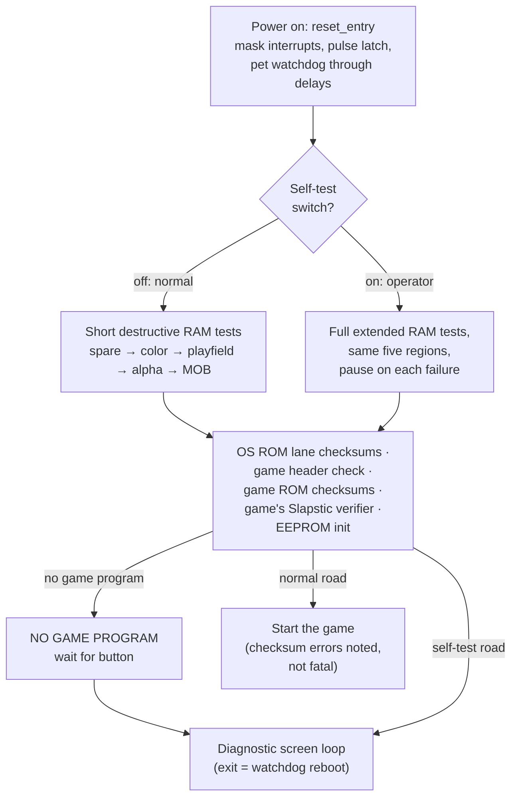

# Chapter 5 — Waking Up (Boot, the OS, and Self-Test)

**This chapter answers:** What happens between the moment a Gauntlet II
cabinet gets power and the moment the attract screen appears, and why does a
1986 arcade board carry something worth calling an operating system?

**By the end you will understand:** how the CPU takes its first steps, how
the machine tests memory it cannot yet trust, what actually happens when a
test fails, the two-way contract between the OS ROM and the game ROM, the
interrupt system that gives the machine its pulse, and the diagnostic world
an operator sees with the self-test switch flipped.

**It builds on:** Chapter 3's memory map and watchdog, and Chapter 4's text
layer, which is where every boot message and test screen gets drawn.

---

## Two seconds of housekeeping

Somewhere an arcade opens for the day and a power strip clicks on. The
monitor warms up, and after a second or two of darkness the attract screen
is just there, cycling high scores as if it had never stopped. Inside those
couple of seconds the machine runs a complete physical: it exercises every
word of its video and working RAM with destructive test patterns, sums both
byte lanes of its own ROM, inspects the game ROM's credentials, asks the
game to vouch for its own chips, and brings up persistent storage, sound,
and interrupts. Only then does it hand control to the game.

The 68010 begins in total ignorance. On reset it reads exactly two things
from the start of the OS ROM: an initial stack pointer and a start address.
Execution begins at the OS's reset entry, which masks all interrupts,
pulses the board-control latch off and on to put the hardware in a known
state, and spins through a delay loop, writing to the watchdog register on
every iteration. That last habit never stops. From its first milliseconds
to the day it is unplugged, this machine's software must keep telling the
watchdog "still alive," and boot code pets it hundreds of times in loops
and tests so that a slow diagnostic is never mistaken for a crash.

The reset code then makes its one decision: it reads the **self-test
switch**, a toggle inside the coin door. Switch off means a paying
customer's power-on, and the machine takes the fast road to the game.
Switch on means an operator wants the back room, and the machine takes the
thorough road to the diagnostic screens. The two roads differ mainly in how
hard they pound the RAM.

## Testing the floor you stand on

Early boot has a bootstrapping problem worth savoring. The 68010's initial
stack pointer aims at the video-RAM spare region, because that is where the
OS keeps its working memory. The very first duty of boot is to verify that
RAM, and a subroutine call *uses the stack*: calling a test routine would
mean trusting the memory under test to hold the return address.

The OS sidesteps the problem with a convention the project's documentation
calls continuation-passing. A RAM tester is not called; it is *jumped to*,
with the address of the next step parked in a spare CPU register. When the
tester finishes, it jumps to whatever that register holds, carrying a
pass/fail flag in another register. No stack, no return addresses, nothing
in RAM at all: the entire test apparatus lives in the CPU's registers until
the memory has earned its trust.

The tests themselves are destructive, overwriting every word in a region
with patterns and reading them back: walking a single 1 bit through a field
of zeroes, walking a 0 through ones, and, on the thorough road, additional
bit orders, full-range fills, and a final pass that flips every word to its
inverse and back. Five regions get this treatment in a fixed order: the
video-RAM spare (the future home of the stack), then color RAM, playfield
RAM, alpha RAM, and MOB RAM. An ordinary power-on runs a short three-stage
suite over each region; the self-test road runs the full extended suite.
Either way, RAM that survives holds nothing of value afterward, which is
fine, because nothing of value has happened yet.

## The failure policy

What happens when a test fails is more interesting than the tests, and the
real policy has more nuance than "boot stops."

A failed RAM region is reported on screen, naming the region, the offending
address, and the expected and actual bits, and then **testing continues
with the next region**. The reasoning is practical: the error display needs
only the text layer, so a machine with, say, bad MOB RAM can still tell the
operator exactly what to replace. On the self-test road the sequence
pauses at each failure until a button at the first player position is
pressed, giving the operator time to write down the details. On the normal
road the machine notes its troubles and keeps moving, because a cabinet
that boots halfway earns nothing.

With RAM cleared for use, a shared continuation takes over and works
through the rest of the checklist:

- **The OS audits itself.** It sums every even-addressed byte and every
  odd-addressed byte of its own 64 KB, one running sum per ROM chip, and
  compares each against a signature. A mismatch is displayed and boot
  continues, with the error noted.
- **The game ROM shows its credentials.** The word at the start of the game
  ROM must be a JMP instruction whose target lies in game-ROM territory.
  If it is anything else, the OS displays NO GAME PROGRAM and waits for an
  acknowledging button press; a board with no game left in it can still
  offer its diagnostic screens, and that is where it goes.
- **The game ROM is checksummed** using a descriptor table the game itself
  supplies, listing ranges and their expected even/odd lane sums. Failures
  name the specific ROM slice, so the operator learns which physical chip
  to reseat or replace.
- **The game verifies its own hardware.** The OS calls an optional hook in
  the game's header, and Gauntlet II supplies one: a routine that checks
  the Slapstic ROM's banks, the one piece of hardware only the game knows
  how to talk to. Chapter 9 explains why that chip needs special handling.
- **Persistent storage comes up.** OS working RAM is cleared and the EEPROM
  service initializes, readying the settings, scores, and statistics that
  Chapter 14 explores.

Then comes the final dispatch, and its logic says a great deal about
priorities. On the normal road, the machine starts the game even if ROM
checksums failed; the errors were displayed for anyone watching, and a
cabinet with a slightly suspect ROM that plays is worth more than one
sulking in a diagnostic screen. Only a missing game program diverts a
normal boot. The self-test road always ends in the OS's diagnostic loop,
which never returns; the way out of self-test is flipping the switch back,
at which point the OS deliberately stops feeding the watchdog and lets the
reset circuit reboot the machine clean.



One honest footnote belongs here. The project's technical documentation
described the self-test switch with the opposite polarity for a long time,
which swapped the labels on these two roads. The account above was verified
for this book directly from the boot dispatch instructions in the OS ROM and
from the switch's active-low wiring in MAME's schematic-derived board
description, and the documentation has since been corrected to match. The
Under the hood box has the specifics.

## Why there is an OS

The OS ROM stays resident forever, and the game leans on it constantly.
Just past the vector table sit two blocks of jump instructions at fixed,
published addresses, more than fifty entries in all, and together they are
the OS's API. Each entry is a six-byte JMP to the real implementation
somewhere inside the OS. Game code calls the fixed entry, never the
implementation, so Atari could rework or relocate OS internals without
touching a shipped game.

The services fall into families a modern programmer would recognize as a
standard library: text drawing and number formatting for the alpha layer,
large-character display, text effects like scrolling and blinking, VBLANK
waiting, sound-command transport to the 6502 board, EEPROM reads and
queued writes, coin counting and credit arithmetic, high-score ranking and
storage, play-time statistics, and the operator's option and statistics
screens. When Chapter 6 shows the game's main loop calling `process_coins`
or Chapter 14 shows it ranking a score, those calls land in this table.

## The contract runs both ways

The OS also makes calls in the other direction, and the game ROM's first
few hundred bytes are shaped entirely by that expectation. They form a
header the OS knows how to read: first a JMP to the game's start, then a
JMP to the game's VBLANK handler, then a row of optional hook slots for
interrupts, exceptions, startup moments, playfield initialization, the
operator's game-options screen, and ROM verification. Scalar fields
follow: fill values for video RAM, a difficulty default, factory settings
for the EEPROM, pointers to control-label strings, and the checksum
descriptor table met above.

Before using any hook, the OS checks that the slot actually begins with a
JMP opcode and skips it otherwise, and Gauntlet II leaves several slots
zeroed. The design plainly anticipates being reused across games, with
each game opting into exactly the hooks it needs. How far that reuse
historically extended is a question the shipped bytes cannot fully answer,
though this OS image does carry a dormant payload of some other game's
support code, an archaeological curiosity Chapter 17 pokes at.

The header includes one contribution of pure personality: the game supplies
the strings the OS uses to label controls in the switch test, so Gauntlet
II's diagnostics speak of the "WARRIOR joystick" and the "WARRIOR <FIRE>
button" and "WARRIOR <MAGIC> button." A MAME switch-test run displays those
exact labels and maps Fire to Button 1 and Magic to Button 2. Even the
self-test knows the red position is the Warrior's.

## Interrupts, the machine's pulse

Chapter 2 promised a heartbeat, and this is where it is wired up. The
68010's vector table lives at the bottom of the OS ROM, so every interrupt
and exception lands in OS code first. Each OS handler then applies the
same etiquette as the boot hooks: if the game has installed a handler,
identified by that JMP-opcode check, control is passed along; otherwise the
OS acknowledges the interrupt and returns.

```text
on interrupt:
    if the game's hook slot for this interrupt holds a JMP:
        jump into the game's handler
    else:
        acknowledge locally and resume
```

Two interrupts matter every frame. **VBLANK** fires when the display
finishes drawing a field, sixty times a second, and its handler has two
lanes: a flag says whether the OS or the game currently owns the machine,
and the corresponding VBLANK handler runs. During diagnostics the OS lane
acknowledges the hardware, feeds the watchdog, publishes the scroll
registers from shadow copies, sets the once-per-frame flag that paces
everything, runs text effects, and trickles one queued EEPROM byte.
Chapter 6 walks the game's own, busier lane. The **sound interrupt** fires
when the 6502 has posted a response byte; the OS collects it and flags it
for whoever is listening, a conversation Chapter 16 covers.

The remaining vectors get a treatment that looks strange until the
watchdog logic from Chapter 3 clicks in. For the low-priority interrupts
this hardware should never raise, Gauntlet II installs hooks that are
nothing except a jump to themselves. If one somehow fires, the machine
spins in place, stops petting the watchdog, and is rebooted by hardware
within a fraction of a second. CPU exceptions land in a game abort routine
with the same endgame: it jumps into an empty stretch of address space and
lets the watchdog do the rest. A crashed Gauntlet II does not freeze; it
quietly becomes a freshly booted Gauntlet II, usually before anyone
wanders over with a quarter.

## The operator's back room

The self-test road ends in a loop that cycles the machine's diagnostic
screens, each advancing on a button press: a switch test showing every
input's live state under those Warrior-flavored labels, a playfield test,
an interactive motion-object test that lets the operator place and resize
sprites by hand, alpha and color test patterns, a convergence grid for
tuning the monitor, and a sound test that can fire individual effects,
music, and speech at the 6502 board.

Alongside the pure diagnostics live the business screens: coin options,
game options, and statistics. The game options screen is actually driven
by the game through its header hook, which is how Gauntlet II offers
settings as specific as health per coin and the secret-code contest
toggle. The statistics screens read back what the EEPROM has been quietly
accumulating about real play. Chapter 14 returns to all of this from the
economics side, where those screens stop being diagnostics and start being
a business dashboard.

After boot hands control to the game ROM, the OS never takes the wheel
again in normal operation; it becomes a library, a vector table, and a
silent partner in every frame. What the game does with that control, sixty
times a second, is Chapter 6.

---

> **Under the hood**
>
> - Reset vector pair (SSP 0x904F00, PC 0x5E2) and `reset_entry`:
>   `doc/02_os_rom.md` §2, §5.1. The full vector table is §2.
> - RAM testers: `mem_test_short` (0xA2C) and `mem_test_full` (0xA6A) with
>   their per-stage state machines and the A4 continuation convention:
>   `doc/02_os_rom.md` §5.5–5.6, checked in
>   `doc/generated/os_memory_test_contracts.csv`.
> - Boot continuation and checklist: `main_init_cont` (0x70C) and
>   `boot_postcheck_dispatch` (0x8EC): `doc/02_os_rom.md` §5.4–5.5. Error
>   displays: `display_working_ram_error` (0xC52), `rom_checksum_display`
>   (0xCC0), "NO GAME PROGRAM" via `display_text`.
> - **Switch-polarity correction:** the final dispatch (0x9D8–0xA2A of
>   `row9.bin`) starts the game when status bit 3 is *set* and enters the
>   never-returning diagnostic loop when it is *clear*, and MAME's
>   schematic-derived `gauntlet.cpp` defines the service switch as
>   `PORT_SERVICE(0x0008, IP_ACTIVE_LOW)`. The switch therefore reads 0
>   when engaged. `doc/01_hardware.md` §3.1 and the §5 boot-path labels in
>   `doc/02_os_rom.md` stated the opposite polarity until this was
>   corrected; `doc/02_os_rom.md` §5.7 now collects all four dispatch sites.
> - Boot error acknowledgment polls bit 0 of 0x803001, the player-1 Magic
>   input (`doc/05_data_reference.md` §3.11).
> - OS API jump tables (0x100–0x1D7 and 0x200–0x278, 56 veneers) and the
>   data-address table between them: `doc/02_os_rom.md` §3.
> - Game ROM header and hook slots (0x40000–0x4013F), including the
>   JMP-opcode gating, fill values, checksum descriptor table (0x40080),
>   Slapstic verifier hook (0x40054 → `slapstic_verify` 0x56EAA), and the
>   WARRIOR control-label strings: `doc/02_os_rom.md` §4.
> - Interrupt handlers and hook dispatch: `doc/02_os_rom.md` §6; the OS
>   VBLANK lane pipeline: §7.2. Self-JMP watchdog traps at the IRQ1/2/3
>   hooks: §4. Exception path: `game_exception_abort` (0x40140), which
>   jumps to empty address space when entered with D0 = 0:
>   `doc/07_function_index.md` and
>   `doc/generated/orchestration_sound_contracts.csv`.
> - Self-test screens and loop: `os_selftest_loop` (0x129A) and the
>   per-screen contracts in `doc/02_os_rom.md` §8.14; operator statistics
>   and option editors: §8.13; the game-options descriptor stream the game
>   feeds them: `doc/05_data_reference.md` (0x5318C).
> - Watchdog-forced exit from self-test: `selftest_watchdog_reset_trap`
>   (0xEEE), `doc/02_os_rom.md` §8.14.
