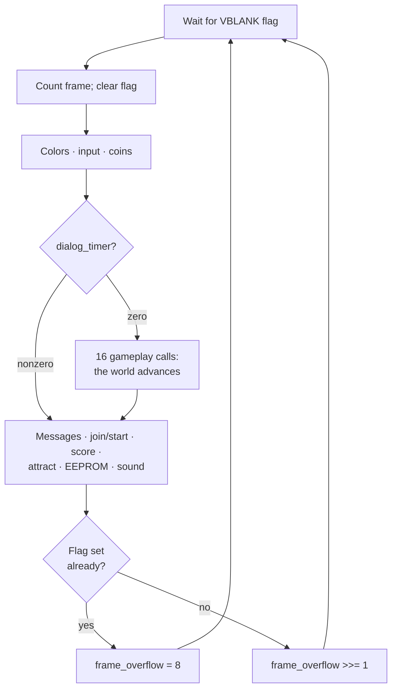

# Chapter 6 — The Heartbeat (The Main Loop)

**This chapter answers:** What does the game actually do, in what order,
during each of its sixty updates per second?

**By the end you will understand:** how the main loop locks itself to the
display's refresh, the fixed sequence of calls that advances the whole world
one frame, the debouncing that cleans up raw joystick electricity, the
dialog gate that can freeze gameplay mid-frame, the mode variable that lets
one loop serve play and attract alike, and the small trick the game uses to
notice and recover when a frame runs long.

**It builds on:** Chapter 4's video tables (this loop is what edits them),
and Chapter 5's VBLANK interrupt and boot handoff. This is the software's
per-frame pulse; the whole life of a play session, coin to game over, is
Chapter 7's subject.

---

## Everything at once, one thing at a time

Watch a busy four-player game for a few seconds. Four heroes move under four
people's hands, a few dozen ghosts converge, shots fly, a door timer runs
somewhere, the thief is making his approach, health numbers tick down, the
cabinet is talking, and the camera glides to keep it all in frame. It reads
as forty things happening at once.

The machine is doing one thing at a time, in a fixed order, very fast. After
boot hands over control, the game enters a loop the project named
`g2mainloop` and never leaves it. Each trip through the loop advances every
system in the game by exactly one frame, and the loop makes sixty trips per
second. The apparent parallelism of a Gauntlet II screen is this list of
sequential function calls, repeated until the power goes out.

## Locked to the beam

The loop does not free-run. Left to itself, the CPU would update the world
as fast as it could, sometimes finishing mid-frame while the display was
still drawing the last one. Instead the game ties itself to the monitor.

Chapter 5 introduced the VBLANK interrupt, fired by the video hardware each
time it finishes drawing a field. The game's VBLANK handler does little more
than raise a flag, a one-word **semaphore** in working RAM. The main loop's
whole relationship with time looks like this:

```text
one_time_init()                  # once, before the first frame

loop forever:
    wait until vblank_flag != 0  # the interrupt sets it, 60 times/sec
    frame_counter += 1
    vblank_flag = 0              # consume it
    ... advance the entire world by one frame ...
```

The loop spins doing nothing until the flag appears, consumes it, performs
one full update, and goes back to waiting. Every quantity in the game that
involves time is therefore denominated in frames: a door timer is a count of
frames, health drain happens every so many frames, the treasure room
countdown is frames dressed up as seconds. When this book says something
takes half a second, the underlying truth is a counter loaded with 30.

## One frame, twenty-nine calls

The loop body is a straight line of twenty-nine direct calls. One of them,
`one_time_init`, runs once before the first frame ever starts. The other
twenty-eight execute in the same fixed order on every trip, and the whole
game is their side effects. They fall into three bands.

**Before anything else, three services that run no matter what:**

- `main_logo_updcolors` keeps palette-driven color animation running,
  title logo effects included.
- `input_debounce` samples all four players' controls (more on it below).
- `coincheck` watches the coin counters and converts money into credit and
  health, the machinery Chapter 14 explores.

**Then the gameplay band, sixteen calls that are the game:** transporter
and forcefield cycling, potion effects, door opening, shot movement and
collision, player movement (`main_move_players`, the biggest of them all,
covered in Chapter 10), camera scrolling, monster movement
(`main_move_monsters`, Chapter 11), the dragon, two calls for the thief,
health drain, the treasure-room timer, death handling, exit animation, and
two calls that let walls move, one for cyclic walls and one for random
ones. Chapters 10 through 13 spend most of their pages inside this band.

**Finally the presentation-and-housekeeping band, which also always runs:**
the message-box countdown, character-selection input, the start/join logic
that turns a credited player into a hero in the maze, score updating and
score display, the attract-mode state machine, the EEPROM write timer,
and two sound calls that drain the outgoing command queue and process the
sound board's responses.

The ordering encodes the game's priorities. Money and controls are read
before anything can be skipped; the world simulates; presentation reports
on the result; persistence and sound flush last, after the frame's events
are known.

## Cleaning up the electricity

`input_debounce` earns a closer look, for what it does and for what it is.

A joystick switch is a piece of springy metal, and metal bounces. In the
milliseconds after a press or release, the contact can open and close
several times, and a program reading the raw bit each frame might see a
single press as several. The game therefore keeps, for each input bit it
cares about, a short history: each frame, the current raw sample is shifted
into a per-player register, so the register holds the last sixteen frames
of that bit's life. Code that wants a clean answer checks several recent
samples together, and a press only counts once the contact has settled.
The raw words are also stored as-is for code that wants them, and Chapter
10 picks up there, turning stable bits into walking, fighting, and magic.

The implementation is one of the game ROM's few pieces of hand-written
assembly, built around a rotate-through-carry instruction no C compiler of
the era would emit. Someone at Atari decided the innermost input path was
worth hand-tuning, and Chapter 17 uses exactly this kind of fingerprint to
tell compiled code from crafted code.

## The dialog gate

Between the first band and the gameplay band sits a single test. One word
in RAM, `dialog_timer`, is nonzero whenever a message box is on screen,
whether first-encounter advice, a power-up explanation, or a warning. While it is nonzero, the loop skips
the entire sixteen-call gameplay band as one block.

The result is an honest freeze. Monsters halt, shots hang in the air,
health stops draining, walls stop moving, and the thief waits politely,
because the code that would advance any of them simply does not run.
Meanwhile the bands on either side of the gate keep working: the message
box counts itself down, sound and speech continue, coins are still
accepted, scores still display, and the attract state machine still ticks.
The game world is in suspended animation while the machine around it stays
alive. When the timer reaches zero, the box is erased and the next frame
runs the gameplay band as if nothing had happened.

Chapter 14 catalogs the dialogs themselves; what matters here is the
mechanism, one word gating sixteen calls.

## One loop, six worlds

The same twenty-eight calls run whether the cabinet is mid-battle or
sitting unplayed at three in the morning. What changes is a single word,
`game_mode`, with six values: normal play, a treasure-room exit
transition, and the four attract-family screens (high scores, title, demo,
legend) that Chapter 15 tours.

Rather than the loop choosing different calls for different modes, each
call is made unconditionally and applies its own gates inside. A
representative slice of the full matrix:

| Call | Normal play | Demo | Title / scores / legend | Dialog active |
|------|-------------|------|-------------------------|---------------|
| `input_debounce` | runs | runs | runs | runs |
| `main_move_players` | runs | runs, reading recorded inputs | returns immediately | skipped |
| `main_move_monsters` | runs | runs if players exist | returns immediately | skipped |
| `main_health_countdown` | runs (every 64th frame) | same | idle | skipped |
| `main_walls_cyclic_move` | runs | runs | runs | skipped |
| `main_attract` | idle | runs | runs | runs |

Two habits of this design are worth naming. First, "called" and "does
work" are different claims: `main_move_players` is invoked on the title
screen, where its own first test notices the mode and returns without
moving anyone, and this book tries to be precise about which is meant. Second, the demo column is nearly identical
to the normal column, because the attract demo *is* the game engine
running on recorded inputs, the subject of Chapter 15. The health drain in
that table is the same in both: one point of health every sixty-fourth
frame, which is slow enough that the recorded hero survives a two-minute
demo without any special treatment.

## Keeping time honestly

The loop's tail contains its most self-aware moment. After the last sound
call, the loop checks the VBLANK semaphore again. If the flag is already
set, the display finished another field while this frame was still being
processed: the frame ran long, and the game missed a beat. The loop then
sets a word named `frame_overflow` to 8. If the flag is clear, the frame
fit inside its sixtieth of a second, and the loop halves whatever
`frame_overflow` currently holds, so the signal decays to zero after a few
good frames.

That word is more than a diagnostic. The monster system reads it when
deciding how many monsters to process this frame, and while it is nonzero
the per-frame monster allowance drops to zero, shedding the heaviest
workload until the loop catches its breath. An overloaded Gauntlet II
slows its crowd for a few frames instead of stuttering its display, and
the decay guarantees the throttle releases as soon as the load passes.
Chapter 11 covers the allowance itself, which in normal times scales with
player count and an operator setting.



## Three clocks

This book keeps three scales of time distinct, and with the loop in view
the distinction is now concrete. **Interrupts** happen *within* a frame:
VBLANK raises the semaphore, and the sound interrupt delivers bytes,
whenever the hardware pleases, between any two instructions. **The main
loop** advances the world one frame at a time, sixty to the second, and is
where every gameplay rule lives. **The session** is the longest scale: the
journey from attract mode through coin, hero, levels, death, and back to
attract, which spans hundreds of thousands of frames and is governed by
`game_mode` and the per-player states threaded through these same calls.
Chapter 7 maps that longest clock from end to end.

---

> **Under the hood**
>
> - The loop is `g2mainloop` (0x42A66); the verified 29-call sequence with
>   addresses for every callee is `doc/03_game_rom_structure.md` §2.1,
>   backed by the checked main-loop contract set in `doc/generated/`.
> - Boot handoff: `game_start` (0x4014C) sets initial color pointers and
>   tail-jumps into the loop; the game VBLANK handler is `game_vblank`
>   (0x4017E) via the header veneer at 0x40006:
>   `doc/03_game_rom_structure.md` §2.2.
> - The VBLANK semaphore is the word at 0x904002. The frame counter is the
>   word at 0x904006, incremented at 0x42A86; note that `doc/05` §1 lists
>   the same address as the OS lane's vertical-scroll shadow
>   (`pf_vscroll_hi`), a dual identity between the OS and game VBLANK
>   regimes.
> - `dialog_timer` is the word at 0x904A9E: `doc/05_data_reference.md` §1;
>   its decrementer is `main_msgbox_countdown` (0x4CCBC).
> - `game_mode` is the word at 0x904918 with the six values tabled in
>   `doc/03_game_rom_structure.md` §2.3; the complete 28-row
>   what-runs-when matrix is §2.4.
> - `input_debounce` (0x40644): raw words at 0x904920, per-player shift
>   registers at 0x905F58/0x905F60, `roxl`-based hand-written
>   implementation: `doc/04_game_subsystems.md` §15.
> - `frame_overflow` is the word at 0x904916; the monster-cap consumer
>   that zeroes the per-frame allowance while it is nonzero is
>   `monster_count_table` (0x40E46): `doc/05_data_reference.md` §1 and §3.
> - The attract state machine called every frame is `main_attract`
>   (0x44562), `doc/03_game_rom_structure.md` §2.5; Chapter 15 covers it.
> - `one_time_init` (0x4327A): `doc/03_game_rom_structure.md` §5.
