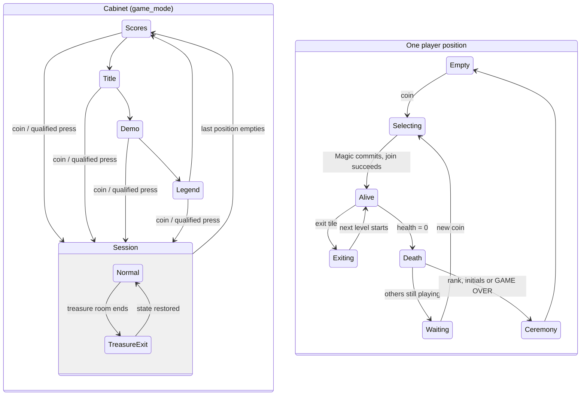

# Chapter 7 — From Coin Drop to Game Over (The Session Lifecycle)

**This chapter answers:** What is the complete shape of a Gauntlet II
session, from the unattended attract cycle through coins, heroes, levels,
deaths, and back to the attract cycle?

**By the end you will understand:** the attract state machine at a glance,
what a coin actually sets in motion, the join path that turns a credited
position into a hero, the level-start pipeline, the small set of per-player
states that lets four people be in four different places in their own
stories, the transitions between levels, and the death, continue, and
game-over ceremonies.

**It builds on:** Chapter 6's main loop and `game_mode` variable. Every
transition in this chapter is performed by calls from that same loop; this
chapter is the longest of the three clocks, mapped end to end. Later
chapters zoom into individual rooms of this map.

---

## One evening, two stories

Picture the machine on a weekday evening. It cycles its screens alone for an
hour. Somebody drops in a quarter mid-demo, plays a Valkyrie for six levels,
and is joined at level 4 by a friend on the Wizard position. The Valkyrie
dies on level 7 and her player walks away; the Wizard exits alone, dies two
levels later, feeds in another coin at the continue screen, and finally lets
the countdown expire on level 11. Initials are entered. The cabinet returns
to its screens as if nothing happened.

Telling that story requires two kinds of state at once, and the game keeps
them separate. The **cabinet** has one global mode, the `game_mode` word
from Chapter 6: one of four attract screens, normal play, or a treasure-room
transition. Each **player position** has its own little lifecycle,
a per-player status byte that says whether that position is empty, choosing
a hero, alive, dying, or entering initials. The Valkyrie's death did not
change the cabinet's mode at all, because the Wizard was still standing.
Keeping those two lanes distinct is most of what this chapter has to teach;
everything else is the transitions.

## The idle machine

Left alone, the cabinet loops four screens forever: high scores for about
ten seconds, the animated title for about twenty-five, a two-minute
self-playing demo, a legend page explaining monsters and items for another
ten, and back to high scores. Each screen is one `game_mode` value, and the
`main_attract` call from Chapter 6 counts each screen's timer down and
builds the next screen when it expires. The demo deserves its own chapter
(15), because it is the real engine playing back a recorded Elf; the legend
pages are real maze layouts used as scenery.

Each attract screen ignores the panel for its first second, a deliberate
lockout so that a button mashed during a screen change cannot immediately jump
the cycle to another screen. Starting a session is a separate path that is live
every frame in every mode, so a coin, or the qualifying button press when
credit already exists, breaks the cycle at any moment. Chapter 15 covers the
paid and free-play qualifications precisely.

## A coin becomes a hero

The coin path begins in `coincheck`, which Chapter 6 showed running every
frame without exception. When a coin lands for a position with no active
player, the position is initialized for play: it receives its
operator-configured allotment of health-to-be and enters **character
selection**, and if the cabinet was idling, the attract screen is torn down
and the session apparatus is built in its place.

A position in character selection is not yet in the maze. Its status byte
holds the selecting-a-hero value, its column of the info panel shows the
choices, and every frame `character_select_input_update` reads that
joystick: point a direction, and the panel redraws for the Warrior,
Valkyrie, Wizard, or Elf. Pressing Magic commits.

Committing runs the join path, `player_join`, and the same path serves a
player starting a fresh session, a friend joining mid-level, and a
respawn after a continue. It searches the current maze for a usable spawn
tile, creates the player's MOB, installs the character's
per-player helpers and effect state, and counts the position into the
active-player total. Only when a spawn spot actually existed does the
finalizer run: status flips to alive, the join sound plays, the HUD column
is drawn in earnest, statistics tracking starts, and the cabinet speaks its
welcome. Join-in-progress, one of the game's signature freedoms, costs no
special machinery at all; it is the ordinary join path running while a
level happens to be in progress.

## Starting a level

Whether a session is beginning at level 1 or the party just cleared level
30, entering a level runs one pipeline, mostly inside `maze_new_level_setup`
and paced frame-by-frame by `main_start_game`:

1. **Choose and reach the stored maze.** The next maze number is chosen
   (Chapter 9's subject, randomizer and all), and the Slapstic ROM is
   switched to the bank holding that record.
2. **Present the level.** The between-level screen names the level and,
   when a secret challenge has been earned, its cryptic qualifier and time
   limit instead. Behind this curtain (Chapter 4's opaque text layer), the
   world is rebuilt.
3. **Construct the world.** The maze record is decoded into logical objects
   and playfield tiles, per-level hazard flags are loaded and partly
   randomized, and post-decode scans find the player start, build the
   transporter and exit tables, and wire up doors and walls. Chapters 8
   and 9 split this work between them.
4. **Place the players.** Every position whose player survived the last
   level is spawned near the start; positions mid-selection stay in
   selection. The camera centers on the start tile.
5. **Release.** A short delay lets the presentation clear, then statuses
   flip to alive and the sixteen-call gameplay band starts doing real work.

The thief's schedule and the dragon's encounter flag are also reset here,
which is why each level feels like a fresh negotiation with both.

## Four stories at once

During play, each position's status byte walks its own path, and the small
set of values covers every situation the cabinet can produce:

| Status | Meaning |
|--------|---------|
| empty | Nobody here; the column shows an invitation |
| selecting | Credited, choosing a hero with the joystick |
| alive (this level) | In the maze, fully simulated |
| exiting / respawn wait | Mid-transition: riding an exit animation, or a dead position waiting while others play |
| alive (next level) | Cleared the level; waiting for the stragglers |
| death / high-score sequence | Health hit zero; running the death and ranking ceremony |
| secret-winner name entry | Won a secret challenge; typing a name (Chapter 13) |

The global mode stays in normal play through all of it. One player can be
entering initials while two others fight on and a fourth chooses a hero,
and no lane blocks another. The only global transitions during a session
are the level boundary and the treasure-room detour.

## Leaving a level

The orderly way out is the exit tile. Stepping on one starts
`player_exit_sequence`: a per-position exit sound, an exit animation MOB
(one of the reserved low slots from Chapter 4), and a flip to exiting
status. The level keeps running for everyone else. When the last active
player has exited, the next-level calculation runs and the pipeline above
begins again. Exits themselves have a rich private life, moving exits and
outright fake ones included, which Chapter 13 enjoys at length.

Two detours interrupt the normal climb:

**Treasure rooms.** Some transitions drop the party into a timed
loot-scramble maze. The global mode is involved here, because leaving a
treasure room is its own mode value: the room ends by timeout or by exit,
a bonus screen tallies the take (the displayed arithmetic multiplies
treasures by players and coins at 100 points a unit), and the saved
normal-game state is restored so the climb resumes where it left off.
Chapter 13 covers the rooms, including the countdown voice that sometimes
lies.

**Secret challenges.** Every ordinary maze quietly tracks a secret
objective, and completing one earns entry to a secret room. The pacing is
a lovely bit of tuning: a countdown of levels gates availability; winning
pushes the next opportunity further out, and failing pulls it closer, so
the feature stays rare for winners and encouraging for everyone else.
Chapter 13 owns the whole pipeline, name entry and mail-in code included.

## Death, and the offer

When a player's health reaches zero mid-level, that position enters its
death sequence: the hero's sprite is dealt with, the ranking ceremony
described below runs, and the position settles into a waiting state. If
anyone else is still standing, the level simply continues; the dead
player's position invites a new coin, and re-coining brings the same
lifecycle back around through selection and join, onto the current level.

If the *last* player falls past level 1, the machine makes its offer. The
continue prompt takes over the screen:

```text
LEVEL: [N]
PRESS START
WITHIN    SECONDS
TO CONTINUE GAME
AT THIS LEVEL
```

The theme music plays under it, a countdown runs, and a coin plus the
start press resumes the session at the level where the
party died. (There is no fifth button: START is the game's own vocabulary for
the button whose input line the game calls Magic.) Letting the countdown expire ends the session. On level 1
there is no prompt, since continuing and starting over would be the same
thing.

The coin that accepts a continue is a new-player credit transaction, not the
mid-life "buy more health" transaction. It restores the complete configured
starting-health value (or 2000 on the demo/free-play path), resets the
multiplier baseline, and returns the position to selection. Applying only the
per-coin increment leaves the continued hero nearly dead.

## The ceremony

A finished player's score gets one last computation, and it is the game's
most opinionated design choice about money. The ranking value is
score-per-coin: the raw score divided by that player's inserted coins,
handed to the OS ranking service from Chapter 5. A big score bought with a
stack of quarters ranks below a modest score earned on one. Chapter 14
works a full example.

If the value ranks in the top ten, the position enters initials entry with
a generous 45-second timer; if unranked, a GAME OVER shows for ten
seconds. Either way the position then empties, statistics and high scores
are queued to the EEPROM, and when the last position empties, the global
mode steps back into the attract family. The machine returns to telling
its own story to an empty room, high scores first, now with somebody's
initials in the table.

## The whole map



The two lanes run concurrently: four copies of the lower diagram, one
cabinet-wide copy of the upper. The exact numeric states are richer than
the picture (the status table above is the truth), but every session this
cabinet has ever hosted is a walk on these two graphs. The next chapter
descends from the map into the world itself: what a thing in the maze *is*,
and how hundreds of them are kept alive at once.

---

> **Under the hood**
>
> - Global mode values and the attract state machine with its exact timers
>   and one-second input lockouts: `game_mode` (0x904918),
>   `main_attract` (0x44562), `start_attract_screen` (0x44414):
>   `doc/03_game_rom_structure.md` §2.3–2.5,
>   `doc/04_game_subsystems.md` §6.
> - Coin handling every frame: `coincheck` (0x42B6A), new-player
>   initialization `player_init_for_coin` (0x488CA), attract interruption
>   `start_attract_to_game` (0x44204): `doc/04_game_subsystems.md` §6.4,
>   §10.1; `doc/07_function_index.md`.
> - Per-player status byte values (0x9049A0):
>   `doc/05_data_reference.md` §1.
> - Character selection per frame: `character_select_input_update`
>   (0x42DF4), `doc/04_game_subsystems.md` §22.
> - The join path: `player_join` (0x48BB6) → `player_start_inner`
>   (0x48BEC) → `player_join_finalize` (0x48A36), including the
>   spawn-search failure case: `doc/04_game_subsystems.md` §4.4.
> - Level start: `maze_new_level_setup` (0x438AE) step list including
>   thief/dragon resets, bank switch, decode, start-slot scan, camera
>   centering, and transporter/exit table rebuilds:
>   `doc/04_game_subsystems.md` §5.2; the paced state machine is
>   `main_start_game` (0x4800C) and the presentation is
>   `show_level_start_screen` (0x44DB4). Its shared delay is decremented outside
>   the gameplay freeze gate; `maze_show` (0x4526A) then removes the splash by
>   clearing every alpha column except the preserved 29–41 status panel.
>   The OS large font is variable-width: the level label's colon is a one-cell
>   glyph, and its returned advance—not Python character count—positions what
>   follows.
> - Exits: `player_exit_sequence` (0x52B40) and the all-exited advance via
>   `maze_checknum` (0x52ECA): `doc/04_game_subsystems.md` §12.
> - Treasure rooms (mazes 104–114), countdown, and the bonus tally screen
>   `show_level_end_bonus_screen` (0x4D476) with its 100 × players ×
>   coins × treasures display: `doc/04_game_subsystems.md` §10.5, §16.
> - Secret-challenge pacing counters (start 20; +15 capped at 40 after a
>   win; −2 floored at 4 after a miss): `secret_check` (0x486FE),
>   `doc/04_game_subsystems.md` §10.6.
> - Continue prompt and its gates (`level_players_active` = 0, level ≠ 1):
>   `show_continue_prompt` (0x44C7E), `doc/04_game_subsystems.md` §10.5.
> - Death and ranking: `player_death_sequence` (0x49DE6),
>   `highscore_check` (0x49D0E) passing 24-bit score-per-coin to OS
>   `rank_high_score` (API 0x1C6); 45-second initials timer (0x0A8C
>   frames) vs 10-second GAME OVER (0x0258):
>   `doc/04_game_subsystems.md` §10.3.
