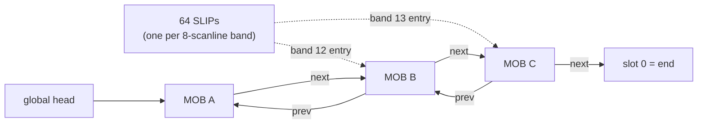
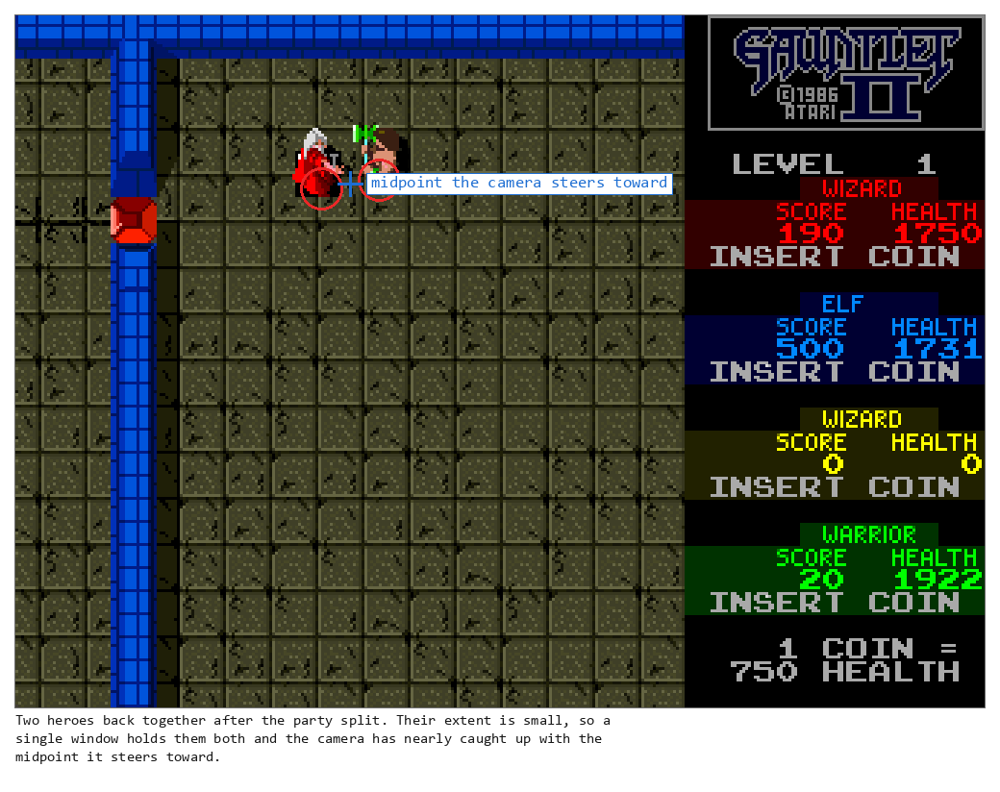
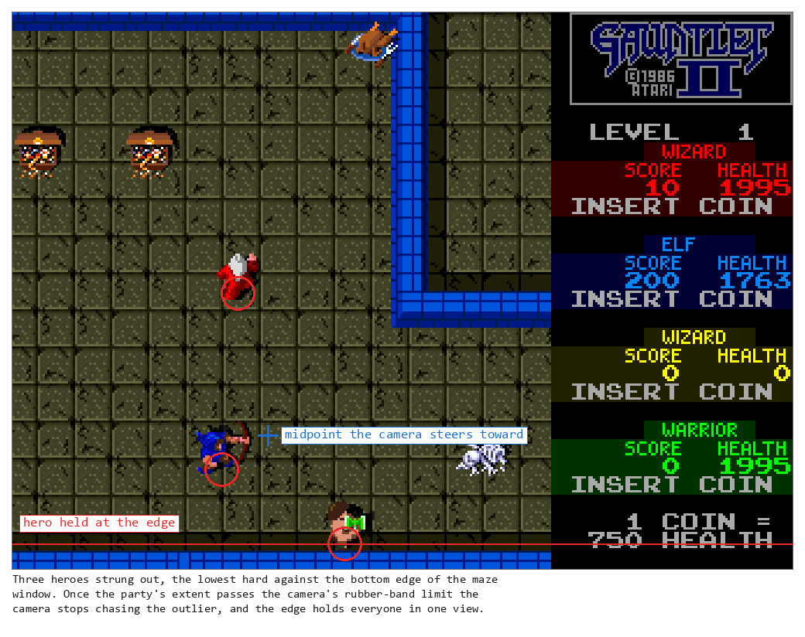

# Chapter 8 — The World in Memory (Objects, Coordinates, and Crowds)

**This chapter answers:** What is a "thing in the maze," where does it live
in memory, and how does the game keep hundreds of things alive, ordered,
and collidable on a 1986 CPU?

**By the end you will understand:** the record that represents every object
from a key to a ghost, the three coordinate systems that locate it, the slot
numbering that makes a maze cell and an object the same idea, the single
linked chain that display hardware and game logic share, the separation of
logical state from visible tiles, the four-player camera, and the design
economics that make Gauntlet's crowds affordable.

**It builds on:** Chapter 4's MOB tables and playfield (this chapter is
their second life as game state), Chapter 6's per-frame budget, and Chapter
7's session map. Chapters 10 through 13 all stand on this one.

---

## Sixty ghosts, one question

Find a level with a ghost generator in a corner and let it run. Ghosts pour
out until they pack the corridor, shoulder to shoulder, a wall of bodies
deep enough that fighting through them feels like digging. Every one of
them is separately real: it occupies a spot, faces a direction, can be shot
individually, walks around its neighbors, and slides *behind* some sprites
and *in front of* others, correctly, every frame.

Chapter 4 explained how a sprite gets drawn. It said nothing about how the
game knows sixty of them apart, finds the one your shot hit, or affords to
think about all of them at 60 Hz. That bookkeeping is this chapter, and it
starts with what a "thing" actually is.

## What a thing is

A thing in the maze is a **MOB slot**: one index into five parallel arrays
of 16-bit words. Four of the arrays are the video-RAM tables the display
hardware reads, met in Chapter 4. The fifth lives in ordinary working RAM,
invisible to the hardware, and completes the record:

| Array | Hardware reads it? | Contents |
|-------|--------------------|----------|
| picture | yes | tile number; top bit is a software flag |
| horizontal | yes | X position; palette; two software-only flag bits |
| vertical | yes | Y position; sprite width and height |
| link | yes (low 10 bits) | next slot in the chain; top 6 bits: **object type** |
| state/back-link | no | previous slot in the chain; top 6 bits: object state |

The design squeezes game state into every corner the hardware ignores. The
top six bits of the link word carry the object's *type*: ghost, grunt, key,
door, exit, generator, forcefield. The top six bits of the software word
carry per-type *state*, and the same bits mean different things for
different types: for a monster, animation phase and facing direction; for a
player MOB, which of the four players it is; for a door, its
connected-shape mask; for a movable wall, an accumulator of hits that
dissolves the wall at 25. Even the two hardware-ignored flag bits in the
horizontal word work for a living, holding a monster's moving/chasing
state. Nothing here is a struct with room to spare; it is 10 bytes per
object, every bit assigned.

## Where a thing is

The game locates things in three coordinate systems, each earning its keep:

- **Maze slots.** The logical maze is a 32×32 grid of cells. A cell address
  packs into one 10-bit value: row in the high five bits, column in the low
  five. Game rules (movement legality, door adjacency, generator spawning)
  speak this language.
- **Playfield tiles.** For rendering, each maze cell owns a 2×2 block of
  8×8-pixel tiles in the 64×64 playfield grid from Chapter 4.
- **Pixels.** MOBs and the camera live in 0–511 pixel coordinates on the
  512×512 world, sixteen pixels to a maze cell.

One cell traced through all three:

| Representation | Example value |
|----------------|---------------|
| Maze cell | row 12, column 20 |
| Packed slot | (12 << 5) OR 20 = 0x194, decimal 404 |
| World pixels | x = 20 × 16 = 320, y = 12 × 16 = 192 |
| MOB position words | those pixels shifted into each word's top nine bits — but the vertical one measures *up* from the playfield floor, so it holds 512 − 192 − 16 = 304 |
| Playfield block | 2×2 tiles with top-left at playfield column 40, row 24 |

The pixel conversion is a shift and the playfield conversion is a doubling,
so crossing between systems costs a few instructions. Two wrinkles deserve
notice. An object's pixel position is its cell's origin plus a small
per-type correction from ROM tables, because a 24-pixel monster and a
16-pixel key sit differently on a 16-pixel cell. And the vertical word runs
the other way from the screen: it is the distance from the bottom of the
playfield up to the bottom edge of the object's cell, which is why the last
maze row stores zero and the sprite hardware draws upward from that anchor.

## Who gets which slot

Chapter 4 mentioned that slot numbers are not handed out arbitrarily, and
the actual scheme is the chapter's first genuinely clever economy. Slots 0
through 29 are fixed appointments: slot 0 is the chain's null terminator,
1–4 are the four players' shots, 5–8 demon shots, 9–12 lobber shots, then
shot explosions, floating score popups, exit animations, and transporter
effects. Every effect the game will ever need has a standing reservation,
so none is ever allocated.

Dynamic objects use slots 30 through 1023, and the assignment rule is
beautiful: **a maze object's slot number is its packed cell address.** The
ghost standing in row 12, column 20 is MOB 404, because that is the cell it
occupies. (Maze decoding never emits row 0, whose slots 0 through 31
overlap the reserved block. Immediately after decoding, level setup explicitly
fills those 32 slots with solid-wall markers, keeping the playable maze on the
second row.) The consequences cascade:

- Finding "whatever stands in that cell" is arithmetic, no searching.
- Two objects cannot share a cell, enforced by construction.
- When a monster moves to a new cell, the game *moves its record* to the
  new slot: a helper inserts the destination slot into the chain, copies
  the five words, and unlinks the source. Identity is location.
- Heroes are no exception. A player's record starts life as the marker MOB
  standing on the level's PLAYERSTART, and from then on it migrates cell by
  cell exactly as a monster's does, carrying its picture, its live position
  words, its object type and the state word that says whose hero it is. That
  is why a shot probing a cell finds a player there, why a monster cannot walk
  into the square you are standing on, and why the display's band table knows
  where to start drawing you.

A thousand-slot table of which perhaps a couple hundred are occupied might
look wasteful, and the trade is deliberate: 10 bytes per slot buys the
elimination of every allocator, free list, and lookup structure the game
would otherwise need.

## The chain

The slots alone are a filing cabinet. What orders them is a single **doubly
linked chain** threaded through the link and state words: forward pointers
in the link array's low ten bits, backward pointers in the software array's
low ten bits, a global head variable, and slot 0 terminating the ends. The
chain holds every active MOB, sorted by depth, meaning vertical screen
band and draw priority.

Alongside the chain sits a table of 64 entry points, one for every eight
scanlines of the playfield. Atari had a name for these, and it
survives: **SLIPs**, starting link points. Ed Logg, who led the original
Gauntlet, laid out the problem they solve in a 2012 postmortem talk. A
thousand motion objects can exist at once, and the display hardware has
only the time between two scanlines to decide which of them matter. So the
software keeps a bookmark every eight scan lines, and the hardware starts
reading there instead of at the beginning.

The SLIPs are not 64 separate lists. Each one points *into the one chain*
at the first MOB belonging to its band or a later one, so insertion and
removal update the neighbors' links along with every affected SLIP. It is
one ordered street with 64 signposts telling you where each block begins.

The earlier drafts of this project's documentation described 64 independent
per-band lists, and the corrected picture matters beyond pedantry: one
chain means one insertion discipline, one traversal order shared by
everything, and SLIPs that are a cheap index rather than a second data
structure.

Two details are worth pinning down because they are easy to get backwards.
The SLIP bands measure the *playfield*, not the screen, so a sprite's band
does not change when the camera scrolls past it. And the SLIP words do not
live in the MOB tables at all; they sit at the very top of the
alphanumerics RAM address range, in company with the playfield's vertical
scroll register, on address lines that were going spare.

## Three users of one structure

Different subsystems enter this structure at different doors, and keeping
them straight explains a lot of the engine.

**The display hardware** follows the links. Composing a scanline, it
enters through a SLIP and walks the chain, visiting only sprites that
can touch the bands it is drawing. This is the traversal Chapter 4
promised: the hardware and the game are literally reading the same
pointers, which is why the software maintains draw order as it maintains
the chain.

**Monster processing** walks the chain too, entering through the SLIP
table, but on the CPU's budget. The walk starts from a saved pointer that
rotates the entry point each frame, so no creature is permanently first in
line, and it runs the chain to completion. A culling rectangle derived from
the camera position gates expensive behavior, so a monster far offscreen
does not, for instance, get to shoot. The crowd's cost is bounded by keeping
each decision tiny and by throttling the generators that create the crowd in
the first place, not by leaving monsters unprocessed.

**Collision does not walk anything.** A player probing a move asks "what
occupies the cell I am entering?", and because slot number equals cell
address, that is a direct read of the neighboring slots. Each of the four
directional probes reads exactly three cells: the one straight ahead and
its two flanking neighbors, which covers everything a 24-pixel body can
overlap while crossing a 16-pixel cell boundary. Logg gave the same rule
from memory in his postmortem, three grid entries in any direction, and
the shipped Gauntlet II code does exactly that. Shots are found
in their fixed channels, 1 through 12, without any search at all. The
chain orders the world; the slot arithmetic interrogates it. They share
data, and conflating them would misdescribe both.

The overlap check uses the candidate record's live H and V words. Even when bit
15 of a picture sends the probe through its marker-rounding branch, the routine
rounds those words; it does not reconstruct an anchor from the slot number.
That distinction matters for corrected door and item placements near tight
level edges.

The player's side keeps one more subtle identity rule: the reserved row-zero
slots can never become a hero's probe origin, even when a corrected sprite
origin visually reaches that band. Near the top, horizontal probes also omit
the row-zero flank while the hero record is still in row one. Missing those
two boundary details makes the top wall catch lateral movement in otherwise
open space.

Upward movement has an additional guard for the same shared storage. Once the
game is running, row-zero slot numbers belong to fixed shots and effects, so
their pictures may replace the wall markers written during level setup. A hero
in row one therefore does not ask those slots whether the ceiling is solid.
The movement routine compares the proposed full vertical MOB word -- size bits
included -- with a fixed boundary. That is why the hero stops at the same
height while continuing to slide left or right even as row-zero objects change.

It also explains a visual trap when judging collision by eye. The hero artwork
is wider than one cell, but the game compares corrected MOB anchors inside a
strict window and resolves horizontal motion before vertical. A frame can move
the picture visibly closer to, or partly over, wall pixels even though the next
anchor test correctly stops it. Replacing this with rectangular sprite
collision would feel tighter than the cabinet, not more faithful.

## The invisible half

Chapter 4 ended by promising that pixels are only the visible half of the
world, and the ledger of the invisible half is now visible. The object
records above are most of it. Two more pieces round it out.

A **direction grid** parallels the maze: for each cell, a nibble of
routing state that movement code reads and writes as things path around
the maze, with a second nibble reserved for the thief's private pathing
(Chapter 12). And doors keep **per-player endpoint records**: when a door
is relevant to a player, the game records which cells and directions that
player may traverse it between, geometry that exists nowhere in the
visible tiles.

Walls make the split vivid. A wall's stone is playfield tiles, drawn by
Chapter 4's machinery; its *substance*, the fact that movement probes
reject its cell, its hit accumulator, its membership in a moving group, is
object state. Chapter 13 exploits the gap deliberately with walls you can
see through and exits that lie.

## One camera, four players

Everything above locates objects in the world; the camera decides which
piece of world everyone sees, and with four independent humans that is a
negotiation. Each frame, the scroll system:

1. Seeds the extent with the current camera center, then folds each active
   player into the 512-pixel window around the current scroll register. That
   camera-relative fold is what makes a party crossing the world seam look
   close rather than 512 pixels apart.
2. Applies the **rubber band** only when an outlier is more than 0x140
   (320) pixels from the opposite extreme. The outlier is shifted by 200
   pixels for the extent calculation; the whole box is not clamped to a
   200-pixel width.
3. Targets the midpoint of the adjusted extent, offset so the
   maze viewport centers rather than the full screen.
4. Moves toward the target smoothly, two pixels per axis per frame when
   far, snapping only when within a couple of pixels, then clamps to the
   playfield's legal scroll range.

The visible tilemap begins at `pf_hscroll` itself. The separate
`(pf_hscroll - 8) << 7` word is a player/shot boundary-test origin, not the
renderer crop origin. At the non-wrapping clamps this means the left view begins
at world X=5, while the right view begins at X=292 and wraps its final twelve
pixels to the left boundary wall. MOBs do not follow that seam unless the
level's horizontal-wrap flag is set. MAME 0.289 pixel comparison pins this
directly: at demo `hscroll=5`, gauntpy and MAME wall pixels align with zero
horizontal offset.

The result is the familiar feel of the party dragging a shared window
around the dungeon, and the screen edge itself becoming a leash.

*Two heroes back together after the party had split. With the extent small,
one window holds them both and the camera has nearly caught up with the
midpoint it steers toward.*

*The same session earlier, with three heroes strung out and the lowest hard
against the bottom edge. Past the rubber-band limit the camera stops chasing
the outlier, and the edge of the window holds the party together.*

## Why crowds are possible

Chapter 1 called the crowds one of this book's central questions, and the
pieces are now all on the table. Read as a design, they reinforce each
other:

- Fixed-size records in parallel arrays make every object the same cheap
  shape, with hardware-ignored bits carrying game state for free.
- Slot-equals-cell addressing eliminates allocation and turns the most
  common query in the game, "what is in that cell," into arithmetic.
- One shared chain gives the display hardware its draw order and the
  monster system its iteration order from the same maintained pointers.
- SLIPs, fixed effect channels, and direct slot probes keep every
  lookup near constant time regardless of crowd size.
- The rotating chain entry point, the culling rectangle, and Chapter
  6's overflow throttle on generator spawning bound the CPU cost of any
  crowd, trading crowd *growth* for frame rate under load.
- Per-monster decisions stay tiny (Chapter 11), and the video hardware
  composes the final picture without CPU help.

No single trick creates the crowds; the evidence supports the more
interesting reading that the data structures, the budget mechanisms, and
the hardware were shaped around the same goal. When Chapter 11 sends a
hundred ghosts at you, this is the machinery underneath.

---

> **Under the hood**
>
> - The five parallel arrays (0x902000/0x902800/0x903000/0x903800 plus
>   software 0x904066) and per-type upper-bit multiplexing:
>   `doc/01_hardware.md` §8, `doc/04_game_subsystems.md` §1.1, §2.1.
> - Fixed slot assignments 0–29 and dynamic 30–1023:
>   `doc/04_game_subsystems.md` §1.2.
> - Packed slot encoding, pixel/playfield conversions, and per-type origin
>   corrections (`mazeobj_hpos_correction_tbl` etc., 0x5858C–0x5868C):
>   `doc/04_game_subsystems.md` §23.1–23.3, §5.4.
> - The chain: forward links in `mob_link` bits 9–0, back links in
>   `mob_state_link` (0x904066) bits 9–0, global head
>   `mob_depth_list_head` (0x9049DE), the 64 SLIPs at 0x905F80 (named
>   `priority_bucket_heads` in the documentation and the radare2 loader),
>   and the 32 depth keys at 0x904940
>   as ordering tie-breakers for managed low slots:
>   `doc/04_game_subsystems.md` §24; `doc/05_data_reference.md` §1. The
>   removal/move API family (`moblist_remove`,
>   `moblist_remove_and_clear`, `move_mob_slot`, `mob_depth_remove`) is
>   §24.
> - 0x905F80–0x905FFF is exactly the last 64 words of the alphanumerics
>   RAM range (0x905000–0x905FFF), which also carries the playfield
>   vertical scroll register at 0x905F6E: `doc/01_hardware.md` §1, §8.4.
> - Hardware traversal through the SLIPs is Verified partly via
>   MAME's schematic-backed motion-object configuration, which models one
>   8-pixel SLIP head per band: `doc/01_hardware.md` §8.4.
> - "SLIP" is Atari's own term, used both by MAME's Atari motion-object
>   device and by Ed Logg in his 2012 GDC Gauntlet postmortem (slides 22,
>   35, and 44):
>   <https://media.gdcvault.com/gdc2012/slides/Design%20Track/Logg_Ed_Gauntlet_Postmortem.pdf>.
>   Slide 22 writes it "starting link pointers" and slide 35 "Starting
>   Link Points"; slide 44 records that the mechanism was one of Gauntlet's
>   five patents. The talk covers the original Gauntlet, whose motion-object
>   hardware Gauntlet II reuses.
> - Monster iteration: `main_move_monsters` (0x49034) →
>   `monsters_everything` (0x40E6A) with `monster_iter_ptr` (0x904A60),
>   which is written back at 0x41526 and only rotates the chain entry point;
>   the generator `monster_spawn_probability_table` (0x40E46);
>   and culling
>   origins 0x904A62/0x904A64 with the `monster_shooter_in_view` gate:
>   `doc/04_game_subsystems.md` §3, `doc/05_data_reference.md` §1, §9.
> - Collision probes: `player_try_move` (0x41BF0) and the `mob_probe_*`
>   leaves with their contracts in
>   `doc/generated/player_collision_contracts.csv`:
>   `doc/04_game_subsystems.md` §4.2. The three-cell count is visible in
>   `doc/generated/control_targets.csv`: each of `mob_probe_up` (0x406B6),
>   `mob_probe_down` (0x40732), `mob_probe_left` (0x4083A), and
>   `mob_probe_right` (0x408A0) branches to the shared
>   `mob_probe_candidate` (0x407A6) exactly three times.
> - Direction/path grid (0x905054, two nibbles per byte, thief mode) and
>   door endpoint records: `doc/04_game_subsystems.md` §23.4.
> - Camera: `main_scroll_playfield` (0x46CAA) with the 0x140 outlier threshold
>   and 200-pixel adjustment, midpoint offsets, 2-pixel smoothing, camera-
>   relative seam folding, wrap flags (0x90491F bits 4–5),
>   and `scroll_set_position` clamps: `doc/04_game_subsystems.md` §17.
