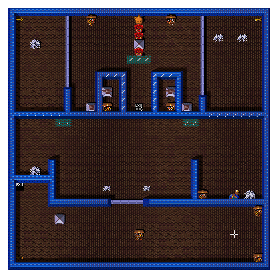

# Chapter 9 — Building and Choosing a Level (Mazes and the Slapstic)

**This chapter answers:** Where do levels come from? How does the game pick
the next maze, get at its data through a copy-protection chip, and turn a
few hundred bytes into a playable world?

**By the end you will understand:** the difference between a level and a
stored maze, the cabinet-persistent rotation that chooses each next maze,
the Slapstic bank-switching ritual, the anatomy of a stored maze record,
the bytecode decoder that unpacks it, the three separate kinds of
randomness layered on a level, and the little generator behind every random
number in the game.

**It builds on:** Chapter 7's level-start pipeline (this chapter is steps
one and three of it in full) and Chapter 8's slots, objects, and
coordinates, which are what the decoder builds.

---

## Levels are not mazes

Play long enough and the same layouts start coming around again wearing
different colors and nastier rules. That observation is the right instinct:
a **level** is a counter of your progress, and a **maze** is a stored
layout record, and the two are related by an algorithm with a memory longer
than your play session.

The Slapstic ROM holds 117 maze records, numbered 0 through 116, and every
one is live:

| Mazes | Role |
|-------|------|
| 0–4 | The first five levels of every session, in fixed order |
| 5–101 | The rotation: normal levels, visited by the algorithm below |
| 102 | The attract demo's level (Chapter 15) |
| 103 | Scenery for the legend and high-score pages |
| 104–114 | The eleven treasure rooms |
| 115–116 | The two secret-room layouts (Chapter 13) |

Earlier project documentation described mazes 0–4 as unused and gave a flat
`level = maze + 4` rule; both claims dissolve under the disassembly, and
the truth is more entertaining.

## Choosing the next maze

Every session begins the same way: the maze number is cleared to zero, so
levels 1 through 5 play mazes 0 through 4 in order. These five layouts,
with their gentle flags and no secret objectives, are the game's fixed
opening act.

After that, selection runs on two words of state the cabinet keeps in its
EEPROM, surviving power-off:

- a **resume position**: where in the 5–101 rotation this cabinet currently
  stands, written once per game — when the last player dies on level 6 or
  later, the maze they died on becomes the new resume point; and
- a **stride**, 0 through 7: how many extra mazes each level advances.

When the last player exits an ordinary level, the next maze is computed
like this:

```text
steps = 1
if current_maze >= 5: steps += stride

repeat steps times:
    candidate += 1
    if candidate == 5:            # crossing out of the opening act:
        candidate = resume        # jump to where the rotation stands
    while candidate is not a valid normal maze:
        if candidate > 101:
            candidate = 5         # wrap to the rotation's home
            schedule an EEPROM save
        else:
            candidate += 1

if final candidate == 5: stride = (stride + 1) mod 8
```

Read what this does across sessions. A factory-fresh cabinet has resume = 5,
so its first game plays mazes 0–5 as levels 1 through 6, exactly the six
the project's owner remembered. Landing on 5 bumps the stride, so the
session continues 7, 9, 11, striding by two. Then the party runs out of
health somewhere in the eighties and the game ends — and *that* is the
moment the cabinet writes down where it got to. The resume point is not a
running bookmark updated level by level; it is an epitaph, recorded once,
on the maze the last player died in. (If they died in a treasure room, the
code first restores the rotation maze that was queued behind it, so the
cabinet never remembers a treasure room as its position.)

The *next* session replays the opening act, then jumps straight to that
epitaph, seeing mazes its predecessor never reached. Each full lap past
maze 101 wraps home to 5 and lengthens the stride again, up to eight, so a
heavily played cabinet strides through its catalog in ever-coarser steps
and different laps visit different subsets.

Nothing here consults the random-number generator. The selection *feels*
random to players, and it is actually a deterministic rotation whose state
lives in the cabinet rather than the session, a design that guarantees
variety between games at the price of two EEPROM bytes. The level counter
itself has one last joke: it caps at 999, and the level after 999 is
labeled level 6.

The opening act also advertises its own fire escape. Maze 0 — level 1,
the first room of every game — contains an EXIT TO 6 tile alongside its
ordinary exit, and it is the only maze in all 117 that has one. Stepping on
it takes a separate branch of the same code, which sets the level counter
to 6 and jumps the maze directly to the resume point, letting an impatient
party skip the opening act in its first ten seconds and land wherever the
rotation stands. That branch ignores the stride and does not bump it.

The **treasure rooms** run a miniature copy of the same idea: a countdown
of levels (reloaded to a random 3 to 5) schedules the next treasure visit,
and the room itself comes from a second EEPROM-backed pair, a position
rotating through mazes 104–114 and its own stride of 1 to 4 that grows
when the rotation laps back to 104. The demo, legend, and secret paths
skip all of this and name their mazes directly: 102, 103, and (chosen by
challenge code) 115 or 116.

## Getting at the bytes: the Slapstic

The maze data occupies a 32 KB ROM the CPU cannot simply read. Its address
window is 8 KB, and which quarter of the ROM appears there is decided by
the **Slapstic**, an Atari security chip wired between the CPU and the
ROM. The Slapstic switches banks only after watching the CPU perform a
specific sequence of accesses to specific addresses, a ritual meaningless
to any program that does not know the secret. Copy the game ROMs without
understanding the chip and the level data stays locked in one bank; this
was copy protection aimed at bootleggers, and Chapter 17 has more to say
about Atari's defensive streak.

The game itself performs the ritual through a small set of helper
routines, and boot (Chapter 5) runs a verifier that exercises all four
banks. Two structures inside the data make the arrangement navigable: a
117-entry pointer table locating every maze record, and a packed table of
2-bit bank numbers saying which bank each record lives in. Selecting a
maze means looking up its bank, performing the ritual, and following the
pointer.

## Anatomy of a maze record

A maze record is a few hundred bytes: an 11-byte header, then a compressed
stream.

| Header byte | Meaning |
|-------------|---------|
| 0 | Secret objective ID for this maze (Chapter 13) |
| 1–4 | Four level-flag bytes: odd-angle and fast monsters, wall behavior, exit behavior, friendly fire, wrap, and more |
| 5 | Wall and floor art pattern |
| 6 | Wall and floor palette choices |
| 7–10 | Four reusable span definitions: two horizontal (HT1, HT2), two vertical (VT1, VT2) |

Those last four bytes are the compression's cleverest part: each defines a
compound brushstroke ("some floor, then a treasure", "a run of wall capped
with a door") that the stream can invoke by name, with a repeat count, over
and over.

## The decoder

Decoding walks a cursor across the 32×32 logical grid from Chapter 8,
top-left to bottom-right, one slot at a time. (The cursor starts on the
second row; row 0 is always solid wall.) Each stream byte is a bytecode:

| Byte range | Action |
|-----------|--------|
| 0x00–0x3F | Place one object of this type; remember it as "previous" |
| 0x40–0x7F | Apply span HT1, VT1, HT2, or VT2, with a count |
| 0x80–0x9F | Repeat the previous object 1–32 times |
| 0xA0–0xBF | A run of wall, horizontal or vertical |
| 0xC0–0xFF | Skip cells (leaving floor), optionally capping with one wall |

Vertical spans write *upward* from the cursor with a stride of one row
while the cursor itself moves on by a single cell, which is how a stream
read left-to-right can still erect columns and door frames. Decoding stops
when the cursor has covered all 1,024 cells; the stream carries no
terminator for the game's benefit, though every stored record ends with a
zero delimiter that offline tools use as a sanity check.

Here is the real opening of maze 0, the first thing every Gauntlet II
session builds. Its header defines HT1 as "a run of floor, then one
treasure," and the first eight stream bytes are:

| Byte | Meaning | Cells emitted |
|------|---------|---------------|
| `35` | place a key | 1 |
| `80` | repeat previous ×1 | another key |
| `47` | span HT1 ×8 | 8 floor, then a treasure |
| `C4` | floor ×5 | 5 floor |
| `31` | place food | 1 |
| `42` | span HT1 ×3 | 3 floor, then a treasure |
| `C9` | floor ×10 | 10 floor |
| `35` | place a key | 1 |

Count the cells: exactly 32. Eight bytes emit the entire first row of the
level, two keys bracketing treasure, food, and open floor, and later
vertical spans will drop door frames and wall ends onto the same row from
below. The whole 32×32 level, monsters and doors and all, costs a few
hundred bytes. Rendered by `python-gex` from those bytes:



*Maze 0, the layout every session opens on: keys at the top corners, the
treasure and food of the worked example along the first row.*

## From tokens to a living level

The decoder hands each placed token to a dispatcher, and Chapter 8
described its output format: object types become MOB records at the slot
matching their cell, with per-type pictures, sizes, and origin
corrections from ROM tables. Walls, traps, and forcefields are placed as
markers first, then a post-decode pass selects their actual 2×2 tile
descriptors so that wall artwork connects properly to its neighbors. Other
scans find the player start, build the transporter and exit tables, wire
door endpoints, initialize forcefields, and center the camera. One special
case is pure pacing: the dragon is written out of the maze data entirely
before level 12 of a normal game, so the deep dungeon keeps something in
reserve.

## Three kinds of random

The word "random" hides three different mechanisms in this game, and
keeping them apart matters:

1. **Maze selection** (above) is deterministic rotation with persistent
   state. No dice involved.
2. **Level-flag randomization** happens after a maze is chosen. The stored
   flags are a floor, not a ceiling: each level, a couple of trap-flag
   bits are randomly flipped, and deep levels get extra hazards ORed in,
   drawn from a 13-entry table, with wraparound geometry forced past
   certain depths. Late in the game, nearly any maze can arrive fast,
   odd-angled, invisible, or wrapped regardless of what its header says.
3. **Random placement** happens after flags. A per-maze count of extra
   food (0 to 7) is scattered onto random empty cells, invulnerable food
   picks a random variant, and Chapter 13's misbehaving walls draw their
   timing from the same well.

The well itself is one small function, `getrandom`, and one 16-bit seed
word. Each call advances the seed with a textbook linear congruential
step and scales it to the caller's range:

```text
seed = (13849 × seed + 23861) mod 65536      # one shared word of state
return (seed × N) div 65536                  # a value in 0..N-1
```

Everything random in Gauntlet II drinks from this stream: flag flips, food
scatter, monster movement odds (a monster's "speed" is a probability its
step happens this frame), generator spawns, forcefield timing, the thief's
schedule, treasure-room countdown pranks, secret-task choices. One
consequence is worth savoring: because every consumer advances the same
seed, apparently unrelated events are coupled. Whether a ghost shuffles
left this frame changes which secret task you draw two levels later. And
because nothing in either ROM ever writes that word except the generator
itself, the coupling has no reset: the stream runs from power-on to power-off
through attract screens and sessions alike. Chapter 15 comes back to that
when it asks how much of the attract demo repeats.

---

> **Under the hood**
>
> - Maze ranges, pointer table, and bank table: `doc/06_maze_catalog.md`
>   §1–3. Its §3.1–3.5 now carry the same selection algorithm with the
>   instruction addresses; the old "Level N = Maze N+4" framing and
>   "unused" labels for mazes 0–4 have been corrected there.
> - Selection algorithm sites: the ordinary-exit path in
>   `player_exit_sequence` (0x52DBA–0x52E36: resume jump, stride add,
>   stride bump, level-999 wrap to 6) and `maze_checknum` (0x52ECA:
>   entry substitution of 5 → resume at 0x52EDE, wrap >101 → 5 with the
>   EEPROM write countdown forced to 1). Rotation state: resume word
>   0x904010 and stride word 0x90400E, both persisted via the EEPROM
>   config block (`doc/07_function_index.md`, `eeprom_load_config`).
>   The resume word is written at exactly one gameplay site,
>   `main_health_countdown` 0x46A0E, guarded by
>   `level_players_active == 0` and level ≥ 6 — that is, at game over,
>   not per level; the treasure-room restore just above it is 0x469F6.
>   The EXIT TO 6 shortcut is the non-ordinary exit-type branch at
>   0x52E38–0x52E50: level counter forced to 6, maze set to 5, then
>   substituted with the resume word by `maze_checknum`. Tile type 0x11
>   (`MAZEOBJ_EXITTO6`) occurs exactly once in the whole ROM, in maze 0.
> - Treasure selector: `show_level_start_screen` 0x44E92–0x44F38, level
>   countdown 0x904B80 (reload `getrandom(3)+3`), rotation word 0x904018
>   and stride 0x904016 (EEPROM bytes 2–3).
> - Slapstic access ritual and helpers (0x56E58/0x56E6E/0x56E84),
>   `slapstic_cmd_bitwise` (0x43826), boot verifier `slapstic_verify`
>   (0x56EAA): `doc/01_hardware.md` §11, `doc/04_game_subsystems.md`
>   §5.6.
> - Record header and bytecode encoding: `doc/06_maze_catalog.md` §8,
>   `doc/05_data_reference.md` §3.19–3.20, §4.1; decoder mechanics
>   (`maze_decode` 0x4C1BC, cursor start 0x20, vertical stride −32):
>   `doc/04_game_subsystems.md` §5.3. The worked example was
>   cross-checked against `python-gex`'s validated decoder
>   (`mazedecode.py`), which reproduces all 117 records.
> - Token placement and the dragon's level-12 suppression:
>   `maze_place_object` (0x45E40), `doc/04_game_subsystems.md` §5.4.
> - Flag randomization thresholds and the 13-entry hazard table
>   (0x57012): `maze_load_pickup_config` (0x436FE),
>   `get_random_maze_flags` (0x436CC), `doc/04_game_subsystems.md` §5.5.
> - The RNG: `getrandom` (0x5FC4E) and register variant (0x5FC46), seed
>   word 0x904BFC; the multiplier/increment constants 0x3619/0x5D35 are
>   verified in the disassembly at 0x5FC2E–0x5FC36.
