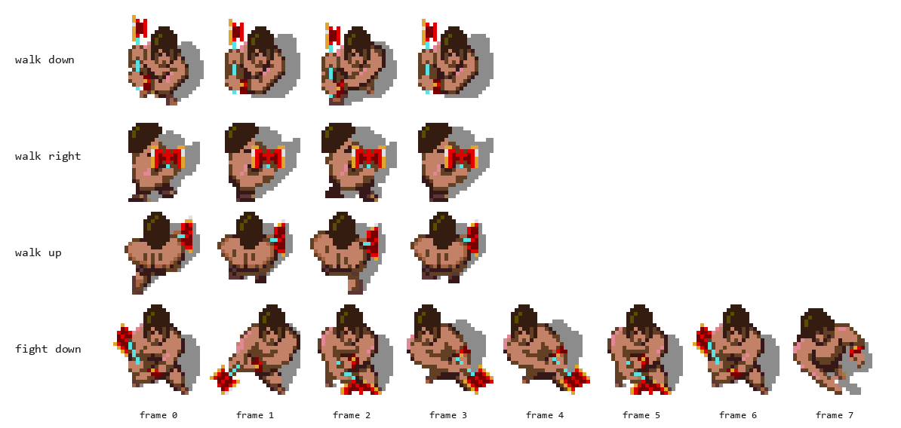
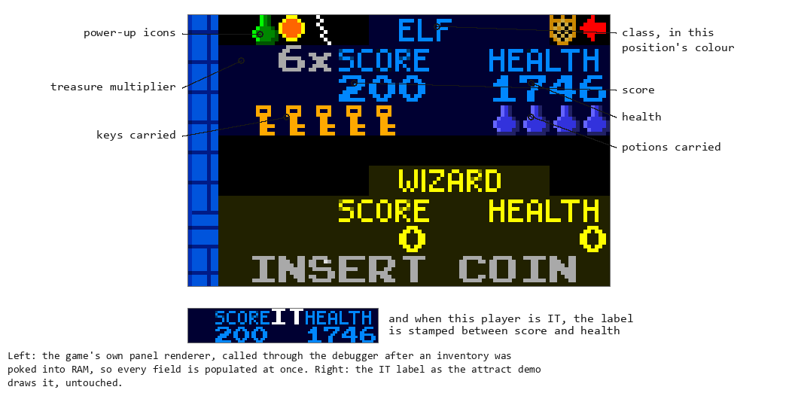

# Chapter 10 — The Heroes (Players, Controls, and Inventory)

**This chapter answers:** What is a player from the machine's point of view,
and how do up to four of them move, fight, drink potions, go shopping for
power-ups, and die, all inside one shared frame?

**By the end you will understand:** how the four character classes exist as
data tables; what happens when someone joins a game in progress; the path from
joystick switches to intent; how the maze answers a request to walk; how
melee, shots, and potions deal their damage; the full life of the health
number; inventory, doors, and the power-up vocabulary; and the moments when
cooperative play quietly turns competitive.

**It builds on:** the frame loop from Chapter 6 (each system here is one of
its per-frame calls), the session lifecycle from Chapter 7, Chapter 8's world
model of maze slots, pixel coordinates, and MOBs (the motion-object records
that represent every moving thing), and Chapter 9's freshly constructed level.

---

## A friend with a coin

You are alone on level nine with your health sagging when a friend walks up,
drops a coin, presses Magic, and holds the stick left. A valkyrie materializes
in a clear cell near where you stand, her stats column lights up in blue on
the info panel, and the cabinet says, in its best announcer voice, "Welcome,
Blue Valkyrie."

Joining mid-level runs the same machinery as starting a fresh game. By the end
of this chapter you will have seen every gear in it: the character-selection
state your friend passed through, the spawn search that found her a safe cell,
the MOB that now carries her around, the tables that make her a valkyrie, and
the shared per-frame update that treats her exactly like you, sixty times a
second. That update is one of the sixteen gameplay calls inside `g2mainloop`.

## A hero, by the numbers

The four classes feel different to play, and the differences are almost
entirely *data*. One body of player code serves all of them, and being a
Warrior or an Elf means indexing that code's tables with a different character
number, an ID that turns up everywhere:

| Character number | Hero |
|------------------|------|
| 0 | Warrior |
| 1 | Valkyrie |
| 2 | Wizard |
| 3 | Elf |

Per-class ROM tables cover movement speed, shot damage, armor, forcefield
burn, and magic (a whole matrix, covered in its own section below). Most are
small enough to show outright, with values read straight from the ROM.

**Movement speed**, in the engine's fixed-point units; the powered row is
selected by the extra-speed power-up:

| | Warrior | Valkyrie | Wizard | Elf |
|--|---------|----------|--------|-----|
| Normal | 0x80 | 0x80 | 0x80 | 0x100 |
| Powered | 0x100 | 0x100 | 0x100 | 0x100 |

The Elf natively moves at double rate, and the speed power promotes everyone
else to Elf pace. (A companion table layers smaller per-class fractional
boosts on a cadence, so the walking feel differs a little more than the base
row suggests.)

**Forcefield burn**, charged per frame while you stand in a lit energy fence:
Warrior 2, Valkyrie 2, Wizard 6, Elf 4, with a second row of gentler rates
(1, 1, 5, 3) selected by the extra-armor power-up. The Wizard pays three times
what the Warrior does, which is one of the numbers behind his fragile
reputation. Time itself charges a flat rate instead, the same for every class,
and the section on health below gives it.

The shot-damage table is small enough to show in full. Heroes run across the
columns here because that is how ROM stores them: consecutive entries step
through the four characters. The table has three such rows, and owning the
shot-power upgrade moves the lookup forward eight bytes, to the third of them.

| Shot | Warrior | Valkyrie | Wizard | Elf |
|------|---------|----------|--------|-----|
| Normal | 2 | 1 | 1 (+0–1 random) | 1 |
| With shot-power upgrade | 2 (+0–1 random) | 2 | 2 | 2 |

A super shot skips the lookup and deals a flat 3.

Basic monsters die in one to three points of damage depending on their tier,
so small numbers decide a lot here, and Chapter 11 does that bookkeeping.
Armor works by the same method in the other direction, with incoming
monster-shot damage looked up by monster type, shot tier, *and* victim
character. The basic tier reads Valkyrie 3, Warrior 4, Elf 4, Wizard 5; the
armor powers select lower rows; and the strongest shot tiers reach 15
against a Wizard while a Valkyrie holds the same shot to 10. Chapter 1's
class tradeoffs are these lookups.



*The Warrior's animation tables, rendered from the graphics ROMs: the
four-frame walking cycle in three of its eight directions, and the
eight-frame fighting swing. The soft gray is the sprite's built-in shadow.*

Even a hero's *look* comes from tables. Each player has a free-running
animation counter, and four ROM tables covering idle, walking, fighting, and
shooting are indexed by character, facing direction, and a few bits of that
counter to pick the sprite for this frame. Walking cycles four frames in about
a quarter second. Fighting runs an eight-frame swing, and shooting is a
four-frame throw. No code anywhere "plays an animation." Every frame, the
current counter value *is* the animation.

## Joining the party

A coin credits an idle player position with health, and pressing Magic moves
that position into **character-selection state**, one of the per-player status
values from Chapter 7. The game keeps running while your friend picks a hero,
so you are still fighting during her deliberations. Selection reads her
joystick directly: up offers the Warrior, left the Valkyrie, down the Wizard,
right the Elf, and each change repaints her info-panel column to preview the
choice.

Once the choice is committed (Chapter 7's session machinery owns the exact
trigger), the placement runs:

1. **Find ground.** If nobody else is in the level, the newcomer stands on
   the level's recorded player-start marker, and the IT curse is cleared
   for good measure, since nobody remains to hold it. Joining a level in
   progress instead anchors the search on the party itself: for each active
   player in turn, four candidate cells offset around that player's position
   are tested for traversable, unoccupied floor, and the first clear one
   wins, which is why a latecomer materializes beside a friend. Placement
   has to succeed before the join continues, and the finalizer never runs
   without a spot for the new hero.
2. **Build the body.** A MOB is created at that cell, and its slot becomes
   this player's. From here on, "player 2" is an index into the same five
   parallel arrays as every monster (Chapter 8), plus a family of per-player
   arrays holding health, score, facing, powers, inventory, and timers.
3. **Install the character.** Two small per-player handler slots in RAM are
   pointed at character-specific palette routines, one driving the "hurt"
   flash cycle and one driving power-state color cycling, and the display
   update calls them every frame thereafter. A wounded wizard flashes in
   different colors from a wounded warrior because the *handler itself* was
   chosen at join time.
4. **Announce.** Counters and per-player state are initialized, the active
   player count goes up, the join sound plays, the info-panel column is
   drawn for real, and the speech system greets the newcomer by color and
   class.

When every candidate around every player is blocked, the join is refused,
and the cabinet says so with a sound effect whose entry in the project's
sound-command catalog is simply named "Unable to Join In."

Player death unwinds the same structures, and that comes later in this chapter.

## From switches to intent

Chapter 6 covered the electrical half: raw joystick words read every frame,
active-low so that a pressed switch reads 0, filtered through hand-written
debouncing. This chapter picks up at the clean result, which is one byte per
player whose high four bits are up/down/left/right and whose low bits include
**Fire** and **Magic**.

A sixteen-entry lookup converts those four direction bits into intent, mapping
every combination of the switches to one of eight compass directions or to "no
direction." That is how up plus left becomes a clean diagonal, while
contradictory combinations resolve to nothing. The result feeds three separate
pieces of per-player state, and keeping them separate is part of why the
controls feel right:

- **facing direction**, the way your sprite looks and shoots, updated as you
  move and deliberately left unchanged when a move is rejected;
- **fighting direction**, a parallel direction used while an attack animation
  is in flight, with its own sixteen-entry input map;
- **the buttons**: Fire arms the shooting sequence and Magic asks to drink a
  potion. Both are requests, and the per-frame player update decides if and
  when to honor them.

## The maze pushes back

Each frame the player update proposes a move, and the maze answers. The
routine the project named `player_try_move` either commits the move or reports
why it failed:

```
speed = speed_table[character][powered?]
delta = direction_deltas[facing] scaled by speed
        (reduced if stunned or acid-slowed)

result = try_move(player, delta, flags):
    probe the target cell(s) for walls and blocking objects
    if a door: run direction-aware door traversal (have a key?)
    if blocked diagonally: try the corner "squeeze" geometry check
    if blocked by monster or player: stop (bodies are solid)
    honor the level's wrap flags at maze edges
    commit the move, or report "blocked"
```

Several details make walking feel polished. The **corner squeeze** retries a
blocked diagonal as an L-shaped slide, so brushing a corner steers you around
it. A **blocked** result sets a flag the caller uses to keep your facing
unchanged, so a failed step never scrambles your aim. The **camera window**
constrains movement too: unless the level flags say otherwise, you cannot walk
somewhere the shared screen refuses to follow, which is Chapter 8's
rubber-band seen from the other side. Slow effects land on the proposal
itself. A stun freezes it briefly, and acid slows you for as long as you
stand in it.

All of the wall, door, and occupancy probes work on Chapter 8's packed maze
slots and the traversability table introduced there. Movement is the biggest
customer of that machinery.

## Swords and arrows

Melee happens without a button. Walk into a monster and your hero *fights*:
the eight-frame fighting animation runs in your fighting direction, and the
collision between the two bodies resolves through class data, weighing the
monster's contact damage against your armor table on one side and your class's
fighting ability on the other. The upgrade item called "extra fight power"
acts here, as does the armor power-up.

Shooting takes a button. Pressing Fire starts the four-frame shooting
animation, and the shot spawns when that animation *completes*, provided your
shot channel is free. The wind-up is why firing feels like a throw. The
projectile takes your facing direction, a velocity from a table indexed by
direction and class, and a picture from your class.

One rule shapes everything about shooting: **each player owns exactly one shot
MOB**, one of the fixed low slots from Chapter 8. One arrow in flight per elf.
Your next shot cannot exist until the current one lands, so standing close to
your target makes you faster.

When a shot arrives somewhere interesting, a large resolution routine called
`resolve_shot_hit` decides what happens, dispatching on what was hit: monster,
generator, player, wall, door, food, potion, dragon, Death. It is the busiest
intersection in the combat system. Chapter 11 takes its monster and generator
branches, and the player-versus-player branch closes this chapter. Every hit
also ends with the shot either *consumed* or still flying: supershots pierce
most monsters, and the reflect power lets a shot bounce off a wall and keep
going.

## Potions and the Magic button

Press Magic with a potion in your pocket and the drink dispatches a blast
against every eligible monster and generator around. What happens to each of
them comes out of a table.

ROM holds a **potion-effect matrix** of one 16-byte record per monster or
generator object type, 28 types in all. Within a record, the entry is selected
by who is drinking (the four characters) and by how the magic was triggered,
either drunk from your pocket or set off by a shot, plus a flag for whether
the drinker owns the **extra magic power** upgrade. For a monster type the
entry holds a damage value, subtracted from the monster's tier health. For a
generator type it holds a *replacement*, the object the generator becomes.
And in both halves, a **zero entry means the target is destroyed outright**:
the blast handler branches a zero straight to MOB removal, no damage
arithmetic involved.

A slice of the real matrix, read from the ROM, for ghost generators under a
normally drunk potion:

| Target | Warrior | Valkyrie | Wizard | Elf |
|--------|---------|----------|--------|-----|
| Ghost generator, tier 1 | unaffected | unaffected | destroyed | destroyed |
| Ghost generator, tier 2 | unaffected | unaffected | destroyed | destroyed |
| Ghost generator, tier 3 | unaffected | unaffected | destroyed | demoted to tier 1 |

The Wizard's column is zeros: every ghost generator on screen, erased with
one drink. The Warrior's and Valkyrie's columns name each generator's own
type, a replacement that changes nothing. Their enhanced-magic columns
upgrade them to one-tier demotions, the shot-triggered columns are a step
weaker across the board, and the grunt, demon, lobber, and sorcerer
generator families all follow the same shape. Over in the monster rows,
ordinary ghosts read damage 2 for the Warrior and Valkyrie and zero, that
is, instant erasure, for the Wizard and Elf. The most famous zero in the
matrix belongs to Death, whose row is nothing else: any character's potion
destroys Death on contact, the one reliable remedy the game offers, and it
is one table byte.

That one matrix answers a lot of questions at once. A Wizard's potion levels a
room where a Warrior's singes it, because the two read different columns of
the same record. A potion set off by a stray shot does less than one you
drank, since the trigger bit selects a different entry, which is the game
charging you for clumsiness by table lookup. (The dragon gets a private check
of its own inside the potion handler; see Chapter 12.)

## The dwindling number

Chapter 1 called health both life bar and cash register. The per-frame code
accounts for every movement of that number.

Time drains health on a steady cadence: one point off every active player's
total on every sixty-fourth frame, in every mode, with no class or difficulty
term at all. It is the one charge in the game nobody can be better at paying.
Monster contact subtracts through the contact-damage
table, which carries its own half for powered players. Monster shots subtract
through the armor table, while hazards and special monsters take their own
paths to the same number. Damage also gets *sampled*: a 60-frame window
accumulates what you have taken and maintains a running average, which the
game consults when deciding whether your situation deserves spoken commentary.

Food adds a flat hundred, and coins add the operator-configured amount. Those
two sources are the entire supply, and health is scarce by design.

Below 200 health, a per-player timer starts driving the low-health show. The
health number on the info panel pulses dim and bright in a steady eight-frame
rhythm, and a heartbeat sound plays on a cadence selected by a mask table
indexed by how low you are. The lower the health, the more often the mask
fires, so the heartbeat accelerates as you fade. The spoken warning ("… is
about to die!", "… needs food, badly") latches once per life, so the cabinet
frightens your friends exactly once per emergency.

At zero the death sequence runs, your MOB winds down, and the per-player timer
that drove your heartbeat is bluntly *reused* as your death countdown: 45
seconds if your score-per-coin ranked for initials entry, 10 seconds of GAME
OVER display if it did not. One word, two jobs, chosen by whether you are
alive, which is a very 1986 economy. If you were the last player standing,
Chapter 7's continue prompt takes over.

One footnote runs the other way. A few food and potion sprites are marked
variants, and shooting one throws the *monsters* into slow motion: ten seconds
for the food, twenty for the potion, each announced by its own sound. For once
the machine rewards you for shooting the food, and Chapter 11 has the
mechanism, which is simply that the monster pass skips every other frame.

## Pockets and doors

A hero's inventory is spartan: a count of **keys**, a count of **potions**,
the **score multiplier**, and the power-up bits below. The info-panel column
renders it directly, with rows of key and potion icons and the multiplier
whenever it exceeds one, so your pockets stay public.



*One player position's column with every field populated at once: class name
in the position's colour, score, health, the treasure multiplier, the keys
and potions carried, and the power-up icons along the top. The inset shows
the IT label, which the game stamps between score and health.*

You collect keys by walking over them and spend them without ceremony: touch a
locked door while carrying one and the door system takes over. Each door is a
logical object with recorded **endpoints** and direction codes, so passing
through depends on which way you approach, and opening one animates through
the door renderer, which can carry eight doors mid-animation at once. Chapter
13 covers the world side of doors, meaning how the maze graph changes and how
neighboring tiles redraw. The player's side of the rule is *one key, one
opening*. If the party dawdles long enough, an idle timer opens every door on
the level for free and announces "Doors open," the dungeon's way of asking you
to keep moving.

An advice system hovers over all of this. The first time you meet a mechanic,
whether that is your first key, first locked treasure, first transporter, or
first potion wasted by a stray shot, a dialog box freezes gameplay (Chapter
6's dialog gate) and explains it. Each tip owns a bit in a 32-bit seen-it
mask, so the machine nags once per lesson.

## The power-up shelf

The floor offers power-ups beyond food and cash, presented, like most things
in this dungeon, in bottle form. The game's own legend screen sorts them onto
two shelves, and the code agrees with the legend.

**The permanent shelf** holds six upgrades that set a bit in your power word
and stay with you: **extra speed**, **extra armor**, **extra fight power**,
**extra shot speed**, **extra shot power**, and **extra magic power**. Each
selects the better column of a table you have already met in this chapter,
namely speed's powered column, the contact table's powered half, melee
strength, projectile velocity, the damage table's upgraded column, and the
potion matrix's enhanced variant. Six bits become six icons on your info-panel
column, and the thief in Chapter 12 appraises exactly these when choosing a
victim.

**The temporary shelf** holds timed or metered effects:

- **Invisibility** makes monsters lose track of you. As the timer runs out
  your sprite flickers at an accelerating rate, driven by a mask table
  indexed by the timer's phase, so the flicker doubles as a fuel gauge.
- **Invulnerability** grants damage immunity on a timer, with its own palette
  cycling so everyone can see you're briefly a demigod.
- **Repulsiveness** works as an anti-magnet, keeping monsters at a distance
  while it lasts.
- **Reflective shots** bounce your projectiles off walls, with a fresh
  direction calculated per bounce.
- **Super shots** come as a metered pack of screen-clearing ammunition, ten
  charges by the legend's account. While charges remain, every shot does top
  damage, pierces ordinary monsters, ignores a blinking sorcerer's immunity,
  breaks "unbreakable" items, and hurts things that nothing else can hurt.
  Each fired shot burns one charge.
- **Transportability** loosens the transporter rules, letting you arrive in
  places ordinarily off-limits. The game's secret challenges go so far as to
  dare you to land on a demon, or on Death itself.

## When friends become targets

Gauntlet II keeps a little venom in reserve for a party that has spent the
whole chapter cooperating.

Touch the darting IT creature and the IT variable, a single word naming the
cursed player or nobody, points at you. The presentation half is instant, with
"IT" stenciled into your info-panel column in your colors and the cabinet
announcing the transfer by name. The gameplay half is that monster targeting
*accounts for the IT player* when choosing whom to chase, so the crowd's
attention finds you. Tag another hero and the label, the announcement, and the
crowd all move on. Touching a friend is an act of aggression here.

Friendly fire arrives by level flag. On levels flagged **shots stun**, a
teammate's shot freezes you mid-stride for a beat and knocks your attack out
of your hands. On the rarer **shots hurt** levels it also costs a couple of
health. Whatever the flags say, a **supershot** is honest artillery: catch a
friend with one and they lose ten health. Four players, one shared screen, and
metered ammunition add up to something the game knows it is inviting.

The dungeon watches all of it. One of the hidden secret-room objectives from
Chapter 13 carries the name "Don't Hurt Friends," and the shot-resolution code
files its report the instant you shoot a teammate, which means the machine
keeps score on your sportsmanship.

Two geometry details tie the whole player system together. The first hero
claims the level's PLAYERSTART; later heroes try the four cells beside each
existing hero and accept the first empty on-screen location. The join finalizer
also owns full health: paid starts and continues take the operator-selected
starting-health value, while demo and free-play joins take 2000. A coin fed to
somebody already alive is the separate, smaller health increment.

Pickups follow the 24×24 hero's logical center, not merely its upper-left pixel.
That distinction is visible whenever the sprite straddles two 16-pixel rows:
the center may already be over food, a potion, or a transporter. Both food
types and both potion types disappear when collected; their shot resistance
does not make them permanent inventory fountains.

A player, then, is a character number indexing a stack of tables, a MOB in the
crowd, a dozen timers, a power word, and a health number spending itself sixty
ticks a second. Chapter 11 takes the other side of the collision, the horde.

---

> **Under the hood**
>
> - The per-frame player update walked through here is `main_move_players`
>   (0x4A53A); its status dispatch and post-loop door/idle behavior are in
>   `doc/04_game_subsystems.md` §4.1. Character selection is
>   `character_select_input_update` (0x42DF4), §22.
> - Joining: `player_join` (0x48BB6) → `player_start_inner` (0x48BEC) →
>   `player_join_finalize` (0x48A36), §4.4. Spawn logic verified by
>   disassembly at 0x48C04–0x48CA6: an empty level uses
>   `maze_player_start_slot` (0x9049E0) and clears IT; otherwise four
>   candidate offsets (tables 0x578A2/0x578B2) are tried around each active
>   player's cell in turn, and total failure plays sound 0x43, catalogued
>   in `refs/soundcmds.csv` as "Unable to Join In". Character palette
>   handlers: pointer tables 0x57842/0x57852 into RAM JMP stubs at
>   0x905F00, §2.4.
> - Input: raw words at 0x904920, direction decode via
>   `joystick_nibble_to_direction` (0x580FC) and `fight_direction_map`
>   (0x5811C); facing/fighting state at 0x9049A4/0x9049AC. Debounce itself:
>   `input_debounce` (0x40644), §15.
> - Movement: `player_try_move` (0x41BF0) and its probe/traversal graph,
>   §4.2 and `doc/generated/player_collision_contracts.csv`; blocked-facing
>   flag `movement_blocked` (0x904A0E); speed table `player_speed_normal`
>   (0x580A8); slow effect `player_stundelay` (0x904A54). The timer at
>   0x9048B2 is `monster_slowmo_timer`, not a player effect — see Chapter 11.
> - Animation tables: idle/walking/fighting/shooting at
>   0x58A4A/0x58A8A/0x5884A/0x5874A with counter mechanics in
>   `doc/05_data_reference.md` §8.
> - Shooting: `player_create_shot` (0x53666); one fixed shot MOB per player
>   (`FIXEDMOB_SHOTPLAYER0–3`, §3.8); velocities 0x576E2/0x57792. Combat
>   resolution: `resolve_shot_hit` (0x4AF50), `doc/04_game_subsystems.md`
>   §26, with `shot_damage_base_tbl` (0x596B6), `monstshot_damage_tbl`
>   (0x596CE, Valkyrie best / Wizard worst), and `player_supershot`
>   (0x905F68).
> - Potions: `main_handle_potions` (0x46FEA); `potion_effect_matrix`
>   (0x5DA98, 28 types × 16 bytes; character bits, shot-trigger bit,
>   enhanced-magic bit; a zero entry destroys the target outright,
>   otherwise damage for monsters and replacement type for generators),
>   `doc/05_data_reference.md` §5. The matrix values quoted here were
>   dumped from `row76.bin`, and the zero-entry-destroys rule is verified
>   in the blast handler (0x41664–0x416CA: a zero byte branches directly
>   to MOB removal); the data reference now documents the same semantics.
>   All stat-table values in this chapter were likewise read straight
>   from the ROM.
> - Health: `main_health_countdown` (0x466F6), §4.3, whose drain is a flat
>   `subq.l #1` at 0x4675E gated on `frame_counter & 0x3F` at 0x4670C;
>   `health_per_coin_table` (0x57862); heartbeat mask table
>   0x576A8; damage sampling `player_damage_sample_update` (0x50E34); the
>   dual-use `player_state_timer` (0x904A26) and score-per-coin ranking
>   `highscore_check` (0x49D0E), §10.3. The per-class table at 0x5813C is
>   `forcefield_damage_table`, whose sole consumer is the forcefield branch
>   at 0x4AA96 (Chapter 13), not this routine.
> - Pickups and doors: `player_tile_interact` (0x511AC), §4.6; key/potion
>   counters 0x90405A/0x904055; `door_record_endpoints` (0x51E80) with
>   endpoint records 0x904A76/0x904A86; `main_open_doors` (0x45C00);
>   idle-timer door opening via `idle_timer` (0x90490C). Inventory/icon
>   rendering: `player_inv_update` (0x45ACA). First-encounter tips:
>   `dialog_first_encounter` (0x4C440), §10.4.
> - Power-ups: `player_powers` (0x9048E0) with the bit enum in
>   `doc/05_data_reference.md` §3.3; `invisibility_flash_masks` (0x58070).
> - PvP: IT variable 0x9049DC and `player_it_label_set` (0x45866), §4.5;
>   shot-stun/shot-hurt level flags (§3.12) and the player-victim branch of
>   `resolve_shot_hit` (§26), including the −10 supershot case and the
>   trick-0x11 "shot another player" secret hook.
