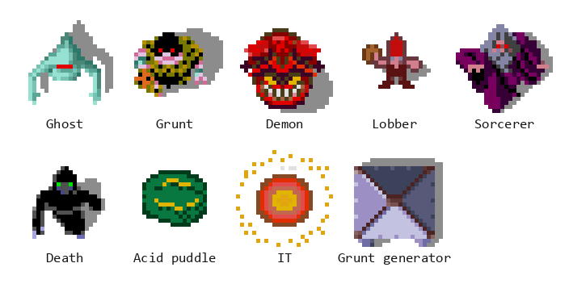
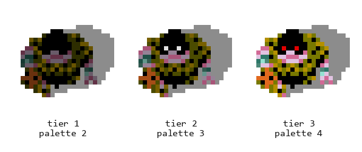

# Chapter 11 — The Horde (Monsters and Combat)

**This chapter answers:** How does a 1986 arcade board run a screenful of
monsters, decide what each one wants, and settle every collision, sixty times a
second?

**By the end you will understand:** how the monster roster exists as data
rather than as code; why a monster's color is its health; the single handler
that drives almost every creature in the maze; how generators regulate the
population and why the cabinet quietly turns them down when it is struggling;
what makes a lobber different from a demon; and the arithmetic behind a kill.

**It builds on:** Chapter 8's MOB records and maze coordinates, Chapter 9's
level flags and shared random number generator, and Chapter 10's shots,
potions, and the IT curse.

---

## The room fills up

You come through a door into a long corridor and there are two grunt
generators at the far end, chewing out monsters faster than you can kill them.
Within a few seconds the corridor is a moving wall of yellow. Your health is
falling from contact damage you cannot even attribute to a specific attacker,
your one arrow is somewhere in the middle of the crowd, and a friend is
shouting at you to find the exit.

This is the picture the whole machine was built to produce. A crowd that dense
was unusual in 1986, and the way Gauntlet II gets there is worth a chapter:
compact tables, one shared decision routine, and a population controller that
knows exactly how much work the CPU has left.

## The roster is a table



*The cast, rendered from the ROMs at full strength: ghost, grunt, demon,
lobber, sorcerer, Death, acid puddle, IT, and a grunt generator. The soft gray
is each sprite's built-in shadow.*

Every object in a maze carries a type number, stored in the upper bits of its
MOB link word (Chapter 8). Ten of those numbers are creatures: ghost, grunt,
demon, lobber, sorcerer, auxiliary grunt, Death, acid, Super Sorcerer, and IT.
Eighteen more are generators, arranged as three strength variants for each of
six monster families. Everything else in the numbering is walls, doors,
treasure, food, and the rest of the furniture.

That single type number is the index into a family of parallel ROM tables:
where to find the creature's idle animation, where to find its moving
animation, what picture to draw when it is first placed, how far to nudge it
inside its cell, and how strong it starts out.

## Health is a color

Here is the trick that makes a crowd affordable. A monster does not carry a
health variable anywhere. Look back at the MOB horizontal-position word from
Chapter 8: the top nine bits are the position, and the bottom four bits are the
palette number the hardware will use to draw the sprite. Combat reads and
writes that palette number as the creature's remaining health.



*The same grunt tiles drawn with three consecutive palettes. Damaging a grunt
decrements the number in its position word, and the hardware paints the result
on the next frame.*

Each family has a base value from a per-type table, and a live monster's
palette sits somewhere in the three-step window ending at that base:

| Family | Base value | Live range |
|--------|-----------|------------|
| Ghost, grunt, auxiliary grunt | 4 | 2–4 |
| Generators (all six families) | 5 | 3–5 |
| Demon | 8 | 6–8 |
| Lobber, sorcerer, Super Sorcerer | 11 | 9–11 |
| IT | 8 | 6–8 |
| Acid | 1 | single strength |
| Death | 0 | single strength |

A hit subtracts its damage from that number. If the result falls out of the
window, the creature is destroyed. Otherwise it survives one shade weaker and
visibly redder, browner, or dimmer, because the number you just changed is
also the color. One field, two jobs, no bookkeeping, and no extra byte of RAM
per monster. Chapter 10's shot-damage table dealt one to three points; this is
the scale those numbers were sized against.

## One brain, many bodies

Once per frame the main loop calls `monsters_everything`, which walks the MOB
chain and handles every creature it finds. There is no jump table of
per-monster behaviors. The routine asks two questions and takes one of three
paths:

```
for each monster MOB in the chain:
    type = link word >> 10
    if type is a generator (28..45):   generator handling
    elif type is Super Sorcerer (26):  special placement handling
    else:                              the shared handler
```

Grunts, demons, lobbers, sorcerers, ghosts, Death, acid, and IT all run through
that last branch. Two flag bits in the creature's position word select which of
three states it is in:

| State | What happens |
|-------|--------------|
| Moving | Advance the walk animation, then run the shared movement and collision code |
| Attacking | Advance the attack animation; when it completes, look for a target and shoot |
| Idle | Wait for this monster's turn in the stagger, look for a target, then move |

Target selection reads the IT variable, so the cursed player from Chapter 10
pulls attention that would otherwise be spread across the party. The rest is
deliberately cheap: a direction toward the target, a probe of the cell ahead,
and a commit or a stall. Nothing in the monster system searches for a route
around an obstacle, which is why a grunt that walks into a wall corner sits
there grinding against it and why herding monsters into dead ends works.

The chain walk is narrowed by a camera-sized culling rectangle, but its edges
are toroidal. The arcade's positions occupy a full 16-bit word at two units per
pixel, so ordinary unsigned overflow is exactly one 512-pixel maze. In a
whole-pixel port the equivalent wrap is 15 bits. Missing that scale change has
a dramatic symptom on the horizontally wrapped seventh-level layout: as the
camera crosses the left seam, creatures that are plainly visible at columns
0–14 appear numerically half a word away and stop receiving turns. Lobber rocks
then fail the same screen-window test. Both the monster rectangle and projectile
window must wrap at the maze boundary.

**The per-frame configuration.** Before the walk begins,
`monsters_everything` builds a small seven-entry table on its own stack, one
entry per monster family, and fills it with a default speed. It then consults
the level flags loaded in Chapter 9. The "fast" flags raise a family's step
from 0x80 to 0x100, and the "odd angle" flags overwrite a behavior byte in the
same records. Two details are worth knowing. The fast
entries are only installed on alternate frames, so a fast grunt takes a
double-length step every other frame rather than every frame, averaging about
one and a half times normal pace. And the odd-angle pass covers ghosts, grunts,
sorcerers, auxiliary grunts, and Death; the demon and lobber bits exist in the
maze data but have no matching entry to install.

Four creatures get exceptions inside the attacking state. A sorcerer jumps
straight past the attack animation and the shot to the movement code, and
because it has no walking animation of its own it reuses its standing pictures
while it relocates, which is what gives sorcerers their blink-from-cell-to-cell
look. An acid puddle acts only on one frame in thirty-two, from a rate mask
that gives it its slow ooze. IT reads its own rate mask from the same per-family
table and switches to a separate chase animation. A lobber selects its throwing
animation where every other family selects the shared attack one.

Its prediction follows movement the target actually achieved, not persistent
facing. A stationary or blocked hero leaves an all-ones movement nibble, which
selects the zero-padded vector row and adds no running lead.

## The population controller

Generators are the reason the corridor filled up, and they are also where the
game does its most interesting arithmetic.

A generator does not get a chance to spawn every frame. Its turn comes when
low bits of its MOB slot number line up with low bits of the frame counter,
which spreads all the generators in a level evenly across a sixteen-frame
cycle. Whatever else is happening, the machine only ever considers a fraction
of them per frame.

When a generator's turn arrives, one number decides everything. It comes from a
thirty-two entry table indexed by the number of active players and by the
operator's **Game Difficulty** setting. The label is Atari's own service-menu
wording; the code shows that its principal effect is this spawn probability:

| Game difficulty | 1 player | 2 players | 3 players | 4 players |
|----------------|----------|-----------|-----------|-----------|
| 0 (lowest) | 4 | 11 | 15 | 18 |
| 3 | 10 | 17 | 21 | 24 |
| 7 (highest) | 18 | 25 | 29 | 32 |

Three adjustments follow. A per-level bonus byte is added. Then, on every level
except the first, the result is clamped to twice the level number, which is why
early levels feel almost polite and a level in the twenties does not. Finally,
if the frame-overflow signal from Chapter 6 is set, meaning the previous frame
ran long, the number is forced to zero.

That number is then compared against a fresh random value from 0 to 31. The
generator spawns only if the number wins. So the table is a probability out of
thirty-two, evaluated once per generator per sixteen frames, and a cabinet that
is falling behind on frame time stops making monsters until it catches up. The
crowd is self-limiting, and the limit is measured in CPU time.

On a successful roll the generator picks a random starting direction and walks
up to eight neighboring cells looking for traversable, unoccupied floor. The
new monster's family and strength come from the generator's own type number, so
a tier-3 ghost generator makes tier-3 ghosts. If every neighbor is blocked,
nothing appears and the generator waits for its next turn.

The per-level bonus byte deserves its own sentence, because it is the closest
thing in the game to an opinion about you. It is recomputed from the party's
combined score divided by the coins they have put in, so a group getting a lot
of points out of very little money gets more monsters. Dropping another coin
walks the number back down.

## Specialists

The shared handler covers the common case. The differences between families are
what you actually remember.

**Ghosts** do not have an attack. They walk into you, deal their contact
damage, and are removed in the same instant, which is why a ghost swarm melts
away as fast as it arrives and why a ghost generator is so much more dangerous
than any individual ghost. The player who absorbed the hit is awarded ten points
per strength step, so ten, twenty, or thirty, multiplied by their treasure
multiplier.

**Demons** shoot. Ordinary monster shots live in four fixed projectile
channels, so the whole level can have at most four of them in the air at once.
A demon that wants to fire and finds every channel busy simply does not fire.

**Lobbers** throw rocks over walls, and the mechanism is neat. Lobber rocks get
their own four channels and their own pair of per-projectile velocity
accumulators, so a rock travels along its own two-dimensional vector rather
than along one of the eight compass directions the other projectiles use. More
to the point, a rock in flight is not tested against anything at all until its
lifetime counter drops into its final few frames. For most of its arc it simply
is not there, as far as collision is concerned, and then it lands. Lobbers also
have no contact damage; walking into one costs you nothing.

The rock's vector is where the real cleverness hides, because a lobber does not
aim at where you are — it aims at where you are going. When it decides to throw,
it reads the target player's *character* and looks that up in a small
per-character table of movement distances: the Elf, the fastest hero, gets the
largest value, the Warrior and Wizard the smallest, and every character's entry
roughly doubles while a speed potion is running. It then reads the direction
that player is currently facing and projects that distance along it, producing a
lead offset. The throw is aimed at the sum: your current position plus that
predicted step. A stationary player, or one you have just spun around, is
throwing off the lobber's arithmetic; a hero sprinting in a straight line is
handing it a perfect solution. The range gate reinforces the trick — a lobber
holds its fire unless you are in a middle band, too far to reach on foot but not
so far the lead becomes guesswork.

**Sorcerers** blink out. A flag bit in the sorcerer's position word marks it as
hidden, and while that bit is set every ordinary shot passes through. A
supershot ignores the flag, which is the answer to a corridor full of them.

**Acid puddles** creep along their fixed pattern and slow anyone who steps in,
setting the per-player acid timer that Chapter 10's movement code reads when it
scales a step.

The **Super Sorcerer** never really moves; it relocates. Its handler takes the
existing MOB and tries to place it behind a player, testing each active player
in turn and, for each, three directions behind that player's facing, with a
required run of clear cells and a proximity check against everything else in
the neighborhood. When it fails on every candidate it stays where it is. The
effect from the player's side is a sorcerer that keeps materializing at your
back.

"Behind" begins at the player's live maze slot, not at a cell recalculated from
the hero sprite's four-pixel-left origin. The arriving sorcerer uses that same
four-pixel correction, then faces exactly back along the selected cardinal or
diagonal probe line. Losing either correction shifts the materialization and
makes its supposedly aimed bolt pass beside the player.

**Death** is the one monster with a private economy. Touching Death costs four
health per contact, or three if you are carrying extra armor, and the same
number is added to a running per-player damage counter. An ordinary shot leaves
that counter alone, so it can never dismiss Death no matter how many you land.
A supershot adds twenty-five, and Death is dismissed when the total passes two
hundred, so from a clean start the ninth supershot is the one that works. The counter belongs to the player rather than
to any particular Death, so it carries across several of them within a level,
and it is cleared whenever that player is placed at a level start or joins a
game. Shooting Death also increments a separate global count that selects which
of eight floating score values appears, running from a thousand up to eight
thousand. The reliable answer remains the one from Chapter 10: any character's
potion destroys Death outright, because its row in the potion matrix is zeros.

**IT** is a monster in the technical sense, a small sparkling thing with a type
number and an animation bank. Touching it plays a sound and moves the IT label
to you, taking it off whoever held it before. If the secret challenge running on
this level is the one that asks you to be IT, the same contact ticks your
progress up by one; Chapter 13 explains where those challenges come from.

## What a hit costs

Chapter 10 left a shot in flight and handed it to `resolve_shot_hit`. Here is
what happens when the thing it hit is a monster.

The routine dispatches on the target's object type through a sixty-two entry
computed jump, so every kind of thing in the maze gets its own arm. On the
monster arm, damage is subtracted from the palette-and-health nibble, and the
window test decides between a weaker monster and a dead one. A destroyed
monster is unlinked from the chain, its picture is cleared, and a sparkle
effect is created in one of the shared effect slots.

Score comes out of the same arithmetic: damage dealt, times a per-class
multiplier, times the player's treasure multiplier. Ghosts pay ten per point of
damage, the grunt-class families pay five, and Death and IT pay one. Damaging a
strong
monster twice therefore pays exactly what killing two weak ones pays, which is
a quietly fair rule.

Generators take damage on the same scale and degrade rather than dying, unless
they are already at their weakest. A tier-1 generator dies to any hit; a tier-2
needs two points and a tier-3 needs three. A generator that survives has its
type number decremented, so it literally becomes the next weaker generator in
the numbering and its picture is updated to match. This is the same idea as the
palette trick, applied one level up.

Two rules cut across all of it. A supershot passes through ordinary monsters
and keeps going, sparing only Death and IT. And a maximum-tier shot passes
through walls, which is how a projectile can reach something you cannot see.

Killing anything resets the level's idle timer and its escape timer, so a
party that keeps fighting keeps the doors closed and the walls where they are.
Chapter 13 explains what happens when they do not.

## Crowds, in summary

Nothing in this chapter is expensive on its own. A monster is a type number, a
position word whose low bits double as health, a link into a shared chain, and
three lines of decision making. Generators are throttled by a probability that
already knows how many people are playing, how much they have paid, and whether
the last frame ran long. The differences between families live in tables and in
a handful of branches.

Two actors in the maze refuse all of this and get their own code. Chapter 12
introduces them.

---

> **Under the hood**
>
> - Per-frame entry `monsters_everything` (0x40E6A) with the internal branch
>   targets `monster_loop_core` (0x40FAE), `monster_special_handler` (0x4119A),
>   and `monster_update_anim_tile` (0x414A4); dispatch and states in
>   `doc/04_game_subsystems.md` §3.1–§3.3, contracts in §3.8 and
>   `doc/generated/monster_combat_contracts.csv`.
> - The per-family exceptions are selected by a monster-index byte offset, not
>   by object type: the loop masks the link high byte with 0xFC to get
>   `type × 4` and subtracts 0x48, leaving `(type − 18) × 4`. That offset
>   indexes the ten-record tables at 0x40DB2/0x40DDA/0x40E1E and the per-family
>   stack configuration. Lobber 0x0C, sorcerer 0x10, acid 0x1C, Super Sorcerer
>   0x20, IT 0x24. The special-case branches are at 0x411D2–0x4121E, and the
>   acid/IT rate masks are applied at 0x413FA.
> - Object type numbers: `doc/05_data_reference.md` §3.14 (creatures 18–27,
>   generators 28–45). Animation banks and their ten-entry idle/moving pointer
>   tables (0x40DB2/0x40DDA): §7.
> - Health as palette: MOB horizontal-position bits 3–0 are the MOB palette
>   number (`doc/01_hardware.md` §8.2); the per-type base values come from
>   `mazeobj_hsize_tier_tbl` (0x5864C) and the destroy test is the
>   `[base−2, base]` window in `resolve_shot_hit` (§26). The table in this
>   chapter was read from `row76.bin` and matches the per-monster stamp
>   palettes in `python-gex`.
> - Per-frame speed/behavior configuration: defaults and the level-flag scan at
>   0x40EEE–0x40F58 using `monster_level_flag_overrides` (0x40E02) and
>   `monster_oddangle_table` (0x40E1E); level-flag bits in
>   `doc/05_data_reference.md` §3.12. Verified by disassembly: the fast entries
>   are installed only when bit 1 of the doubled frame counter is set, and the
>   odd-angle scan uses mask 0x73, which excludes the demon and lobber bits.
>   While `monster_slowmo_timer` (0x9048B2) is running, the whole monster pass
>   is skipped on even frames (0x40EE0), halving every monster's update rate.
>   Chapter 10 explains what sets it.
> - Generator turn stagger and spawn probability: 0x41026–0x41056;
>   `monster_spawn_probability_table` (0x40E46, 8 settings rows × 4 player
>   columns), `monster_spawn_probability_bonus` (0x90405F) maintained by
>   `update_monster_spawn_bonus_from_score_per_coin`
>   (0x48B58), the `level × 2` clamp, and the `frame_overflow` (0x904916)
>   force-to-zero. `handle_generate` (0x492C0) compares the resulting number
>   against `getrandom(32)` at 0x49300–0x4930E, so the value is a spawn
>   probability rather than a live population cap; neighbor scan tables
>   0x57B50/0x57B68/0x57B80.
> - Ghost contact and the per-type contact dispatch: `monster_playerhit`
>   (0x495A6) with `monster_playerhit_jumptbl` (0x49620); the ghost arm at
>   0x49760 removes the ghost and awards `(tier+1) × 10` through
>   `player_add_score_with_mult` (0x5214C); the lobber arm has no effect;
>   `monster_contact_damage_table` (0x57A2E, 64 words, normal and powered
>   halves).
> - Projectiles: `main_handle_shots` (0x474F6) covers slots 0–11;
>   `FIXEDMOB_SHOTDEMON0–3` and `FIXEDMOB_SHOTLOBBER0–3`
>   (`doc/05_data_reference.md` §3.8); lobber accumulators at
>   0x904A66/0x904A6E fed from 0x9048F8/0x904900; lifetimes from
>   `shot_counter_reload` (0x578C2). Loop slots 8–11, the lobber rocks, run
>   their collision test only while the lifetime counter is in 0–5
>   (0x47564–0x47584); slots 0–7 are tested on every frame.
> - Lobber target leading: `monster_find_and_shoot` (0x41750), lobber branch
>   0x41946–0x41A22. The range gate is 0x41946–0x41960 (throw only when a player
>   axis delta is ≥0x14 and both are <0x2C). The lead reads `player_character`
>   (0x9048E8) and `player_joystick` (0x9048F0) for the chosen target at
>   0x41980/0x41986, indexes the per-character distance scalar at 0x580C8
>   (`[96,112,96,128]` normal, `[128,128,128,160]` powered; the powered half is
>   selected by the +8 at 0x41992), multiplies it by the facing unit vector
>   `player_delta_x`/`player_delta_y` (0x580D8/0x580EA) at 0x419AC/0x419B0, and
>   adds that to 4× the current position delta at 0x419B4–0x419CA. Verified by
>   disassembly; 0x580C8 has exactly one consumer in the ROM, this site.
> - Hit resolution: `resolve_shot_hit` (0x4AF50) and
>   `resolve_shot_hit_jumptbl` (0x4B338), `doc/04_game_subsystems.md` §26,
>   including the sorcerer blink bit, supershot pierce, generator degrade, and
>   wall pass-through.
> - Death: `death_damage_accumulate` (0x49A3C) with the per-player counter at
>   0x904B3A and the strict `> 200` test; `death_potion_score` (0x49446) with
>   `death_potion_score_table` (0x579D2) and
>   `death_potion_popup_type_table` (0x579E2); global `death_hits` (0x904A5C).
> - Super Sorcerer placement: `supersorc_place` (0x5FDE0) and
>   `supersorc_place_helper` (0x5FDB8), §3.3.
