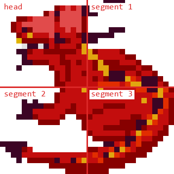
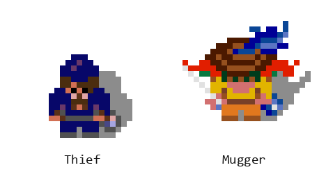

# Chapter 12 — Special Guests (The Dragon, Thief, and Mugger)

**This chapter answers:** What happens when the designers wanted a creature
that the general monster engine could not express, and what did it cost them?

**By the end you will understand:** how the dragon is assembled from four
sprites and driven by five tiny authored programs; why you can only hurt it
while its mouth is open; how the thief decides who to rob, when to arrive, and
what to take; and why the mugger is the same machine with one bit flipped and a
different appetite.

**It builds on:** Chapter 8's MOB slots and coordinates, Chapter 9's maze
records and shared random number generator, Chapter 10's inventory and
power-ups, and Chapter 11's monster dispatcher, whose every branch these three
sidestep.

---

## Two sounds you learn to dread

The first is a short warning jingle. Somewhere off screen a small hooded figure
has entered the level, and it already decided some time ago which of you is
carrying the most valuable pocket. It will walk to you, take one thing, laugh,
and leave.

The second is a roar. A red shape you had taken for scenery in the corner of
the room turns out to have a head, and the head is coming around toward you.

Neither of these creatures runs through the shared handler from Chapter 11.
Each has its own state variables, its own MOB slots, its own movement code, and
its own rules for taking damage. They are the game's hand-tuned exceptions, and
looking at how they are built shows what the general engine was and was not
willing to do.

## The dragon is four sprites

*The dragon as the maze decoder places it, rendered from the graphics ROMs.
Four adjoining MOB slots hold the head and three body segments; the red lines
mark the boundary between them.*

A maze record can place a dragon the same way it places a grunt, as one object
type in the compressed object stream. What follows is different. Setup takes
that primary cell and derives four MOB slot numbers from it, one for each cell
of a two-by-two block, and stores them in a small array. From then on the
dragon is not a monster in a slot; it is four cooperating slots plus about a
dozen words of private state.

The head is the interesting one. Its picture and its offset from the body come
from tables indexed by two things: which way the dragon faces, and which of
four poses it is currently holding. Every time the pose changes, the head's
sprite is replaced and its position is recomputed as a delta from the body,
which is how the neck appears to extend, curl, and swing without any of the
segments actually moving.

The dragon spends most of its life asleep. Once per frame its handler asks
whether any player has come within about nine cells horizontally and five
vertically. When one has, a wake animation starts, counting a signed animation
counter up to zero while the body picture cycles. When the counter lands on
zero the transition state clears and the dragon chooses a random one of its
five path programs.

The same handler carries a stun state that freezes the dragon entirely, a
turning state that plays a rotation animation and then picks a fresh path, and
a fire cooldown that ticks down every frame. Stun and cooldown share one word,
because in 1986 you did that.

## Five programs, sixteen bytes each

Everything the dragon does with its head is authored. Five compact programs sit
in ROM, sixteen bytes apiece. The current program is a number from 0 to 4. The
current byte within it is the animation counter divided by eight, so the
program steps once every eight frames and wraps after 128, which makes a full
pass through a program a little over two seconds.

Each byte packs two fields. The low bit is a fire trigger. The rest of the byte
is the head pose, 0 through 3.

Program 1 is the clearest of the five:

| Step | 1 | 2 | 3 | 4 | 5 | 6 | 7 | 8 |
|------|---|---|---|---|---|---|---|---|
| Pose | 0 | 1 | 2 | 3 | 3 | 2 | 1 | 0 |
| Fire | | | | | ● | ● | ● | ● |

The head swings out through its four poses in silence, then sweeps back through
the same four while breathing flame. The program contains that figure twice, so
you get two full sweeps per pass. The other four programs are less regular,
with short fire stabs at the start or in the middle, and it is the mixture that
makes the dragon feel like it is deciding rather than looping.

Firing has its own gate. The current byte's fire bit has to be set, the
cooldown has to have expired, and a free projectile channel has to exist. Up to
four dragon fireballs can be in the air at once, and they occupy the same
hardware slots the demons use, which the allocator scans from the top down. On
a successful shot the cooldown is reloaded with eight frames and the fireball
launches from whichever body segment the current pose and facing say the mouth
is nearest. There is also a locked-in mode where a fire byte holds the counter
in place until the cooldown expires, so the flame becomes continuous instead of
a burst.

## Nine hits, and only some of them count

Shooting the dragon is not like shooting anything else. When Chapter 10's
`resolve_shot_hit` sees a dragon segment, it hands off to a dedicated routine,
and that routine starts by throwing most shots away.

A hit counts only when three things are true. The dragon must not be mid-turn
or mid-transition. The shot must have reached the moving head's hitbox, which
is tracked separately from the segment MOBs because the head wanders. And the
current path byte's fire bit must be set. That last condition is the one
players discover by feel: you can only hurt the dragon while its mouth is open.
Every other shot makes the ordinary impact sparkle and disappears.

A counted hit plays its own sound and increments a hit counter. It also
switches the dragon to a fresh random program. The switch would normally snap
the head to a new pose, so the routine walks forward through the new program
until it finds a byte with the pose the dragon is already holding, advancing
the counter and rolling over into the next program if it has to. The animation
stays continuous and the dragon's rhythm changes, which reads as the creature
reacting.

The ninth hit ends it. All four segments are removed with a transporter-style
dissolve, and two objects appear where the dragon was, at offsets chosen from
its final facing: a bag of treasure and a hidden potion whose picture is one of
six chosen at random. The special bonus value is set to two thousand. If the
level's secret objective happened to be the one called "Don't Get Hit," and the
player who landed the blow has not already been disqualified by taking a hit,
their progress is marked complete. Chapter 13 explains what that earns.

The dragon's target word decides which attack appears. Its low nibble names a
player, its next nibble holds compass direction 0/2/4/6, and its high byte
measures forward distance in 16-pixel cells. No target has its own sentinel.
Within three cells the dragon uses the large, max-strength 3×3 flame; farther
away it throws the ordinary 2×2 fireball.

Close range alone does not sustain the flame. The muzzle must also line up with
the target by roughly one sprite width. That sets the lock bit and holds the
current fire phase instead of advancing the path program. Leaving either the
packed distance or this alignment update unwritten reduces the encounter to
isolated long-range shots.

On the ninth accepted hit the four-segment body is replaced by two prizes at
facing-dependent neighboring cells: a score bag and a randomized hidden potion.
The bag's carried value is set to 2000, replacing the ordinary level value of
100, so its floating popup and eventual multiplied award agree. The second
prize offset accumulates from the first, keeping both drops in the dragon's
just-cleared 2×2 footprint, while the dissolve itself is centered eight pixels
inside that footprint.

## The thief

*The two variants, rendered from the ROMs. They run the same state machine and
differ by one flag bit, one speed constant, one MOB palette number, and what
they take from you.*

The thief is not placed by a maze record. It is scheduled.

At level setup the game decides whether this level gets a thief at all. Levels
one through five never do, and neither do the two secret rooms. From level six
onward it rolls a random number from 0 to 7 and compares it against the level
number divided by eight, so the odds climb in steps: nothing at all on levels
six and seven, one chance in eight from eight to fifteen, two in eight from
sixteen to twenty-three, and a certainty once you reach level sixty-four. Deep
play is thief country. Treasure rooms are included, which is why the room where
you least want a visitor gets one.

**Choosing a victim.** If a thief is coming, `thief_target_calc` walks the four
player positions, skips anyone who is not active, and scores the rest:

| What you are carrying | Points |
|----------------------|--------|
| Extra shot power | 1000 |
| Extra speed | 700 |
| Extra shot speed | 500 |
| Extra magic power | 300 |
| Extra armor | 200 |
| Extra fight power | 100 |
| Each potion | 3 |
| Each key | 2 |
| Each step of the treasure multiplier | 1 |

The highest total becomes the victim. Nothing else about you matters: not your
health, not your score, not your class. The thief wants your upgrades, and it
has a strict opinion about which upgrade is worth the most.

**Choosing a moment.** The arrival timer is computed from a second measure
entirely, the victim's score divided by the coins they have inserted. Call that
number W, clamped to fifteen, and let D shrink from 50 down to 0 as the level
number climbs from six past a hundred. On an ordinary maze the delay in seconds
works out to `(20 − W) + random(W + 10 + D)`, multiplied by sixty to get frames.
Treasure rooms run a tighter version of the same formula. A player
who is doing well on very little money is visited sooner and more variably; a
deep level narrows the random component until the wait is short no matter what.

**Getting to you.** Once deployed, the thief has a small set of modes: entering,
pursuing, dodging, and escaping. Pursuit does not use a general path finder.
Every time the victim moves, a hook in the player movement code writes the
direction they came from into a nibble of the same direction grid the rest of
the game uses for routing, and the thief reads that nibble as it goes. It is
literally following your footprints, one cell behind. Each grid byte holds two
of these direction codes, and the thief switches to the other one the moment it
turns to escape, which looks very much like retracing the route it came in by.

Dodging is more pointed. A helper scans the four players for one whose shot
direction is exactly opposite the thief's own and whose position lies on that
ray. When it finds one, the thief starts dodging, latching that player and
direction, and stops only when the live shot's direction changes. Line up a
clean shot down a corridor and the thief will see it coming.

**Taking something.** On contact, the theft routine picks in a fixed order. If
you have any of the six permanent upgrades, it takes the most valuable one you
own, using the same ranking as the wealth table. Otherwise it compares three
tallies, potions times three, keys times two, and your treasure multiplier, and
takes whichever is largest. Stealing the multiplier resets it to one and
encodes its old value into the carried item, so what the thief walks away with
is worth five hundred points per multiplier step. The theft plays its sound,
sets a first-encounter dialog flag, and marks the level's thief as spent.

**Getting it back.** A thief that reaches the edge of the maze escapes, and
here the game gets its joke in. A coin flip picks one of two voices, and the
cabinet plays a laugh and then "YOU CAN'T CATCH ME!" in the matching pitch. The
carried item is remembered in a variable that survives the level transition,
and it comes back as a pickup on the next level's floor.

Transporters are part of that retracing graph. If the target player has taught
the route by teleporting, the thief dissolves into the same transition machinery,
reappears beside the linked pad, restores its MOB record there, writes the
reverse breadcrumb, and recomputes its next path cell. The level-start setup
resets the thief scheduler before a new route is considered. While the dissolve
timer is active, the ordinary thief movement loop is gated off; the transition
machine alone owns the source and destination records.

Killing the thief before it leaves is worth five hundred points times your
treasure multiplier, and the loot is respawned on the tile it was standing on.
If it was carrying your multiplier, recovering the bag is worth what the
multiplier was worth. The cabinet will tell you this in so many words: one of
its recorded lines is "KILL THIEF TO RECOVER STOLEN ITEM."

## The mugger

The mugger is the same routine. One flag bit in the thief's mode word selects
it, and that bit is decided when the arrival timer is set.

The logic is a constrained coin flip. Two latch bits record whether an ordinary
thief and a mugger have each already got away with something on this level, and
once both are set the scheduler stops producing visitors. The latches are set by
a successful theft, so a thief you chase off empty-handed does not use up its
slot and will be back. If the mugger latch is still clear, a random number
decides evenly. If that roll comes up thief while the thief latch is already
set, the visitor becomes a mugger anyway.

Four things change with that bit:

- **Speed.** The thief moves at 0x200 per frame in the engine's units and the
  mugger at 0x180. For scale, Chapter 10's Elf moves at 0x100 and everyone else
  at 0x80, so both of these are faster than any hero can run, and the mugger
  gives up a quarter of the thief's pace.
- **Appearance.** A different spawn picture, different walk and idle animation
  banks, and a different MOB palette number, added straight into the horizontal
  position word.
- **Voice.** The sound catalog carries a separate mugger warning alongside the
  thief's, and the mugger raises its own first-encounter dialog flag.
- **Appetite.** This is the real difference. Where the thief removes an item
  from your inventory, the mugger subtracts a flat hundred from your health,
  clamping at zero, and redraws your info-panel column. Then it records a meal
  as its carried item, so what it drops when you kill it, or leaves behind on
  the next level when it escapes, is food.

That last exchange is the whole design in one line of arithmetic. The thief
costs you a thing; the mugger costs you the resource that Chapter 10 spent its
length explaining, and hands you back the only item that restores it.

## What the exceptions bought

Three actors, three sets of private state, and a few hundred bytes of
special-case code. Everything else they use is shared: MOB slots and the depth
chain from Chapter 8, the maze coordinate system, the shared random number
generator from Chapter 9, the projectile channels and collision helpers from
Chapter 11, the sound queue, the palette and rendering machinery, the
first-encounter dialog system.

Read that as a budgeting decision rather than as a design philosophy. The
general engine covered the crowd, and the crowd is most of the game. Where the
designers wanted a specific, memorable encounter, they spent the ROM and wrote
the exception, and they spent it three times.

Chapter 13 turns from the creatures to the room itself, which in Gauntlet II is
also capable of moving while you are not looking.

---

> **Under the hood**
>
> - Dragon state machine `main_handle_dragon` (0x54454), proximity check
>   `dragon_player_proximity` (0x549EA), segment derivation
>   `dragon_setup_segments` (0x5496E), segment/pose update
>   `dragon_update_segments` (0x53D10), movement
>   `dragon_choose_move_direction` (0x53E4A);
>   `doc/04_game_subsystems.md` §8.1–§8.2. State bits and private RAM:
>   `doc/05_data_reference.md` §1.5 and §3.7, including the four segment MOB
>   ids at 0x904894 and the shared stun/fire word at 0x90487C.
> - Path programs `dragon_path_programs` (0x5D578, 5 × 16 bytes), phase =
>   `dragon_anim_ctr` (0x904892) >> 3, §8.3. Verified by disassembly at
>   0x53D5C–0x53D70: the rendered pose is the path byte shifted right one, and
>   the pose plus twice the facing indexes the head picture (0x5D528) and the
>   pose delta tables (0x5D4C8/0x5D4E8). The program-1 table printed in this
>   chapter is the decoded ROM bytes `00 02 04 06 07 05 03 01`, repeated.
> - Firing: `dragon_fire_setup` (0x54748), free-slot scan
>   `dragon_find_free_shot_slot` (0x540E8) over the same MOB slots the demon
>   shots use, origin-segment table 0x5D4B8, cooldown 8.
> - Damage: `dragon_shot_hit` (0x54112) called from the dragon arm of
>   `resolve_shot_hit`; head hitbox via `dragon_shot_hitbox_adjust` (0x54B68)
>   and `dragon_head_hitbox_offsets` (0x54BD6); `dragon_hits` (0x904880). The
>   three-part gate, the pose-matching fast-forward, and the ninth-hit drop of
>   a treasure bag plus a hidden potion with `special_bonus_score` (0x904B56)
>   set to 2000 were read from 0x5413A–0x54428; the trick-9 credit at
>   0x54420–0x54444 corresponds to `TRICK_NOGETHIT`
>   (`doc/05_data_reference.md` §3.17).
> - Thief scheduling: `thief_setup` (0x4E432) requires a normal maze and level
>   ≥ 6 and compares `level >> 3` against `getrandom(8)` at 0x4E480–0x4E494;
>   `thief_target_calc` (0x4DFF6) with the wealth weights listed in
>   `doc/04_game_subsystems.md` §4.7; `thief_timer_set` (0x4E4D8) with the
>   score-per-coin term and the `× 60` conversion at 0x4E568–0x4E620.
> - Thief runtime: `main_thief_anim` (0x4E8DC), modes in
>   `doc/05_data_reference.md` §3.18, per-thief RAM in §1.16.
>   `thief_track_victim_move` (0x4E630) writes the breadcrumb nibble;
>   `thief_find_aligned_shooter` (0x4FCF0) with `thief_begin_dodge` (0x4E1B8)
>   and `thief_end_dodge` (0x4E172); `thief_compute_path` (0x4F912);
>   `thief_enter_tport` (0x4FAD4).
> - Theft: `thief_steal_from_player` (0x4E1FE). Verified by disassembly:
>   power-up priority uses `thief_stealable_power_masks` (0x5B62E) in the order
>   shot power, speed, shot speed, magic, armor, fight; otherwise potions × 3
>   against keys × 2 against the multiplier; multiplier theft encodes
>   `mult × 500` into the carried longword, which
>   `thief_remove_and_drop_loot` (0x4F5C8) converts back by shifting right 6.
>   Kill award 500 through `player_add_score_with_mult`. Escape taunt at
>   0x4E960–0x4E992: `getrandom(2)` selects a pitch, playing a laugh from
>   0x5B6FA and the matching speech from 0x5B702, catalogued in
>   `refs/soundcmds.csv` as ids 0x62–0x65.
> - Mugger: selected in `thief_timer_set` at 0x4E530–0x4E560. With the
>   mugger-used latch clear, `getrandom(32) < 16` picks it; otherwise the
>   thief-used latch forces it. `ram.thief_speed` (0x9048BC) is set to 0x180
>   for the mugger and 0x200 for the thief. The mugger arm of
>   `thief_steal_from_player` at 0x4E232–0x4E280 subtracts 100 from
>   `player_health`, clamps at zero, sets the carried item to object type 0x32
>   (invulnerable food), and raises `DLGFLAG_KILLMUGGER`. Carried loot survives
>   a level change through `thief_item_nextlevel`/`mugger_item_nextlevel`
>   (0x904BA8/0x904BAC), consumed by `maze_addrandompickups`.
