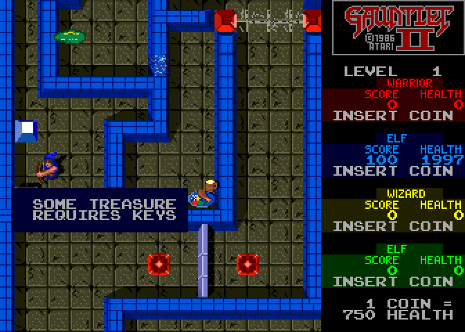
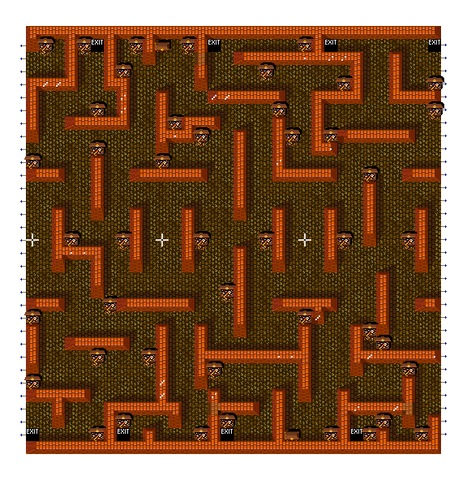
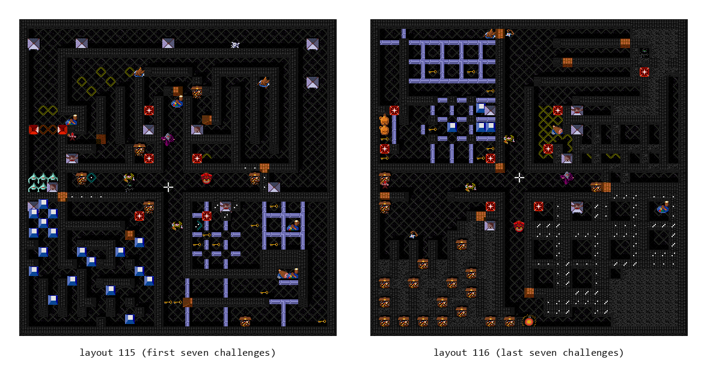

# Chapter 13 — A Living Maze (Doors, Hazards, Treasure, and Secrets)

**This chapter answers:** How does a level keep changing after it has been
built, and what is the complete path from a hidden objective in an ordinary
maze to a six-character code you could mail to Atari?

**By the end you will understand:** how doors, transporters, forcefields, and
half a dozen kinds of misbehaving wall rewrite the maze while you play; what
exits actually promise; how treasure rooms and secret challenge rooms borrow
and restore the session around them; and exactly how the `XXX-XXX` secret code
is computed, complete with a tested implementation you can run yourself.

**It builds on:** Chapter 8's maze slots, MOB records, and the logical-state
versus visible-tile distinction; Chapter 9's maze records, level flags, and
shared random number generator; Chapter 10's inventory and tile interactions;
and the session transitions of Chapter 7.

---

## The room is not what you mapped

Chapter 9 left you with the impression that a level is a fixed thing: a stored
record, decoded once, standing still while players and monsters move through
it. That impression survives about six levels. Then you meet a corridor that
seals itself behind you on a two-second cycle, a wall that was not there the
last time you looked at that corner, an exit that moves, and an exit that was
never an exit at all. The decoded maze is only the opening position. This
chapter is about everything that rewrites the board while the game is on.

The machinery for all of it was built in earlier chapters. A maze cell is a MOB
slot holding a logical object type; the visible 2×2 block of playfield tiles is
derived from that type on demand. Changing the world is therefore cheap: write
a new type into the slot, redraw one descriptor, and revisit the neighbors so
their connective graphics still make sense. Every system in this chapter is
some scheduler deciding *when* to make that write.



*The demo, pausing to explain itself. Almost everything in this chapter is in
one frame: the gray pole below the Elf is a vertical door waiting for a key,
the two red pads flanking it are transporters, the chain stretched between the
red hubs at the top of the screen is a forcefield, and the message box is the
Chapter 6 dialog gate holding the whole gameplay block frozen while you read.*

## Doors, from the world's side

Chapter 10 covered the player's half of a door: you carry keys, you walk into
the door, a key is spent. Here is what happens on the other side of that
transaction.

A door is a logical object like any wall, one of two types for horizontal and
vertical orientation, occupying one or more maze cells. Its picture encodes
which of three shape families it belongs to: doors that continue a line of
neighbors, corner and junction shapes, and the isolated single-cell door. When
a player engages a door, the endpoint scanner from Chapter 8 inspects the
adjacent cells and records up to two **endpoints** for that player, the cells
and directions the crossing may happen between. The door's own state word
carries a four-bit neighbor mask, the same trick the wall renderer uses to
pick connective graphics.

Spending a key does not simply delete one cell. The door logic walks the
connected door cells as a unit, removes their objects, and hands each one to
the opening animation, which can carry eight doors mid-swing at once. As each
cell empties, the tile pipeline from Chapter 8 redraws it and then revisits the
four neighbors, because a wall that used to abut a door may now need a
different end cap. This is why opening a door never leaves a visual seam: the
neighbors are always reconsidered, not just the cell that changed.

Doors also open without keys. A per-level idle timer counts up while play
drags; past its threshold the game removes every door object on the level in
one sweep and plays the "Doors open" fanfare. The timer is the cabinet's
opinion that you have been dawdling, and it is reset by forward progress. The
common level-start tail also clears it after placing the party, so the one-shot
disable from an earlier maze cannot carry into the next.

## Transporters

Step on a transporter and three systems cooperate. Level setup has already
built a table of every transporter position in the maze, up to 32 of them.
The touch handler saves your sprite, replaces it with a flash frame, and asks
the destination checker for a usable target: another transporter cell whose
occupant picture is empty, that is not one of the reserved wall types, and
whose adjacent door, if any, is one you hold a key for. Blocked candidates are
skipped. Arrival plays the transport sound, restores your saved sprite, and
runs a sparkle: a dedicated effect MOB from a small reserved pool, stepped
through its picture cycle by the per-frame animation loop until it expires.

When the thief's selected victim uses a transporter, the game also learns a
two-way route: one table links the source pad forward, while a companion table
links the destination backward and records which neighboring cell the player
used. The thief resolves the pad link first and then consults the opposite table
for the step-off direction. This lets an escaping thief retrace a route it saw
the player take rather than walking through the pad as ordinary floor.

The shimmer of the transporter pads themselves is a third, independent piece:
a palette animation. A bouncing counter selects one of six sixteen-byte color
blocks each few frames, and the VBLANK color copy does the rest. Nothing about
the pad's tiles changes at all, which is the cheapest possible way to make
something look alive.

Transporters are woven into several other systems in this chapter: a thief can
use them, the IT tag rides along with a transported player, one secret
objective asks you to transport onto a demon, and one challenge qualifier
counts how many you have used.

## Forcefields

A forcefield is a hub object plus a run of segments. At level setup a scan
finds every hub and encodes each run as one word: horizontal or vertical, its
length, whether it wraps across the maze edge, and the hub position. That
compact table is the entire collision model; a helper answers "is this cell on
a forcefield?" by walking it.

The field you see is another palette trick, but with teeth. A step counter
cycles through eight phases whose durations are a ROM table value plus a
random component, so the rhythm never quite settles. Even phases light the
field in one of four colors; odd phases write color zero, and the field goes
dark.

The dark phase is not cosmetic. The per-frame contact check begins by testing
the live field color and skips the entire damage branch when it is zero. While
the field is lit, standing in it drains health every frame at a per-character
rate: the armored classes pay 2 per frame, the Elf 4, and the Wizard 6, with
the armor power-up shaving one point off each rate. Contact also arms a small
looping-sound timer that plays the buzz on first touch and a silencer sound
when you break away. A forcefield never blocks movement the way a wall does.
The whole design is a timing puzzle: watch the flicker, cross in the dark.

The burn also uses the ordinary hurt-color machinery. Every damaging contact
frame reloads the hero's hurt timer to eighteen; VBLANK subtracts six before
copying that class and player-position's hurt colors into live motion-object
palette RAM. While contact continues the first flash color is held. Once the
hero leaves, the remaining two palette steps finish.

The visible beam uses that same live color word. Each VBLANK writes it into the
forcefield entries of all three selected playfield palettes, so the segment
cells must be re-paletted every frame even though the maze's tile raster is
otherwise cached.

The hubs themselves use the 0x8000 marker picture, so setup must recognize a
far hub before applying the ordinary marker-blocker test. Reversing that order
records no segment: the colors still cycle, but every later lit phase is
harmless because collision has no beam to find.

## Walls that misbehave

Gauntlet II's signature trick is that a wall is a *claim*, and several
subsystems are allowed to revise it. All of them exploit the same fact: a wall
is a logical type in a slot, and the graphic is derived. Change the type,
redraw the cell and its neighbors, done.

Doors are the exception to the apparent "terrain stamp" model: the door
updater selects a live MOB picture and position for each door cell. Horizontal
runs are therefore chains of correctly oriented MOB segments, not overlapping
2×2 playfield stamps.

**Cyclic walls.** Maze records can mark wall groups one, two, and three. When
the level's cyclic flag is set, a two-second timer advances a phase counter
through those groups: walls of the outgoing phase are removed, walls of the
incoming phase appear in any cell still empty, and a grinding sound announces
the shift. The group assignments are packed two bits per cell into a spare
corner of color RAM. Whole corridors open and close on a beat you can learn,
and the sweep even pauses every 64 cells to let the display catch up.

**Trap walls.** The same three wall groups serve a second master. On levels
flagged for traps, the groups are instead wired to trap tiles on the floor,
one tile type per group. Step on a trap tile and every wall in the matching
group is converted to floor at once. On some levels the flags additionally
make trap walls invisible, or all walls invisible, at which point the maze
becomes an exercise in memory and faith.

**Random walls.** A separate wall type toggles on its own schedule. Every two
seconds the handler walks the level's random-wall span and flips a coin for
each cell, toggling the wall's existence bit on heads. There is no pattern to
learn; the corridor you came in by is simply sometimes not there.

**Movable and destructible walls.** Some walls answer to force. A movable
wall tracks hits in its own state word and dissolves in a transporter-style
shimmer after 25 player shots; two of the secret objectives reward shoving at
these. A destructible wall is softer and crumbles when shot. At maximum shot
power, projectiles pass through walls entirely, and a player with the reflect
power bounces shots off them at computed angles instead of losing them.
When a hero pushes a movable wall, the game tests the wall's destination with
the same directional ray-march geometry used by monster movement, not the
similar-looking private player probe family. That shared ownership is what keeps
wall traversal and actor traversal in agreement at boundaries and corners.
Secret shootable walls keep the ordinary level-wall palette until revealed;
a brighter special palette would give the secret away.
On ordinary wall sets, damage advances a live color-RAM nibble rather than
selecting another static wall-color theme. A host without that mutable palette
bank must keep the level wall palette; interpreting the nibble as a theme index
produces unrelated pink or green walls after one hit.

**Secret walls.** One wall type exists to be shot. A hit plays its own sound,
converts the wall to floor, and rolls dice on what was behind it. The odds of
finding anything scale with the head count: a lone player usually uncovers
bare floor, a full party usually uncovers something. The prize table includes
a treasure bag, potions and food that cannot be destroyed by stray fire, a
hidden potion, and, on the two lowest rolls, Death himself. The game means
this as a lesson about curiosity.

The common thread: at any moment, what you can walk through is decided by the
logical grid, and what you can see is a derived rendering that may be out of
date, hidden, or a lie. The next section is about the biggest lie.

## Exits, honest and otherwise

An ordinary exit is a tile type. Walk onto it and the exit sequence plays your
character's exit sound, spawns a departure animation, marks you as leaving,
and, when every exiting player has finished, computes the next level using the
rotation from Chapter 9.

Maze authors get three ways to complicate that. A level flagged with a moving
exit periodically picks the exit up and drops it on a random empty cell,
with a sound cue so you know it happened. A level flagged choose-one may be
drawn with several exits, of which the game keeps exactly one, selected at
random during setup. What happens to the others depends on a second flag: they
are either quietly replaced with floor, or kept as **fake exits**, marked with
a single bit in the exit's record. A fake exit looks pixel-identical to the
real one. Stepping on it does not end the level, and one of the secret
objectives, Don't Be Fooled, is failed by exactly that step. The collision
record is consumed, but no playfield replacement runs, so the false exit
remains drawn rather than turning into floor.

The choice is one draw from the game's shared RNG stream, not a fixed maze
property. Because that stream is never reset by the ROM, revisiting the level
does not imply the same exit will be real.

There is also a mercy rule. A timer counts frames since anyone took damage or
anything died. If it reaches 21,000 frames, close to six minutes of genuine
stalemate, the game converts every ordinary wall on the level into an exit.
The maze gives up before you do.

## Traps and special floors

A few floor types act on whoever steps on them, dispatched by the same tile
interaction handler that picks up keys and food in Chapter 10.

Stun tiles freeze you mid-stride: a per-player stun timer is loaded, and while
it runs, a remap table scrambles your input direction so even your struggles
are unreliable. Acid puddles, covered with the monsters in Chapter 11, apply
their slow effect on contact, and an acid-slowed player is shown with a dimmed
health panel. Trap tiles, described above, are floor whose job is to demolish
walls. Add the wraparound and offscreen level flags from Chapter 9, which bend
the geometry itself, and the floor is nearly as untrustworthy as the walls.

## Treasure rooms



*The first treasure-room layout as stored in the Slapstic ROM: treasure
everywhere, no monsters, exits on every side, and wraparound edges (the
arrows). You are not meant to clear it. You are meant to run out of time.*

Chapter 9 explained when a treasure room happens: a countdown of levels,
reloaded to a random three-to-five, with its own rotation through the eleven
stored layouts. Here is what happens inside.

On entry the session's real level and maze are saved, the mode word flips to
the treasure-room state, and a timer is loaded by head count: 20 seconds for a
lone player, up to 26 for four. There are no monsters; the opponent is the
clock, and the cabinet narrates it. Each second, the display updates and a
recorded voice speaks the number. The status panel changes with the room: its
ordinary GAUNTLET II dungeon banner and level number are erased, leaving a
black header with **TIME:** directly above the large remaining-seconds value.

The narration is where the game shows its personality. On levels above 30
there is a 1-in-16 chance the voice counts down *wrong*, reading one of four
deliberately scrambled number sequences from ten down to six, then confessing
with "JUST KIDDING" or "FOOLED YOU" before resuming honestly. Even without
the prank, six seconds left carries a 1-in-4 chance of a taunting warning
line. Run to zero and the voice picks a sign-off; the operator can force a
plain "ZERO," but by default it may be "BETTER LUCK NEXT TIME" or "LOOKS LIKE
YOU LOSE."

Leaving through any exit, or running out the clock with players still
standing, leads to the bonus tally screen: the treasures you grabbed, scored
at 100 points multiplied by players and coins, added up in front of you. Then
the saved level and maze are restored and the normal rotation continues as if
the room had never happened.

There is no tally before entry. The transition that decrements the hidden-room
countdown to zero immediately substitutes the treasure maze. Only the room's
exit or timeout opens the bonus curtain and pays for the treasure-room take.

## The secret objective you did not know you had

Every normal maze from level 6 onward carries a hidden objective in its
header, one of seventeen. Some are dares: transport beside Acid or Death,
transport into the exit, or pass through a secret wall. Some are abstinence:
finish without eating food, without picking up keys or potions, without
hoarding treasure, or without hitting any player with a shot. Some are oddly
specific: shoot food or secret walls twice, bank eleven super shots, collect
invulnerability without being hit while protected, push a movable wall into an
exit, exit while IT, and, as covered above, do not fall for a fake exit. The
dragon objective is stranger than its English hint, as explained below.

The cabinet phrases are clues rather than complete specifications, and several
different objectives share one clue. `TRY TRANSPORTABILITY` can mean landing
beside Acid, landing beside Death, transporting into the exit, or
corner-transporting through a secret wall. `WATCH WHAT YOU SHOOT` distinguishes
two food shots from two secret-wall shots. The two `DON'T BE GREEDY` objectives
mean either collect no keys or potions, or collect no treasure; `GO ON A DIET`
is the separate no-food objective. Even `DON'T USE INVULNERABILITY` is
deliberately coy: the actual test requires collecting it and then avoiding
monster contact or fire while protected.

One clue is stranger still. `DON'T GET HIT` sounds like a clean dragon kill,
but the shipped predicate only asks whether the low two bits of a per-player
byte are zero. Dragon fire increments that byte; killing the dragon writes two
unless it was already one. A clean non-killer therefore passes while a clean
killer does not, and four fire hits make the masked test pass again. This is
counterintuitive, but it is what the ROM executes. `DON'T HURT FRIENDS` is
strict in the opposite direction: merely hitting any player with a shot,
including the shooter after a reflection, fails it before the game decides
whether that hit can damage or stun.

The objective is not announced merely because it became active. Finding a
secret wall or killing the dragon does, however, raise a discovery latch. On
the next between-level curtain the game prints `TO ENTER SECRET ROOM:` and
either reveals the objective in the already selected next maze (when it is
eligible) or offers one of the seventeen objective hints at random. The latch
is consumed by those text-layer writes.

Availability is sampled when the maze is set up, not checked continuously
while the party plays. When the pacing counter is already zero, setup copies
the maze header's objective into the live task byte; making the counter zero
later would not arm that same maze by itself. The exit path checks the copied
task, records the winning player, and only after that player's dissolve reaches
the between-level status can the next-level curtain substitute a secret room.

Progress and violations are tracked per player, and the hooks are scattered
through every system the objectives touch: the shot resolver notices when you
shoot food, another player, or a secret wall; the dragon's death routine checks
who stayed clean; the exit code knows who fell for a fake. Five objectives skip
the progress bytes entirely and name a winner at the completing movement:
transport beside Acid or Death, transport into an exit, phase through a secret
wall, or push a movable wall into an exit. Chapter 7
described the pacing counter that decides *whether* the current level's
objective is armed at all; wins push the next secret further away, misses
bring it closer.

Complete an armed objective and the reward is an invitation: the next level
transition detours into a secret challenge room.

## The secret challenge room



*The only two secret-room layouts in the ROM. Each of the fourteen challenge
codes is permanently assigned to one of them: the first seven use layout 115,
the last seven layout 116.*

The transition screen saves where you were, both the maze number and the trick
you completed, because both will matter later. It then draws a random
**challenge code**, one of fourteen, and this code lives in a different
namespace than the seventeen maze-header objectives, reusing the same state
byte for a new purpose. The code picks the room: the first seven challenges
load stored layout 115, the other seven layout 116. It also selects a time
limit and, for most challenges, a qualifier line displayed under the SECRET
ROOM banner: "AFTER COLLECTING 6 TREASURES," "AFTER SHOOTING 3 SECRET WALLS,"
"AFTER USING 5 TRANSPORTERS," "AFTER REMOVING ALL TREASURE," "WHILE YOU ARE
IT," and so on.

The two stored layouts contain no exit tile. Setup creates the way out for the
particular challenge: a fourteen-word table names one generator type for each
task code, every generator of that type becomes an exit, and the other
high-tier generators disappear. The ordinary monsters in the room become
hidden potions, with the former monster family selecting which permanent power
the potion contains. This transformation follows the ordinary exit-position
scan, so challenge exits never participate in moving- or choose-one-exit logic.
An implementation that merely loads maze 115 or 116 will therefore show no exit
at all.

The curtain also names the winning player's color and character, says that
they performed a secret trick, and shows the time limit in both the invitation
and the status panel. The room is therefore announced before its maze is
revealed; it is not a renderer-side title laid over gameplay.

Those color and character labels are large text too. Their ROM strings are
fixed-width and visibly padded—`" RED  "` and `"  ELF   "`, for example—and
the spaces advance through the same two-cell large-glyph machinery as letters.
The padding positions the two fields; trimming it would pin RED to the left
edge. A direct MAME 0.289 capture confirms the remaining broad separation is
intentional arcade formatting: the color and class are two fields, not the
adjacent phrase “RED ELF.”

Inside, the same per-player progress flags track the qualifier. Five challenge
codes need no extra progress beyond reaching the exit. The others require six
treasures, all six potions, three secret walls, no monsters or generators left,
five distinct transporters, all nineteen treasures removed, or at least one IT
event. Merely finding the exit does not earn a failed challenge: the bonus
screen pays 5,000 points per inserted coin only when the code-specific predicate
passes and the entrant reached the exit. Only that successful path can continue
to contest name entry, and only when the operator enabled the contest option.
Your saved supershot state survives the detour, the saved maze and level are
restored, and the rotation resumes.

The inventory handoff is a reminder that spare RAM is part of the design.
Rather than reserve a neat structure, entry parks keys in the monster-spawn
bonus byte, potions in red player's key byte, and supershots in one spare byte.
The normal score-per-coin adjustment then changes the saved-key value before
the room begins. Red has an additional ordering quirk: clearing the entrant's
own keys also clears the potion scratch; on payout, restored keys are written
first and that new key total is then added as potions. It is surprising, but it
is the exact byte-level program Atari shipped.

For most cabinets that is the end of the story. But if the operator has
enabled one particular option, winning the challenge leads somewhere stranger.

## Name entry and the secret code

With the contest option switched on, the winning player is asked for their
name. The prompt says ENTER YOUR, then 'LAST-NAME FIRST-NAME', and hands you a
30-character buffer primed with an A, edited with the joystick the same way
high-score initials are.

That includes a conspicuous cabinet-era pause: the editor initializes its
repeat-delay byte to 160 frames. The first held direction can therefore feel
unresponsive for about 2.7 seconds; once it starts moving, the accumulated
velocity shortens repeats to eight through thirteen frames. This is the shipped
input routine, not host keyboard lag.

When you commit the name, a small routine replaces it, in the same buffer,
with a six-character code in the form `XXX-XXX`, displayed under REMEMBER YOUR
SECRET CODE. The screen goes on to explain why you should remember it: "SEND
CONTEST ENTRY FORM TO ATARI GAMES CORP." and "CONTEST ENDS 12/19/86." In 1986
Atari ran a contest around these codes, and the code is constructed so that a
mailed-in entry could be checked.

The replacement is literal on the display too. Before writing the code page,
the game blanks all twenty-nine cells of the old editor row. A surviving name
prefix or suffix under `REMEMBER YOUR SECRET CODE` is stale alpha RAM, not
intentional formatting.

The dash takes one more special path. The game's name-entry character writer
recognizes it before consulting the OS large-font map and writes a dedicated
four-glyph bar. Sending the dash through the generic map selects the same
zero-shaped quad used by `0`; that implementation error makes a buffer such as
`W1Y-GN0` appear on screen as `W1YOGNO`. The last character is still a zero,
whose unslashed arcade glyph naturally resembles O.

The construction takes two independent halves and interleaves them.

The first half is a hash of your name. The routine runs the name bytes through
a textbook CRC-16 (the CCITT polynomial, from a 256-entry table in ROM, with
initial value zero), skipping spaces so that name spacing cannot change the
result. The 16-bit hash is then byte-swapped, and its low fifteen bits are cut
into three five-bit fields.

The second half is not hashed at all. The routine packs the state saved at the
detour into one word: four bits of the trick you completed, four bits of the
challenge code you drew, and seven bits of the maze number you were on. That
fifteen-bit word is cut into three five-bit fields the same way.

Each five-bit field selects a character from a 32-letter alphabet stored in
ROM: the digits and the alphabet minus I, L, O, and V, the four letters most
likely to be misread on a CRT or in handwriting. The six characters are then
interleaved, name fields in positions one, three, and six of the display, state
fields in positions two, five, and seven, with the dash in the middle.

An adjudicator holding only the name and code from the entry form could
therefore do two different things. The state letters *decode*: they recover the
maze number, challenge, and low four bits of the trick outright, which tells
Atari where and how the code was won. The name letters *verify*: recompute the
name hash and compare positions 1, 3, and 6. No separate maze, trick, or
challenge fields are required. Fifteen bits of hash is no cryptography, but it
is plenty to make a guessed code embarrassing at contest scale.

## Checking the math

The description above is not transcribed from the documentation; it was
re-implemented from the disassembly and tested against the shipped code. This
Python program reproduces the routine exactly:

```python
ALPHABET = "0123456789ABCDEFGHJKMNPQRSTUWXYZ"   # I, L, O, V omitted

def crc16(data):                     # CRC-CCITT, poly 0x1021, init 0
    crc = 0
    for b in data:
        crc ^= b << 8
        for _ in range(8):
            crc = ((crc << 1) ^ 0x1021 if crc & 0x8000 else crc << 1) & 0xFFFF
    return crc

def secret_code(name, prev_maze, prev_trick, challenge):
    h = crc16(name.replace(" ", "").encode("ascii"))
    name_bits  = ((h & 0xFF) << 8) | (h >> 8)          # byte-swapped hash
    state_bits = ((prev_trick & 0xF) << 11) | ((challenge & 0xF) << 7) \
                 | (prev_maze & 0x7F)
    def sym(v, shift):
        return ALPHABET[(v >> shift) & 0x1F]
    return (sym(name_bits, 10) + sym(state_bits, 10) + sym(name_bits, 5)
            + "-" + sym(state_bits, 5) + sym(name_bits, 0) + sym(state_bits, 0))
```

A worked example. Say the winner types `DARREN STONE`, having completed trick
9, Don't Get Hit, on maze 57, and drawn challenge code 0x5A, the
remove-all-treasure room:

- Skipping the space, the CRC of `DARRENSTONE` is `0x8BA3`; byte-swapped,
  `0xA38B`. Its three five-bit fields are 8, 28, and 11, which the alphabet
  maps to `8`, `W`, and `B`.
- The state word packs trick 9, challenge nibble 10, and maze 57 into
  `0x4D39`. Its fields are 19, 9, and 25: the letters `K`, `9`, and `S`.
- Interleaved: `8KW-9BS`.

That result was tested against the game two ways. The shipped routine's own
bytes, executed directly under an emulated 68000, produce identical codes to
this implementation for several hundred randomized names and states, including
empty and all-space names. And a running Gauntlet II machine under MAME, given
that exact name and state in its RAM, computes `8KW-9BS` in the same buffer
the screen displays. The alphabet string and all 256 CRC table entries in ROM
also match the independent derivation from the polynomial. If you ever find a
1986 contest form in a drawer, the adjudication tooling is now public.

The reimplementation exposes the same check directly:

```text
python -m gauntpy.secret_code_verifier "DARREN STONE" 8KW-9BS
```

One quirk worth recording: only the low four bits of the trick number survive
the packing, so tricks 16 and 17 encode identically to 0 and 1. Atari could
not have told a Don't Hurt Friends winner from a Transportability winner by
the code alone, and nothing in the routine suggests they minded.

Three display details are easy to mistake for gameplay objects. A transporter
pad is a 2×2 playfield stamp whose six bright colors bounce through six phases;
its arrival sparkle is the separate MOB. EXIT TO LEVEL 6 uses lower tiles
0x3A0/0x3A1 instead of an ordinary exit's blank lower pair. Trap and stun
floors pulse through live playfield palettes rather than fixed colors.

Trap walls also expose a setup rule: types 7–9 become cyclic assignments only
when the level's cyclic-wall flag is set. Otherwise they must survive setup as
the groups removed by matching trap types 10–12. Consuming those markers
unconditionally makes the wall absent before the player can trigger it.

A mirrored dragon needs one more correction than a one-cell object: horizontal
mirroring shifts its anchor one column left, and vertical mirroring one row
down, before the other three cells are reserved. Without that adjustment the
2×2 body overwrites neighboring maze objects on half the mirrored layouts.

The maze has now done everything a maze can do: moved its walls, lied about
its exits, staged its own game shows, and issued you a receipt. Chapter 14
turns to the layer that pays for all of it: coins, health, score, and the
cabinet's remarkably candid bookkeeping.

---

> **Under the hood**
>
> - Door endpoints: `door_open_start` (0x51E80) fills
>   `door_endpoint_pos`/`door_endpoint_dir` (0x904A76/0x904A86); shape classes
>   by picture range in `pf_isdoor` (class 1 0x9D18–0x9D3B, class 2
>   0x9D3C–0x9D7B, class 3 0x9D7C–0x9DAC); opening animation
>   `main_open_doors` (0x45C00, 8 channels); timed opening `open_timed_doors`
>   (0x47FAC) from `idle_timer` (0x90490C), sound 0x12. Neighbor redraw chain
>   `refresh_tile_visual` (0x5F5A0) → `write_tile_descriptor` (0x5E542) →
>   `update_neighbor_tiles` (0x5F7F0): `doc/04_game_subsystems.md` §13, §23.4.
> - Transporters: position table 0x910700 (32 words, built by
>   `maze_new_level_setup`); `player_tport` (0x50224), `tport_player_move`
>   (0x50662), `tport_check_dest` (0x50ADE, blocked by wall types
>   0x2F/0x3C/0x3E and keyless doors); sparkle MOBs 0x0D–0x10, pictures
>   0x924–0x95A, counters 0x90497C driven by `main_score_update` loop 3;
>   pad palette blocks at 0x5AFAE; `doc/04_game_subsystems.md` §7.1–7.2.
> - Forcefields: segment table 0x910780 built by `forcefield_segments_setup`
>   (0x53398), word format in `doc/05_data_reference.md` §4.3; blink state
>   machine in `main_cycle_tport_and_ffield` (0x40528), color word 0x904046;
>   the contact test beginning at 0x4AA42 skips damage while that word is zero
>   and charges `forcefield_damage_table` (0x5813C: 2/2/6/4, armored 1/1/5/3)
>   per frame, its only consumer in the whole ROM (verified by disassembly); hurt/silencer sounds 0x2E/0x2F via
>   `main_handle_death` (0x4664C), §21.
> - Cyclic walls: `main_walls_cyclic_move` (0x5E62A), 120-frame timer, phases
>   at 0x90401C, group bytes at 0x910600 (2 bits/cell), sound 0x2B, §18.
>   Trap groups: wall types 7–9 removed by `maze_place_object_types` (0x5E7A6)
>   when a matching trap tile (types 0x0A–0x0C) is stepped on; invisibility
>   via LFLAG1 bit 7 / LFLAG2 bit 7 (`doc/05_data_reference.md` §3.12).
> - Random walls: `main_walls_random_move` (0x5E41A), type 6, 50% toggle per
>   cell per pass, §19. Movable walls: 0x400/hit in the state word, dissolve
>   at 0x6400 (25 hits); secret-wall prize roll and wall/reflect shot rules in
>   `resolve_shot_hit` (0x4AF50), §26; `wall_crumble` (0x5303A).
> - Exits: `maze_scan_objects` (0x43D8C) implements choose-one (kept slot →
>   0x904A0A) and fake-exit marking (hpos bit 4) under LFLAG3 bit 7 / LFLAG4
>   bit 6; `main_exit_move` (0x5287C), sound 0x31; `player_exit_sequence`
>   (0x52B40) with next-maze selection per `doc/06_maze_catalog.md` §3.2;
>   escape conversion `maze_convert_walls_to_exits` (0x5E80C) at
>   `escape_timer` (0x9048C6) = 0x5208 (21,000 frames).
> - Stun tiles: `player_stundelay` (0x904A54) with input remap table
>   `stun_direction_remap` (0x4A4FA); tile dispatch `player_tile_interact`
>   (0x511AC), §4.6.
> - Treasure rooms: `main_treasure_timer` (0x4D29E) with durations
>   1200/1440/1500/1560 frames by player count (0x57358); fake countdown
>   sequences 0x5AB90 with JUST KIDDING / FOOLED YOU at 0x5ABF0; timeout lines
>   0x5ABF8; bonus screen `show_level_end_bonus_screen` (0x4D476), §10.5,
>   §16; scheduling in `doc/06_maze_catalog.md` §3.5.
> - Secret objectives: trick IDs 0x01–0x11 (`doc/05_data_reference.md` §3.17),
>   progress in `secret_tricks_flags` (0x904872), hooks in `resolve_shot_hit`
>   (tricks 5/9/0x11) and the dragon/movement paths; pacing counters
>   0x904878/0x90487A via `secret_check` (0x486FE), §10.6.
> - Challenges: `show_level_start_screen` (0x44DB4) saves `secret_trick_last`
>   (0x904064), draws challenge 0x50 + getrandom(14) into 0x904065, selects
>   maze 115 (0x50–0x56) or 116 (0x57–0x5D), time limits 0x57360/0x5737C,
>   qualifier records 0x573D4; bonus predicate `secret_check_winner`
>   (0x4D1A4); supershot bridge 0x905F6D.
> - Secret code: `secret_getname` (0x54EC6, gated by settings bit 13),
>   `secret_name_entry_update` (0x54FE8), `secret_code_build` (0x54BE0);
>   alphabet 0x54CA6, CRC table 0x54CC6–0x54EC5, contest strings
>   0x5D9E8–0x5DA97. The algorithm here was reproduced from the 0x54BE0
>   disassembly and validated against the ROM routine executing under
>   emulation (404 randomized cases, zero mismatches) and against a live
>   MAME `gaunt2` machine computing `8KW-9BS` for the worked example.
