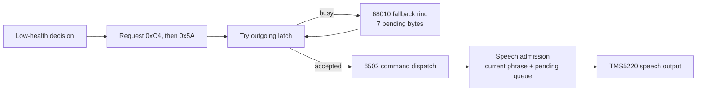

# 14. A machine that speaks

“Blue Elf needs food, badly.”

You do not have to stop moving, find your status column, and read the
number to understand that warning. The other players do not have to
wonder whom it concerns. A condition that might otherwise remain in the
corner of the screen has become an announcement to everybody.

Its identity has two parts. Blue identifies a control position; Elf
identifies the class chosen there. As [four-player play](03_four_players.md)
showed, those choices are independent. Four Elves can share a dungeon
without the warning becoming “one of you needs food.”

The voice makes the game seem attentive to a particular person. Underneath
that impression are several separate decisions: whether to warn, which
words to request, whether those requests cross to the sound processor,
and when that processor can speak them. Following one sentence through
those decisions explains both its usefulness and its limitations.

## Choosing the person and the predicament

Consider an illustrative Blue Elf with 200 health, no powers, no previous
low-health warning latched, and an expired speech cooldown. On an eligible
health-drain update, the game subtracts one. The new value, 199, is below
the warning threshold.

The health charge occurs on every sixty-fourth game frame while this
part of the update is running. That means the ordinary spoken-warning
opportunity is tied to the health routine's drain cadence, not a separate
alarm that instantly fires at every downward crossing of 200. There is
another caller: the damage-sampling routine can request the warning when
health is below 500 and four times the pending damage exceeds the
remaining health. A sufficiently bad encounter can prompt advice before
the ordinary threshold is reached.

Neither caller guarantees speech. The warning routine first checks two
per-player fields. A nonzero “already spoken” byte rejects the request.
So does a cooldown that has not yet become negative. Our example gives
both checks permission to proceed.

The sixteen-entry name table is indexed by:

```text
character number + 4 × player-position number
```

The positions and classes are numbered from zero. Blue is position one;
Elf is class three. Entry seven therefore supplies command `0xC4`,
`BLUE ELF`. This is one recorded phrase identifying color and class
together, not the sound processor separately pronouncing two text words.

The next command supplies the predicament. Without the special powers
branch, a random choice selects one of three entries:

| Command | Phrase |
|---------|--------|
| `0x5A` | `NEEDS FOOD, BADLY.` |
| `0x5B` | `YOUR LIFE FORCE IS RUNNING OUT!` |
| `0x5D` | `IS ABOUT TO DIE!` |

For our example, choose the first. The main program requests `0xC4`
followed by `0x5A`. No English sentence travels across the connection to
the sound board. Two numbers identify material already available there.

An equipped hero can receive `ALL YOUR POWERS WILL BE LOST!` instead.
That selection requires at least two set power bits in the low byte and
a random zero-through-seven draw greater than three. A single power is
not enough. Failing that branch returns to the ordinary three-way
selection; the threatening phrase is not permanently assigned to one
character class.

After requesting the two parts, the routine sets the spoken latch and
loads the cooldown with `0x708`, or 1,800. Both requests pass through a
wrapper that honors the operator's Disable Speech setting. Importantly,
the routine still sets its latch when that wrapper suppresses the
commands. The latch records that the game handled the warning opportunity,
not proof that a listener heard a complete sentence.

## A warning is not a repeating alarm

The cooldown counts down while the player's relevant update runs. Roughly
thirty seconds must pass before it is eligible again, but that does not
automatically repeat the warning. The spoken latch remains a separate
obstacle.

Eating food that leaves health at 200 or above clears the latch, as well
as disabling the low-health display timer. Join and death initialization
also clear warning state. Merely waiting at dangerously low health does
not clear the latch every thirty seconds. If food restores the Elf above
the threshold and a fight soon knocks the Elf below it again, the latch
may be clear while the old cooldown still prevents another announcement.

This gives the voice a different rhythm from the heartbeat. The heartbeat
uses a counter advanced every eligible frame below 200 and a mask selected
by the remaining health. Whenever the counter AND the mask is zero, the
game requests that position's heartbeat effect. For Blue, it is command
`0x19`.

Here are three readings from the actual mask table:

| Health | Mask | Repeating heartbeat interval |
|--------|------|------------------------------|
| 199 | `0xFF` | 256 updates, about 4.27 seconds |
| 63 | `0x3F` | 64 updates, about 1.07 seconds |
| 31 | `0x1F` | 32 updates, about 0.53 seconds |

These are nominal intervals between requests at constant health, not
measurements of recorded audio. Crossing a band also changes the mask
applied to the existing counter. Meanwhile the visible health number
uses an eight-frames-dim, eight-frames-normal pulse; that pulse does not
accelerate with the heartbeat.

The result is a layered warning. The voice can identify a new problem
once, the heartbeat can keep making it harder to ignore, and the number
continues to give the exact amount. The game's instructional dialog
system can also present advice through its own pause rules. Speech does
not require holding the dungeon still until every syllable finishes.

## Across the latch

The main 68010 runs the dungeon. A separate 6502 on the sound board runs
the audio program. A hardware latch is a small holding place between
them: the main CPU writes one command byte, and the sound CPU collects
it. A status bit reports whether the outgoing latch remains full.

There is a second latch in the reverse direction for replies. Incoming
traffic notifies the main CPU with an interrupt; outgoing commands notify
the sound CPU. Neither processor needs the other to read a whole sentence
or a block of waveform data at once.

The game-side `sound_play` routine first tries to hand over its command
immediately, provided sound-board recovery is not active. The OS service
checks the latch. If it is available, it writes the command and returns
success. If it is busy, the game has somewhere else to put the byte.

That fallback is an eight-slot ring in main-CPU RAM. A ring advances its
read and write positions modulo its size, wrapping from the last slot
back to the first. Here one position must remain unused so equality of
the indices can mean empty. The practical capacity is seven pending
bytes. An eighth waiting request is dropped, not allowed to halt the
game indefinitely.

Near the end of the frame, `main_update_sound` makes at most eight
submission attempts. An accepted command advances the read position.
A busy result leaves the oldest pending byte where it is, consumes one
attempt, and allows another try after a short delay. Eight attempts do
not promise eight accepted commands.

The frame-overflow signal skips this draining, as does sound recovery.
Overflow does not itself block a new request's immediate-send attempt
or stop audio already playing on the sound board. Also, a new request's
immediate-send path does not first require the
ring to be empty. The fallback ring is ordered internally, but it is
not a blanket guarantee that all sounds reach the board in the order
gameplay requested them.

For a simple, uncongested instance of our warning, `0xC4` crosses
immediately. Suppose the latch is still occupied when `0x5A` follows.
The second byte waits in the ring until an attempt succeeds. This is a
short wait for communication capacity, quite different from waiting for
the spoken name to finish.



*A successful warning's communication path, not a promise of immediate
playback. Either admission stage can lose a request.*

## Waiting for a voice, not a wire

On the sound board, the two commands are classified as speech and mapped
to their speech data. Their individual priorities are both zero. These
values and classifications come from the sound ROM's command and speech
tables, not from their English descriptions.

Speech has one current phrase and another seven-entry pending capacity.
This queue lives on the 6502 side. It is not the main CPU's seven-byte
fallback ring, even though the capacities happen to match.

Assume the board is permitting speech and initially idle. The Blue Elf
phrase can begin. If “needs food, badly” arrives while the name is
playing, its equal priority allows it to wait. When the current phrase
finishes its playback lifecycle, the queued phrase can begin. The main
CPU has long since returned to moving players and monsters.

The priority rules become visible when other speech intervenes. While
a phrase is active, a full pending ring rejects an arrival before
considering its priority. If space exists, a lower-priority arrival is
rejected, an equal-priority arrival appends, and a higher-priority arrival
discards pending phrases before entering the queue itself.

That higher priority does **not** interrupt the phrase already playing.
It changes what comes afterward. Nor can it rescue a completely full
pending queue, because fullness is checked first.

Imagine the Elf's name is speaking and its warning is pending. A
higher-priority speech command arrives while there is room. The name
continues, but the waiting warning can be discarded. Alternatively,
congestion on the main CPU could have dropped the warning before the
sound board ever received it. These are different failures with the
same possible listening experience: a name without its expected ending.

The game did not submit the sentence as an indivisible transaction.
Its already-spoken latch cannot distinguish these cases from successful
delivery. Understanding that limitation does not make the interface less
effective; it explains why its rules govern requests rather than certify
what the room actually heard.

The board ultimately drives a TMS5220 speech chip, alongside the YM2151
and POKEY used for music and effects. Turning stored speech data into
a waveform, or scheduling every instrument channel, is sound-board
work. We need the admission boundary to understand the game's warning,
not an exhaustive synthesis model or an invented duration for each word.

## The thief does not introduce itself the same way

The thief's arrival supplies a useful contrast. Once deployment has
succeeded, the game tests the visitor's variant bit and requests `0x29`
for the ordinary thief or `0x2D` for the mugger. These are warning
effects. They are not a color-and-class name followed by a spoken
description of the target.

The ordinary thief warning is a YM2151 sequence command on the sound
board, not a speech command. It still competes for the same outgoing
latch and main-CPU fallback ring, but after dispatch it does not wait in
the speech queue behind “Blue Elf.” Music and effects have their own
channel-allocation rules. There is no single universal sound queue that
plays every request to completion in turn.

The thief also has vocal material—laughter and “you can't catch me”
commands elsewhere in its encounter. Those should not be confused with
the deployment cue. The cue tells the party that the visitor has arrived;
the low-health sentence identifies a particular person's condition.
Both carry useful information without requiring somebody to read the
panel, but they reach the loudspeaker by different sound-board paths.

## Some noises need an ending

A spoken phrase has a natural completion. A forcefield contact effect
is controlled differently: the game asks for it to start and later
asks for it to stop.

When qualifying contact finds a player's forcefield sound timer at
zero, it stores minus sixteen. The negative sign means “new contact
not yet announced.” The sound-timer routine recognizes it, requests
`0x2E`, changes the timer to positive sixteen, then performs that
visit's decrement. The stored value is now fifteen.

Subsequent visits count down toward zero. Continued qualifying contact
can refresh a positive timer below sixteen back to sixteen without
turning it negative. That extends the effect without repeatedly issuing
the start command.

For an isolated contact with no refresh:

```text
contact:       0 → -16
first visit:   request 0x2E; -16 → 16 → 15
later visits:  15 → 14 → ... → 1
final visit:   1 → 0; request 0x2F
```

The stop request occurs on the sixteenth timer visit in this example,
roughly a quarter-second at nominal speed. On the sound board,
`0x2F` names `0x2E` as its stop target. The stop command does not need
to contain a new sound recording; it tells the audio program which
existing effect to remove.

Death contact uses the same negative-start, positive-countdown pattern
with `0x20` and `0x21`. The timers are per player, but these command
numbers identify shared effect types rather than four private sound
instances. Four timer records should not be mistaken for four
independently addressable audio channels.

Both starts and stops still travel as ordinary command requests. A
congested connection can affect an ending as well as a beginning. The
game-side timer has finished its responsibility when it requests the
stop, not when a microphone could confirm silence.

## The reply might be a quarter

The reverse latch is not merely a place for sound diagnostics. The coin
switches are read through the sound board. Without its replies, the
main CPU would be missing part of the game's payment input.

The OS regularly submits command `0x03` with a one-byte destination in
RAM. The reply packs four two-bit coin-channel counters. On receipt,
the sound interrupt reads the latch into that registered destination.
A later OS update compares the new byte with the previous one and
passes changes into coin processing.

These are wrapping counters, not four “coin currently held down” bits.
A channel advancing from three to zero has advanced once modulo four.
The resulting events still have to pass through operator pricing
before the game's player coin count and health change, as
[Chapter 8](08_what_a_quarter_buys.md) followed.

Command `0x07` uses the same hardware but asks a different question.
Its one-byte destination is a game diagnostic field, and its reply
is a fault bitmap. The bytes are interpreted according to the
outstanding request, not by inspecting a self-identifying label
inside each reply.

```text
COIN POLL
OS command 03 + coin-byte destination
    → outgoing latch → sound CPU's cached coin counters
    → reply latch → main CPU sound interrupt
    → registered coin byte → compare previous → pricing/credits

DIAGNOSTIC POLL
Game command 07 + diagnostic-byte destination
    → outgoing latch → sound CPU's fault status
    → reply latch → the same main CPU sound interrupt
    → registered diagnostic byte → game's recovery checks
```

*The destinations are RAM addresses, not callback functions. The OS
allows only one registered direct-reply transaction at a time.*

Replies without an installed direct destination enter the OS receive
ring instead. The game's response routine polls that ring. This is yet
another queue, in the reverse direction; it must not be confused with
either outgoing effects or pending speech.

## When the second computer stops answering

The game periodically requests diagnostic status, reloading its idle
timer to 240 frames after successful submission. A failed submission
is retried on the next frame; more than 180 consecutive failed attempts
triggers reset. In a received status, the game watches the low three
fault bits, associated with speech, music, and interrupt operation.
The sound board's fuller diagnostic bitmap also supports the operator's
tests.

Recovery resets the sound CPU independently through the OS. It clears
the main-CPU sound ring and response-tracking state, then starts a
180-frame holdoff. During that interval, ordinary sound requests can
accumulate in the game ring, but the immediate-send and drain paths
stand down.

The expected startup reply is `0xFF`. Received through the otherwise
unsolicited-response path during recovery, it clears the holdoff.
A different byte, an unexpected reply outside recovery, or expiry
without acknowledgment causes another reset.

This acknowledgment means the sound CPU has restarted. It does not mean
“speech finished.” The recovery timer is not a timer for the length
of the Elf's sentence. The distinction is practical: treating a long
phrase as a stalled processor would reset a healthy sound board.

Nor is a failed board merely an opportunity to keep playing silently.
Coin polling shares the connection and depends on the board's input
work. A communication failure can interfere with new credit as well
as the warning that might persuade somebody to buy more health.

The voice at the beginning of the chapter joined a person, a condition,
and a request for action. Behind it, the processors exchange only
small commands and replies. That narrow conversation carries the
urgency of a heartbeat, a thief's entrance, the end of a buzzing
forcefield—and the quarter that may let the Blue Elf continue.

### Source notes

- Player warning selection and lifecycle: [game subsystems](../doc/04_game_subsystems.md),
  §4.3; `player_lowhealth` at `0x487CA–0x488C8`, health-drain caller
  `0x46770–0x46794`, cooldown decrement `0x467C2–0x467D8`, and
  food reset `0x51D06–0x51D32`. Tables at `0x5797A`, `0x596F6`,
  and `0x576A8` supply phrases, identities, and heartbeat masks.
- Game-side transport and recovery: [game subsystems](../doc/04_game_subsystems.md),
  §11, [hardware I/O](../doc/01_hardware.md), §3, and
  [OS sound services](../doc/02_os_rom.md), §§8.7–8.8.
  Loop contact and refresh are at `0x4AABE–0x4AADE`; the start/stop
  consumer is `0x4664C–0x466F4`. Thief deployment sends its cue at
  `0x4DFC0–0x4DFD8`.
- Sound-side admission is bounded by the companion sound-ROM research
  summarized in [game subsystems](../doc/04_game_subsystems.md), §11.6:
  `docs/04_subsystems.md` and `docs/08_command_reference.md`, with their
  generated speech and command catalogs. The sound ROM's tables at
  `0x5DEA`, `0x5EC5`, and `0x64CC` independently confirm that `0xC4`
  and `0x5A` are priority-zero speech, `0x29` is a sequence effect, and
  `0x2F` stops `0x2E`. These are sound-CPU addresses, not addresses in
  the main game ROM. Phrase labels are in the
  [sound catalog](../refs/soundcmds.csv); reply-command meanings follow
  the OS and sound-ROM consumers.

[Previous: Secrets and treasure](13_secrets_and_treasure.md) |
[Contents](README.md) |
[Next: When nobody is playing](15_attract_and_demo.md)
