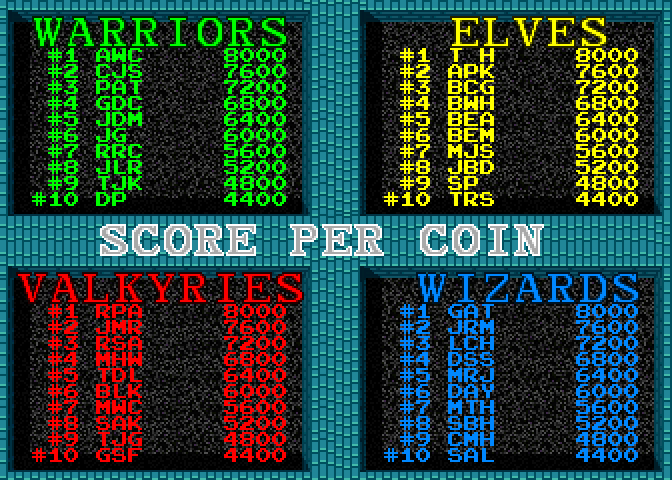
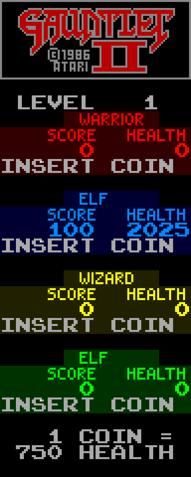

# Chapter 14 — Keeping Score (UI, Arcade Economics, and Memory)

**This chapter answers:** What happens to a quarter after it drops, how the
game decides what your play was worth, and what the cabinet remembers after
the power goes out.

**By the end you will understand:** the path from coin switch to health
points; how score, the treasure multiplier, and the floating score popups
work; why the high-score table ranks *score per coin* rather than score; how
the info panel redraws itself on a budget; and how the EEPROM stores
settings, rankings, and a surprisingly frank set of statistics about you.

**It builds on:** Chapter 5's OS services, Chapter 6's main loop and dialog
gate, Chapter 7's session lifecycle, and Chapter 10's health and inventory.

---

## The quarter's journey

Drop a coin and the first thing that notices is the OS, not the game. Chapter
5 introduced the OS as a service layer, and coin handling is its
department: every frame it samples the coin-door switches as small hardware
counters, computes how many clicks arrived on each channel since last frame,
discards impossible jumps, and applies the operator's pricing rules. Those
rules are richer than they look on the marquee. A configurable multiplier
turns one physical coin into several credit units, and a bonus setting can
grant extra units for bulk feeding, which is how a cabinet offers "4 coins
for the price of 3" without the game ROM knowing anything about it. The
result lands in per-player-position credit counts, because in Gauntlet II
every coin slot belongs to a color-coded player position.

The game ROM watches those counts change. Once per frame it compares each
position's total against a cached copy, and a new coin goes one of two ways.
If that position already has a live hero, the coin converts immediately into
health: the amount comes from a 32-entry table selected by the operator's
health-per-coin setting, anywhere from 100 to 2,000 units. The info panel
quotes the going rate on its bottom line; the machine photographed for this
chapter is set to 750. If the position is
empty, the coin instead primes the position for joining, and the
coins-to-start setting decides how many units the OS must collect before the
join is allowed to happen.

Chapter 10 established that health drains every frame just for existing.
Put next to this section, that fact completes the business model: a coin buys
a block of health, health is time, and everything dangerous in the game is a
tax on it. There is no lives counter anywhere in RAM. The wallet *is* the
player state.

## What things are worth

Score is the other accumulator, and it only ever goes up. Treasure adds to
it, monsters add to it (Chapter 11's rule: damage dealt times a per-type
value, ghosts worth double), the thief and dragon and treasure rooms pay
their special bonuses, and the bonus tally screens from Chapter 13 pour in
their computed awards.

Nearly every award passes through one function that multiplies the base value
by that player's **treasure multiplier** before adding it. The multiplier
starts at one, and it belongs to the treasure bags: the special sacks dropped
by a beaten dragon, a slain thief, and the luckier secret walls. Banking a bag
pays its bonus points and, when more than one player is in the game, raises
your multiplier by two, capped at twice the number of live players, while
knocking one step off every rival's. In a one-player game the raise is
skipped entirely; the multiplier is a competitive instrument. It is also the
number the thief resets to one when he robs you, which is why a late-game
theft stings far beyond the item lost. A monster kill that pays a new player
10 points pays 80 to a four-player game's bag hoarder at the cap.

When something scores in the world, the game likes to say so in place: a
small floating number appears where the kill or pickup happened. Those
popups are their own miniature system, four reserved MOB channels, each
holding a picture chosen from a table of preset values, parked at the source
position for one second. If all four channels are busy, additional scores
simply go unadvertised; the points still land, only the fanfare is dropped.

## Score per coin, the honest metric

At game over the cabinet judges you by a quotient, the score-per-coin metric
Chapter 7 flagged in passing: each player's 32-bit score divided by the count
of coins that player inserted. The quotient, and only the quotient, is handed
to the OS ranking service against the stored top ten for your character
class. Rank there and you are routed to initials entry with a 45-second
timer; miss and you get a ten-second GAME OVER instead.

A worked example. Suppose a Warrior finishes a long evening at 96,000 points
on 8 coins, while a Valkyrie burns bright and dies at 45,000 points on 3
coins:

| Player | Score | Coins | Score per coin |
|--------|-------|-------|----------------|
| Warrior | 96,000 | 8 | 12,000 |
| Valkyrie | 45,000 | 3 | 15,000 |

The Valkyrie outranks the Warrior, and the attract screen will say so. Half
the arcade's usual bragging strategy, feeding the machine until your total is
unbeatable, is simply divided away. The display below is what the attract
cycle shows between games: four quadrants, one per class, each a top-ten of
quotients.

*The attract mode's high-score screen. Every number on it is a score divided
by the coins that earned it.*

The quotient also feeds back into the gameplay, as Chapter 11 mentioned in
passing: the byte that raises the monster-count cap is recomputed from the
party's combined score over their combined coins, so efficient players fight
bigger crowds, and feeding in another coin literally buys relief. The cabinet
is, quietly, a handicapping system.

## The info panel

*The right edge of the screen during the demo: level number, one column per
player position, and the operator's exchange rate at the bottom.*

The panel on the right edge is mostly the text layer from Chapter 4, with MOB
graphics layered in for the fancier parts, and it is drawn by a routine that
can either rebuild the whole presentation or refresh a single player's
column. A column tracks its player's state from Chapter 7: an empty position
shows INSERT COIN, a joining one shows the character-selection prompt, a live
one shows class name, score, and health, and a finished one shows GAME OVER
or the initials editor.

What keeps the panel cheap is that almost nothing is redrawn on any given
frame. The per-frame display routine services exactly one player per frame,
rotating through the four positions, and within that column it repaints only
fields whose dirty bits are set, plus health whenever it has fallen low
enough to deserve attention. The low-health warning is done with palettes,
not text: below 200 units the health number pulses dim and bright on a steady
eight-frame cadence — the driving timer ticks once per frame and never speeds
up — while the heartbeat sound from Chapter 10 accelerates independently, and
an acid-slowed player's column shifts to
a different dimmed palette entirely. The score multiplier appears beside the
health once it exceeds one, and when somebody is IT, the two-character IT
label is stamped into their column in their color and announced out loud.

The playfield has a second, brief score display. Four fixed MOB channels can
float a value over its source object for 60 frames. Adaptive food chooses a +25
through +200 picture from a byte table parallel to its twenty health values. A
special score bag derives its popup from the value it carries in RAM and awards
that same value through the multiplier. A fresh level seeds 100; killing the
dragon changes the value to 2000 before dropping its bag. Updating the numeric score without
allocating this MOB leaves the panel right but the maze visually silent.

Potion-killed Death has its own eight-entry sequence: the global Death hit
counter selects both the awarded score and its matching floating picture.
gauntpy also shows the ordinary 100-point treasure pickup through the same
four-channel popup mechanism.

`gauntpy` also writes the current decimal frame in the lower-right status-panel
corner as a host debugging aid. It deliberately uses host text, is not a game
asset, and has no claimed arcade counterpart.
When the host loop is paused, `PAUSED` appears immediately above it.

## Messages, advice, and the continue offer

The message boxes that freeze the action, Chapter 6's dialog gate, are fed by
a first-encounter system. Thirty-two one-shot flags record which pieces of
advice this session has already delivered: the first locked chest explains
keys, the first potion explains Magic, the first thief introduces himself.
Each dialog record couples the text with an optional spoken line, and the
caller learns whether speech played so it can pace itself. Seen flags reset
with the session, which is why the machine repeats its wisdom for every new
audience.

The continue prompt is the economic pitch in dialog form. When the last
player dies past level one, the screen offers to resume at the current level,
counting down while the theme song plays. Accept by feeding a coin and
pressing Magic, and the session resumes where it stood; decline and the
session winds down through the rankings above. One period-correct wrinkle:
the prompt's ROM text says PRESS START, and the panel in front of you holds
only a joystick, Fire, and Magic. The debounced edge the code waits for is the
one on the Magic line, so Magic is the start button.

## What the cabinet remembers

Everything above is RAM and vanishes with the power. The cabinet's long-term
memory is a small EEPROM, and both the game and the OS treat it with the
respect owed to a part that wears out.

The game side is deliberately lazy. A ten-minute timer gates a check of six
values, the settings word, the played-games counter, and the two
rotation-position pairs from Chapter 9, against cached copies of what was
last written; only a difference triggers a write request. High scores and
statistics queue their own writes when they change. One special case from
Chapter 9 is visible here: when the maze rotation wraps its lap, the code
forces the ten-minute timer to expire immediately, so a lap boundary is never
lost to a power switch.

The OS side is where the durability lives. Each logical ten-byte record
occupies a thirty-byte physical block carrying five XOR check bytes, enough
redundancy that a single failed bit can be identified and corrected on load.
Records are kept in redundant copies; if one copy fails its checks, the OS
silently promotes the survivor and queues a repair write. Writes themselves
are serialized one byte per frame from VBLANK, each byte read back and
verified with up to four retries, and exhausted retries feed a saturating
error counter for the technician to find. What this
machinery does *not* promise is atomicity across a whole record; the honest
claim is bit-level repair and redundancy, not transactions.

Persisted in this memory: the operator's settings, the per-class top-ten
tables (each entry a three-byte score plus three initials packed into two
bytes), the maze and treasure-room rotation state, and the statistics below.

## The operator's cabinet

The service-mode options editor is the OS's user interface driven by a
descriptor stream the game supplies, which is how the same OS can present
different menus for different games. Gauntlet II's stream offers: resetting
high scores and restoring defaults, attract-mode sound, game difficulty
(implemented chiefly as monster-generation tuning), health per coin, coins to start, the secret-code
contest toggle from Chapter 13, speech on or off, and a reduced-text mode.
A separate screen edits coin pricing, the multipliers and bonus units from
the top of this chapter.

Then there are the statistics screens, and they are the most revealing part
of the machine. The OS keeps a running account of total power-on time versus
time with at least one live player, per-position play time, and games
played. Beyond the totals, it builds a histogram per player position: each
finished session's play time is normalized by difficulty and divided by the
coins spent, then dropped into one of twenty buckets. When a bucket
saturates, the whole row is halved to make room, a cheap trick that preserves
the shape of the distribution indefinitely. The operator, or Atari's field
engineers, could read off exactly how much time a coin bought their players
at the current settings, and tune price and difficulty against data. The
1986 cabinet was doing telemetry; it just never phoned home.

That closes the loop this book opened in Chapter 1: the coin drop is a
health transaction, the health drain prices the danger, the score-per-coin
table judges the exchange, and the EEPROM files the receipts. Chapter 15
turns to what the machine does when nobody is paying: the attract cycle, and
a demo that replays a human's hands.

---

> **Under the hood**
>
> - OS coin services: `process_coins` (OS 0x35C4, API 0x16C) with multiplier/
>   bonus from config bytes +0x0A/+0x0B, `get_coin_multiplier` (0x3706),
>   `calc_health_per_coin` (0x3740), `check_and_deduct_coin` (0x37C2),
>   `check_and_deduct_credits` (0x3804): `doc/02_os_rom.md` §8.10.
> - Game-side coin watch: `coincheck` (0x42B6A) against cached counters,
>   active re-coining from the 32-entry health table at 0x57862 indexed by
>   the settings word's low five bits; joining via `player_init_for_coin`
>   (0x488CA): `doc/04_game_subsystems.md` §10.1, §1.10 in
>   `doc/05_data_reference.md`.
> - Scoring: `player_add_score_with_mult` (0x5214C), multiplier array
>   `player_bonusmult` (0x90490E), kill values via
>   `monster_kill_score_by_multiplier` (0x40D78, 0–80). Verified by
>   disassembly of the treasure-bag arm of `player_tile_interact` at
>   0x51A16–0x51AB0: +2 to the collector unless `level_players_active`
>   (0x904928) is 1, cap at 2 × active players, −1 to each other live
>   player's multiplier above 1; the thief's reset to 1 is at 0x4E3EC. Popups
>   `playfield_showscore` (0x49498), four channels at 0x90493A, 60-frame
>   lifetime, picture table 0x579F2, retired by `main_score_update`
>   (0x4715E) loop 1: §10.2, §25.
> - Score per coin: `calc_score_per_coin` (0x40628) filling
>   `player_scorepercoin` (0x904B1A); `highscore_check` (0x49D0E) passes the
>   24-bit quotient to OS `rank_high_score` (0x3F68, API 0x1C6); initials
>   timer 0x0A8C (45 s) vs GAME OVER 0x0258 (10 s) in `player_state_timer`;
>   attract display `attract_highscores` (0x4A124); difficulty feedback
>   `update_monster_spawn_bonus_from_score_per_coin` (0x48B58) into 0x90405F.
> - Info panel: `setup_infopanel` (0x452D0, selector −1 = full rebuild);
>   `main_score_display` (0x457C0) services player `frame_counter & 3` only,
>   score/health renderers 0x45940/0x459A2, low-health dim −0x1000 and acid
>   dim −0x2000 palette shifts; IT label `player_it_label_set` (0x45866):
>   §14.1–14.2, §4.5.
> - Dialogs: `dialog_first_encounter` (0x4C440), 32-bit seen mask 0x9049E4,
>   record tables 0x5A200/0x5A300, box sound 0x1C; continue prompt
>   `show_continue_prompt` (0x44C7E) with theme 0x3B: §10.4–10.5.
> - EEPROM, game side: `eeprom_timer` (0x431EE), 36,000-frame period,
>   six-value change detection, write buffer 0x904B8E, flush via OS API
>   0x24E: §20. Forced save on rotation wrap: `doc/06_maze_catalog.md` §3.2.
> - EEPROM, OS side: ten-byte logical records as thirty physical bytes with
>   five XOR syndromes, single-bit correction, redundant copies,
>   byte-per-VBLANK verified writes with four retries and error counter
>   0x904FC0: `eeprom_process` (0x432E), `eeprom_init` (0x44E8),
>   `eeprom_read_block` (0x4822): `doc/02_os_rom.md` §8.9.
> - High-score storage: `read_high_score_entry`/`write_high_score_entry`
>   (0x39B0/0x3A7E), five bytes per entry, ten per class, base-40 initials,
>   24-bit score cap: §8.11.
> - Operator UI: options stream `game_options_display` (0x5317C, 442-byte
>   descriptor at 0x5318C) through OS `run_game_options` (0x58C6, API
>   0x248); coin options `run_coin_options` (0x593C); statistics
>   `run_statistics_screens` (0x5454, API 0x1D2), play-time accounting
>   `update_active_player_time_stats` (0x3BE8), per-player 20-bin normalized
>   time-per-coin histograms with saturation halving in
>   `record_player_session_histogram` (0x4038): §8.12–8.13, §20.1.
