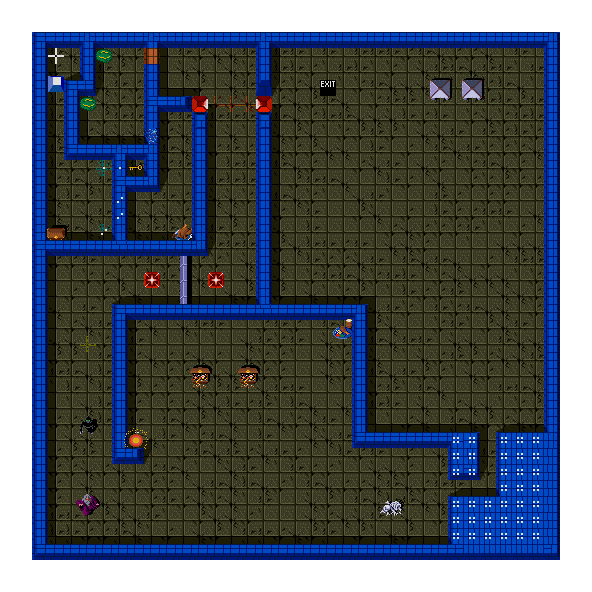
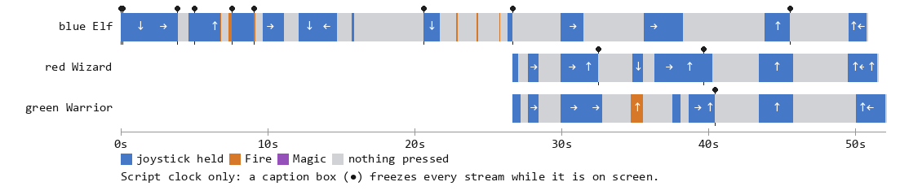

# Chapter 15 — The Show (Attract Mode, Demo Playback, and Legend)

**This chapter answers:** What is the cabinet doing when nobody is playing,
and how does a machine with no artificial opponent manage to play itself?

**By the end you will understand:** the four-screen attract cycle and its
timers, why the demo is the real game engine driving a puppet, the two-byte
recording format and what a decoded run of it looks like, exactly how much
of the demo repeats run to run and how much does not, what happens when a
bystander touches the controls, and what the legend pages teach.

**It builds on:** Chapter 6's main loop, mode variable, and dialog gate;
Chapter 7's session lifecycle; Chapter 9's maze records and shared random
number generator; Chapter 14's high-score screen.

---

## The empty room

An arcade at closing time is a room full of machines performing for nobody.
Gauntlet II performs on a loop about three minutes long: ten seconds of high
scores, twenty-five seconds of title, two minutes of somebody apparently
playing, and half a minute of illustrated instructions. Then it starts over,
and keeps starting over until a quarter arrives or the power goes out.

Those four screens are four values of the `game_mode` word from Chapter 6,
and the loop that walks between them is `main_attract`, one of the
twenty-eight calls every frame makes. Its job is small. It counts a timer
down, and when the timer expires it decrements `game_mode` by one, which
happens to walk the four attract values in order, then hands the new mode to
`start_attract_screen` to be built. The legend is the exception at both ends:
it holds for three pages before the code stores the high-score mode back into
`game_mode` and starts the lap over.

| Screen | Timer | Duration | What gets built |
|--------|-------|----------|-----------------|
| Scores | 0x258 | 10 s | The four-way score-per-coin table from Chapter 14 |
| Title | 0x5DD | 25 s | A stored 40×25 tilemap plus the logo assembled from MOBs |
| Demo | 0x1C20 | 120 s | Maze 102, one joined Elf, and a recorded input stream |
| Legend | 0x258 each | 10 s × 3 | Maze 103 as scenery under three explanatory pages |

Every screen begins from the same clean slate. `start_attract_screen` blanks
the text layer through the OS, forces any lingering message box to close,
sends a silence command and a music fade to the sound board, sets the level
counter to one and the maze number to zero, clears the playfield palettes,
and resets all four player slots. Only then does it branch on which screen
it is about to become.

## The title screen keeps a small secret

The title is the one screen with memory. A counter tracks how many times the
title has been built, and every thirteenth visit the game re-reads its
settings out of EEPROM, which is how an operator's change in service mode
reaches a cabinet that has been sitting untouched.

A second, smaller counter decides how grand the entrance is. When it reads
zero, the logo is driven by the longer of two stored motion programs, and if
the operator has left attract sound enabled, the theme song plays over it.
The counter is then set to two, so the next two title screens use the shorter
program and stay quiet, counting down as they go. Every third title screen
gets the full treatment.

The programs themselves are four-byte records of the form *hold this many
frames, move the view this much horizontally, this much vertically*. Both
start the logo off the left edge and slide it into place, then slide it down.
The long program adds three extra records to each phase: a few frames of
reversed motion followed by a slower correction, so the logo overshoots its
landing and settles back. The short program simply stops. Gauntlet II's logo
bounces only when it is also singing.

## The demo plays the game for real

*Stored maze 102, rendered from the Slapstic ROM. The demo always plays this
layout, and its contents give the game away: one movable wall, one secret
wall, one destructible wall, one stun tile, one key, one locked treasure,
three doors, two transporters, two forcefield hubs, an acid puddle, a Super
Sorcerer, an IT object, and a Death. Thirty-six random walls fill the middle.
This is a sampler, built so that one recorded walk can pass a specimen of
everything the captions want to talk about.*

There is no computer opponent anywhere in Gauntlet II. What the demo screen
shows is the game itself, running exactly as it does for a paying customer,
with one substitution: where the player-movement code would read a joystick,
it reads a byte out of ROM.

Setting that up takes one short routine, `attract_demo_init`. It hides the
maze behind the opaque text layer, rebuilds the info panel, clears the
first-encounter flags so the advice messages will fire again for this
audience, loads stored maze 102, and runs the ordinary new-level pipeline
from Chapter 9. Then it writes 3 into the blue position's character slot,
which is the Elf, and calls `player_join` on that position, the same
`player_join` a real person reaches by pressing Magic in character selection.
The blue position now holds a live hero with a MOB, a spawn point, a HUD
column, and health. Finally it installs a ROM pointer and a countdown byte
for that position and zeroes the other three.

The recording is a list of two-byte records. The first byte is a duration in
frames and the second is a joystick byte, stored the way the hardware
delivers it, with a zero bit meaning pressed:

| Bit | Meaning when clear |
|-----|--------------------|
| 7 | Up |
| 6 | Down |
| 5 | Left |
| 4 | Right |
| 1 | Fire |
| 0 | Magic |

Two first-byte values are escapes. 0xFF means *display caption number N*.
0xFE means *make a player join*, with the second byte carrying the character
class in its high nibble and the position in its low nibble.

Here is how the blue Elf's stream opens, decoded straight from the ROM:

| Record | Bytes | Meaning |
|--------|-------|---------|
| 0 | `01 F3` | hold nothing for 1 frame |
| 1 | `FF 00` | caption: BLUE / SELECTED / ELF |
| 2 | `08 B3` | hold Down for 8 frames |
| 3 | `FF 01` | caption: PUSH / MOVABLE / WALLS |
| 4 | `90 B3` | hold Down for 144 frames |
| 5 | `28 E3` | hold Right for 40 frames |
| 6 | `10 D3` | hold Left for 16 frames |
| 7 | `08 B3` | hold Down for 8 frames |
| 8 | `0E 93` | hold Down and Left for 14 frames |

A pointer per position walks that list, and a byte per position counts down
the current record's duration. When a countdown reaches zero the pointer
advances two bytes, and escape records are consumed immediately so a caption
never costs a frame of its own.

## Where the recording is read

The demo block sits at the top of `main_move_players`, and it exists only
to advance those pointers and timers. It never moves anybody. The actual
substitution happens further out, in the routines that would normally
consult a joystick. Each one carries a two-way fork: read the debounced
input word for this position, or read the word sitting at this position's
demo pointer and mask it down to the six meaningful bits.

Four consumers take that fork. Player movement asks which directions are
held. The shot handler asks whether Fire is down. The potion handler tests
the Magic bit. The transporter code asks which way the stick is pointing so
it can pick an exit. Everything downstream of those four questions is
ordinary gameplay: collision, damage, generators, the thief's schedule, the
camera. A demo Elf who walks into a ghost loses health for the same reason
you would.

The transporter selection is visible in a retained MAME trace: the blue Elf
starts dissolving at slot 492 `(180,240)`, then the live LEFT record selects
slot 486 `(92,240)` beside destination pad 487. The per-player sparkle channel
stays at the source through phase 21 and is recreated at the destination from
phase 22 until the transition retires.

*All three demo streams on the script clock. The blue Elf runs alone for the
first twenty-six seconds, then two joins bring a red Wizard and a green
Warrior into the maze on their own recordings.*

Two things stand out in that picture. The first is how much of it is empty:
long stretches where nothing is held at all, letting monsters close in so
the audience has something to watch. The second is the pair of join records
partway along, which is the demo advertising the game's signature trick.
The blue Elf's stream reaches `FE 20` and `FE 03`, and two more heroes walk
into a level already in progress, at the same moment the caption reads HAVE
FRIENDS / JOIN IN / ANY TIME. There is no separate code path for that
demonstration. The join records call `player_join`, exactly as a coin would.

The last record of every stream carries a duration of zero. A zero-length
record parks the whole mechanism: the countdown stays at zero, so the
pointer never advances again, and the consumers keep reading the final
record's input byte, which holds nothing pressed. The Elf's stream runs
3,047 frames of stick positions, a little over fifty seconds, and then the
heroes stand still while the maze keeps going on around them.

## The captions stop the clock

The nine caption records in the Elf's stream, plus one in the Warrior's and
two in the Wizard's, use the same message box that explains keys and potions
during a real game. That means they arrive through Chapter 6's dialog gate.
While the box is up, the main loop skips its entire sixteen-call gameplay
block, and `main_move_players` is inside that block. The demo's own
countdowns therefore freeze along with the monsters. Wall-clock time on the
demo screen is the script's fifty seconds plus roughly two seconds for each
of the twelve boxes.

One more box is produced by the world rather than an `FF` record. When the Elf
reappears from the transporter, `tport_player_move` raises the ordinary
first-encounter transporter advice. The transition animation lives outside the
dialog-gated block and finishes, but the `32 D3` input record stops counting
down. When the box closes, its remaining LEFT frames carry the Elf away from
the landing wall. This is not presentation-only timing: omit that game-side
dialog and the same immutable ROM recording gets stuck after the teleporter.

The twelve messages are worth reading as a set:

> BLUE SELECTED ELF · PUSH MOVABLE WALLS · SOME TREASURE REQUIRES KEYS ·
> THERE CAN BE MORE THAN ONE TRAP · ACID PUDDLES MOVE RANDOMLY · SOME WALLS
> CAN BE SHOT AND TURN INTO GOOD OR BAD · DEATH DIES AFTER TAKING UP TO 200
> HEALTH · HAVE FRIENDS JOIN IN ANY TIME · MONSTERS FOLLOW PLAYER WHO IS IT ·
> SOME WALLS MOVE RANDOMLY · MONSTERS MAY MOVE DIFFERENTLY · TAG, YOU'RE IT

The cabinet's attract shortcuts are split across four control positions. The
single-keyboard host maps its position-0 direction shortcut to DEMO from other
screens and to the next LEGEND screen while DEMO is already active; otherwise
the only available joystick would simply restart the demo forever.

Each of the twelve is used exactly once across the three streams, and the
maze in the picture above was stocked to contain a working example of almost
every one. Two of the twelve are about IT, the tag mechanic Chapter 10
covered, which is a fair measure of how much the designers wanted it noticed.

The recording is an integration test disguised as theater. Its Elf pushes the
opening wall, reveals and collects a potion while straddling a row boundary,
uses a transporter, waits for two scripted joins, spends the potion, and takes
the exit. Demo joins receive the full 2000 health and later actors use the
ordinary adjacent-player spawn search. Approximate pickup cells, spawning, or
viewport clipping break the timing and leave the Elf below the final wall.
The recording itself is finite; reaching its final input pair is not evidence
that the cabinet necessarily exits the maze before the attract timer advances.

The Elf is player position 1, so its status panel and sprite are both blue.
Hardware MOB palette slots 12–15 select color variants 0–3 within the chosen
hero class. Treating slot 13 as an out-of-range Elf palette and falling back to
variant zero paints a red Elf beside a blue panel.

## How much of this repeats

A recording of joystick positions is only a recording of joystick positions.
Whether the resulting Elf ends up in the same place at the same moment
depends on how much of the surrounding world is pinned down, and Gauntlet II
pins down less than you might expect.

Fixed on every run: the stored maze, the position and class of the first
hero, the pointers and countdown bytes, the joins, and the captions. The
frame counter is zeroed when the demo screen is built, so the animation and
palette cycles that key off it start from the same phase. The maze's own
geometry, doors, transporters, and starting objects come out of the same
Slapstic record every time.

Not fixed: the level's hazard flags and the random number generator behind
them. Chapter 9 introduced `getrandom` and its single sixteen-bit seed word.
That seed is never written by anything except the generator itself. A search
of both analyzed ROM images finds exactly two references to that address,
both of them inside the generator's own wrappers. Nothing seeds it at power
on, at the start of a level, or at the start of the demo. It begins at
whatever the boot memory tests left in that word and advances one step per
draw, forever, across attract screens and paid sessions alike.

So the demo draws from a stream whose position depends on everything the
cabinet has done since it was switched on. The consequences are visible. The
level-flag routine runs on the demo maze like any other, and it re-rolls two
of maze 102's hazard bits from a random value on every build, which is why
the demo's monsters do not always move the same way. Generator spawn timing,
monster step probabilities, forcefield cycling, and random-wall movement all
draw from the same well while the demo plays.

The honest description is a puppet show. Its script was authored against a
fixed stage, so the same stick motions walk a plausible route, and the parts
that vary are the parts that do not matter to the effect. Nothing checks
whether the Elf is where the recording expected. If a
grunt happens to block a corridor and the scripted turn arrives early, the
Elf bumps a wall for a few frames and carries on. The demo ends when its
120-second timer expires, whatever state the heroes are in, and the cabinet
moves to the legend.

## When somebody touches the controls

Each attract screen ignores the control panel for its first second. The
mechanism is a set of thresholds sitting exactly sixty frames below each
screen's loaded timer, so the screen's length is unchanged and only the
input test is suppressed. A button still held from the previous screen
cannot leak through a screen change.

After that second, the panel turns into a jukebox. A button press at the blue
or yellow position jumps the cycle to the high-score screen. The same press
at red or green goes to the title instead. Joysticks work the other way
round: pushing one at red or green summons the demo, while at blue or yellow
it summons the legend, and on the legend page a push walks forward to the
next page and finally to the scores. Whether Magic counts alongside Fire
depends on pricing. The game asks the OS for the coin multiplier, and free
play, which the OS reports as a multiplier of zero, narrows the test to Fire
alone.

None of that starts a game. Starting a game is a separate path that runs
every frame regardless of mode, and it has two entrances. On a paid cabinet
the entrance is the coin: `coincheck` sees a new coin arrive while the
machine is in an attract mode with nobody alive, and calls
`start_attract_to_game` before it even credits the coin.

On a free-play cabinet the entrance is Magic. Once a frame,
`main_start_game` looks at each position's debounce shift register from
Chapter 6 and matches the last five samples against a specific pattern: three
frames released followed by two frames held. That is a clean press edge
with the bounce filtered out. When a free-play cabinet sees one at an empty
position during attract, it calls the same `start_attract_to_game` and then
initializes the position as though a coin had arrived. Either way, the
attract screen is torn down, the mode word goes to zero, the level counter
goes to one, and Chapter 7's session lifecycle takes over.

## The legend, and the people in it

The legend is three ten-second pages drawn over stored maze 103, which is
loaded purely as scenery. The routine that builds a page always fills a
29-by-30 block of the text layer with opaque blanks first, the black curtain
Chapter 4 described, so the maze behind it never shows through where the
text goes. The item page then cuts six exact rectangular windows back through
that curtain so the corresponding maze objects show beside their labels. Those
rectangles stop before the status panel; their 68000 arguments are pushed in
the reverse of the callee's `(column, width, row, height)` order.

That maze persists into the following high-score screen. The four score boxes
are opaque alpha rectangles, but the cells between them are transparent, so
maze 103's cyan floor pattern is visible around the ladder. Updated MAME 0.289
captures distinguish these cases: SCORES visibly retains the maze; LEGEND is
intentionally black across its 29-column curtain. The upper score boxes begin
on alpha row one, leaving the maze's complete cyan top border visible.

The pages come in reverse order of their numbering. The first is headed
LEGEND and shows the item and terrain vocabulary: wall and floor types,
movable and destructible walls, potions, food, exits, traps, stun tiles,
forcefields, keys, treasure, and the temporary and permanent power-ups, each
beside its actual sprite. The second is headed MONSTERS and runs the roster
from ghosts through Super Sorcerers, with Death, the acid puddle, IT, and the
dragon named next to their graphics. It repeats those ten names in a lower
table and answers three cabinet-manual questions for each one: can it be fought,
shot, or affected by magic? The ROM's cells answer `NO`, `YES`, or `STUN` in
separate palettes. The third page is the credits:

| Role | Names |
|------|-------|
| Designer/programmer | Ed Logg |
| Game programmer | Bob Flanagan |
| Video graphics | Sam Comstock, Susan G. McBride, Alan Murphy, Will Noble |
| Engineer | Pat McCarthy |
| Technician | Cris Drobny |
| Sound design | Hal Canon, Brad Fuller, Earl Vickers |
| Cabinet design | Ken Hata |
| Special thanks to | Mike Albaugh, Dave Theurer, and many others |

Those names come out of the ROM itself, two linked lists of text records
drawn by an OS text service onto a maze that exists to be wallpaper, on the
last screen of a cycle most players walked past. Chapter 17 comes back to Ed
Logg for a different reason, involving nine bytes of Morse code.

The demo has now quietly used every subsystem the previous chapters
described. One thing it kept using without explanation is the voice: the
captions arrive with speech, the joins announce themselves, and the theme
song plays over a bouncing logo. All of that is a second computer's work,
reached one byte at a time. Chapter 16 walks the wire.

---

> **Under the hood**
>
> - Attract state machine `main_attract` (0x44562); screen builder
>   `start_attract_screen` (0x44414) with timers 0x258 / 0x5DD / 0x1C20;
>   mode advance by `subq.w #1` on `game_mode` (0x904918) at 0x448D6;
>   legend page counter `attract_legend` (0x90491A) loaded with 2 and
>   counted down at 0x44882: `doc/04_game_subsystems.md` §6.1,
>   `doc/03_game_rom_structure.md` §2.5.
> - Title extras: `attract_count` (0x904B60) with the every-13th EEPROM
>   refresh at 0x4449E; `title_intro_state` (0x904B82) gating theme 0x3B and
>   selecting `logo_motion_program_full` (0x5AC2E, 8 records) versus
>   `logo_motion_program_short` (0x5AC4E, 4 records) at 0x4DC82; background
>   `load_attract_display_tilemap` (0x4438E); `title_logo_init` (0x4DA3E);
>   per-frame `main_logo_updcolors` (0x4DCBA): `doc/04_game_subsystems.md`
>   §14.3.
> - Demo setup `attract_demo_init` (0x449D4): maze 102 via
>   `maze_select_bank` (0x40D24) and `maze_new_level_setup` (0x438AE),
>   `player_character[1]` (0x9048EA) = 3, `player_join` (0x48BB6),
>   `demo_ptr` (0x904B66) = 0x581C4, `demo_timer` (0x904B76). The frame
>   counter (0x904006) is cleared by the DEMO branch at 0x44524.
> - Stream data: pointer table 0x58098; streams at 0x5818C (56 B),
>   0x581C4 (150 B, the Elf), 0x5825A (2 B, a bare terminator), 0x5825C
>   (48 B): `doc/05_data_reference.md` §5.8. The Elf's 75 records total
>   3,047 frames.
> - Playback: the pointer/timer walk is the head of `main_move_players`
>   (0x4A53A, 0x4A554–0x4A5F0), including the 0xFE arm that writes
>   `player_character[n]`, calls `player_join`, and reloads that position's
>   pointer from 0x58098. Input forks: `main_move_players` (0x4A8F2),
>   `main_handle_shots` (0x47B5E), `main_handle_potions` (0x4702E),
>   `tport_player_move` (0x506A8). Each masks the record word with 0xF3 or
>   0xF0. The 0xFE arm at 0x4A5B2–0x4A5C4 writes its high nibble to
>   `player_character`, making it a class rather than the direction earlier
>   revisions of `doc/04_game_subsystems.md` §6.2 recorded; that section now
>   carries the corrected reading.
> - Captions: `demo_speech_cmd` (0x4C9A2), record table 0x5815C (12
>   entries), strings 0x5828C–0x584FF; the box sets `dialog_timer`
>   (0x904A9E) to 0x96 or 0x78 at 0x4CB34/0x4CB3E, which is what freezes
>   the gameplay block described in `doc/03_game_rom_structure.md` §2.1.
> - Determinism: `random_seed` (0x904BFC) is referenced only by
>   `random_word` (0x5FC46) and `getrandom` (0x5FC4E). A byte-level scan of
>   `row76.bin` and `row9.bin` for the 32-bit address finds no other site,
>   matching `doc/generated/ram_operands.csv`. Flag re-rolling in the demo
>   reaches `maze_load_pickup_config` (0x436FE) through `maze_setupnew`
>   (0x44AC2) at 0x44B30–0x44B46, whose guard admits any negative
>   `game_mode`; the XOR target is LFLAG1 bits 2–3:
>   `doc/04_game_subsystems.md` §5.5.
> - Interruption: input thresholds 0x21C / 0x5A1 / 0x1BE4, sixty frames
>   below each loaded timer (`doc/04_game_subsystems.md` §6.4). Button
>   blocks at 0x4460E (positions 1/2, to SCORES) and 0x44694 (positions
>   0/3, to TITLE); joystick blocks at 0x44716 (positions 0/3, to DEMO),
>   0x4477E (positions 1/2, to LEGEND) and 0x447F8 (legend paging). Pricing
>   gate `two_player_mode` (0x9049E2), loaded from OS
>   `get_coin_multiplier` (API 0x236), which returns 0 for free play:
>   `doc/02_os_rom.md` §8.10. All four raw input words at 0x904920–0x904926
>   are tested, in pairs; §6.4 now tabulates which pair reaches which screen.
> - Transitions into play: `start_attract_to_game` (0x44204) from
>   `coincheck` (0x42BE2), `main_start_game` (0x484B8), and the expired
>   attract timer (0x448CE). The press edge `main_start_game` looks for
>   is `(debounce_A[player] & 0x1F) == 0x1C` at 0x48402–0x48416, over the
>   shift register at 0x905F58, which `input_debounce` fills from raw input
>   **bit 0** — `JOY_MAGIC_BIT` in `doc/05_data_reference.md` §3.11, and the
>   same register `main_handle_potions` reads at 0x47020;
>   `doc/04_game_subsystems.md` §15 and §6.4;
>   the free-play arm at 0x484A8–0x484C4 pairs it with
>   `player_init_for_coin` (0x488CA).
> - Legend: `load_legend_page` (0x4CD1C) loads maze 103, blanks a 29×30
>   text block, then dispatches selector 2 to the item page (0x4CFDA),
>   selector 1 to the monster page (0x4CDB8, which also forces palette
>   index 7), and selector 0 to the credits (0x4CFAE). Credits records are
>   two linked lists headed at 0x5A99C and 0x5AB0E, each node carrying a
>   column, a row, a string pointer, and a link; strings run 0x5A8CC–0x5AA69.
