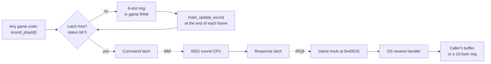

# Chapter 16 — The Voice (Sound, at Arm's Length)

**This chapter answers:** How does a game loop with no time to spare produce
music, effects, and a cabinet that talks constantly?

**By the end you will understand:** what lives on the sound board and why it
is a separate computer, the pair of one-byte latches between the two
processors, the
small queue and once-per-frame drain on the game side, how the game notices
a dead sound board and reboots it, why your quarters arrive as answers to a
sound command, and how the cabinet builds a sentence out of two commands.

**It builds on:** Chapter 3's board layout, Chapter 5's OS services and
interrupts, Chapter 6's main loop and frame-overflow signal, and Chapter 14's
coin handling.

---

## Two bytes make a sentence

Your health drops below two hundred, and the machine says "Blue Elf needs
food, badly." Arcade folklore has kept that line alive for four decades.
Inside the game ROM it is two bytes: 0xC4, then 0x5A.

The sound board holds the phrase "BLUE ELF" at command 0xC4 and the phrase
"NEEDS FOOD, BADLY." at command 0x5A. The game ROM holds a sixteen-entry
table of color-and-class phrase numbers, indexed by which position you play
and which hero you chose, plus a four-entry table of warnings. When the
health check fires, the low-health routine looks up your name phrase and
sends it, then picks one of the first three warnings at random and sends
that. Carrying more than one power-up gives a separate roll a chance to
override the pick with "ALL YOUR POWERS WILL BE LOST!" Afterward it sets a
thirty-second cooldown so the cabinet does not nag.

Nothing in the game ROM knows what a formant is. It knows two numbers and
the order to send them in.

## The second computer

Audio in Gauntlet II belongs to a MOS 6502 running at about 1.8 MHz on its
own corner of the board, with 4 KB of RAM, 48 KB of program and data ROM,
and three sound chips of its own. The main 68010 cannot see any of it. The
two processors share zero bytes of address space, so every exchange between
them has to fit through a latch.

The three chips divide the work. A Yamaha YM2151 handles FM synthesis, which
means the music. A POKEY, Atari's own general-purpose sound chip, handles
effects. A TMS5220 speech synthesizer handles the voice, and its clock is
software-selectable, so the same synthesizer can be run fast or slow to
change pitch. Each chip's output volume is set by a field in a single mixer
register the 6502 writes, three bits for speech, two for effects, three for
music. These identifications come from MAME's Gauntlet driver, which
documents the sound board's memory map; the ROM analysis in this book covers
the main CPU's side of the conversation and takes the far end on that
authority.

Keeping audio on separate silicon buys the game loop its schedule. Chapter 6
showed twenty-eight calls that must all finish inside a sixtieth of a second.
A music player that had to service an FM chip's envelope timings inside that
budget would be a permanent tax on every frame. Instead the game spends a few
microseconds handing over a number.

## The wire

The link is two byte-wide latches and one status bit.



To send, the CPU checks bit 5 of the hardware status word, which reports
whether the latch still holds an unread byte. If the latch is free, it writes
the command and returns success. If not, it reports busy and the caller
decides what to do. Writing that latch raises a non-maskable interrupt on the
6502, so the sound board never polls for work.

The return path is the mirror image. When the 6502 writes its own latch, the
68010 takes interrupt level 6. Chapter 5 described the game ROM's header of
hooks that the OS calls for each interrupt, and the sound entry is the
laziest of them: it is a single jump straight into an OS routine. The game
handles no sound interrupt at all. The OS routine reads one byte from the
hardware and puts it in one of two places. If a previous command asked for a
reply and named a destination, the byte goes there and the remaining count
ticks down. Otherwise it goes into a fifteen-entry circular buffer that
software can read later at its leisure.

There is a third wire. Writing a control address asserts reset on the 6502,
and the OS wraps the whole sequence: assert reset, drain any stale byte out
of the receive latch, write a startup command, release reset. The main CPU
can power-cycle the sound board without touching the rest of the machine, and
as the next section shows, it does.

## Eight slots and one frame

Any code that wants a noise calls `sound_play` with a command number. The
policy inside is worth reading, because it explains a subtlety in how the
cabinet sounds.

```text
sound_play(id):
    if holdoff_counter == 0:
        if try_send(id):      # latch was free
            return            # sent immediately, never queued
    enqueue(id)               # latch busy, or the board is recovering
```

Most sounds go out on the same call that asked for them. Only when the latch
is still occupied does the command land in a ring of eight bytes in game RAM.
One slot is spent distinguishing full from empty, so seven commands can wait,
and an eighth is dropped without complaint. Losing a sound is preferable to
blocking a frame.

The ring is emptied at the very end of the main loop, after all the gameplay
and presentation work is done. `main_update_sound` makes at most eight
attempts per frame, marking each accepted slot as spent and moving on. A busy
latch costs an attempt and a few microseconds of delay loop, after which the
same byte is offered again. It also declines to run at all under two
conditions. The first is Chapter 6's `frame_overflow` signal: if the previous
frame ran long, sound draining is one of the things sacrificed to catch up.
The second is the holdoff counter, which brings us to the interesting part.

## Watching for a corpse

An arcade cabinet lives in a room with big speakers, fluorescent lights, and
teenagers. Things glitch. Gauntlet II assumes its sound board will
occasionally stop answering, and spends a whole per-frame routine on the
possibility.

`sound_response` runs every frame, right before the queue drain. It asks the
OS for one received byte. When nothing has arrived and the board is idle, it
counts down a four-second timer, and on expiry sends command 7, a status
query, with a one-byte reply directed at a known word. A successful send
reloads the timer and clears the retry count. A failed send clears the timer
so the next frame tries again, and increments a retry counter; after one
hundred and eighty consecutive failures, three seconds of a latch that never
clears, the game gives up and resets the sound processor.

The reply is inspected the following frame. If any of the low three bits of
the status byte are set, the board has reported a fault, and the game resets
it. If a byte arrives when the game was not expecting one at all, the game
resets it. There is a certain bluntness to the whole design, and it is
right for the setting: a wedged sound board in an arcade earns exactly one
diagnosis and one remedy.

Reset itself sets the holdoff counter to one hundred and eighty frames. While
that counter is nonzero, nothing is sent to the sound board and nothing is
drained from the ring, because the 6502 is busy booting. The counter has two
exits. If a 0xFF byte arrives during the grace period, the board has come
back and the counter is cleared immediately. If the counter reaches zero
without that byte, the board never answered, and the reset runs again. A
cabinet with a dead sound board sits in this loop forever, silently, still
perfectly playable.

## The coins come back down the same wire

Here is the part that reorganizes Chapter 14 in retrospect.

The game's own VBLANK handler ends by calling an OS service that runs once
per frame. That service does three things: it looks at whatever the sound
board last replied with, it services the EEPROM, and it sends command 3 with
a one-byte reply directed at its own status area.

The reply to command 3 is the coin switches.

The four coin mechanisms report to the sound board, which reads them as four
bits of one of its input ports. The 6502 keeps a small counter per channel,
packs four of those counters into a single byte, and hands the byte over
when asked. On the main
side, the OS compares each frame's byte against the previous one, rejects
impossible jumps, applies the operator's multiplier and bonus, and updates the
per-position credit bytes. The coin-accounting routine at the heart of
Chapter 14 has exactly one caller in the entire OS ROM, and that caller is the
sound service.

So the chain from a quarter to a hero runs: coin switch, 6502, response latch,
IRQ6, game hook, OS receive handler, status byte, next frame's sound service,
coin accounting, credit bytes, `coincheck` in the main loop, health. Every
frame of every game, the main processor asks the sound board whether it has
anything to say, and most of the time the answer is "no coins."

## The vocabulary

Commands are numbers with meanings agreed between the two ROMs, and there are
a couple of hundred of them. A few, tied to moments earlier chapters already
covered:

| Command | Meaning | Where it comes from |
|---------|---------|---------------------|
| 0x09–0x0C | Warrior/Valkyrie/Wizard/Elf joins in | Chapter 7's join path |
| 0x0D | Food eaten | Chapter 10's pickups |
| 0x12 | Doors open | Chapter 13's mass door opening |
| 0x13 | Player takes key | Chapter 10's inventory |
| 0x18–0x1B | Heartbeat, one per position color | Chapter 14's low-health pulse |
| 0x1C | Message appears on screen | Chapter 6's dialog gate |
| 0x20 / 0x21 | Death touches player / silence it | Chapter 11's Death |
| 0x28 | Transporter | Chapter 13's teleports |
| 0x29 / 0x2D | Thief arrives / mugger arrives | Chapter 12 |
| 0x2B | Cyclic walls | Chapter 13's moving walls |
| 0x2E / 0x2F | Forcefield contact / silence it | Chapter 13's forcefields |
| 0x35 | Player touches IT | Chapter 10's tag mechanic |
| 0x3B / 0x3C | Theme song / fade it out | Chapter 15's title screen |

Two patterns in that list are structural. Several effects come in groups of
four indexed by player position, which is how the cabinet keeps four
simultaneous heartbeats distinguishable. Looping sounds come in pairs, one
command to start and another to stop, because the game has no way to ask the
sound board what it is currently doing. The thief pair is a variation on the
same idea: a single call site tests the mugger bit in the thief's mode word
from Chapter 12 and pushes 0x2D or 0x29 accordingly, so the arrival announces
which visitor it is before you can see the sprite.

## Speech as game design

Of the two hundred and nineteen classified commands in the catalogue, one
hundred and forty are speech, and the phrases are built to be combined. The ROM stores "NOW
HAS" as one phrase and "EXTRA ARMOR", "LIMITED
INVISIBILITY", "EXTRA SHOT POWER" and the rest as others. It stores sixteen
name phrases covering four colors times four classes. It stores "IS IT" and
"IS NOW IT" separately from the names that precede them. The game assembles
sentences by sending two or three commands in order, which is why the cabinet
can address you personally without the sound ROM holding a separate recording
for every hero saying every line.

That personalization is doing real work on a screen with four players, a few
dozen monsters, and a camera that keeps everybody in frame. When four people
are shouting at each other over a cabinet, a color-and-class name is the
fastest way to tell one of them that this warning is theirs. Chapter 14's
first-encounter dialogs use the same channel to teach: the box explaining
keys arrives with a voice reading it, and the caller learns whether speech
played so it can pace the box accordingly.

Two operator settings gate all of this. One disables speech entirely, checked
by a thin wrapper that every voice line goes through, so an operator in a
quiet arcade loses the talking without losing the effects. The other controls
whether the attract cycle makes noise at all, which is what decides if the
title screen from Chapter 15 gets its theme song.

## What the technician hears

The self-test from Chapter 5 turns the whole conversation into a diagnostic
screen. The OS can command the sound board to exercise its music chip, its
effects chip, and its speech chip in turn, and the sound board reports back on
its own RAM and ROM. The strings in the OS ROM name the failures it expects:
a processor that does not respond, a speech chip that times out, a music chip
that times out, an interrupt error, RAM errors, ROM errors, and a status line
that reads Good when all is well. There is also a manual sound test that fires
individual command numbers at the board so a technician can walk the
vocabulary one entry at a time.

The main CPU cannot see a single register on the sound board. Everything on
that screen arrives as a reply byte on the same wire that carries the coins.

## Where this stops

This chapter has stayed on the main CPU's side of the latch on purpose. What
the 6502 does with command 0x5A, how its music player drives the YM2151, how
the speech data is encoded and how the phrases were recovered, and what the
48 KB of sound ROM contains, are all a separate body of work with its
own reverse engineering behind it. That material belongs to a future volume
about the sound ROM, and this book will not pretend to have covered it.

What this volume can say is that the interface between the two halves is
small, honest, and well defended: one byte out, one byte back, a queue that
prefers dropping a sound to missing a frame, and a watchdog that will reboot
the far end rather than wait for it. Chapter 17 turns from the machine to the
people who built it, and to how much of any of this can be proven from ROM
images alone.

---

> **Under the hood**
>
> - Hardware: command latch 0x803170/0x803171 (byte on the odd lane), status
>   word 0x803009 bit 5 (SoundIOFull), response read 0x80300F on the game
>   lane and 0x80300E on the OS lane, reset/control 0x80312F and 0x80312E:
>   `doc/01_hardware.md` §3, §3.1, §11.
> - Sound-board chips, clocks, the NMI-on-command-latch and IRQ6-on-response
>   wiring, and the three-field mixer register are from MAME's
>   `src/mame/atari/gauntlet.cpp` (memory-map comment block and machine
>   configuration). The sound ROMs are 136043-1120.16r (16 KB at 0x4000) and
>   136043-1119.16s (32 KB at 0x8000).
> - OS transport: `send_sound_command` (0x4184, API 0x172) taking command,
>   destination pointer, and reply count; `send_sound_command_wait` (0x41C8,
>   API 0x23C); `try_send_sound_command` (0x41CC, API 0x242) returning 1 or 0;
>   `read_sound_data` (0x42C8, API 0x178) over the 15-entry ring at 0x904F98;
>   `sound_receive_irq_body` (0x427A, API 0x17E); `reset_sound_cpu` (0x42F8,
>   API 0x254): `doc/02_os_rom.md` §8.7–8.8. The game's IRQ6 hook at 0x4001E
>   is `jmp 0x17E`, with no game-side body at all; OS dispatch is at 0x36C
>   (§6.7).
> - Game queue: `sound_play` (0x4AD76), ring of eight bytes at 0x90404B with
>   write head 0x904053 and read head 0x904054, full test
>   `((write − read) & 7) == 7`; `sound_enqueue` (0x4ADD6);
>   `sound_queue_reset` (0x4ADAE); drain `main_update_sound` (0x4AE20), which
>   returns early on `frame_overflow` (0x904916) or a nonzero holdoff:
>   `doc/04_game_subsystems.md` §11.1–11.2. At 0x4AE6E a busy result branches
>   to the delay at 0x4AE8E and then back to the loop head without advancing
>   the read index, so a busy latch costs one of the eight attempts and the
>   same byte is retried; only an empty ring or the attempt cap exits.
> - Recovery: `sound_response` (0x42D0A) and `sound_system_reset` (0x42DC8).
>   Status query is command 7 with its reply byte at 0x9049F1; idle reload
>   0xF0 (240 frames) at 0x9049F2; retry counter 0x9049F4 with the reset
>   threshold at 0xB4 (180); holdoff 0x9049EE reloaded with 0xB4 by the reset
>   path. That word still carries the name `speech_counter` in the loader
>   symbols, but the only site storing a nonzero value into it is 0x42DDA
>   inside `sound_system_reset`, and the 0xFF test at 0x42D30 is the
>   post-reset acknowledgement, so it is a recovery holdoff. A byte-level
>   scan of `row76.bin` for the address finds references only at 0x42D14,
>   0x42DDA, 0x4AD7E and 0x4AE36: `doc/04_game_subsystems.md` §11.3.
> - Speech gate: `sound_speech_play` (0x4AD4E) tests bit 11 of `game_settings`
>   (0x904A24) and calls `sound_play` only when clear; attract audio is bit 14:
>   `doc/04_game_subsystems.md` §11.4, `doc/05_data_reference.md` §1.10.
> - Phrase composition: `player_lowhealth` (0x487CA) sends
>   `speech_charname_tbl[character + player × 4]` (0x596F6, IDs 0xBD–0xCC)
>   followed by an entry of `character_lowhealth_speech` (0x5797A,
>   {0x5A, 0x5B, 0x5D, 0x5C}), then sets the spoken flag at 0x904ACA and a
>   0x708-frame cooldown at 0x904ACE. The warning index is random rather than
>   character-derived: 0x48856 picks entries 0–2 with `getrandom(3)`, and
>   entry 3 is reachable only through the power-count branch at
>   0x48812–0x48850. Also `speech_welcome` (0x48754).
> - The coin path: the game VBLANK handler tail calls OS `process_sound`
>   (0x41FA, API 0x15A) at 0x40496 using the 16-bit absolute form
>   (`4EB8 015A`). `process_sound` compares the current and previous reply
>   bytes at 0x904F8E, calls `process_coins` (0x35C4, API 0x16C) on a change,
>   runs `eeprom_process`, and submits command 3 with a one-byte reply. That
>   0x4216 call site is the only caller of `process_coins` in the OS ROM.
>   Credit state lands at 0x904FEC, which `coincheck` (0x42B6A) polls against
>   its cache at 0x9049EA: `doc/02_os_rom.md` §8.7, §8.10. Note that
>   `refs/soundcmds.csv` labels command 3 "Stop playing? (used during idle)";
>   the OS's use of it is a status/coin poll, and the supplied label for that
>   entry is a guess rather than a checked identification.
> - Command list: `refs/soundcmds.csv` (219 entries: 140 speech, 58 effects,
>   9 music, 12 unidentified); the main-loop subset with verified call sites
>   is `doc/04_game_subsystems.md` §11.5. The mass-door-open command 0x12 is
>   pushed at 0x47FF4 after a 0x400-slot scan for vertical-door objects. The
>   thief/mugger pair shares one call site at 0x4DFC0–0x4DFD8, selecting
>   between 0x2D and 0x29 on bit 7 of `thief_mode` (0x904BA0), the
>   mugger-variant flag from §9 and Chapter 12.
> - Self-test strings and the sound diagnostics: `doc/02_os_rom.md` §12.3,
>   §8.14.
