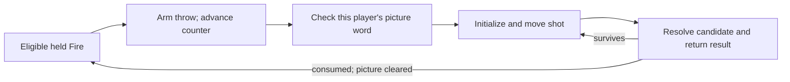

# 18. Reading the ROMs

At the beginning of this book, an Elf moved closer to a generator and
could shoot again sooner. We explained the difference through a reserved
projectile slot. That explanation makes a useful prediction, but a
plausible alternative could have sounded just as convincing. Perhaps
the game adjusted a firing timer according to distance. Perhaps the Elf
could have several arrows, with a hidden limit that happened to look
like one.

Looking at the screen would start the investigation. It would not finish
it. To distinguish those accounts, we need to find the decision that
permits a shot, follow the information it reads, and see what changes
that information later.

Alinsa had spent decades doing this kind of work before the AI-assisted
part of the project began. Addresses, hardware descriptions, descriptive
routine names, and observations supplied a substantial starting map.
The later work extended that map; it did not conjure the game from an
empty prompt. Neither an old annotation nor a fluent new explanation
gets the last word when the instructions say something else.

## First, which bytes are we reading?

A physical program ROM chip is not necessarily a consecutive slice of
the processor's instruction stream. The 68010 fetches across two byte
lanes. In the supplied main-game set, the A chip contributes even-addressed
bytes and the B chip contributes odd-addressed bytes.

Imagine two tiny chips containing these invented values:

```text
A lane:       12    56    9A
B lane:       34    78    BC
CPU order:    12 34 56 78 9A BC
```

*An illustrative interleave, not six bytes identified as game code.*

Concatenating A and then B would produce a different sequence. A
disassembler might still turn some of it into legal instructions; a
processor has no obligation to make nonsense look obviously nonsensical.
Getting the physical arrangement right comes before interpreting the
program.

For `row76.bin`, interleave row 7's pair, interleave row 6's pair, then
concatenate those two results in that order. The result is a 128 KiB
image mapped beginning at CPU address `0x040000`. The OS image and level
image have separate roles and assembly instructions. The repository's
[ROM appendix](../README.md#appendix-roms) identifies the matching chips
and image hashes.

A hash is a compact identity check over a file. Matching the documented
SHA-1 is useful here because it establishes which known image a reader
is examining; it is not an argument that the accompanying explanation
is correct. A different revision needs its own address correspondence.

File offsets and CPU addresses are also different labels. The shot
creation routine at CPU address `0x53666` begins at offset `0x13666` in
this main-game image:

```text
0x53666 - 0x40000 = 0x13666
```

The arithmetic is simple because this is a fixed mapping. A banked
level-data address needs an additional answer: which bank is selected?
The supplied offline level image also normalizes its maze pointers.
Applying that normalization a second time would move a valid pointer
to the wrong place. An address copied out of a notebook is useful only
with the image and mapping that give it meaning.

## Find the refusal, not just the arrow

Our narrow question is what prevents a second ordinary projectile from
being created. In the routine called `player_create_shot`, the player's
zero-based index arrives as an argument. After the entry code reads it
into register `d3`, the following instructions compute and inspect the
reservation:

```asm
; CPU addresses 0x53678 through 0x5368C; descriptive comments added
move.w  d3, d0
ext.l   d0
addq.l  #1, d0
add.w   d0, d0
movea.l #0x902000, a0
tst.w   (a0,d0.w)
beq.b   0x53690
bra.w   0x5380E
```

*A short disassembly excerpt from the supplied main-game image, with
normalized assembler notation. This is static instruction evidence,
not a transcript of a played shot.*

Registers are small working locations inside the CPU. Here `d0` holds
a number and `a0` holds an address. The `.w` operations work on 16-bit
words; `.l` means 32 bits. `ext.l` sign-extends the word, preserving its
signed value in the larger register.

The addition of one converts player indices 0-3 into MOB slots 1-4.
Doubling then converts a slot number into a byte offset, because every
picture entry occupies a two-byte word. `0x902000` is the picture-array
base. For the blue position, player index 1, the calculation becomes
`2 * (1 + 1) = 4`: inspect the word at `0x902004`.

`tst.w` examines that word and sets the CPU's condition flags. `beq`,
"branch if equal," takes the zero-result path to the creation body.
A nonzero picture instead reaches the branch to the routine's
epilogue. No search for a spare neighboring channel occurs on this
path. Another player's unused reservation does not help.

The neighboring instructions matter too. The body installs direction,
picture, and position and initializes shot-related state. The branch
target restores saved registers and returns. We have therefore found a
refusal to allocate, rather than merely an animation test that happens
to mention the same sprite.

This distinction turns a name into evidence. We call the routine
`player_create_shot` because of what its callers and effects establish.
Atari's original source symbols were not recovered with the ROM.
The label is a modern bookmark, and can be improved without changing
one byte of the underlying program.

## Put time back into the decision

An allocation check alone does not explain the interval between pressing
Fire and seeing an arrow. Follow the caller backward.

The held-Fire path in `main_handle_shots` checks eligibility, clears the
player's animation counter, and arms shooting. Later in the repeated
frame, `main_move_players` advances that action. Its launch comparison
first copies the old counter to a register, increments the stored
counter, and compares the saved old value with the player's threshold.
The shipped threshold is three.

That ordering gives this small instruction-derived example:

| Eligible shooting update | Counter read | Counter stored | Launch comparison |
|---|---:|---:|---|
| First | 0 | 1 | Not yet |
| Second | 1 | 2 | Not yet |
| Third | 2 | 3 | Not yet |
| Fourth | 3 | 4 | Call shot creation |

*The counter sequence assumes an armed action starting at zero and no
interruption. It is a worked reading of the update, not measured video.*

Replacing "old value equals three" with "increment until three" would
move launch by one update. Describing this as four distinct pictures
would introduce a different mistake: artwork selection divides the
counter separately. The integer serves two related jobs without making
those jobs identical.

The final link is retirement. The projectile update calls
`shot_mob_collision` to find a candidate, then passes an accepted
candidate to `resolve_shot_hit`. The latter's result is zero when the
shot survives and minus one when it is consumed. At `0x475B0`, the caller
tests that result. Zero continues through the live-shot path; nonzero
skips to the end of that channel's processing.

Inside the consumed path, unlinking the projectile and clearing its
picture releases the reservation. A piercing or reflected shot can take
a different route and remain live. Consequently, "there was a collision"
and "the player can start another shot" are not equivalent statements.



*An explanatory evidence chain. Each arrow stands for an inspected
control or state dependency, not simply two events seen near each other.*

We can now return to the corridor without pretending to have explained
every collision branch. Shorter travel can release the reservation
earlier. Whether that happens in a particular fight depends on where the
shot starts, what it hits, and whether it survives. That conditional
claim is stronger than an unconditional story about proximity bonuses.

## What would we watch in a running game?

Static reading tells us what a path does. An observation of original-ROM
execution can test whether the path is reached under the conditions we
believe select it. MAME, an emulator of the arcade hardware, provides
one way to inspect that execution.

For this example, a useful debugger setup watches the blue player's
picture word at `0x902004` and stops at shot creation and hit resolution.
A *watchpoint* stops or records execution when a chosen memory location
is accessed; a *breakpoint* does so at an instruction. The interesting
record includes who wrote the word, not just its current value.

Before comparing runs, record the ROM revision, player position and
class, powers, facing, input history, and starting state. Keep the
camera and the target in the account. A shot lost at the screen boundary
does not measure the time to a generator beyond it.

| Situation to arrange | State to follow | Prediction from the chain |
|---|---|---|
| Hold Fire while an ordinary shot is live | Reserved picture and shooting action | No second projectile is allocated in that reservation |
| Ordinary shot is consumed | Hit result, unlink, picture write | Clearing the picture removes the occupancy obstacle |
| A shot survives a reflection | Direction and the same picture slot | Changed direction does not provide another reservation |
| A dialog opens during an action | Dialog timer and animation counter | The gameplay block waits while other frame work continues |

*A proposed observation plan and its predictions, not a claim that these
four original-ROM runs were captured for this chapter.*

A screenshot is excellent evidence of what was visible. It does not
identify the instruction that cleared a slot. A memory trace can identify
that write but needs enough surrounding state to explain why it happened.
Using both views avoids asking either to answer a question it cannot.

The distinction also keeps an unsuccessful experiment useful. If a
nominally ordinary shot survives, inspect its powers and collision
target before discarding the allocation model. If a second allocation
really occurs while the same picture word remains occupied, the model
needs revision. An experiment that cannot inconvenience an explanation
is not much of a test.

## A readable reconstruction is another instrument

The preceding chapter's `gauntpy` tools make state easy to freeze,
inspect, and restore. They can turn a complicated room into a small
example with one actor and one relevant obstacle. That is extremely
helpful when a proposed rule is difficult to reason through mentally.

But a Python routine and documentation used to write that routine can
agree because they share an assumption. A test asserting that same
assumption adds consistency, not independent evidence about Atari's
program. Comparing the reconstruction against a matched original-ROM
observation answers a different and more demanding question.

This is why a synthetic scenario needs its label even when it looks
exactly like the game. It demonstrates the reconstruction's response to
an invented starting arrangement. It does not establish that the maze
decoder can produce that arrangement, or that the original game takes
the same path from it. A saved Python state is likewise a snapshot of
the modeled machine, not a MAME save state.

Generated catalogs help at another boundary. They can check that a
table has the bytes, length, pointers, and branch destinations claimed
for it. For example, from the repository root:

```powershell
python .\doc\generated\generate_maze_catalog.py --check
```

That existing checker identifies the supplied level image and compares
its derived catalog with the checked-in reference. It does not play
every maze. Passing it cannot establish how every monster behaves after
setup.

Coverage has the same limits. Classifying every byte prevents unexplained
gaps from quietly falling out of the map. It does not prove that a
classified instruction has been explained correctly. Counts belong in
maintained reports; a causal account still has to earn each connection.

## A record that crosses a supposed boundary

The last stored maze offers a particularly compact example of why the
consumer outranks our expectations. Maze 116 begins at file offset
`0x7E48` in the normalized level image. Its decoder consumes 423 bytes,
including the eleven-byte header, ending just before `0x7FEF`.

The bank lookup table starts at `0x7FE0`.

That looks like a mistake if we assume two named structures cannot
overlap. Yet fifteen bytes, `0x7FE0` through `0x7FEE`, participate in
both uses. The maze's end is determined by the decoding cursor reaching
the full cell range, not by a zero byte marking a polite boundary.
Unlike the preceding records, this final record has no trailing zero
delimiter.

```text
0x7E48                         0x7FE0       0x7FEF       0x8000
|--------- maze 116 ---------------|
                               |------ bank lookup table -----|
                               |15 B|
```

*A schematic of verified file extents, not a to-scale storage diagram.*

An extractor that stops when it reaches the table's name will truncate
the maze. An extractor that regards pointer entry 116 as an end sentinel
will omit a live secret-room layout. The correct boundary comes from
following the actual decoding operation and the code that selects
the record.

The overlap is a fact about the image. Calling it a clever deliberate
packing trick would add a claim about its authors. Without build records
or testimony, we do not know the sequence of decisions that produced it.
The bytes are interesting enough without that extra story.

## Nine bytes with another kind of meaning

Near the main-game header, at file offset `0x009C`, are these bytes:

```text
AE D6 8C 17 FB 90 6A 33 80
```

Read each byte most-significant-bit first, substitute a dot for zero and
a dash for one, and group the first 69 bits into Morse characters:

```text
-.-. --- .--. -.-- .-. .. --. .... -
.---- ----. ---.. -....
.- - .- .-. ..
--. .- -- . ...
```

The result is `COPYRIGHT 1986 ATARI GAMES`. The remaining three bits
are zero padding. The physical row-7 chip lanes split adjacent bytes;
assembling the CPU-visible image brings the sequence together.

There is an important qualification: character and word separators are
not stored. The grouping above makes the continuous bitstream readable.
We can check that the proposed text re-encodes into those 69 bits; we
should not describe the bytes as a self-delimiting text format.

Atari's use of a Morse copyright signature in Centipede is documented
in Ed Logg's affidavit. That provides historical context for finding
one here. It does not by itself prove a particular legal or production
purpose for these Gauntlet II bytes. A decoded ownership statement and
an inferred anti-copy device are different claims.

The signature need not run as instructions to carry information. This
is another reason disassembling everything indiscriminately fails:
meaningful data can be neither executable code nor ordinary printed
text.

## Recognizing a family is not naming a compiler

Much of the game has a recognizable calling pattern. A routine establishes
a stack frame, saves registers it will use, reads arguments at known
offsets, restores its working context, and returns. Its caller removes
the arguments afterward. This makes function boundaries and parameter
relationships easier to recover.

The shot routine's `move.w 0xA(a6),d3` is a useful example. With this
frame layout, the first argument occupies a four-byte slot beginning at
`a6 + 8`. Big-endian storage puts its low, meaningful 16 bits at
`a6 + 10`, hexadecimal `0xA`. Reading only that instruction without
the frame layout could suggest an inexplicable gap in the parameters.

Other routines use registers directly or share an enclosing routine's
stack. The bit-serial input filter and bank-switching helpers are good
places to see a less compiler-shaped style. A missing stack frame alone
does not prove hand assembly: optimized code can also omit one.

These patterns support an account of how the program was constructed.
They do not uniquely identify a compiler vendor. Green Hills attribution
is an inference in the technical research, not a recovered build command.
Logg's postmortem describes the original Gauntlet's development environment
and notes that the Green Hills post compiler came later. It is useful
context, but is not a dated Gauntlet II toolchain manifest.

## Familiar words in the wrong program

The OS image contains game-like material above `0x8000`: object workers,
tables, options, hints, and score records. Some phrases sound immediately
familiar. That makes this region attractive to a reader looking for an
explanation of the live game's behavior.

It is also a trap for that method of investigation. The retained
game-support payload is not used by the supplied Gauntlet II execution
paths. Its health-per-coin choices, for example, are not the source of
the sequel's live option menu. The live game supplies its own option
stream from the main-game ROM.

To distinguish the two, follow the OS's game-options hook to its target
and then to the descriptor stream actually consumed. A descriptor is
data telling shared display or editing code what to do. Searching for
an appealing option string skips precisely the relationship that decides
whether the string matters.

The older-looking text, including a 1985 marker, supports recognizing
retained material. It does not make the OS image a complete hidden copy
of another game. The original link map and the reason this payload was
kept are separate historical questions.

Absence claims deserve care even here. Searching for a literal address
cannot exclude register-indirect access, indexed tables, a copied jump
stub, or a block clear spanning the location. The game's live palette
helpers illustrate the problem: setup installs their addresses into
RAM jump stubs, and VBLANK reaches them through those stubs. A list of
direct calls alone would miss the relationship.

## Where the explanation ends

An unpopulated address range presents another limit. A file can establish
that there are no supplied ROM bytes for that part of the decode
aperture. It cannot establish what every physical board returns from
an empty socket. Bus wiring and electrical state matter. Filling a
host model with a convenient constant does not turn that constant into
a measurement.

The same discipline applies to intent. One reserved projectile gives
distance tactical value. Shared camera limits make the party negotiate.
Speech identifies a player in a crowded room. The implementation can
establish all three consequences without proving the exact discussion
that led Atari to choose them.

AI assistance makes this responsibility more visible, not less necessary.
It can organize references, trace candidate relationships, and propose
explanations quickly. A mistaken premise can travel just as quickly into
a table, a reconstruction, and polished prose. Keeping the original
bytes, the interpreted contract, and the observed run distinct makes
those mistakes easier to find.

The goal is not to replace playing with reading disassembly. It is to
make a sentence about play answerable to something more durable than
its own fluency. When the next arrow leaves the Elf, we know where to
look for the decision that allowed it. And when an observation disagrees,
we know which chain to take apart.

### Source notes

- Project history and image assembly: [repository introduction and ROM
  appendix](../README.md); earlier manual annotations:
  [game-ROM notes](../refs/GAME_ROM_KNOWN.md).
- The allocation excerpt is CPU range `0x53678-0x5368F` in the supplied
  `row76.bin`. The counter read/increment/compare is at `0x4ABD2-0x4ABE8`;
  hit-result handling is at `0x475AA-0x475B6`. Contracts:
  [function index](../doc/07_function_index.md),
  [combat catalog](../doc/generated/monster_combat_contracts.csv), and
  [subsystems](../doc/04_game_subsystems.md), sections 2.2 and 26.
  The instruction excerpts were checked against that image; the proposed
  runtime exercise above is not a new MAME capture.
- Inspection setup: [radare2 loader](../doc/gauntlet_loader.r2);
  [generated reference guide](../doc/generated/README.md).
  The maze-boundary example follows the [catalog](../doc/06_maze_catalog.md),
  its [machine-readable records](../doc/generated/maze_catalog.csv), and
  [boundary checker](../doc/generated/generate_maze_catalog.py).
- Signature bytes and calling patterns:
  [game ROM structure](../doc/03_game_rom_structure.md), sections 1.3 and 3.
  Historical context: [Logg's 2012 Gauntlet postmortem slides](https://media.gdcvault.com/gdc2012/slides/Design%20Track/Logg_Ed_Gauntlet_Postmortem.pdf),
  [Centipede affidavit](https://arcadeblogger.com/wp-content/uploads/2019/06/ed-logg.pdf),
  and [accompanying article](https://arcadeblogger.com/2019/06/29/atari-centipedes-hidden-code-trap/).
  These concern their named subjects, not independent confirmation of the
  sequel's compiler or a particular purpose for its signature.
- Retained support material and live option ownership:
  [OS ROM](../doc/02_os_rom.md), sections 10.5 and 12.4-12.8.
  Empty decode apertures and hardware evidence:
  [hardware reference](../doc/01_hardware.md), section 2.

[Previous: Gauntlet in Python](17_gauntpy.md) |
[Contents](README.md) |
[Glossary and source map](appendix_glossary.md)
