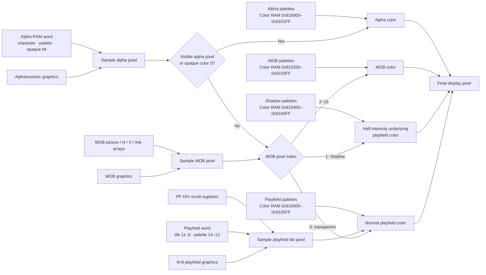

# Gauntlet II — Hardware Reference

*Software reverse engineering reference for the Gauntlet II arcade game hardware.*

---

## 1. CPU

**Confidence: Verified** from the board/software reference and ROM decoding.

- **Main CPU:** Motorola 68010 (32-bit, big-endian)
- **Sound CPU:** MOS 6502 (connected through command/response latches; protocol is software-defined)
- **Clock:** ~7.159 MHz (NTSC)
- **SLAPSTIC chip:** Performs bank switching for the level-data ROM (`row10.bin`), triggered by CPU accesses to special address sequences. **Confidence: Verified.**

---

## 2. Memory Map (Main CPU)

**Confidence: Verified** for populated ranges and hardware/RAM windows;
decoded-but-unpopulated ROM apertures are **Strong inference** as qualified
under the table.

### 2.1 Address Space Layout

| Region | Address Range | Size | Description |
|--------|--------------|------|-------------|
| **OS ROM** | `0x000000–0x00FFFF` | 64 KB | Bootstrap, OS, diagnostics, game support |
| **Unpopulated OS-ROM decode** | `0x010000–0x037FFF` | 160 KB | No supplied ROM bytes; included in MAME's schematic-verified ROM decode, not an OS mirror |
| **Slapstic ROM** | `0x038000–0x03FFFF` | 32 KB | Level data (bank-switched, 4 × 8 KB banks) |
| **Game ROM image** | `0x040000–0x05FFFF` | 128 KB | Populated `row76.bin` main-game image |
| **Unpopulated main-ROM decode** | `0x060000–0x07FFFF` | 128 KB | Decoded main-program ROM aperture with no bytes in this Gauntlet II set; not a mirror |
| **Main RAM** | `0x800000–0x801FFF` | 8 KB | General-purpose RAM |
| **EEPROM** | `0x802000–0x8023FF` | 1 KB CPU aperture | 28C04A, 4 Kbit (512 × 8); high scores, settings, and statistics occupy the low byte lane (odd byte addresses `0x802001–0x8023FF`) |
| **Hardware I/O** | `0x803000–0x8031FF` | 512 B | Input ports, watchdog, sound, LEDs |
| **Playfield RAM** | `0x900000–0x901FFF` | 8 KB | Playfield tile map |
| **MOB RAM** | `0x902000–0x903FFF` | 8 KB | Motion object (sprite) data |
| **Video RAM Spare** | `0x904000–0x904FFF` | 4 KB | Game + OS working variables |
| **Alpha RAM** | `0x905000–0x905FFF` | 4 KB | Alphanumeric character overlay |
| **Color RAM** | `0x910000–0x9107FF` | 2 KB | Color palettes |
| **PF H-Scroll** | `0x930000–0x930001` | 2 B | Playfield horizontal scroll register |
| **PF V-Scroll** | `0x905F6E–0x905F6F` | 2 B | Playfield vertical scroll register |

**Confidence: Verified** for the populated file ranges. The decoded ROM
apertures are **Strong inference** from Atari's
[hardware/OS memory map](https://arcarc.xmission.com/Web%20Archives/Andys%20Arcade%20%28Sep-09-2003%29/arc/atari/gauntlet/gauntlet_memos.pdf)
and MAME's explicitly
[schematic-verified address map](https://github.com/mamedev/mame/blob/master/src/mame/atari/gauntlet.cpp#L3083-L3096).
Both sources map the full `0x040000–0x07FFFF` main-ROM aperture, while this
set supplies bytes only through `0x05FFFF`; neither describes a mirror.
MAME also decodes `0x000000–0x037FFF` as ROM. Exact electrical
data returned by an empty socket is board-state dependent and is not modeled
as a separate device response.

### 2.2 Video RAM Sub-Regions

**Confidence: Verified** by the hardware map and game/OS access widths.

| Address Range | Description |
|---------------|-------------|
| `0x900000–0x901FFF` | Playfield RAM |
| `0x902000–0x9027FF` | MOB Picture (tile index) |
| `0x902800–0x902FFF` | MOB Horizontal Position |
| `0x903000–0x9037FF` | MOB Vertical Position |
| `0x903800–0x903FFF` | MOB Link |
| `0x904000–0x904FFF` | Video RAM Spare (OS + game variables) |
| `0x905000–0x905FFF` | Alphanumerics RAM |
| `0x910000–0x9101FF` | Color RAM — Alphanumeric |
| `0x910200–0x9103FF` | Color RAM — MOB |
| `0x910400–0x9104FF` | Color RAM — Playfield Shadow |
| `0x910500–0x9105FF` | Color RAM — Playfield |
| `0x910600–0x9107FF` | Color RAM — Spare |

---

## 3. Hardware I/O Ports

**Confidence: Verified** for the addresses, lanes, and read/write direction
from the OS/game access sites. Names describing higher-level latch purpose are
limited to behavior actually exercised by the software.

> **Note on input addressing:** The hardware data is at odd byte addresses (0x803001, 0x803003 etc.). The `input_debounce` routine (0x40644) reads these as 16-bit words from the corresponding even addresses (`0x803000 + player*2`), giving word-sized results where the meaningful data is in the low byte. Both addressing conventions refer to the same hardware.

| Address | R/W | Description |
|---------|-----|-------------|
| `0x803001` | R | Player 1 inputs (odd byte) |
| `0x803003` | R | Player 2 inputs (odd byte) |
| `0x803005` | R | Player 3 inputs (odd byte) |
| `0x803007` | R | Player 4 inputs (odd byte) |
| `0x803009` | R | VBLANK status / SoundIOFull / Self-test switch |
| `0x80300E` | R | Read from sound processor (OS ROM address) |
| `0x80300F` | R | Read from sound processor (game ROM address) |
| `0x803100` | W | Watchdog reset |
| `0x803120` | W | Hardware latch (bit 0 = LED/board enable) |
| `0x803121` | W | LED 1 |
| `0x803123` | W | LED 2 |
| `0x803125` | W | LED 3 |
| `0x803127` | W | LED 4 |
| `0x80312E` | W | Sound processor reset/control (OS ROM) |
| `0x80312F` | W | Sound processor reset/control (game ROM) |
| `0x803140` | W | VBLANK acknowledge |
| `0x803150` | W | EEPROM unlock |
| `0x803170–0x803171` | W | Sound-command latch, normally written as a word at the even base; the command byte is on the odd lane (`0x803171`) |
| `0x905F6E–0x905F6F` | W | Playfield vertical-scroll register (one 16-bit word; `0x905F6F` is its low byte) |

### 3.1 Status Register Bits (`0x803009`)

**Confidence: Verified.** Implementations at 0x41C8/0x41CC: both take a command
word, test SoundIOFull, and write that word to 0x803170. The bit assignments
below are verified from every `btst` site in the OS ROM: bits 3, 5, and 6 are
the only ones the software reads.

| Bit | Description |
|-----|-------------|
| 3 | Self-test switch, **active low** (0 = switch engaged, 1 = normal play) |
| 5 | Sound I/O full |
| 6 | VBLANK status (toggles each field) |

**Contradicted and corrected:** earlier revisions gave bit 3 as
"1 = self-test active" and listed a bit 0 "Player 1 start button (active low,
used for boot wait)". Both are wrong.

- Bit 3 is inverted. The boot dispatch at 0x9D8 of `row9.bin` starts the game
  at 0x40000 when bit 3 is *set* and enters the never-returning diagnostic
  loop when it is *clear*, so set is the ordinary running state. MAME's
  schematic-derived `gauntlet.cpp` agrees, declaring the service input as
  `PORT_SERVICE( 0x0008, IP_ACTIVE_LOW )`. `doc/02_os_rom.md` §5.7 lists all
  four dispatch sites.
- There is no bit 0 here. The OS ROM never tests bit 0 of `0x803009`; the
  boot-time acknowledge waits poll bit 0 of `0x803001`, which is the player 1
  Magic input (`doc/05_data_reference.md` §3.11), not a start button. MAME
  marks bits 0–2 of this port unused.

---

## 4. Display Overview

**Confidence: Verified** for dimensions, refresh, scroll registers, and layer
ordering.

- **Resolution:** 336×240, 60 Hz
- **Playfield (maze):** 512×512 pixels; only ~240×240 is visible at once
- **Scroll registers:** vertical at `0x905F6E`, horizontal at `0x930000`

The display hardware resolves one output pixel by testing the alpha and MOB
layers over the scrolled playfield. MOB pixel value 1 is not an ordinary
sprite color: it selects the half-intensity playfield-shadow palette for the
underlying playfield pixel.



### 4.1 Rendering Layers (bottom to top)

1. **Playfield** — the maze (walls, floor, doors, items)
2. **MOBs** (sprites) — players, monsters, shots, animations
3. **Alphanumeric** — text overlay (scores, messages); can be transparent or opaque per-character

### 4.2 Precise Layer Priority (highest to lowest)

1. Alphanumeric with opaque color 0 (bit 15 = 1)
2. Alphanumeric non-transparent pixels (color ≠ 0, or bit 15 = 1)
3. MOBs (non-transparent pixels, color index ≠ 0)
4. Playfield

---

## 5. Tiles

**Confidence: Verified** by the graphics-ROM exporter and rendered reference
corpus.

- Each tile is **8×8 pixels**, **4 bits per pixel** (16 colors per tile)
- Tile data is stored in graphics ROMs, split across 4 ROM chips (one per color bit plane: PLANE 0–3)
- Tile color indices index into palette RAM at `0x910000`

---

## 6. Palette / Color RAM (`0x910000`)

**Confidence: Verified** for entry format, region boundaries, and lookup
formulas. The analog phrase “actual output level” is a model of the intensity
and channel nibbles rather than a calibrated monitor voltage.

Each color entry is **2 bytes** (16-bit word): **4 bits each for I (Intensity), R, G, B**. In the simple nibble-product model, `I × channel` ranges from 0 to 225 before display/emulator scaling.

The 2 KB hardware window contains **1,024 color entries**. Entries 0–767 have assigned layer roles; entries 768–1023 are spare.

| Color Index Range | Type | Layout |
|-------------------|------|--------|
| 0–255 | Alphanumeric (text) | 2 banks × 16 palettes × 4 colors |
| 256–511 | MOBs (sprites) | 16 palettes × 16 colors |
| 512–639 | Playfield Shadow | 8 palettes × 16 colors |
| 640–767 | Playfield | 8 palettes × 16 colors |

> **Note:** The "Playfield Shadow" palette (512–639) mirrors the Playfield palette but at half intensity. Used when a MOB pixel has color index 1 (shadow behavior).

**To get RAM byte offset:** multiply color index by 2.

### 6.1 Color Index Formulas

| Layer | Formula |
|-------|---------|
| Alphanumeric | `(palette_bank × 128) + (palette_number × 4) + pixel_color` |
| MOB | `256 + (palette × 16) + pixel_color` |
| Playfield | `640 + (palette × 16) + pixel_color` |

### 6.2 Color RAM Sub-Regions (byte addresses)

| Byte Address | Entry Count | Type |
|---|---|---|
| `0x910000–0x9101FF` | 256 entries | Alphanumeric palettes |
| `0x910200–0x9103FF` | 256 entries | MOB palettes |
| `0x910400–0x9104FF` | 128 entries | Playfield Shadow palettes |
| `0x910500–0x9105FF` | 128 entries | Playfield palettes |
| `0x910600–0x9107FF` | 256 entries | Spare palette RAM |

---

## 7. Playfield RAM (`0x900000`)

**Confidence: Verified** for geometry, storage order, palette bits, and tile
index. **Confidence: Strong inference** that bit 15 is unused by shipped game
logic; no consumer assigning it a distinct playfield meaning was found.

Layout: **64×64 grid** of 16-bit words, stored **column-first**:
- Index = `column × 64 + row`

Each word:

| Bits | Meaning |
|------|---------|
| 15 | Horizontal flip field; no shipped Gauntlet use found (**Strong inference**) |
| 14–12 | Palette number (0–7, indexes into Playfield palettes starting at color 640) |
| 11–0 | Tile number (must be in first 4096 tiles) |

---

## 8. MOBs (Motion Objects / Sprites) — 1024 total

**Confidence: Verified** for the four hardware arrays, software state/link
overlay, pixel behavior, and shipped fixed-slot assignments.

Each MOB is described by 4 parallel arrays in video RAM. MOB `n` is at offset `n × 2` in each array.

Software maintains a fifth parallel software-only array at `0x904066`.

### 8.1 MOB Picture (`0x902000`)

| Bits | Meaning |
|------|---------|
| 14–0 | Tile number for **upper-left corner** of MOB |
| 15 | Not used by hardware; used as a **software flag** |

Tiles for a W×H MOB starting at tile T are laid out in row-major order:
```
T,   T+1,   ..., T+W-1
T+W, T+W+1, ..., T+2W-1
...
```

### 8.2 MOB Horizontal Position (`0x902800`)

| Bits | Meaning |
|------|---------|
| 15–6 | Horizontal position on playfield (0–511) |
| 5–4 | Software-only flags |
| 3–0 | Palette number (0–15, into MOB palettes at color index 256+) |

### 8.3 MOB Vertical Position (`0x903000`)

| Bits | Meaning |
|------|---------|
| 15–6 | Vertical position on playfield (0–511) |
| 5–3 | Horizontal size in tiles minus 1 (0 = 1 tile, 7 = 8 tiles) |
| 2–0 | Vertical size in tiles minus 1 (0 = 1 tile, 7 = 8 tiles) |

### 8.4 MOB Link (`0x903800`)

| Bits | Meaning |
|------|---------|
| 9–0 | MOB ID of next MOB in linked list (0 = end of list) |
| 15–10 | Software-only — **maze object type** (see Maze Object IDs enum in `05_data_reference.md`) |

- Linked list heads: 64 words at `0x905F80`, one per 8-pixel vertical band of the playfield
- Each band's list contains MOBs whose Y position falls in that scanline range
- Used by **software** for collision detection and by the motion-object
  hardware for display traversal. **Confidence: Verified** by MAME's
  [schematic-backed Gauntlet motion-object configuration](https://github.com/mamedev/mame/blob/master/src/mame/atari/gauntlet.cpp#L2668-L2707),
  which marks entries linked, selects the fourth word's 10-bit link field, and
  uses one 8-pixel SLIP head per band.

### 8.5 MOB Backward Link / Object State (`0x904066`, software only)

| Bits | Meaning |
|------|---------|
| 15–10 | Object-specific auxiliary state. For ordinary monsters: animation counter (15–13) and direction (12–10). Other slot types reuse these bits for player identity, door/forcefield variants, or movable-wall damage. |
| 9–0 | Back-link (previous MOB ID in depth-sorted chain), common to all uses |

### 8.6 MOB Pixel Special Cases

| Pixel color index | Behavior |
|-------------------|----------|
| 0 | **Transparent** — shows layer below |
| 1 | **Shadow** — subtracts 128 from the underlying playfield pixel |
| 2–15 | Normal — looks up color in MOB palette |

### 8.7 Fixed MOB ID Assignments

The first 30 MOB slots (IDs 0–29) are reserved:

| ID | Purpose |
|----|---------|
| 0 | Linked-list null terminator |
| 1–4 | Player shots (one per player) |
| 5–8 | Demon shots |
| 9–12 | Lobber shots |
| 13–16 | Shot explosion animations |
| 17–20 | Floating score popups |
| 21–24 | Player exit animations |
| 25–29 | Transporter animations |

Dynamic maze objects use slots 30–1023.

---

## 9. Alphanumeric (Text) RAM (`0x905000`)

**Confidence: Verified** for geometry, word fields, character-ROM layout, and
the opaque-space blanking behavior.

- Screen grid: **64×30 characters** (only left 42 columns are displayed)
- 1 word per character, 128 bytes per row (64 words)

Each word:

| Bits | Meaning |
|------|---------|
| 15 | **Opaque flag** — if 1, color 0 is solid; if 0, color 0 is transparent |
| 14 | Palette bank (extra palette select bit) |
| 13–10 | Palette number (0–15) |
| 9–0 | Character number (0–1023) |

Character pixel data is stored in a dedicated ROM, not accessible by the main CPU. Each scanline of a character is 2 bytes, deinterlaced into 2 bitplanes:
```
Raw bytes:   byte1=ABCDabcd  byte2=EFGHefgh
Bitplane 0:  abcdefgh
Bitplane 1:  ABCDEFGH
```

> The "black screen" between levels is the text layer filled with **opaque space characters**, not a disabled playfield.

### 9.1 Display Modes

**Confidence: Verified** from the OS address calculation and the game-mode
selection path.

The OS ROM supports two alpha overlay modes (controlled by `ram.display_mode` at `0x904F0E`):

| Mode | Description |
|------|-------------|
| 0 (standard) | 42 columns × 30 rows, sequential row-major addressing |
| 1 (Gauntlet scrolling) | Column-major addressing (128 bytes per column), enables smooth horizontal scrolling of the text overlay. Set when a Gauntlet game ROM is detected. |

---

## 10. Scroll Registers

**Confidence: Verified** from direct game/OS accesses. The vertical register
overlays the last alpha-RAM word by hardware design.

| Address | Description |
|---------|-------------|
| `0x905F6E` | Playfield vertical scroll (word) |
| `0x930000` | Playfield horizontal scroll (word) |

Shadow copies maintained in RAM by the OS VBLANK handler:
- `0x904006` = `pf_vscroll_hi`
- `0x90400A` = `pf_vscroll_lo`
- `0x904008` = `pf_hscroll`

---

## 11. Software Notes

- The **SLAPSTIC chip** performs bank switching for the level-data ROM (`row10.bin`). Bank switching is triggered by the CPU performing a specific read-write sequence to special addresses in the 0x38000–0x3FFFF range. Three slapstic helper functions at 0x56E58, 0x56E6E, and 0x56E84 manage this. **Confidence: Verified.**
- **Verified:** the **6502 sound CPU** interface is software-managed: the game
  writes command bytes to `0x803171`, reads responses from `0x80300F` (or the
  OS lane at `0x80300E`), and the OS maintains send/receive queues.
- **Verified:** the **28C04A EEPROM** stores 4 Kbit (512 bytes). It is decoded
  across the 1 KB CPU aperture `0x802000–0x8023FF`, with its 512 data bytes on
  the low byte lane at odd addresses `0x802001–0x8023FF`. Writes use the
  `0x803150` unlock, and the OS queues one byte per VBLANK with XOR checksums
  and retry logic.
