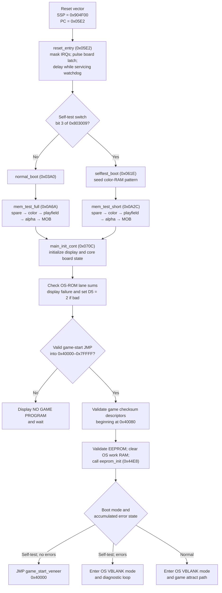
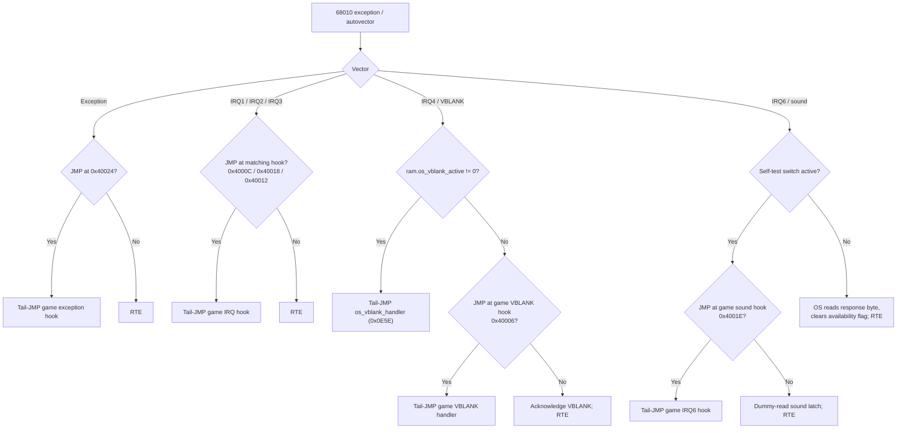
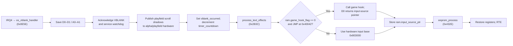
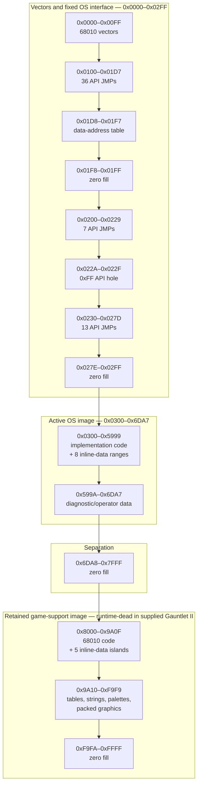
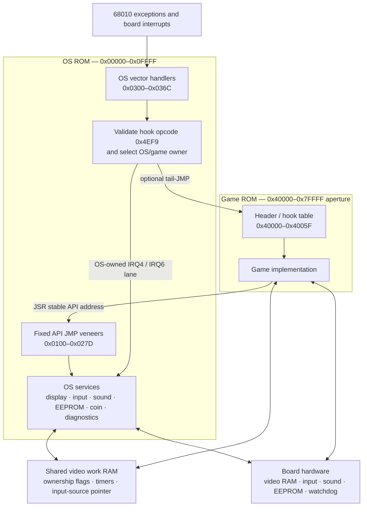

# Gauntlet II — OS ROM Analysis (row9.bin)

*Comprehensive reverse engineering analysis of the 64 KB OS ROM mapped at `0x000000–0x00FFFF`.*

---

## 1. Overview

**Confidence: Verified** for vector values, ROM size, initial state, and the
service categories directly exercised by the game ROM.

The OS ROM provides:
- Complete hardware bootstrap (memory tests, ROM checksum validation)
- Diagnostic/self-test mode
- OS services via a fixed API jump table (interrupt dispatch, video, input, EEPROM, sound, coin handling)
- Persistent high-score/statistics/configuration services and operator UI
- A separately linked, runtime-dead game-support payload retained at 0x8000

**Key Facts:**
- CPU: Motorola 68010
- ROM size: 65,536 bytes
- Initial SSP: `0x00904F00` (Video RAM Spare area)
- Initial PC: `0x000005E2` (`reset_entry`)
- Game ROM at: `0x040000–0x07FFFF`

---

## 2. M68010 Vector Table (`0x000000–0x0000FF`)

**Confidence: Verified** by byte-exact vector decoding.

| Offset | Vector | Value | Target |
|--------|--------|-------|--------|
| `0x000` | Initial SSP | `0x00904F00` | Stack in Video RAM Spare |
| `0x004` | Initial PC | `0x000005E2` | `reset_entry` |
| `0x008` | Bus Error | `0x00000300` | `exception_handler` |
| `0x00C` | Address Error | `0x00000300` | `exception_handler` |
| `0x010` | Illegal Instruction | `0x00000300` | `exception_handler` |
| `0x014` | Divide by Zero | `0x00000300` | `exception_handler` |
| `...` | (Other exceptions) | `0x00000300` | `exception_handler` |
| `0x064` | Autovector Level 1 | `0x00000314` | `irq1_handler` |
| `0x068` | Autovector Level 2 | `0x00000326` | `irq2_handler` |
| `0x06C` | Autovector Level 3 | `0x00000338` | `irq3_handler` |
| `0x070` | Autovector Level 4 | `0x0000034A` | `irq4_vblank_handler` |
| `0x078` | Autovector Level 6 | `0x0000036C` | `irq6_handler` |

---

## 3. OS API Jump Table

**Confidence: Verified** for every entry address and JMP destination.
Function names/categories are **Strong inference** from implementation and
game callers except where a detailed contract below is explicitly Verified.

The jump table at `0x100` is the OS API entry point. It consists of `JMP <absolute>.l` instructions (6 bytes each). Game code calls through these fixed addresses to access OS services, allowing the OS implementation to be relocated without changing the game ROM.

### 3.1 Jump Table Entries (`0x100–0x1D7`)

| Address | Target | Function Name | Category |
|---------|--------|---------------|----------|
| `0x100` | `0x3162` | `start_blink_text` | Text Effects |
| `0x106` | `0x2ABE` | `format_decimal` | Number Formatting |
| `0x10C` | `0x2A5E` | `format_hex` | Number Formatting |
| `0x112` | `0x2918` | `format_number` | Number Formatting |
| `0x118` | `0x30F4` | `stop_text_effect` | Text Effects |
| `0x11E` | `0x3156` | `start_progressive_text_clear` | Text Effects |
| `0x124` | `0x3122` | `start_text_line_rotation` | Text Effects |
| `0x12A` | `0x3168` | `start_timed_text` | Text Effects |
| `0x130` | `0x316C` | `start_progressive_text` | Text Effects |
| `0x136` | `0x3130` | `init_fullscreen_text_scroll` | Text Effects |
| `0x13C` | `0x35B2` | `set_text_position` | Text Display |
| `0x142` | `0x2E36` | `display_text` | Text Display |
| `0x148` | `0x2B3C` | `process_text_effects` | Text Effects |
| `0x14E` | `0x3522` | `init_alpha_display` | Alpha Display |
| `0x154` | `0x359A` | `wait_vblanks` | Timing |
| `0x15A` | `0x41FA` | `process_sound` | Sound |
| `0x160` | `0x3740` | `calc_health_per_coin` | Coin/Credit |
| `0x166` | `0x37C2` | `check_and_deduct_coin` | Coin/Credit |
| `0x16C` | `0x35C4` | `process_coins` | Coin/Credit |
| `0x172` | `0x4184` | `send_sound_command` | Sound |
| `0x178` | `0x42C8` | `read_sound_data` | Sound |
| `0x17E` | `0x427A` | `sound_receive_irq_body` | Sound IRQ |
| `0x184` | `0x4802` | `eeprom_check_busy` | EEPROM |
| `0x18A` | `0x432E` | `eeprom_process` | EEPROM |
| `0x190` | `0x44E8` | `eeprom_init` | EEPROM |
| `0x196` | `0x47A8` | `eeprom_request_write` | EEPROM |
| `0x19C` | `0x4038` | `record_player_session_histogram` | Statistics |
| `0x1A2` | `0x3860` | `read_eeprom_setting` | Config |
| `0x1A8` | `0x38C0` | `read_game_config` | Config |
| `0x1AE` | `0x39B0` | `read_high_score_entry` | High Scores |
| `0x1B4` | `0x3A7E` | `write_high_score_entry` | High Scores |
| `0x1BA` | `0x3BE8` | `update_active_player_time_stats` | Statistics |
| `0x1C0` | `0x3CF6` | `write_eeprom_setting` | Config |
| `0x1C6` | `0x3F68` | `rank_high_score` | High Scores |
| `0x1CC` | `0x401A` | `activate_player_time_tracking` | Statistics |
| `0x1D2` | `0x5454` | `run_statistics_screens` | Statistics |

### 3.2 Data Address Table (`0x1D8–0x1F7`)

| Offset | Value | Points To |
|--------|-------|-----------|
| `0x1D8` | `0x00904006` | `ram.pf_vscroll_hi` |
| `0x1DC` | `0x00904008` | `ram.pf_hscroll` |
| `0x1E0` | `0x00904F8A` | `ram.input_source_ptr` |
| `0x1E4` | `0x00904004` | `ram.vblank_occurred` |
| `0x1E8` | `0x0090400C` | `ram.timer_countdown` |
| `0x1EC` | `0x0080300E` | `hw.sound_read` |
| `0x1F0` | `0x00803170` | `hw.sound_command_word` |
| `0x1F4` | `0x0090400A` | `ram.pf_vscroll_lo` |

### 3.3 Jump Table Entries (`0x200–0x278`)

**Confidence: Verified.** This block contains 20 JMP entries with one
intentional six-byte 0xFF-filled hole at `0x22A–0x22F`. The entries are
`0x200–0x224` and `0x230–0x278`, each on a six-byte stride; `0x22A` is
unused and might point to actual code in other Atari arcade titles.

| Address | Target | Function Name | Category |
|---------|--------|---------------|----------|
| `0x200` | `0x31D2` | `display_large_text` | Large Characters |
| `0x206` | `0x3346` | `clear_large_text` | Large Characters |
| `0x20C` | `0x32BC` | `display_large_char_at` | Large Characters |
| `0x212` | `0x32A0` | `display_large_char_raw` | Large Characters |
| `0x218` | `0x3044` | `write_alpha_char` | Alpha Display |
| `0x21E` | `0x3586` | `write_alpha_word` | Alpha Display |
| `0x224` | `0x2CE4` | `calc_alpha_address` | Alpha Display |
| `0x230` | `0x3804` | `check_and_deduct_credits` | Coin/Credit |
| `0x236` | `0x3706` | `get_coin_multiplier` | Coin/Credit |
| `0x23C` | `0x41C8` | `send_sound_command_wait` | Sound |
| `0x242` | `0x41CC` | `try_send_sound_command` | Sound |
| `0x248` | `0x58C6` | `run_game_options` | Operator Options |
| `0x24E` | `0x4822` | `eeprom_read_block` | EEPROM |
| `0x254` | `0x42F8` | `reset_sound_cpu` | Sound |
| `0x25A` | `0x2F04` | `draw_string` | Text Display |
| `0x260` | `0x2EB4` | `display_decimal_value` | Text Display |
| `0x266` | `0x2EEA` | `display_hex_value` | Text Display |
| `0x26C` | `0x332A` | `display_large_text_at` | Large Characters |
| `0x272` | `0x32DA` | `display_large_decimal_value` | Large Characters |
| `0x278` | `0x3310` | `display_large_hex_value` | Large Characters |

---

## 4. Game ROM Header and Hook Tables (`0x40000–0x4013F`)

**Confidence: Verified** for bytes, ranges, OS consumers, and active JMP
targets. Rows explicitly described as unreferenced remain **Unknown** in
original build-time purpose and are unresolvable from the supplied runtime
artifacts; their bytes, boundaries, and lack of runtime consumers are
Verified, and no meaning is inferred from their values.

| Address | Size | Name | Description |
|---------|------|------|-------------|
| `0x40000` | 6 B | `game_start_veneer` | JMP to game entry point (must be `0x4EF9` + address) |
| `0x40006` | 6 B | `game_vblank_veneer` | JMP to game VBLANK handler |
| `0x4000C` | 6 B | `game_irq1_watchdog_trap` | Self-JMP trap; leaves the watchdog unserviced |
| `0x40012` | 6 B | `game_irq3_watchdog_trap` | Self-JMP trap; leaves the watchdog unserviced |
| `0x40018` | 6 B | `game_irq2_watchdog_trap` | Self-JMP trap; leaves the watchdog unserviced |
| `0x4001E` | 6 B | `game_irq6_sound_veneer` | JMP through OS API 0x17E to the sound receive IRQ body |
| `0x40024` | 6 B | `game_exception_veneer` | JMP to `game_exception_abort` at 0x40140 |
| `0x4002A` | 6 B | `game_startup_hook2_slot` | Optional post coin/text-display initialization hook tested by the OS. All six bytes are zero in Gauntlet II, so the OS skips it. |
| `0x40030` | 6 B | `game_playfield_init_veneer` | Optional game playfield-initialization hook. `os_selftest_loop` verifies the slot begins with JMP, then calls it indirectly through A0; Gauntlet II targets 0x44A82. If absent, the OS clears 0x1000 playfield words itself. |
| `0x40036` | 6 B | `game_startup_hook1_slot` | Optional post-attract-display initialization hook; zero-filled and therefore skipped in Gauntlet II. |
| `0x4003C` | 6 B | `game_startup_hook3_slot` | Optional post-palette initialization hook; zero-filled and therefore skipped in Gauntlet II. |
| `0x40042` | 6 B | `game_vblank_hook_slot` | Optional supplemental VBLANK hook. The OS calls it only when its first word is JMP opcode 0x4EF9; Gauntlet II ships six zero bytes here, so input remains handled by the ordinary OS/game VBL paths. |
| `0x40048` | 6 B | `game_options_veneer` | JMP to the game-specific options/configuration display at 0x5317C; the former `game_attract` name was **Contradicted** by the target body and descriptor strings. |
| `0x4004E` | 6 B | `game_post_attract_hook_slot` | Optional post-attract hook tested by the OS; zero-filled and skipped in Gauntlet II. |
| `0x40054` | 6 B | `game_rom_verify_veneer` | Optional JMP to the game-ROM/Slapstic verifier. Returns D0 with bit 16 set on success and two packed lane/bank check bytes in bits 15–8 and 7–0; Gauntlet II tail-jumps to `slapstic_verify` at 0x56EAA and returns 0x0001FFFE on success. |
| `0x4005A` | 6 B | `game_header_ff_pad_4005a` | Solid 0xFF padding between the final hook and scalar header values. |
| `0x40060` | 2 B | `game_mob_fill_value` | Default fill value for MOB RAM during display init. In Gauntlet: `0x0000`. |
| `0x40062` | 2 B | `game_pf_fill_value` | Playfield RAM fill value during startup. In Gauntlet: `0x0010` (background tile). |
| `0x40064` | 9 B | `game_reserved_header_40064` | Bytes `00 01 00 02 00 03 00 00 00`; no OS/game runtime consumer found. |
| `0x4006D` | 1 B | `game_eeprom_start` | EEPROM game-section start index. In Gauntlet: `0x01`. |
| `0x4006E` | 1 B | `game_reserved_header_4006e` | Zero reserved byte; no runtime consumer found. |
| `0x4006F` | 1 B | `game_difficulty` | Difficulty/config byte (masked to 0-7). In Gauntlet: `0x2C` (effective difficulty 4). |
| `0x40070` | 2 B | `game_default_settings` | Default 16-bit game-settings value copied into EEPROM configuration item 12 and used by the operator editor. In Gauntlet: `0xE090`. The former `game_screen_mode` identity is **Contradicted**. |
| `0x40072` | 1 B | `game_rom_type` | ROM type flag (non-zero = Gauntlet scrolling mode). In Gauntlet: `0x00`. |
| `0x40073` | 1 B | `game_reserved_header_40073` | Value 1; no runtime consumer found. |
| `0x40074` | 4 B | `game_button0_label_ptr` | Pointer to button 0 label string for self-test. |
| `0x40078` | 4 B | `game_button1_label_ptr` | Pointer to button 1 label string for self-test. |
| `0x4007C` | 4 B | `game_joystick_label_ptr` | Pointer to joystick label string for self-test. |
| `0x40080` | 24 B | `game_checksum_tbl` | One 16-byte descriptor `{start=0x40000, end=0x5FFFF, chunk_count=0x8000, enabled=1}`, followed by the 8-byte zero terminator. The OS reads start/end first and stops when the terminator's end is zero. |
| `0x40098` | 4 B | `game_header_zero_pad_40098` | Four zero bytes after the checksum-table terminator; no OS/game runtime consumer found. |
| `0x4009C` | 9 B | `game_copyright_morse_signature` | Bytes `AE D6 8C 17 FB 90 6A 33 80`. Reading the first 69 bits MSB-first with `0` as Morse dot and `1` as Morse dash decodes to `COPYRIGHT 1986 ATARI GAMES`; the low three bits of the final byte are zero padding. No runtime consumer exists. The decoded copyright statement is Verified; use as a deliberate anti-copy/code-trap signature is Strong inference from Atari's documented practice. |
| `0x400A5` | 57 B | `game_header_ff_pad` | Solid 0xFF fill ending at 0x400DD. |
| `0x400DE` | 6 B | `scroll_to_slot_veneer` | JMP to `scroll_to_slot` (0x46C5E). |
| `0x400E4` | 6 B | `init_display_veneer` | JMP to `init_display` (0x43486). |
| `0x400EA` | 6 B | `maze_setup_veneer` | JMP to `maze_setupnew` (0x44AC2). |
| `0x400F0` | 6 B | `pf_replace_veneer` | JMP to `pf_replace` (0x5F31E). |
| `0x400F6` | 6 B | `mob_clear_veneer` | JMP to `moblist_remove_and_clear` (0x5DDDA). |
| `0x400FC` | 6 B | `game_unreferenced_ram_value_pair` | Longword 0x00904894 followed by word 0x872E. No static OS/game consumer; retained as an unassigned header constant pair. |
| `0x40102` | 17 B | `game_joystick_label` | NUL-terminated “WARRIOR joystick”. |
| `0x40113` | 22 B | `game_fire_label` | NUL-terminated “WARRIOR <FIRE> button”. |
| `0x40129` | 23 B | `game_magic_label` | NUL-terminated “WARRIOR <MAGIC> button”; ends at 0x4013F immediately before game code. |

---

## 5. Boot Sequence

**Confidence: Verified** for control flow, hardware writes, test ranges, and
checksum comparisons. Higher-level intent labels such as “enable board” are
**Strong inference** from the write sequence and hardware reference.

The two boot paths differ mainly in the destructive RAM-test suite they use.
They rejoin at `main_init_cont`, which validates the ROMs and EEPROM before
selecting the game or OS-controlled diagnostic/attract path.



### 5.1 Reset Entry (`0x5E2`)

The 68010 loads SSP from `0x000000` (= `0x904F00`) and PC from `0x000004` (= `0x5E2`).

```
1. Set SR = 0x2700 (supervisor mode, all interrupts masked)
2. Write 0x0001 to hardware latch (0x803120) — enable board
3. Write 0x0000 to hardware latch — reset pulse
4. Delay loop (0xFA0 iterations) petting watchdog
5. Write 0x0001 to hardware latch — re-enable
6. Read self-test switch (bit 3 of 0x803009)
7. If self-test: JMP selftest_boot (0x61E)
8. Otherwise:    JMP normal_boot (0x3A0)
```

### 5.2 Normal Boot (`0x3A0`)

Performs the full extended destructive memory test on each video RAM region.
Uses `mem_test_full` (0xA6A), which runs both bit orders, restoration
passes, an all-ones fill, and a per-word inversion test. Test order:

```
1. Test Video RAM Spare     (0x904000–0x904FFE) → error: continue anyway
2. Test Color RAM           (0x910000–0x9107FE) → error: display "COLOR RAM error"
3. Test Playfield RAM       (0x900000–0x901FFE) → error: display "PLAYFIELD RAM error"
4. Test Alpha RAM           (0x905000–0x905FFE) → error: display "ALPHA RAM error"
5. Test MOB RAM             (0x902000–0x903FFE) → error: display "MOTION OBJ RAM error"
6. On success: JMP main_init_cont (0x70C)
```

### 5.3 Self-Test Boot (`0x61E`)

Uses the shorter `mem_test_short` (0xA2C) on the same RAM regions and also
initializes Color RAM with an incrementing pattern first. **Contradicted and
corrected:** the former `quick`/`thorough` names were reversed: 0xA2C is the
short three-stage test, while 0xA6A is the full extended suite used by normal
boot.

### 5.4 Main Init Continuation (`0x70C`)

```
1.  Clear d5 (error flag)
2.  Clear ram.os_flag (0x904000)
3.  Clear all Color RAM (0x910000–0x9107FE); set colors 1–3 to 0xF00F (white)
4.  Enable hardware latch
5.  Reset stack to 0x904F00
6.  Call init_alpha_display (0x3522) — clears alpha overlay
7.  ROM Checksum:
    - Two byte accumulators: d0 init=0, d1 init=1
    - Loop 0x8000 times, adding even-addressed bytes to d0, odd to d1
    - Both must equal 0xFF (even bytes sum to 0xFF, odd bytes sum to 0xFE)
    - On failure: call rom_checksum_display (0xCC0)
    - In self-test mode: continue regardless
8.  Check for valid game ROM:
    - 0x40000 must contain JMP instruction (0x4EF9)
    - Target address must be in range 0x40000–0x7FFFF
    - If invalid: display "NO GAME PROGRAM" and wait
9.  If valid game ROM: validate checksums from table at 0x40080
10. Validate EEPROM
11. Clear Video RAM Spare (0x904000–0x904FFB, 4092 bytes)
12. Call eeprom_init (0x44E8)
13. Dispatch:
    - Self-test + no errors: JMP game ROM start (0x40000)
    - Self-test + errors: JMP os_vblank_mode_entry → self-test
    - Normal mode: JMP os_vblank_mode_entry → game attract
```

> **Architectural note:** The OS ROM uses an unusual "continuation address in A4" pattern for memory tests during early boot. Instead of returning via `RTS`, test routines jump to `(A4)` pre-loaded with the continuation address. This is continuation-passing style used when the stack hasn't been validated yet.

### 5.5 Boot and diagnostic helper contracts

**Confidence: Verified** from each body, its caller/continuation load, and the
tested memory range. These entries were missing from the former 68-function
summary. “Inherited” entries are not ordinary calls: the memory tester or
error display jumps to the address held in A4/A6 while preserving the stated
register state.

| Address | Name | Inputs | Result | Exceptional convention and purpose |
|---:|---|---|---|---|
| `0x03B6` | `normal_boot_spare_test_done` | inherited `D4.w` test status | no ordinary return | A4 continuation; handles spare-RAM failure and starts the full color-RAM test |
| `0x03C4` | `normal_boot_spare_error_ack` | hardware switch/status state | no ordinary return | A4 continuation from `display_working_ram_error`; waits for acknowledgement and resumes at the color test |
| `0x0424` | `normal_boot_color_test_done` | inherited `D4.w` test status | no ordinary return | A4 continuation; reports color-RAM failure and starts the full playfield-RAM test |
| `0x04A4` | `normal_boot_playfield_test_done` | inherited `D4.w` test status | no ordinary return | A4 continuation; reports playfield failure and starts the full alpha-RAM test |
| `0x0512` | `normal_boot_alpha_test_done` | inherited `D4.w` test status | no ordinary return | A4 continuation; reports alpha failure and starts the full MOB-RAM test |
| `0x0582` | `normal_boot_mob_test_done` | inherited `D4.w` test status | no ordinary return | A4 continuation; reports MOB failure and jumps to `main_init_cont` |
| `0x0652` | `selftest_spare_test_done` | inherited `D4.w` test status | no ordinary return | A4 continuation; optionally displays the spare-RAM error and starts the short color test |
| `0x0660` | `selftest_spare_error_ack` | hardware status | no ordinary return | A4 continuation from the error display; resumes the short color test |
| `0x067C` | `selftest_color_test_done` | inherited `D4.w` test status | no ordinary return | reports color failure and starts the short playfield test |
| `0x06A6` | `selftest_playfield_test_done` | inherited `D4.w` test status | no ordinary return | reports playfield failure and starts the short alpha test |
| `0x06D0` | `selftest_alpha_test_done` | inherited `D4.w` test status | no ordinary return | reports alpha failure and starts the short MOB test |
| `0x06FC` | `selftest_mob_test_done` | inherited `D4.w` test status | no ordinary return | reports MOB failure and falls into `main_init_cont` |
| `0x08EC` | `boot_postcheck_dispatch` | `D5.w` boot/error mode | no return | shared branch target; performs the sound/EEPROM readiness handshakes, clears OS work RAM, initializes EEPROM, and tail-dispatches to the game, OS VBLANK mode, or game exception hook |
| `0x0D26` | `game_descriptor_ram_test` | `A0=start`, `A1=end` | returns through 0x0D3A | saves all registers, converts descriptor bounds to A1/A2, installs A4 continuation, and tail-enters `mem_test_short` |
| `0x0D3A` | `game_descriptor_ram_test_done` | inherited `D4.w` test status and saved frame in A5 | returns to 0x0D26 caller | A4 continuation; restores the saved register set and displays the failing address when nonzero |
| `0x0D7A` | `game_rom_checksum_error` | `D0.b`/`D1.b` checksum accumulators, `A0` current range end, inherited descriptor frame in A6 | sets `D5.w=2`; otherwise void | register/inherited-frame helper; identifies the failing ROM slice and displays the even/odd checksum errors |
| `0x0F04` | `playfield_add_word_test_range` | one normal longword slot, low word = signed/additive tile delta | void | frameless normal entry; adds the word to each of 4,095 tested playfield words |
| `0x11FC` | `color_test_palette_init` | void | void | initializes the first six color-RAM words to the fixed black/red/green/blue diagnostic palette |
| `0x1228` | `selftest_load_control_labels` | void | void | selects the game header's control-label strings or OS defaults and copies them into three OS work buffers through `copy_cstring` |
| `0x16F6` | `copy_cstring` | destination pointer, source pointer | void | frameless normal entry; copies through and including the terminating NUL |

### 5.6 Destructive RAM-test state machines

**Confidence: Verified** from the complete 0x0A2C–0x0C50 control flow. Both
testers take the inclusive word range in A1/A2 and a completion/failure
continuation in A4. They never use RTS: a failed comparison sets D4.w=1 and
jumps through A4 immediately; success reaches the final A6 stage with D4.w=0,
which also jumps through A4. A6 links the individual pattern stages below.
D6 counts completed stages and the inner workers pet the watchdog.

| Address | Entry | Stage |
|---:|---|---|
| `0x0A2C` | `mem_test_short` | Clear status, fill the range with zero, then run high-bit-first walking-one and walking-zero passes |
| `0x0A42` | `mem_test_short_walk_ones` | Schedule walking ones over zero base |
| `0x0A52` | `mem_test_short_walk_zeroes` | Schedule walking zeroes over 0xFFFF base |
| `0x0A62` | `mem_test_short_done` | Return D4 status through A4 |
| `0x0A6A` | `mem_test_full` | Start the full extended destructive suite used by normal boot |
| `0x0A7A` | `mem_test_full_walk_ones_highbit` | High-bit-first walking ones |
| `0x0A84` | `mem_test_full_walk_zeroes_highbit` | High-bit-first walking zeroes |
| `0x0A8E` | `mem_test_full_walk_ones_lowbit` | Low-bit-first walking ones |
| `0x0A98` | `mem_test_full_walk_zeroes_lowbit` | Low-bit-first walking zeroes |
| `0x0AA2` | `mem_test_full_restore_ones_highbit` | High-bit walking-one pass that restores the zero base |
| `0x0AAC` | `mem_test_full_restore_ones_lowbit` | Low-bit walking-one pass that restores the zero base |
| `0x0AB6` | `mem_test_full_fill_ones` | Fill the full range with 0xFFFF |
| `0x0AC2` | `mem_test_full_restore_zeroes_highbit` | High-bit walking-zero pass that restores 0xFFFF |
| `0x0ACC` | `mem_test_full_restore_zeroes_lowbit` | Low-bit walking-zero pass that restores 0xFFFF |
| `0x0AD6` | `mem_test_full_toggle_words` | For each word, verify inversion to 0 and back to 0xFFFF |
| `0x0AE0` | `mem_test_full_done` | Return D4 status through A4 |

The exact argument/return/exception rows are checked into
`generated/os_memory_test_contracts.csv`; its failure report is empty.

---

## 6. Interrupt System

**Confidence: Verified** for dispatch tests, hook addresses, register/memory
effects, and RTE/tail-JMP behavior.

Every hardware exception first enters the OS vector table. The OS either
handles it locally or validates the corresponding game-ROM hook by checking
for the absolute-JMP opcode `0x4EF9` before transferring ownership.



### 6.1 Architecture

All interrupt handlers follow the same pattern: check if the game ROM has installed a handler (by testing for a `JMP` instruction = opcode `0x4EF9` at the expected hook address), and if so dispatch to it. If no game handler is installed, return via `RTE`.

### 6.2 Exception Handler (`0x300`)

```c
if (*(uint16_t*)0x40024 == 0x4EF9) {
    d0 = 0;
    JMP 0x40024;  // dispatch to game exception handler
}
RTE;
```

### 6.3 IRQ1 Handler (`0x314`) — Hooks to game ROM at `0x4000C`

### 6.4 IRQ2 Handler (`0x326`) — Hooks to game ROM at `0x40018`

### 6.5 IRQ3 Handler (`0x338`) — Hooks to game ROM at `0x40012`

### 6.6 IRQ4 / VBLANK Handler (`0x34A`) — The most important interrupt

```c
if (ram.os_vblank_active != 0) {
    JMP os_vblank_handler;   // OS is in control
} else {
    // Game is in control
    if (*(uint16_t*)0x40006 == 0x4EF9) {
        JMP 0x40006;         // dispatch to game VBLANK handler
    }
    WRITE(hw.vblank_ack);
    RTE;
}
```

### 6.7 IRQ6 Handler (`0x36C`) — Sound processor communication

```c
if (bit3(hw.vblank_selftest)) {   // self-test switch active?
    if (*(uint16_t*)0x4001E == 0x4EF9) {
        JMP 0x4001E;              // dispatch to game IRQ6 handler
    }
    READ(0x80300E);               // dummy read to clear interrupt
    RTE;
} else {
    // OS handles sound data
    ram.sound_data_recv = READ(0x80300E);
    ram.sound_data_flag = 0;      // signal data available
    RTE;
}
```

---

## 7. OS VBLANK System

**Confidence: Verified** for the shown control flow and state updates.

When `ram.os_vblank_active` selects the OS lane, IRQ4 performs a compact
once-per-frame service pipeline. The interrupted code resumes only after all
steps below complete.



### 7.1 OS VBLANK Mode Entry (`0xE14`)

Called when the OS takes control (self-test, attract mode, etc.):

```c
ram.os_vblank_active = 1;  // tell IRQ4 to use OS handler
ram.pf_vscroll_hi = 0;
ram.pf_hscroll = 0;
ram.pf_vscroll_lo = 0;
ram.vblank_occurred = 0;
ram.os_flag = 0;
call 0x355C;               // clear text effect state
SR = 0x2000;               // enable all interrupts
push_long(sign_extend(d5));
call os_selftest_loop;     // repeats forever; supplied mode is not read
SR = 0x2700;               // encoded cleanup, no returning predecessor found
ram.os_vblank_active = 0;
JMP 0x8EC;
```

### 7.2 OS VBLANK Handler (`0xE5E`) — Called every VBLANK (60 Hz) when OS is in control

```c
PUSH d0-d1/a0-a1;
WRITE(hw.vblank_ack);
WRITE(hw.watchdog);

// Update scroll registers from shadow variables
scroll_v = (ram.pf_vscroll_hi << 7) | ram.pf_vscroll_lo;
WRITE(0x905F6E, scroll_v);
WRITE(0x930000, ram.pf_hscroll);

// Signal VBLANK to main loop
ram.vblank_occurred = 1;
ram.timer_countdown--;

// Process text scrolling effects
call process_text_effects;

// Input-source pointer
if (ram.game_hook_flag == 0) {
    if (*(uint16_t*)0x40042 == 0x4EF9) {
        d0 = call 0x40042;  // game supplies a pointer to four input words
    } else {
        d0 = (uint32_t*)0x803000;
    }
} else {
    d0 = (uint32_t*)0x803000;
}
ram.input_source_ptr = d0;

call eeprom_process;
POP d0-d1/a0-a1;
RTE;
```

**Contradicted and corrected:** 0x904F8A does not hold a four-byte input
snapshot. The instruction at 0x0ED6 is immediate mode (`203C 00803000`), so
the VBLANK handler stores the address 0x803000. When installed, the game hook
instead returns another source pointer in D0. `read_debounced_input` then
indexes four 16-bit input words through that pointer.

### 7.3 Core vector, boot, error-display, and VBLANK contracts

**Confidence: Verified** from each body, vector/control predecessor, register
effects, and byte prefix. These roots either use CPU-created frames or early
boot register continuations and therefore are not ordinary C calls.

| Address | Entry | Inputs | Result / exceptional convention |
|---:|---|---|---|
| `0x0300` | `exception_handler` | CPU exception frame | RTE when no game hook; otherwise clears D0.w and tail-jumps to 0x40024 |
| `0x0314` | `irq1_handler` | CPU interrupt frame | RTE or tail-jump to hook 0x4000C |
| `0x0326` | `irq2_handler` | CPU interrupt frame | RTE or tail-jump to hook 0x40018 |
| `0x0338` | `irq3_handler` | CPU interrupt frame | RTE or tail-jump to hook 0x40012 |
| `0x034A` | `irq4_vblank_handler` | CPU interrupt frame | tail-jumps to OS/game VBLANK handler, or acknowledges locally and RTE |
| `0x036C` | `irq6_handler` | CPU interrupt frame | tail-jumps to game sound hook or consumes/stores the OS-lane response and RTE |
| `0x03A0` | `normal_boot` | void | installs A4 and tail-enters the full RAM test; no return |
| `0x05E2` | `reset_entry` | reset-vector CPU state | tail-selects normal/self-test boot; no return |
| `0x061E` | `selftest_boot` | void | seeds color RAM, installs A4, and tail-enters the short RAM test |
| `0x070C` | `main_init_cont` | void | validates ROM/EEPROM, clears OS RAM, and tail-dispatches; no return |
| `0x0C52` | `display_working_ram_error` | A4 continuation | writes the fixed “Working RAM error” text, then JMP (A4) |
| `0x0C98` | `error_display_ram` | D4 error class, A0 address, D0 expected, D1 actual | register wrapper; displays details and returns void |
| `0x0CC0` | `rom_checksum_display` | D0.b even and D1.b odd accumulators | sets D5.w=2 and clobbers D2/D3/D5 before RTS |
| `0x0E14` | `os_vblank_mode_entry` | D5.w mode value | pushes the value, enables OS VBLANK, and enters `os_selftest_loop`; no return path reaches the encoded cleanup/tail jump |
| `0x0E5E` | `os_vblank_handler` | CPU interrupt frame | saves D0-D1/A0-A1 and returns with RTE |
| `0x2828` | `display_ram_error_detail` | error class, address, expected word, actual word | normal four-slot helper; void |

**Contradicted and corrected:** the former `error_display_string` name implied
a caller-supplied string. The body has no such input and always copies the
NUL-terminated literal at 0x0C86 to the diagnostic display destination at
0x906D00. It converts the 17 characters to opaque alpha words (space becomes
0x8000) and writes exactly 34 bytes at 0x906D00–0x906D21 before jumping
through A4. The destination lies outside the ordinary 0x905000–0x905FFF
alpha aperture; its use as the early-failure display alias is a **Strong
inference**, while the address, span, conversion, and continuation are
**Verified**. The complete rows are checked in `generated/os_core_contracts.csv`; its
failure report is empty.

---

## 8. Detailed OS Function Reference

**Confidence: Verified** for addresses and observable effects unless a
subsection says otherwise. Concise purpose names and semantic parameter labels
are **Strong inference** from the bodies and their Gauntlet II callers.

### 8.0 Normal OS calling convention

**Confidence: Verified** from compiled callers and callees. Ordinary OS C
routines use the same convention documented for the game ROM in
`03_game_rom_structure.md` §3: arguments are pushed right-to-left in 32-bit
slots, the caller removes them, D0 carries scalar/pointer returns, D0-D1/A0-A1
are caller-saved, D2-D7/A2-A5 are callee-saved, and A6 is the frame pointer
when a frame is needed. A blank exceptional-convention field in the eventual
OS contract catalog will mean this normal convention.

Exceptions must be recorded per entry. The reset and interrupt roots consume
CPU-created state and do not have ordinary callers; IRQ bodies return with
`RTE`; API slots are absolute-JMP veneers; early memory tests receive bounds in
A1/A2 and a continuation in A4; several inner display/self-test helpers are
called through fixed address registers or enter shared bodies without a new
frame.

### 8.1 Number Formatting

#### `format_decimal` (`0x2ABE`, API `0x106`)
Converts a 32-bit unsigned integer to decimal ASCII string.

**Arguments:** `(value, buffer pointer, field width, padding mode)`. Padding
mode zero emits leading zeroes; nonzero emits leading spaces. Divides by 10
repeatedly, builds the NUL-terminated field right-to-left, and handles values
above 99,999 by splitting the division.

#### `format_hex` (`0x2A5E`, API `0x10C`)
Converts a 32-bit value to hexadecimal ASCII string.

**Arguments:** `(value, buffer pointer, field width, padding mode)`. Output is
always uppercase hexadecimal; padding mode zero emits zeroes and nonzero emits
spaces. **Contradicted and corrected:** the fourth argument is not an
uppercase selector.

#### `format_number` (`0x2918`, API `0x112`)
General-purpose formatter with `(value, destination buffer, format byte,
format mode, field width)`. Format bytes `'d'` and `'s'` select unsigned and
signed decimal; `'X'`, `'x'`, and `'h'` select hexadecimal; `'o'` selects
octal; other values take the binary path. The mode controls zero/space and
separator post-processing.

### 8.2 Text Display

#### `display_text` (`0x2E36`, API `0x142`)
Primary text display function. Displays a string at a position on the alpha overlay with scroll effect support.

**Stack:** `+0x04`: text descriptor pointer; `+0x0A`: color/attribute word.

Text descriptor struct:
```c
struct text_desc {
    uint8_t  row;         // Y position (0-29)
    uint8_t  col;         // X position (0-41)
    uint32_t string_ptr;  // pointer to null-terminated ASCII string
    uint8_t  repeat;      // continuation count
    uint32_t next_ptr;    // pointer to next descriptor (for chaining)
};
```

In scrolled mode (Gauntlet-specific): row is inverted (`41 - col`) and multiplied by 128 for column-major addressing.

#### `draw_string` (`0x2F04`, API `0x25A`)
Draws ASCII string directly to alpha RAM at row/column.

**Stack:** `+0x07`: row (byte); `+0x0B`: col (byte); `+0x0C`: string pointer; `+0x12`: color/style word (bits 0–1 select character style: 0=normal, 1=uppercase-shifted, 2=lowercase-shifted).  
**Returns:** D0 = source bytes consumed, including the terminating NUL. Thus
an empty string returns 1 and an N-character string returns N+1.

#### `display_decimal_value` (`0x2EB4`, API `0x260`)
Takes `(coordinate0, coordinate1, value, field width, padding mode,
color/style)`, builds a temporary text descriptor, formats decimal, and calls
`display_text`. It is not a `(descriptor, color)` wrapper.

#### `display_hex_value` (`0x2EEA`, API `0x266`)
The same six-argument wrapper for uppercase hexadecimal values.

#### `write_alpha_char` (`0x3044`, API `0x218`)
Writes a single character to alpha overlay at a given position.

**Stack:** `+0x07`: row; `+0x0B`: col; `+0x0E`: character value (word); `+0x12`: color/style.

#### `calc_alpha_address` (`0x2CE4`, API `0x224`)
Calculates the linear address in alpha RAM for row/column.

**Returns:** D0 = absolute address (0x905000 + offset).

### 8.3 Alpha Display Management

#### `init_alpha_display` (`0x3522`, API `0x14E`)
Initializes the alpha overlay. Detects Gauntlet game ROM (checks `0x40072`), sets `ram.display_mode` (1 = Gauntlet scrolling, 0 = standard), clears all alpha RAM.

#### `write_alpha_word` (`0x3586`, API `0x21E`)
Writes a raw 16-bit value to alpha RAM at a given offset.

### 8.4 Text Scroll/Effect System

The OS supports four simultaneous text-effect slots beginning at `0x904F18`.
**Contradicted and corrected:** the former effect names and the documented
`speed,color` argument order did not match the dispatcher. The implementation
stores argument 2 as the color/style word and argument 3 as the interval. The
six-word signed-offset table at 0x2C16 selects these exact inherited-frame
cases:

| Type | Dispatch | Verified behavior |
|---:|---:|---|
| 1 | `0x2C22` | After the interval, deactivate the slot and clear the complete descriptor chain. The allocator draws it immediately, making this timed text. |
| 2 | `0x2C32` | Toggle the complete chain between drawn and cleared states: blinking text. |
| 3 | `0x2C64` | Draw one indexed character per interval, advancing to chained descriptors at NUL. |
| 4 | `0x2C82` | Clear one indexed character position per interval, advancing at NUL. |
| 5 | `0x2CC4` | Cyclically rotate each descriptor-selected alpha line in one direction. |
| 6 | `0x2CD0` | Cyclically rotate those lines in the opposite direction. |
| 7 | separate path at `0x2B54` | Shift the complete visible alpha surface and advance the global scroll offset. |

All three-argument starters below use `(descriptor pointer, color/style word,
interval word)` and return `D0.l=1` when one of four slots was allocated or 0
when all slots were occupied:

- `start_blink_text` (`0x3162`, API `0x100`) allocates type 2.
- `start_timed_text` (`0x3168`, API `0x12A`) allocates type 1.
- `start_progressive_text` (`0x316C`, API `0x130`) allocates type 3.
- `start_text_line_rotation` (`0x3122`, API `0x124`) allocates type 6 for a
  nonnegative interval and type 5 for a negative interval, using its absolute
  value as the stored interval.
- `init_fullscreen_text_scroll` (`0x3130`, API `0x136`) allocates type 7,
  clears the global scroll offset, and stores the interval and allocation
  result in the global full-screen state.

`start_progressive_text_clear` (`0x3156`, API `0x11E`) is the exception: it
takes `(descriptor pointer, interval word)`, forces the stored color to zero,
and allocates type 4 with the same 1/0 result.

#### `stop_text_effect` (`0x30F4`, API `0x118`)
Stops and clears a text effect slot by descriptor pointer.

#### `process_text_effects` (`0x2B3C`, API `0x148`)
**Called every VBLANK.** Processes all 4 text effect slots. Each slot has type, speed counter, phase counter, and text descriptor pointer.

The shared `allocate_text_effect` entry at 0x3172 takes the type in D0.b and
interval in D1.w while inheriting the normal descriptor/color stack slots. It
initializes the slot counters and descriptor pointer; types other than 3 and 4
also draw the descriptor immediately.

The newly bounded internal helpers are `rotate_text_line_forward`/`reverse`
(0x2D14/0x2D74 normal stack veneers, 0x2D18/0x2D78 A0 register bodies),
`scroll_alpha_surface_one_step` (0x2DDE), `display_text_register` (0x2E3E),
`draw_string_register` (0x2F3C), the type-3/type-4 single-character workers
at 0x2FBE/0x3020, the shared character writer at 0x304E, the A0 descriptor
clearer at 0x308C, the allocator at 0x3172, the large-glyph register renderer
at 0x324E, and `reset_text_effects` at 0x355C. Purpose, arguments, return, and
exceptional-convention rows for all of them and the six computed cases are in
`generated/os_text_contracts.csv`; its failure report is empty.

### 8.5 Large Character Display

Used for title screens, attract mode, and score displays. Renders characters using 2×2 or larger tile patterns.

#### `display_large_text` (`0x31D2`, API `0x200`)
Displays a string using large (multi-tile) characters on the alpha overlay. Looks up each character in the large character font table at PC-relative offset `0x34A2`, renders 2×2 tile blocks.

**Returns:** D0 = total alpha-cell advance. Each mapped glyph contributes one
or two cells; this is not a pixel count.

The `movea.l 0x00800002,A0` instructions in this renderer family load a
packed pair of strides, not a hardware pointer: 0x0080 is the 128-byte alpha
row stride and 0x0002 is the word-cell stride. This immediate is tracked
separately from the RAM/hardware operand inventory. **Confidence: Verified.**

#### `display_large_char_raw` (`0x32A0`, API `0x212`)
Renders one mapped glyph with the rotated-display strides. Arguments are
`(alpha destination pointer, glyph index, color/style)`; D0 returns an advance
of one or two alpha cells.

#### `display_large_char_at` (`0x32BC`, API `0x20C`)
The corresponding standard-display-stride entry with the same arguments and
one-or-two-cell D0 return.

`display_large_decimal_value` (0x32DA, API 0x272) takes the same six arguments
as `display_decimal_value`, renders through the mapped large font, and returns
the total alpha-cell advance in D0.l.

`display_large_hex_value` (0x3310, API 0x278) has the same six-slot ABI and
return, calls `format_hex`, then shares the decimal wrapper's display tail at
0x32F2. `display_large_text_at` (0x332A, API 0x26C) takes
`(coordinate0, coordinate1, string pointer, color/style)`, overlays those
slots as a temporary descriptor, and returns the total alpha-cell advance.
`clear_large_text` (0x3346, API 0x206) takes a descriptor pointer, maps each
character to its one- or two-cell large-glyph width, clears both tile rows,
follows descriptor chaining, and returns the cleared span for the final
descriptor.

**Contradicted and corrected:** the legacy `large_char_render`,
`large_char_lookup`, and `display_large_char_styled` labels obscured a
hex-format wrapper, a coordinate/string wrapper, and a clear operation. The
expanded 16-row numeric/direct-display contract report verifies all three.

### 8.6 VBLANK Synchronization

#### `wait_vblanks` (`0x359A`, API `0x154`)
Waits for N VBLANK interrupts. It watches `vblank_sync` at 0x904F04, which
`process_text_effects` increments once per OS VBLANK. **Contradicted and
corrected:** it does not watch the distinct `vblank_occurred` semaphore at
0x904004.

**Stack:** `+0x06`: count (word).

```c
while (count-- > 0) {
    while (ram.vblank_sync == old_value) { }  // spin-wait
}
```

`write_alpha_word` (0x3586, API 0x21E) takes `(cell index, value word)` and
writes to `0x905000 + 2*index`. `set_text_position` (0x35B2, API 0x13C) takes
`(descriptor pointer, coordinate0, coordinate1)`, writes the first two
descriptor bytes, and clears its byte-6 repeat field. The checked 13-row
numeric/direct-display batch is `generated/os_numeric_display_contracts.csv`; its
failure report is empty.

### 8.7 Sound System

#### `send_sound_command` (`0x4184`, API `0x172`)
Sends a sound command to the sound processor.

**Arguments:** `(sound command word, response destination pointer, response
byte count word)`.

1. Save SR, set interrupt level to 5 (mask sound IRQ)
2. Check if sound I/O is full (bit 5 of `0x803009`)
3. Require that no direct response destination is already active
4. If available, write the command to `0x803170` and store destination/count
5. Return 1 on success, 0 on failure

The wrapper packs count in D0's high word and command in its low word, loads
A0 with the destination and A1 with 0x904F8E, then enters the shared
`send_sound_command_register` body at 0x4198. **Contradicted and corrected:**
the pointer is a byte destination advanced by IRQ6, not a callback function.

#### `process_sound` (`0x41FA`, API `0x15A`)
Called once per game VBLANK. It advances the sound-status/coin handshake,
calls `eeprom_process`, and submits command 3 with a one-byte response directed
to the status byte at 0x904F8E whenever the direct-response channel is free.
It has no arguments or scalar return.

#### `read_sound_data` (`0x42C8`, API `0x178`)
Reads the next byte from the sound data receive buffer. Circular buffer (15 entries) at `0x904F98+`. Read pointer at `0x904F91`, write pointer at `0x904F92`.

**Returns:** D0.l = received byte, or -1 if empty.

#### `sound_receive_irq_body` (`0x427A`, API `0x17E`)

**Confidence: Verified.** This is an interrupt-only receive path, not a
sound-command sender. It saves D0/A0/A1, chooses either the installed direct
destination or the next byte in the 15-entry receive ring, reads one byte from
`0x80300F` into that destination, restores registers, and exits with `RTE`.
It takes an existing interrupt frame and has no ordinary return value. The
game IRQ6 veneer tail-jumps here through API 0x17E. The former
`send_sound_immediate` identity is **Contradicted**.

#### `reset_sound_cpu` (`0x42F8`, API `0x254`)
Takes `(sound control word, startup command word)`. It clears bit 0 of the
control word and writes 0x80312E to assert reset, drains the receive latch,
writes the startup command to 0x803170, sets bit 0, clears polling/direct-
response state at 0x904F90–0x904F97, and releases reset. **Contradicted and
corrected:** this is not a zero-argument API, even though Gauntlet II's caller
passes zero for both slots.

The complete eight-entry sound contract batch includes the stack wrapper and
0x4198 register body, both blocking/nonblocking latch veneers, polling,
interrupt receive, ring read, and reset. `generated/os_sound_contracts.csv` passes with
zero failures.

### 8.8 Sound-Latch Submission

#### `send_sound_command_wait` (`0x41C8`, API `0x23C`)

**Confidence: Verified.** Takes a sound-command word at stack offset +6,
temporarily raises the interrupt mask, and retries while SoundIOFull is set.
Once the latch is available it writes the command to `0x803170` and returns
1. The former `disable_interrupts` name was contradicted by the body.

#### `try_send_sound_command` (`0x41CC`, API `0x242`)

**Confidence: Verified.** Has the same command-word input and hardware write,
but makes one attempt: `D0.l = 1` when accepted and `D0.l = 0` when the sound
latch is busy. The former `enable_interrupts` name was contradicted by both
the body and the game-ROM callers.

### 8.9 EEPROM Management

**Confidence: Verified.** The EEPROM system stores each logical ten-byte
record as a thirty-byte physical block with five interleaved XOR syndromes.
It can correct a single encoded data-bit syndrome while loading, identifies
uncorrectable syndromes by a negative status, queues logical-region writes in
a 32-bit bitmap, and serializes physical byte writes and verification from
VBLANK. The eleven-entry `generated/os_eeprom_contracts.csv` batch covers both public
services and every promoted register/shared helper with zero failures.

#### `eeprom_init` (`0x44E8`, API `0x190`)

**Confidence: Verified.** Validates that the game start slot at `0x40000` is
an even in-range absolute jump, then reserves `0xE6 + 20 *
(game_difficulty & 7)` bytes on the caller's stack and publishes that persistent
configuration image through `ram.eeprom_config_ptr`. This is an intentional
nonstandard allocation: it removes the return address, moves SP down by the
image size, stores the new SP, and pushes the return address again.

It decodes redundant EEPROM records, copies the usable redundant copy when
only one copy fails, corrects single-bit syndromes in the RAM image, resets
unrecoverable configuration/statistics groups, and queues every repaired
logical region. It returns `D0.l = 0` after successful initialization,
`D0.l = 1` when the game-start header is invalid, and `D0.l = -1` on its
terminal initialization/error-state exit.

#### `eeprom_process` (`0x432E`, API `0x18A`)

**Confidence: Verified.** Called every VBLANK. It increments
`ram.vblank_counter`, then advances at most one active write/verify step or
dequeues one asynchronous read. A logical ten-byte source is expanded into
the thirty-byte physical layout, including its five XOR check bytes. Each
byte is verified and retried up to four times; exhausted mismatches increment
the saturating EEPROM error counter at `0x904FC0`.

EEPROM write sequence:
```c
saved_sr = SR;
SR |= 0x0700;              // disable all interrupts
WRITE(hw.eeprom_unlock);   // unlock EEPROM (0x803150)
WRITE(eeprom_addr, data);  // write the byte
SR = saved_sr;
```

#### `eeprom_check_busy` (`0x4802`, API `0x184`)

**Confidence: Verified.** Returns `D0.l = 1` if the logical write bitmap, the
four-entry asynchronous-read ring, or the active byte-write pointer is
nonzero; otherwise returns 0.

#### `eeprom_request_write` (`0x47A8`, API `0x196`)

**Confidence: Verified.** Takes a logical region index long, sets that bit in
the request bitmap at `ram.eeprom_work`, and returns the supplied index in
`D0.l`. Its shared register entry at `0x47AC` takes the index in D0.

The initialization-only register helpers are also now bounded:

- `eeprom_decode_block` (`0x4674`) derives a ten-byte destination from A2/D3
  and falls into `eeprom_decode_block_to` (`0x467C`). Both take the physical
  block in D2 and EEPROM base in A3, return zero/positive/negative for
  clean/correctable/uncorrectable syndrome, and increment D2 and D3.
- `eeprom_clear_statistics` (`0x4770`) clears configuration-image bytes
  `+0x1E..+0xE5` and queues regions 4–11.
- `eeprom_clear_configuration` (`0x4784`) clears bytes `+0..+9`,
  `+0x10..+0x12`, and `+0x14..+0x1D`, then queues regions 0–2.
- `eeprom_clear_difficulty_rows` (`0x47B8`) clears all allocated 20-byte
  difficulty rows and queues their regions; difficulty zero is a no-op.

All four clear/decode helpers use register-only internal conventions recorded
in `generated/os_eeprom_contracts.csv`.

#### `eeprom_read_block` (`0x4822`, API `0x24E`)

**Confidence: Verified.** Takes `(destination pointer, logical block index
word, mode long)`. Mode zero requires the subsystem to be idle and performs a
synchronous verified decode; nonzero mode enqueues a four-byte destination /
block descriptor in the asynchronous ring. It returns 1 for a clean
synchronous read or successful enqueue, 0 for an invalid block, busy
synchronous request, or full queue, and -1/-2 for a synchronous correctable /
uncorrectable syndrome respectively.

The verified `ram.eeprom_work` layout at `0x904FA8` is: request bitmap long at
`+0`, asynchronous ring read/write byte offsets at `+4/+5`, four packed
four-byte descriptors at `+6..+21`, write bytes-remaining/retry counters at
`+22/+23`, saturating error count at `+24`, the generated fifteen-byte
data/check staging block at `+25..+39`, current physical EEPROM word offset at
`+40`, and active staging-source pointer at `+42`.

### 8.10 Coin/Credit System

#### `process_coins` (`0x35C4`, API `0x16C`)

**Confidence: Verified.** Takes two long stack slots but consumes only their
low bytes, each packing four two-bit coin-counter samples. For each channel it
computes `(previous + 4 - current) & 3`, rejects impossible deltas above one,
applies the multiplier and bonus encoded by complementary configuration bytes
`+0x0A/+0x0B`, and updates the per-player accumulated, total, and pending
credit bytes. The former claims that this routine directly drives LEDs and
sound are **Contradicted**; those operations are not in this body.

#### `get_coin_multiplier` (`0x3706`, API `0x236`)

**Confidence: Verified.** Validates the complementary bytes at configuration
offsets `+0x0A/+0x0B`; returns `(setting & 3) + 1` (1–4), or 0 for free play,
an invalid complement, or the high free-play setting range.

#### `calc_health_per_coin` (`0x3740`, API `0x160`)

**Confidence: Verified.** Takes a player-index long. It moves pending credit
units into that player's accumulated byte in complete multiplier groups,
caps the accumulator at 25, and returns `12 * accumulator / multiplier`.
Free play returns 24. This is stateful accounting, not a pure configuration
lookup.

#### `check_and_deduct_coin` (`0x37C2`, API `0x166`)

**Confidence: Verified.** Takes a player-index long, invokes the accounting
above, and when at least twelve health units are available subtracts one
multiplier group from the player's accumulated credits. Returns 1 on success
or free play and 0 when insufficient.

#### `check_and_deduct_credits` (`0x3804`, API `0x230`)

**Confidence: Verified.** Takes `(required credit units long, player index
long)`. It returns 0 without mutation when the pending-plus-accumulated total
is insufficient. On success it consumes pending units first and accumulated
units second, returning 1; free play also returns 1. The former non-mutating
`check_credits` label is **Contradicted**.

### 8.11 Game Configuration (EEPROM Settings)

#### `read_eeprom_setting` (`0x3860`, API `0x1A2`)

**Confidence: Verified.** Takes `(difficulty threshold/row long, bin index
long)` and addresses the 20-byte rows at configuration offset `+0xE6`. It
returns the unsigned byte only when the current difficulty is greater than
the requested row, -1 when the bin index exceeds 19, and -2 otherwise. The
former unsigned `0xFE/0xFF` and index-19 interpretation is **Contradicted**.

#### `read_game_config` (`0x38C0`, API `0x1A8`)

**Confidence: Verified.** Takes a configuration-index long. Indexes 0–12 use
the descriptor pairs at `0x698E` to extract byte, word, and packed-nibble
fields, optionally combining a modifier byte from configuration offset
`+0x14`. Index 13 returns the sign-extended game difficulty byte at `0x4006F`;
larger indexes return -1.

#### `read_high_score_entry` (`0x39B0`, API `0x1AE`)

**Confidence: Verified.** Takes `(character class word, rank word)` and reads
the record at `config + 0x1E + class * 50 + rank * 5`. It expands the
three-byte big-endian score and two-byte base-40 initials into the shared
seven-byte work buffer at `0x904F44`: a score long followed by three ASCII
bytes. Returns that buffer pointer, or 0 when rank exceeds 9. Class 0–3 is a
caller precondition and is not checked.

#### `write_high_score_entry` (`0x3A7E`, API `0x1B4`)

**Confidence: Verified.** Takes `(class word, rank word, expanded-entry
pointer)`, shifts the class's five-byte records, encodes three ASCII initials
as one 16-bit base-40 value (space=0, A–Z=1–26, 0–9=27–36), inserts the
record, and queues every affected EEPROM region. Returns 0 on success, -1 for
rank above 9, and -2 when the score exceeds 24 bits. Oversize scores are
stored with the 24-bit maximum marker before -2 is returned.

#### `update_active_player_time_stats` (`0x3BE8`, API `0x1BA`)

**Confidence: Verified.** Takes an active-player bit mask, accumulates the
elapsed `ram.vblank_counter` delta into each previously active player's
32-bit counter and an aggregate counter, stores the new mask, and returns
`0x904F50`, the first per-player counter. At the `0x3840`-tick threshold it
folds complete `0x0E10`-tick units into configuration counters and queues
regions 0 and 1. The former `get_eeprom_base` label is **Contradicted**.

#### `write_eeprom_setting` (`0x3CF6`, API `0x1C0`)

**Confidence: Verified.** Takes `(configuration index long, value long)`.
Indexes below 11 are forcibly written as zero; indexes 11–13 pass their value
to `write_game_config` (`0x3D18`). Indexes above 13 return -1 through the
delegate. The internal writer packs the descriptor-defined field, queues
region 0 or 1 when it changes, and treats index 13 as a request to clear and
queue the allocated difficulty rows. A changed ordinary value returns the
queued region index; unchanged paths have no stable scalar result beyond the
explicit -1 invalid-index sentinel.

#### `rank_high_score` (`0x3F68`, API `0x1C6`)

**Confidence: Verified.** Takes a character-class index and a 24-bit score
value, compares it with that class's ten EEPROM high-score entries, and
returns rank 0–9, 10 when it does not rank, or -1 when the value does not fit
the three-byte score format. The former `read_eeprom_config` label was
contradicted by the implementation.

#### `activate_player_time_tracking` (`0x401A`, API `0x1CC`)

**Confidence: Verified.** Takes a player-index long, ORs that player's bit
into the current active-time mask, and delegates immediately to
`update_active_player_time_stats`. It returns the propagated counter-base
pointer `0x904F50`. The former no-argument `write_eeprom_config` identity is
**Contradicted**.

### 8.12 Statistics

#### `record_player_session_histogram` (`0x4038`, API `0x19C`)

**Confidence: Verified.** Takes a player-index word and coin-count/divisor
word in two long stack slots. It removes the player from active-time tracking,
retrieves and clears that player's elapsed counter, caps the divisor at 128,
normalizes elapsed time through the difficulty factor table at `0x69A8`, and
increments one of the player's twenty histogram bytes at configuration offset
`+0xE6`. When a byte saturates it halves the entire current-difficulty row and
sets the selected bin to `0x80`; all affected regions are queued. The divisor
is expected nonzero. The former generic `process_coin_stats` label is
**Contradicted**.

The 15-entry `generated/os_coin_config_contracts.csv` batch verifies every routine in
§8.10–§8.12, including the internal packed writer at 0x3D18, with zero
failures.

### 8.13 Operator statistics and option editors

**Confidence: Verified.** The final twenty callable roots at
`0x4896–0x5999` are the operator statistics/options UI, not attract-mode
rendering. `generated/os_operator_ui_contracts.csv` checks every body, byte prefix, ABI,
and observable result with zero failures. This closes semantic contracts for
all 168 roots in the current OS control closure.

#### `run_statistics_screens` (`0x5454`, API `0x1D2`)

Takes one long Boolean that permits clearing stored statistics. It initializes
the operator-screen MOB template, runs `run_statistics_summary` (`0x5098`),
then `run_statistics_histograms` (`0x4C66`). The summary displays packed
configuration/statistics items 0–10 plus total play-time ratios; the histogram
viewer navigates the player/difficulty rows exposed by
`read_eeprom_setting`. Both screens use debounced controls and only expose
their clear operation when the argument is nonzero. This routine returns
void. The former whole-suite `run_self_test` name is **Contradicted**.

#### `run_game_options` (`0x58C6`, API `0x248`)

Takes a game-supplied option-descriptor stream pointer. It initializes the
alpha/operator display and edits configuration item 12. With a non-null
stream it passes the current and `game_default_settings` words to
`run_option_descriptor_editor` (`0x5476`); with null it uses
`run_game_settings_bit_editor` (`0x522A`) to expose the raw sixteen bits. It
then delegates storage to `write_eeprom_setting`. Its observable D0 is that
writer's result, not the edited settings word. The former
`display_attract_screen` identity is **Contradicted** by its callers,
descriptor strings, and configuration writes.

#### `run_coin_options` (`0x593C`)

Uses the built-in descriptor stream at `0x6D3A` to edit configuration item 11
with default/comparison value zero, then stores it through
`write_eeprom_setting`. It has no arguments; its incidental observable D0 is
the delegated writer result.

The shared operator-UI helpers have these checked contracts:

| Address | Entry | Arguments | Result / behavior |
|---:|---|---|---|
| `0x4896` | `wait_vblank_counter_ticks` | tick-count word | waits for that many changes to `ram.vblank_counter`; void |
| `0x48B8` | `display_text_set_cursor` | coordinate0, coordinate1, string | draws and saves the string-end cursor; void |
| `0x4912` | `display_text_at_cursor` | string | draws at and advances the saved cursor; void |
| `0x493C` | `display_decimal_at_cursor` | value | draws a trimmed eight-digit decimal at the cursor; void |
| `0x4966` | `display_decimal_set_cursor` | coordinate0, coordinate1, value | formats/draws and saves cursor; void |
| `0x49C8` | `option_record_present` | record pointer | OR of bytes 0/1; zero denotes stream terminator |
| `0x49E8` | `find_option_record` | stream, record index | selected record pointer, or zero at/past terminator |
| `0x4A44` | `render_option_record` | record, current word, comparison word, row, style/clear flags | following record pointer or zero |
| `0x4B66` | `render_option_record_page` | stream, current word, comparison word, first index, flags | renders one orientation-sized page; void |
| `0x4BE6` | `display_next_screen_prompt` | void | inserts the game action label into the OS next-screen prompt |
| `0x4C38` | `init_operator_mob_display` | void | installs eight MOB template words and clears the trailing link |
| `0x4FA0` | `display_statistics_play_time` | display row | safely scales and displays total/active-time ratios |
| `0x5392` | `draw_game_settings_bits` | settings word, selected bit | draws all sixteen bits and highlights one |
| `0x5476` | `run_option_descriptor_editor` | stream, current word, comparison/default word | returns edited settings word |

The option-record byte at offset zero encodes the selected bitfield in its
two nibbles; the render/skip helpers derive the number of NUL-terminated value
strings as `2 << (high_nibble - low_nibble)`. A record whose first two bytes
OR to zero terminates the stream.

### 8.14 Self-Test / Diagnostics

#### Checked self-test and input helpers

**Confidence: Verified.** The following thirteen roots have independently
decoded bodies and ROM-byte prefixes in `generated/os_selftest_helper_contracts.csv`;
its failure report is empty. All use the normal stack ABI unless stated by
their argument column.

| Address | Entry | Arguments | Result / behavior |
|---:|---|---|---|
| `0x0F7E` | `copy_test_tile_rows_to_alpha` | start column, first row, inclusive last row, source pointer | copies exactly 16 words to every selected 64-cell alpha row; void |
| `0x113E` | `read_debounced_input` | input/player index | returns stable active-low press edges in D0.l, with asserted raw high-nibble inputs included |
| `0x169C` | `load_color_test_palettes` | void | loads three 256-word palette banks and calls the color-test palette initializer |
| `0x1704` | `reset_sound_test_interface` | void | synchronizes to VBLANK, pulses sound reset/control, and clears test state |
| `0x1732` | `fill_incrementing_words` | destination, first word, count | writes `first + i` for exactly `count` words; void |
| `0x1758` | `display_standard_large_glyph_range` | destination, first glyph, count | draws an ascending large-glyph range using standard-display advances; void |
| `0x179E` | `display_rotated_large_glyph_range` | destination, first glyph, count | draws the corresponding rotated-display range at a fixed two-word stride; void |
| `0x1A34` | `run_switch_test` | void | renders all four players' switch bits until the advance input is pressed |
| `0x2190` | `wait_os_vblank` | void | clears 0x904004 and waits for IRQ4 to set it; void |
| `0x226A` | `display_next_test_prompt` | color/style word | selects the descriptor chain at 0x5B58 or 0x5B8E and draws “Press [button] for next test” |
| `0x27AC` | `send_sound_test_command_wait` | sound command word | response byte, or -1 after 30 VBLANK ticks |
| `0x27F4` | `wait_sound_test_delay_or_abort` | void | 1 if advance was pressed, otherwise 0 after four VBLANK ticks |
| `0x28CA` | `display_two_byte_hex_pair` | high byte, low byte, signed display offset | draws the packed value as four zero-padded hexadecimal digits; void |

`read_debounced_input` keeps four previous-raw words at 0x904F7A and
four stable words at 0x904F82. For each bit it retains the stable value while
two consecutive raw samples disagree and adopts the raw value once they
agree. Its edge term is `(new_stable ^ old_stable) & old_stable`, which
reports the 1-to-0 transition of an active-low switch. It ORs in
`(raw & 0xF0) ^ 0xF0`, allowing the upper-nibble service/coin-class inputs to
remain asserted rather than edge-only.

#### High-level diagnostic screens and loop

**Confidence: Verified.** The seven high-level bodies are checked in
`generated/os_selftest_screen_contracts.csv`; its failure report is empty.

| Address | Entry | Arguments | Result / behavior |
|---:|---|---|---|
| `0x0FCA` | `run_color_test` | void | builds color-test palettes and alpha patterns, displays Color Test, waits for advance, returns void |
| `0x129A` | `os_selftest_loop` | one caller-supplied mode long, unused | cycles Switch, Playfield, Motion Object, Alpha, Color, convergence, and Sound tests plus optional game hooks; never returns |
| `0x1632` | `display_init_clear` | void | clears alpha/playfield RAM, resets the first MOB list words, and initializes diagnostic colors |
| `0x17D4` | `run_alpha_test` | void | fills alpha RAM with raw word and both-orientation large-glyph patterns, then waits for advance |
| `0x1B20` | `run_motion_object_test` | void | creates 1,024 link/picture/position entries and interactively edits object, picture, position, size, and palette fields |
| `0x21A0` | `validate_game_rom` | void | returns 1 when bit 16 of the game verifier result is set; otherwise displays the failed packed check bytes and returns 0 |
| `0x229C` | `run_sound_test` | void | resets and diagnoses sound-CPU communication, then runs interactive music/effect/speech command tests |

**Contradicted and corrected:** the legacy names `display_init_palette`,
`display_init_text`, and `display_attract_setup` described setup fragments,
but each body owns a complete test screen through its advance wait. Likewise,
`eeprom_validate` at 0x21A0 never reads EEPROM: it calls the 0x40054
game-ROM/Slapstic verification hook and renders ROM-bank errors. The
`os_selftest_loop` body does not read the mode value pushed by 0x0E14 and has
no RTS or other returning edge; the cleanup instructions after its call have
no discovered returning predecessor.

---

## 9. OS RAM Variable Map

**Confidence: Verified** for address, access width, and directly observed
read/write behavior. Generic names such as `os_flag` retain **Strong
inference** semantics where several OS paths reuse the storage.

### 9.1 Video RAM Spare — OS Working Area (`0x904000–0x904FFF`)

| Address | Size | Name | Description |
|---------|------|------|-------------|
| `0x904000` | word | `os_flag` | General OS state flag |
| `0x904004` | word | `vblank_occurred` | Set to 1 each VBLANK; used as sync semaphore |
| `0x904006` | word | `pf_vscroll_hi` | Playfield vertical scroll high bits (shadow) |
| `0x904008` | word | `pf_hscroll` | Playfield horizontal scroll (shadow) |
| `0x90400A` | word | `pf_vscroll_lo` | Playfield vertical scroll low bits (shadow) |
| `0x90400C` | word | `timer_countdown` | Countdown timer (decremented each VBLANK) |
| `0x90400E` | word | `sound_data_recv` | Last byte received from sound CPU |
| `0x904010` | word | `sound_data_flag` | Cleared when sound data received |
| `0x904012` | word | `sound_test_status_value` | Sound-test command-6 response normalized from -1 to 0, displayed and compared by later sound-test stages |
| `0x904014` | word | `game_hook_flag` | 0 = game ROM hooks active; 1 = OS-only mode |
| `0x90403E` | 26 B | `selftest_button0_label` | Writable copy of the game/default first-button label used by self-test screens |
| `0x904058` | 26 B | `selftest_button1_label` | Writable copy of the game/default second-button label used by self-test screens |
| `0x904072` | 26 B | `selftest_joystick_label` | Writable copy of the game/default joystick label used by self-test screens |
| `0x90408C` | word | `motion_test_object_index` | Current 0–1023 object index manipulated throughout the Motion Object test |
| `0x90408E` | word | `motion_test_pattern` | Motion Object test mask/pattern word updated by the interactive test |
| `0x904F00` | word | `text_repeat_bias` | Added to each descriptor's byte-6 repeat/chaining count |
| `0x904F02` | word | `fullscreen_scroll_active` | 1 when type-7 full-alpha scrolling allocated successfully, otherwise 0 |
| `0x904F04` | word | `vblank_sync` | VBLANK synchronization counter |
| `0x904F06` | word | `fullscreen_scroll_offset` | Current signed full-alpha scroll displacement applied when drawing text |
| `0x904F08` | word | `fullscreen_scroll_counter` | Frame/interval counter for the type-7 surface shift |
| `0x904F0A` | word | `fullscreen_scroll_interval` | Frames between type-7 surface shifts |
| `0x904F0C` | word | `os_vblank_active` | 1 = OS handles VBLANK; 0 = game handles VBLANK |
| `0x904F0E` | word | `display_mode` | 0 = standard alpha; 1 = Gauntlet scrolling mode |
| `0x904F10` | 8 B | `text_color` | Four per-slot text color/style words |
| `0x904F18` | 4 B | `text_effect_type` | Per-slot effect type (0=inactive, 1-7=active types) |
| `0x904F1C` | 8 B | `text_effect_speed` | Per-slot speed/delay values (2 words) |
| `0x904F24` | 8 B | `text_effect_counter` | Per-slot frame counters (2 words) |
| `0x904F2C` | 4 B | `text_effect_phase` | Per-slot animation phase |
| `0x904F30` | 4 B | `text_effect_step` | Per-slot step counter |
| `0x904F34` | 16 B | `text_effect_desc` | Per-slot text descriptor pointers (4 longs) |
| `0x904F44` | 7 B | `highscore_work_buffer` | Expanded high-score view: score long followed by three ASCII initials; returned by `read_high_score_entry` |
| `0x904F4B` | byte | `active_player_time_mask` | Bit mask of players whose session-time counters are currently accumulating |
| `0x904F4C` | long | `player_time_last_vblank` | VBLANK timestamp used to derive the next active-time delta |
| `0x904F50` | 4 longs | `player_time_counters` | Per-player accumulated active-session VBLANK counts |
| `0x904F60` | 5 longs | `active_count_time_counters` | Time accumulated while exactly 0, 1, 2, 3, or 4 players were active |
| `0x904F74` | long | `player_time_conversion_counter` | Global elapsed-time accumulator; at 0x3840 ticks complete 0x0E10-tick units are folded into configuration statistics |
| `0x904F78` | byte | `operator_cursor0` | End coordinate saved by operator-screen text/number helpers |
| `0x904F79` | byte | `operator_cursor1` | Companion saved operator-screen coordinate |
| `0x904F7A` | 8 B | `input_previous_raw` | Four previous raw low-byte input samples, one word per input/player index |
| `0x904F82` | 8 B | `input_debounced` | Four two-sample-debounced active-low input words |
| `0x904F8A` | long | `input_source_ptr` | Pointer to four input words; either hardware 0x803000 or the pointer returned by the game VBLANK hook |
| `0x904F8E` | struct | `sound_queue` | Sound command queue structure |
| `0x904FA8` | 46 B | `eeprom_work` | EEPROM request bitmap, four-entry async-read ring, retry state, generated 15-byte data/check block, physical offset, and active source pointer; exact offsets are in §8.9 |
| `0x904FC0` | byte | `eeprom_error_count` | Saturating cumulative EEPROM write/decode error count (`eeprom_work+24`) |
| `0x904FEB` | byte | `sound_status_poll_busy_count` | Cleared on a sound-status transition; saturating count of command-3 status polls rejected because the latch/direct-response path is busy |
| `0x904FEC` | 4 B | `coin_counters` | Per-player coin counter accumulators |
| `0x904FF0` | 4 B | `coin_totals` | Per-player total coins deposited |
| `0x904FF4` | 4 B | `coin_pending` | Per-player pending coin credits |
| `0x904FF8` | long | `vblank_counter` | Monotonic VBLANK counter (incremented each frame) |
| `0x904FFA` | byte | `eeprom_init_timeout_counter_byte` | Alias of byte +2 in the big-endian `vblank_counter`; nonzero after queued-repair draining means at least 256 process ticks and terminal initialization failure |
| `0x904FFC` | long | `eeprom_config_ptr` | Pointer to EEPROM config working area (allocated from stack) |

`0x904F00` is also the initial OS stack top installed before the spare-RAM
clear and before `eeprom_init` persistently allocates its configuration area
downward. Later text code uses the now-safe word at that same boundary as
`text_repeat_bias`. The apparent `0x904FFA` overlap is also intentional:
`eeprom_process` increments the full counter at 0x904FF8, and the initializer
tests its bits 15–8 as a bounded-drain timeout. **Confidence: Verified.**

The verified 0x904F8E sound structure begins with current status, previous
status, and poll-phase bytes at +0/+1/+2. Ring read/write indices are at
+3/+4 (0x904F91/0x904F92); the active direct-response byte count is at +5 and
its destination pointer at +6. The 15-byte fallback IRQ receive ring begins at
+10 (0x904F98). IRQ6 advances the direct pointer and count when active;
otherwise it appends to that ring.

### 9.2 Independent RAM/hardware operand reconciliation

**Confidence: Verified.** `generated/os_ram_operands.csv` independently analyzes all
168 implementation/shared roots and records 81 unique absolute RAM, video,
color, EEPROM, and hardware addresses. Every address has a containing loader
flag; OS-lifetime aliases in spare video RAM use explicit OS-specific flags,
and `generated/os_ram_operand_failures.csv` is empty. Endpoint and diagnostic-only
targets include the last words at 0x901FFE, 0x903FFE, 0x904FFE, 0x905FFE, and
0x9107FE; the Color Test bottom alpha row at 0x905E80; the 34-byte early-error
destination at 0x906D00; alpha palette entries 1–7 at 0x910002–0x91000E; and
playfield palette entry 15 at 0x91051E.

The scan also identifies one address-shaped value that is not an address:
0x00800002 at 0x3202/0x32CC/0x336E is the packed large-text stride described
above. `generated/os_non_address_literals.csv` keeps that exclusion explicit and
site-checked instead of silently omitting it.

---

## 10. ROM Code and Data Layout

**Confidence: Verified** for every boundary, instruction/data/fill
classification, ROM hash, and the absence of a Gauntlet II control transfer
into the retained upper module. The original product/build identity of that
module and the semantic names assigned to its routines are **Strong
inference**.

The following address-ordered map is not drawn to scale. It separates the
active OS image from the zero-filled gap and the retained, Gauntlet-II-dead
game-support module; the table below supplies the exact sizes.



| Address Range | Size | Description |
|---------------|------|-------------|
| `0x0000–0x00FF` | 256 B | M68010 vector table |
| `0x0100–0x01D7` | 216 B | OS API jump table (36 JMP entries) |
| `0x01D8–0x01F7` | 32 B | Data address table |
| `0x01F8–0x01FF` | 8 B | Zero fill |
| `0x0200–0x0229` | 42 B | Seven API JMP veneers |
| `0x022A–0x022F` | 6 B | Solid 0xFF unused API slot |
| `0x0230–0x027D` | 78 B | Thirteen API JMP veneers |
| `0x027E–0x02FF` | 130 B | Zero fill |
| `0x0300–0x5999` | 22,170 B | Active OS implementation code and eight exact inline-data ranges |
| `0x599A–0x6DA7` | 5,134 B | Active OS diagnostic/operator tables, descriptors, strings, and palette data |
| `0x6DA8–0x7FFF` | 4,696 B | Zero fill between the active OS image and the upper module |
| `0x8000–0x9A0F` | 6,672 B | Retained game-support code and five exact inline-data islands |
| `0x9A10–0xF9F9` | 24,554 B | Retained game-support tables, strings, palettes, and packed graphics |
| `0xF9FA–0xFFFF` | 1,542 B | Solid zero fill |

**Contradicted and corrected:** 0x8000 is valid 68010 code, not font or
graphics data. It accesses the game RAM layout and calls main-ROM routines,
whereas neither the complete active-OS control sweep nor the complete
Gauntlet II main-ROM control sweep transfers into it. Its Gauntlet II
runtime-dead status is therefore **Verified** for the supplied game, while
its identification as a retained legacy/game-support module is a **Strong
inference**. `generated/os_rom_regions.csv` is the gap-free fourteen-row top-level
partition; `generated/os_rom_byte_coverage.csv` further reduces the two mixed regions
to 39 contiguous code/data segments with no unknown byte.

### 10.1 Callable-entry completeness baseline

**Confidence: Verified** for active entry addresses, direct/computed control
evidence, 68010 decoding, and checked contracts. There are no uncontracted
active roots.

The former total of 68 named functions is **Contradicted** as a completeness
claim: it was a prose-category count, not a callable-entry reconciliation.
`generated/generate_os_entry_candidates.py` now starts from all vector targets, all 56
API implementation targets, and the 79 OS-address roots inherited from the
legacy loader, then recursively follows direct calls and out-of-body tail
jumps, memory-test continuation pointers, constant targets proven to feed
register-indirect calls, the callable workers behind the text-effect computed
dispatch, and the two complete stack veneers preceding its register entries.
The current closure contains:

| Inventory | Count | Status |
|---|---:|---|
| Public API JMP veneers | 56 | All raw opcodes and destinations Verified |
| Distinct implementation/shared roots in proven control closure | 168 | All decode and have checked semantic/ABI contracts without failure |
| Roots already present in the legacy loader | 79 | Address inventory Verified; names still audited individually |
| Roots absent from the legacy loader | 89 | Included in the generated closure/loader; the final operator-UI batch closes checked semantic coverage at 168/168 roots |

`generated/os_callable_contracts.csv` is a reject-on-gap union of all 168
implementation/shared roots, the six separately bounded computed-dispatch
cases, and all 56 raw-opcode/target-checked public API veneers: 230 rows with
zero failures. Discovery evidence remains in `generated/os_entry_candidates.csv`; both
failure reports are empty.

**Confidence: Verified.** The independent `generated/os_control_targets.csv` pass then
re-analyzes every implementation root and reconciles 392 unique control sites:
267 direct internal transfers, 94 constant register-indirect internal
transfers, 13 inherited memory-test continuations, 17 direct/register game
header hooks, and the six-way text-effect computed dispatch. No target falls
outside the callable/dispatch union and its failure report is empty, closing
the callable-entry inventory independently of the legacy symbol set.

The byte sweep then found five structurally valid but unreferenced entries
outside that reachable closure. They are separately checked in
`generated/os_residue_contracts.csv`. The retained upper module contributes 21 more
entries. `generated/os_all_function_contracts.csv` is therefore the complete 256-row
ROM-wide union: 168 active implementation/shared roots, five active-image
residue entries, 21 retained-module roots, six computed-dispatch entries, and
56 public API veneers. Its failure report is empty.

### 10.2 Corrected OS API identity at 0x272

**Confidence: Verified.** The implementation at `0x32DA` is executable code,
not large-character data. It formats a supplied number through
`format_decimal` into a 16-byte stack buffer, then passes the resulting text
to `display_large_text`. Its canonical name is therefore
`display_large_decimal_value`; the former `large_char_data` name is
**Contradicted**. Its complete external stack contract is checked in the
numeric/display batch and callable union.

### 10.3 Active OS data catalog

**Confidence: Verified.** These are the eight non-code ranges embedded among
the active instructions. Each range is byte-exact and every surrounding byte
is in the analyzed instruction union.

| Range | Name | Format / use |
|---|---|---|
| `0x0C86–0x0C97` | `working_ram_error_text` | NUL-terminated early-boot diagnostic string |
| `0x0F1C–0x0F7D` | `rom_error_descriptor_pointer_tables` | Three indexed tables of 16-bit display-descriptor addresses |
| `0x2A48–0x2A5D` | `number_format_bit_masks` | Eleven words selected by the generic formatter's mode index |
| `0x2C16–0x2C21` | `text_effect_dispatch_offsets` | Six signed word offsets relative to 0x2C16 |
| `0x33D2–0x34A1` | `large_character_tile_quads` | 52 four-byte tile-number records |
| `0x34A2–0x3521` | `large_character_clear_maps` | 128-byte clearing/width lookup stream |
| `0x44BE–0x44C9` | `eeprom_redundancy_probe_order` | Word seed and signed byte offsets for redundant-record probing |
| `0x4736–0x4745` | `eeprom_bit_index_map` | Sixteen signed packed-bit-to-record-bit mappings |

The separate active data image is also completely partitioned:

| Range | Name | Format / use |
|---|---|---|
| `0x599A–0x5A19` | `motion_test_lookup_tables` | Palette, position/delta, and 8x8 multiplication tables |
| `0x5A1A–0x5A49` | `diagnostic_pointer_and_endpoint_tables` | Descriptor pointers and hardware/video endpoints |
| `0x5A4A–0x6113` | `selftest_descriptor_and_string_stream` | Chained display descriptors and strings for all hardware tests |
| `0x6114–0x6133` | `color_name_pointer_table` | Eight longword pointers, including terminator |
| `0x6134–0x6173` | `display_test_selection_tables` | Signed word selection/enable matrices |
| `0x6174–0x6183` | `display_test_palette_words` | Eight palette words |
| `0x6184–0x6623` | `color_test_palette_source_prefix` | Prefix of the three-bank, 768-word color-test source view |
| `0x6624–0x6783` | `palette_and_rom_error_descriptor_overlap` | Both the palette-source tail and structured error descriptors/strings |
| `0x6784–0x6985` | `rom_error_descriptor_stream` | Remaining socket/lane error descriptors and strings |
| `0x6986–0x698D` | `coin_counter_decode_table` | Eight packed 2-bit counter-decode bytes |
| `0x698E–0x69A7` | `game_config_descriptor_table` | Thirteen two-byte packed configuration descriptors |
| `0x69A8–0x69AB` | `session_difficulty_factors` | Four histogram weighting bytes |
| `0x69AC–0x6A45` | `statistics_prompt_strings` | Histogram/navigation text fragments |
| `0x6A46–0x6B17` | `statistics_summary_table` | Title, eleven longword pointers, and summary labels |
| `0x6B18–0x6B65` | `statistics_error_and_navigation_descriptors` | EEPROM-error and navigation descriptors/strings |
| `0x6B66–0x6B89` | `operator_more_marker_variants` | Three decorated MORE marker strings |
| `0x6B8A–0x6B99` | `operator_ui_palette` | Eight Motion Object palette words |
| `0x6B9A–0x6D39` | `operator_option_descriptor_stream` | Save/cancel, raw-bit, game, and coin editor descriptors |
| `0x6D3A–0x6DA7` | `built_in_coin_option_stream` | Tagged multiplier/bonus prompts and NUL-terminated choices |

The copy beginning at 0x6184 deliberately treats 0x6624–0x6783 as palette
words even though the same bytes encode error descriptors and text. This is
an intentional overlapping view, not an undecoded gap. The complete
machine-readable 45-row active/retained catalog is
`generated/os_rom_data_catalog.csv`.

### 10.4 Active-image residue entries

**Confidence: Verified.** No vector, API veneer, direct transfer, or proven
indirect transfer reaches these five entries, but their instruction bytes and
contracts are complete.

| Address | Entry | Arguments | Return / convention | Purpose |
|---:|---|---|---|---|
| `0x0EEE` | `selftest_watchdog_reset_trap` | D0.w watchdog value | never returns; supervisor trap | Masks interrupts, services watchdog until self-test release, then stops servicing it to force reset |
| `0x2FB2` | `draw_text_effect_next_char_stack_veneer` | descriptor, color/style, index | result of 0x2FBE; stack-to-register fallthrough | Loads A0/D1/D0 for the documented worker |
| `0x3018` | `clear_text_effect_next_char_stack_veneer` | descriptor, index | result of 0x3020; stack-to-register fallthrough | Loads A0/D0 for the documented worker |
| `0x3088` | `clear_text_descriptor_chain_stack_veneer` | descriptor | void; stack-to-register fallthrough | Loads A0 for the documented worker |
| `0x3166` | `unused_text_effect_noop` | void | void; one-instruction RTS | Explicit no-op entry between text-effect veneers |

### 10.5 Retained game-support module

**Confidence: Verified** for the executable/data partition, instruction
boundaries, and Gauntlet II runtime-dead status. Names, argument roles, and
the conclusion that this is an older linked game-support payload are **Strong
inference** because the original link map is absent.

The executable partition is exactly `0x8000–0x9A0F`, interrupted by five data
islands: `0x860C–0x8701` object-motion/MOB attribute tables,
`0x8A64–0x8AE7` direction/route tables, `0x8B9E–0x8C35` MOB bucket/link
tables, `0x8D86–0x8F37` path-probe tables, and `0x9252–0x9283` recursive
movement tables. The 21 contracted entries are:

| Address | Entry | Arguments | Return / special convention |
|---:|---|---|---|
| `0x8000` | `legacy_monster_object_update` | object-list selector word | void; normal stack ABI |
| `0x8702` | `legacy_monster_choose_direction` | D2 object offset; inherited A2–A6 bases | updates direction/path state |
| `0x89AA` | `legacy_four_cell_occupied_test` | D4 first cell offset | condition codes |
| `0x89E6` | `legacy_position_in_active_bounds` | D4.b x, D5.b y | D4=-1 inside, 0 outside |
| `0x8A12` | `legacy_set_direction_from_delta` | D2 object, D3 candidate, A3/A4/A6 arrays | state update; register leaf |
| `0x8AE8` | `legacy_moblist_insert` | D1 destination; A2/A5/A6 arrays | void; register leaf |
| `0x8C36` | `legacy_move_mob_slot` | D2 source, D1 destination; A2–A6 | void; falls through to 0x8C70 |
| `0x8C70` | `legacy_moblist_remove_and_clear` | D2 object; A2–A6 | void |
| `0x8D00` | `legacy_moblist_unlink` | D2 object; A5/A6 | void |
| `0x8F38` | `legacy_probe_up` | D2 cell, D3 radius, D4/D5 coords, A2–A4 | D1 candidate/sentinel and flags |
| `0x9006` | `legacy_probe_down` | same | D1 candidate/sentinel and flags |
| `0x90D2` | `legacy_probe_left` | same | D1 candidate/sentinel and flags |
| `0x9192` | `legacy_probe_right` | same | D1 candidate/sentinel and flags |
| `0x9284` | `legacy_recursive_path_move` | D0 actor index; D6/D7 mode, A2–A4 | D0 status; recursive worker |
| `0x9864` | `legacy_test_actor_contact_a` | D1 cell, D5 actor offset | D0 predicate; stale call to 0x49572 |
| `0x9880` | `legacy_test_actor_contact_b` | same | duplicate wrapper and predicate |
| `0x989C` | `legacy_probe_vertical_triplet_up` | D2 cell, D3/D4 coords, A2–A4 | D1 candidate and flags |
| `0x98D8` | `legacy_probe_vertical_triplet_down` | same | D1 candidate and flags |
| `0x9914` | `legacy_test_cell_proximity` | D1 candidate, D3/D4 coords, A2–A4 | carry set for near cell; writes four delta words |
| `0x99A0` | `legacy_probe_horizontal_triplet_left` | D2 cell, D3/D4 coords, A2–A4 | D1 candidate and flags |
| `0x99D8` | `legacy_probe_horizontal_triplet_right` | same | D1 candidate and flags |

Absolute calls at 0x88CE, 0x9830, 0x9872, and 0x988E target
0x48064, 0x49C36, and 0x49572. Those addresses are not callable roots in the
complete supplied Gauntlet II main-ROM union and land inside different
instruction bodies in this build. Together with the lack of any incoming
transfer, that is strong evidence that this module was linked against another
game revision rather than being a hidden Gauntlet II execution path.

The remaining `0x9A10–0xF9F9` data is partitioned into thirteen exact groups:
game options; level/status tables; status descriptors; two large gameplay/
movement/object table blocks; four factory high-score lists; high-score and
name-entry data; tutorial descriptors; hint/legend text; legend/credit text;
descriptor/tile tables; and final palette/packed-graphics tables. The precise
boundaries and formats are in `generated/os_rom_data_catalog.csv`; bytes
`0xF9FA–0xFFFF` are verified zero fill.

---

## 11. Key Architectural Notes

**Confidence: Verified** for the API/hook/VBLANK mechanisms and watchdog write
sites; “separation pattern” and “callback-based design” are architectural
summaries of those observations.

### OS/Game Separation Pattern

The fixed OS API and game-owned hook table form opposite-direction interfaces:
the game calls stable OS veneers for services, while exception entry always
passes through the OS before an optional tail-dispatch back into game code.
Shared RAM supplies the VBLANK ownership and input-pointer state used to choose
between those lanes.



1. **Fixed API entry points** (jump table at 0x100) — game code never calls OS internals directly
2. **Hook-based interrupt dispatch** — each IRQ handler checks for a JMP instruction at the corresponding game ROM vector
3. **VBLANK ownership flag** (`ram.os_vblank_active`) — cleanly switches between OS-managed and game-managed VBLANK
4. **Callback-based design** — the OS self-test loop calls game hooks through vectors at 0x40042, 0x40048, and optionally 0x4004E

### Watchdog Pattern

Throughout the boot sequence, `move.w d0, hw.watchdog` appears hundreds of times. During error display, code waits for VBLANK toggles while petting the watchdog:
```
loop:
    pet watchdog
    wait for VBLANK=1 → pet watchdog → wait for VBLANK=0 → pet watchdog → wait for VBLANK=1
    check button
    loop if not pressed
```

---

## 12. Strings in the OS ROM image

**Confidence: Verified** for byte ranges and NUL-terminated text. Error,
self-test, sound-test, statistics, and built-in coin-option strings below
0x6DA8 are active. Most gameplay text below is in the retained
`0x9A10–0xF9F9` payload and is **Verified** unreachable in supplied Gauntlet
II; its original use is **Strong inference** from the encoded descriptor
streams.

The OS ROM data section contains extensive game text:

### 12.1 Error Messages
- `"Working RAM error"`, `"COLOR RAM error at:"`, `"PLAYFIELD RAM error at:"`
- `"ALPHA RAM error at:"`, `"MOTION OBJ RAM error at:"`, `"GAME RAM error at:"`
- `"Main ROM error"`, `"Game board RAM error"`, `"NO GAME PROGRAM"`
- `"ROM at XXXXX error"` (for addresses 10000–88000), `"EEPROM ERROR"`

### 12.2 Self-Test Screen Labels
- `"Switch Test"`, `"Playfield Test"`, `"Alpha Test"`, `"Color Test"`
- `"Convergence Test"`, `"Motion Object Test"`, `"Sound Test"`
- `"Statistics"`, `"Game Options"`, `"Coin Options"`

### 12.3 Sound Test Messages
- `"Testing Sound CPU"`, `"Wait 3 Seconds"`
- `"Sound Processor Not Responding"`, `"Speech Chip Time Out"`, `"Music Chip Time Out"`
- `"Sound CPU Interrupt Error"`, `"Sound CPU RAM 1/2 Error"`, `"Sound CPU ROM 1/2/3 Error"`
- `"Sound CPU Status  : Good"`, `"Sound # :"`, `"Number of Sounds  :"`

### 12.4 Retained-module game messages
- `"PRESS START"`, `"ADD   COIN"`, `"ADD   COINS"`, `"INSERT COIN"`
- `"GAME OVER"`, `"COIN MIN."`, `"TIME:"`
- `"PRESS START WITHIN 20 SECONDS TO CONTINUE GAME AT THIS LEVEL"`
- `"ATARI GAMES"`, `"@1985"`
- `"TREASURE ROOM"`, `"YOU HAVE    SECONDS TO COLLECT TREASURES"`
- `"YOU MUST EXIT TO RECEIVE BONUS POINTS"`

### 12.5 Configuration option strings

The active OS owns the built-in coin-editor choices beginning at 0x6D3A:
`"Multiplier:"`, `"Bonus Adder:"`, their numeric/ratio choices, and
`"Free Play"`. The following game-specific options are in the retained module
at 0x9A10; live Gauntlet II supplies its option stream from main ROM 0x5318C.
- `"Game Difficulty"`: `"0 - Easiest"` through `"7 - Hardest"`
- `"Health Per Coin"`: `"1000"` through `"2000"` (100-unit increments)
- `"Coins to Start"`: `"1234"`
- `"Sounds in Attract Mode?"`, `"Disable Speech?"`, `"Reduce Text?"`
- `"Automatic Reset of High Score Tables?"`, `"Restore Factory Default Settings?"`
- `"Reset High Score Tables?"`

### 12.6 Retained-module gameplay hints
- `"FIND THE HIDDEN POTION"`, `"STUN OTHER PLAYERS"`
- `"GHOSTS MUST BE SHOT"`, `"SOME FOOD CAN BE DESTROYED"`
- `"FIGHT HAND TO HAND BY RUNNING INTO GRUNTS"`
- `"BEWARE THE DEMONS WHICH SHOOT YOU"`
- `"SORCERERS MAY BE INVISIBLE"`, `"USE MAGIC TO KILL DEATH"`
- `"HOLD FIRE BUTTON TO SHOOT"`, `"RELEASE FIRE BUTTON TO MOVE"`
- `"GAME OVER WHEN HEALTH = 0"`

### 12.7 Retained-module legend/game strings
- `"WARRIOR:"`, `"VALKYRIE:"`, `"WIZARD:"`, `"ELF:"`
- `"FOOD:  HEALTH INCREASED BY 100"`
- `"SCORE PER COIN"`, `"INSERT COINS FOR MORE HEALTH"`

### 12.8 Retained-module factory high scores

The four 10-entry lists at 0xBD3C encode a score longword, three initials
bytes, and one pad byte per record. Visible initials include HAL, KEN, BOB,
MEA, CAD, ED, GEL, SMO, and CJ. These are not the live Gauntlet II defaults,
which reside in the main game ROM.

---

## 13. Loading the radare2 Annotations

**Confidence: Verified.** Use the generated three-ROM loader; it explicitly
sets M68K/68010, 32-bit, big-endian decoding and maps every supplied ROM at its
canonical address:

```bash
r2 -q -n -i doc/gauntlet_loader.r2 malloc://1
```

`generated/generate_r2_loader.py --check --run-check` verifies three maps, the CPU
configuration, a zero-error load, and all 515 current analysis-function
entries. The loader maps row9.bin at 0, row10.bin at 0x38000, and row76.bin at
0x40000 and includes the OS data/RAM/hardware flags described above.
