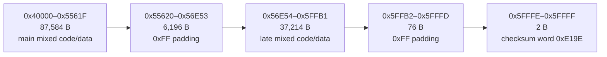
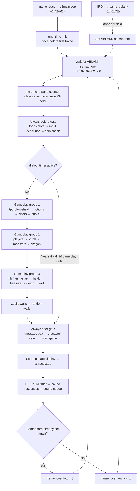

# Gauntlet II — Game ROM Structure

*Main loop, calling conventions, ROM layout, and coverage analysis for row76.bin.*

---

## 1. Game ROM Overview

**Confidence: Verified** for image range, callable count, and C/assembly
mixture; compiler-vendor attribution remains **Strong inference**.

- **File:** `row76.bin`
- **Address:** `0x040000–0x05FFFF` (128 KB populated image; the OS accepts game entry targets through `0x07FFFF`)
- **Language:** C plus hand-written assembly leaves; Green Hills C compiler
  attribution is **Strong inference** from code-generation patterns.
- **Callable entries:** **Verified** 322 unique shipped entry points, each
  reconciled to a checked purpose/argument/return/convention contract.

### 1.1 ROM Layout

This address-ordered map shows the five physical regions in the populated
128 KiB image. It is not drawn to scale; the table below gives exact sizes.



| Region | Address Range | Size | Content |
|--------|--------------|------|---------|
| Main mixed executable region | 0x40000–0x5561F | 87,584 B | Compiled C/assembly plus inline dispatch and lookup tables |
| Erased padding | 0x55620–0x56E53 | 6,196 B | Solid 0xFF gap |
| Late mixed code/data region | 0x56E54–0x5FFB1 | 37,214 B | Slapstic helpers, later MOB/wall/placement routines, strings, palettes, animation data, and tile descriptors |
| End padding | 0x5FFB2–0x5FFFD | 76 B | Solid 0xFF |
| Checksum trailer | 0x5FFFE–0x5FFFF | 2 B | Final big-endian word 0xE19E |

**Confidence: Verified** for these physical boundaries and contents.  The
former classification of 0x56F00–0x5FFB1 as a pure data-table region was
**Contradicted**: executable routines are interleaved throughout it.  The
hash-guarded, gap-free union is generated as
[`generated/rom_regions.csv`](generated/rom_regions.csv) by `generated/generate_rom_regions.py`.

### 1.2 Jump Table (`0x40000–0x40054`)

Fifteen six-byte hook slots occupy 0x40000–0x40059. Ten slots contain active absolute JMP entries or interrupt self-loops; five optional slots are all zero and are skipped because the OS tests for opcode 0x4EF9 before calling them:

| Address | Target | Function |
|---------|--------|----------|
| `0x40000` | `0x4014C` | `game_start_veneer` — entry point from OS |
| `0x40006` | `0x4017E` | `game_vblank_veneer` — VBLANK interrupt veneer |
| `0x4000C` | `0x4000C` | `game_irq1_watchdog_trap` — self-JMP trap |
| `0x40012` | `0x40012` | `game_irq3_watchdog_trap` — self-JMP trap |
| `0x40018` | `0x40018` | `game_irq2_watchdog_trap` — self-JMP trap |
| `0x4001E` | `0x0017E` | `game_irq6_sound_veneer` — OS sound IRQ tail veneer |
| `0x40024` | `0x40140` | `game_exception_veneer` — exception-abort veneer |
| `0x4002A` | zero | Optional startup hook 2 slot (post coin/text initialization); absent in this ROM |
| `0x40030` | `0x44A82` | `game_playfield_init_veneer` — OS-called playfield initialization hook |
| `0x40036` | zero | Optional startup hook 1 slot (post attract-display initialization); absent |
| `0x4003C` | zero | Optional startup hook 3 slot (post palette initialization); absent |
| `0x40042` | zero | Optional supplemental VBLANK hook slot; absent, not a callable entry |
| `0x40048` | `0x5317C` | `game_options_veneer` — game-specific operator-options/configuration display hook; the former attract-handler name was contradicted |
| `0x4004E` | zero | Optional post-attract hook slot; absent |
| `0x40054` | `0x56EAA` | `game_rom_verify_veneer` — packed game-ROM/Slapstic verification provider |

**Confidence: Verified.** The ten active hook veneers and five later
trampolines at 0x400DE–0x400FB are callable entries with the same ABI as their
tail targets. IRQ1/IRQ2/IRQ3 deliberately self-jump and therefore become
watchdog traps if those unexpected sources fire; IRQ6 tail-jumps through OS
0x17E to the sound receive interrupt body, which exits with `RTE`.

### 1.3 Copyright Morse Signature (`0x4009C–0x400A4`)

The otherwise runtime-dead header area contains a nine-byte copyright
signature at file offset `0x009C` (CPU address `0x4009C`):

```text
AE D6 8C 17 FB 90 6A 33 80
```

Treating the first 69 bits in CPU/MSB-first order as Morse symbols, with
`0 = dot` and `1 = dash`, gives the following letter grouping:

```text
-.-. --- .--. -.-- .-. .. --. .... -
.---- ----. ---.. -....
.- - .- .-. ..
--. .- -- . ...
```

This decodes to **`COPYRIGHT 1986 ATARI GAMES`**. Morse character and word
separators are not stored; they are the grouping of the continuous bitstream.
The signature consumes five high bits of the last byte, leaving its low three
zero bits as byte-alignment padding. It is split byte-by-byte across the 7A
and 7B physical ROM lanes and becomes contiguous in the reconstructed
CPU-visible `row76.bin` image.

**Confidence: Verified** for the bytes, address, bit order, and decoded text.
No OS or game code references the range. Its purpose as a deliberate
copyright/anti-copy code trap is **Strong inference**, consistent with Atari's
known practice of embedding ownership statements directly in ROM bits rather
than displaying or executing them. The earlier Centipede implementation is
described, including its affidavit's Morse decoding, in
[Atari Centipede's Hidden Code Trap](https://arcadeblogger.com/2019/06/29/atari-centipedes-hidden-code-trap/).

---

## 2. Main Loop Structure

**Confidence: Verified** by the checked 29-entry main-loop contract generator
and whole-ROM direct-call reconciliation.

The main loop is synchronized to the game-owned VBLANK path. Three services
run before the dialog gate, sixteen gameplay calls are skipped as one block
while a dialog is active, and the remaining UI, persistence, and sound work
runs every frame.



### 2.1 Verified Main Loop Call Sequence (`g2mainloop`, 0x42A66)

> **Correction from REPORT.md:** The main loop does NOT execute everything every frame. It has a two-level conditional structure.

```
g2mainloop (0x42a66):
    link a6, #-4
    a2 = #0x904002              ; → VBLANK semaphore
    jsr one_time_init (0x4327a) ; runs once before first VBLANK
    a3 = address of local var

VBLANK_WAIT (0x42a7e):
    if (0x904002) == 0:         ; spin until VBLANK handler sets this
        clear local var
        goto VBLANK_WAIT

    (0x904006) += 1             ; increment frame counter
    (0x904002) = 0              ; clear VBLANK semaphore
    copy (0x904020) → (0x90401e)    ; save playfield color

    ── ALWAYS CALLED (every frame, all modes) ──────────────
    jsr main_logo_updcolors         (0x4dcba)
    jsr input_debounce              (0x40644)
    jsr coincheck                   (0x42b6a)

    ── DIALOG GATE ─────────────────────────────────────────
    if (0x904a9e) != 0:         ; dialog_timer active?
        goto SKIP_GAMEPLAY      ; YES → skip all 16 gameplay functions

    ── GAMEPLAY FUNCTIONS (skipped when dialog is active) ──
    jsr main_cycle_tport_and_ffield (0x40528)
    jsr main_handle_potions         (0x46fea)
    jsr main_open_doors             (0x45c00)
    jsr main_handle_shots           (0x474f6)
    jsr main_move_players           (0x4a53a)   ← has internal game_mode check
    jsr main_scroll_playfield       (0x46caa)
    jsr main_move_monsters          (0x49034)   ← gated by active player count
    jsr main_handle_dragon          (0x54454)
    jsr main_thief_anim             (0x4e8dc)   ← address corrected from GAME_ROM_KNOWN.md
    jsr main_start_thief            (0x4deb8)
    jsr main_health_countdown       (0x466f6)
    jsr main_treasure_timer         (0x4d29e)
    jsr main_handle_death           (0x4664c)
    jsr main_exit_move              (0x5287c)
    jsr main_walls_cyclic_move      (0x5e62a)
    jsr main_walls_random_move      (0x5e41a)

SKIP_GAMEPLAY (0x42b14):
    ── ALWAYS CALLED (every frame, all modes) ──────────────
    jsr main_msgbox_countdown       (0x4ccbc)
    jsr character_select_input_update (0x42df4)
    jsr main_start_game             (0x4800c)
    jsr main_score_update           (0x4715e)
    jsr main_score_display          (0x457c0)
    jsr main_attract                (0x44562)   ← attract mode state machine
    jsr eeprom_timer                (0x431ee)   ← periodic EEPROM write
    jsr sound_response              (0x42d0a)   ← process sound CPU responses
    jsr main_update_sound           (0x4ae20)

    ── FRAME OVERFLOW CHECK ─────────────────────────────────
    if (0x904002) != 0:         ; another VBLANK already?
        (0x904916) = 8          ; frame took too long
    else:
        (0x904916) >>= 1       ; decay overflow counter

    goto VBLANK_WAIT
```

### 2.2 VBLANK Synchronization

The game's VBLANK handler implementation is at **`0x4017E`**, reached via the jump table entry at `0x40006`. The VBLANK semaphore is at `0x904002` (word). The OS VBLANK handler sets it each field. The main loop spins on it, clears it after processing, and detects frame drops via `0x904916` (set to 8 if a second VBLANK occurred before processing finished).

The synchronous Python host normally substitutes one `Clock.tick(60)` wait at
this boundary. Its host-only `--uncapped` mode omits that wait but does not alter
the loop body: input sampling, one complete game update, and one presentation
still occur in order. Consequently all arcade counters retain their literal
frame units while advancing faster than wall time. This is an accelerated
runner mode and forces host sound playback off; modeled sound commands remain
unchanged. It is not a claim that the cabinet free-runs or a model of additional
VBLANK interrupts.

For host performance comparisons, `gauntpy-play --benchmark [FRAMES]` removes
that wait and measures five named boundaries after a short warm-up: host
event/input sampling, one complete `tick`, game-raster composition/conversion/
scale/blit, total presentation through display flip, and the enclosing host
iteration. These intervals are nested: raster is part of presentation, which is
part of the complete loop. The harness therefore reports them independently
rather than summing them. It also disables static playback and external EEPROM
writes while retaining modeled sound commands and the literal one-update-per-
iteration game timeline.

`--stresstest SECONDS` uses the same uncapped boundary but changes complete
modeled states through their ordinary setup owners. Its cycle covers TITLE,
DEMO, level 12 / maze 11, level 16 / maze 15, SCORES, and LEGEND, exercising
the title MOB program, full demo simulation, dragon and living-exit gameplay,
and the maze-103 alpha/playfield attract pages. This is a host workload, not a
new cabinet mode: each phase still executes one full ROM-shaped frame body
before one presentation.

**Confidence: Verified.** The reset veneer at 0x40000 reaches `game_start`
(0x4014C). That entry installs three initial playfield-color pointers at
0x904036/3A/3E, installs forcefield delay profile 0 (ROM 0x571DA) at
0x904042, writes SR=0x2300, and tail-jumps to the non-returning
`g2mainloop`. The interrupt veneer at 0x40006 reaches `game_vblank`, which
saves D0-D1/A0-A2 and exits with `RTE` unless it takes one of the separately
documented abort/reset-vector paths.

> **Correction from REPORT.md:** The semaphore is at `0x904002`, not in `ram.os_flag` at `0x904000`. `0x904000` is the maze number.

### 2.3 Game Mode Variable

**Confidence: Verified** for stored values and their tested branches.

> **Correction from REPORT.md:** The game mode variable is `game_mode` at `0x904918`, **not** `ram.os_flag`. REPORT.md's description of "values below 0x5 are pre-game, 0x5–0x72 are normal gameplay" referred to the maze number, not game mode.

Game mode values:

| Value | Meaning |
|-------|---------|
| `0x0000` (GAMEMODE_NORMAL) | Normal gameplay |
| `0x0001` (GAMEMODE_TREAS_EXIT) | Treasure room exit |
| `0xFFFF` (GAMEMODE_SCORES) | High score attract screen |
| `0xFFFE` (GAMEMODE_TITLE) | Title screen attract |
| `0xFFFD` (GAMEMODE_DEMO) | Demo gameplay attract |
| `0xFFFC` (GAMEMODE_LEGEND) | Legend screen attract |

### 2.4 What Runs When — Complete Function Execution Matrix

**Confidence: Verified** for the main-loop dialog gate and each callee's
mode/player gates represented below.

| Function | Normal | TreasExit | Demo | Title/Scores/Legend | Dialog Active |
|----------|--------|-----------|------|---------------------|---------------|
| `main_logo_updcolors` | YES | YES | YES | YES | YES |
| `input_debounce` | YES | YES | YES | YES | YES |
| `coincheck` | YES | YES | YES | YES | YES |
| `main_cycle_tport_and_ffield` | YES | YES | YES | YES | **NO** |
| `main_handle_potions` | YES | YES | YES | YES | **NO** |
| `main_open_doors` | YES | YES | YES | YES | **NO** |
| `main_handle_shots` | YES | YES | YES | YES | **NO** |
| `main_move_players` | YES | YES | DEMO INPUT | **SKIPS** | **NO** |
| `main_scroll_playfield` | YES | YES | YES | YES | **NO** |
| `main_move_monsters` | YES | YES | if players | **SKIPS** | **NO** |
| `main_handle_dragon` | YES | YES | YES | YES | **NO** |
| `main_thief_anim` | YES | YES | YES | YES | **NO** |
| `main_start_thief` | YES | YES | YES | YES | **NO** |
| `main_health_countdown` | YES (1/64) | YES (1/64) | YES (1/64) | n/a | **NO** |
| `main_treasure_timer` | YES | YES | YES | YES | **NO** |
| `main_handle_death` | YES | YES | YES | YES | **NO** |
| `main_exit_move` | YES | YES | YES | YES | **NO** |
| `main_walls_cyclic_move` | YES | YES | YES | YES | **NO** |
| `main_walls_random_move` | YES | YES | YES | YES | **NO** |
| `main_msgbox_countdown` | YES | YES | YES | YES | YES |
| `character_select_input_update` | YES | YES | YES | YES | YES |
| `main_start_game` | YES | YES | YES | YES | YES |
| `main_score_update` | YES | YES | YES | YES | YES |
| `main_score_display` | YES | YES | YES | YES | YES |
| `main_attract` | YES | YES | YES | YES | YES |
| `eeprom_timer` | YES | YES | YES | YES | YES |
| `sound_response` | YES | YES | YES | YES | YES |
| `main_update_sound` | YES | YES | YES | YES | YES |

### 2.5 Attract Mode State Machine (`main_attract`, 0x44562)

The attract mode cycles through four screens:
```
SCORES → TITLE → DEMO → LEGEND → SCORES → ...
```

Loaded screen timers (frames at 60 Hz; **Confidence: Verified** at `start_attract_screen` 0x44414):
| Screen | Timer | Seconds |
|--------|-------|---------|
| TITLE | 0x5DD | ~25 sec |
| SCORES | 0x258 | ~10 sec |
| DEMO | 0x1C20 | 120 sec |
| LEGEND | 0x258 | ~10 sec |

Every 13th TITLE cycle: refreshes EEPROM settings. If attract sounds are enabled (bit 14 of settings) and the music counter is zero: plays theme 0x3B ("Gauntlet II Theme Song").

---

## 3. Calling Convention

The game ROM is compiled C using a **stack-based, caller-cleanup convention** (cdecl) typical of the Green Hills C compiler for 68000 targets.

**Confidence: Verified** as the normal convention across the 322-entry
contract audit. Every register/shared-stack/tail-entry exception is stated in
`07_function_index.md` and the generated contract catalogs.

### 3.1 Prologue / Epilogue

```asm
; Prologue
link.w  a6, #-N            ; save old a6, set frame pointer, allocate N bytes of locals
movem.l <reg-list>, -(a7)  ; save callee-saved registers

; Epilogue
movem.l -offset(a6), <reg-list>  ; restore saved registers
unlk    a6                        ; restore old a6, deallocate locals
rts
```

`a6` is always the frame pointer. Local variables are at negative offsets from `a6`; arguments are at positive offsets.

A few heavily-used functions (e.g., `mob_create` at 0x5DC58) omit `link`/`unlk` and access arguments relative to `a7` directly — a hand-optimization, not a different convention.

### 3.2 Argument Passing

All arguments are pushed **right-to-left** (last argument pushed first) as **32-bit longwords**, even when the logical type is 16-bit. Values are sign- or zero-extended to 32 bits before pushing.

Common push idioms:
| Instruction | Effect |
|-------------|--------|
| `move.l dN, -(a7)` | Push register (already 32-bit) |
| `pea.l <ea>` | Push effective address (pointer arg) |
| `clr.l -(a7)` | Push zero |
| `pea.l 0x20.w` | Push immediate constant as longword |

Because the 68010 is **big-endian**, the low (meaningful) 16 bits of each longword slot sit at `+2` within the slot:

```asm
; Frame-pointer form:
;   a6+0  = saved old a6
;   a6+4  = return address
;   a6+8  = arg 1 longword  → low word at a6+0x0A
;   a6+C  = arg 2 longword  → low word at a6+0x0E
move.w  0xa(a6), d6      ; read arg 1 as word
move.w  0xe(a6), d3      ; read arg 2 as word
```

### 3.3 Caller Cleanup

The **caller** removes arguments after the call returns, typically with `lea`:

```asm
; Call mob_create with 6 longword args (24 bytes)
move.l  d0, -(a7)    ; arg 6
move.l  d0, -(a7)    ; arg 5
...
jsr     mob_create
lea     0x18(a7), a7  ; pop 24 bytes (6 × 4)
```

### 3.4 Return Values

Return values are passed in **d0**. Word-sized results use `d0.w`; longword/pointer results use `d0.l`. Void functions leave d0 undefined.

### 3.5 Register Classes

| Registers | Role | Convention |
|-----------|------|------------|
| d0–d1 | Scratch / temporaries | **Caller-saved** |
| d2–d7 | General purpose | **Callee-saved** |
| a0–a1 | Scratch / pointer temps | **Caller-saved** |
| a2–a5 | General purpose pointers | **Callee-saved** |
| a6 | Frame pointer | Saved/restored by `link`/`unlk` |
| a7 | Stack pointer | Managed implicitly |

### 3.6 Identifying Hand-Written Assembly

Telltale signs of non-compiler-generated code:
- No `link`/`unlk` and no `movem` save (only scratch registers used)
- No stack-based arguments (inputs arrive in registers or fixed memory)
- Unusual sequences not typical of compiler output (e.g., `roxl` for bit-serial I/O debouncing at `input_debounce`, 0x40644)
- Inline within the slapstic trampoline (bank-switch helpers at 0x56E58/0x56E6E)

---

## 4. ROM Coverage

**Confidence: Verified** by the generated physical-region, callable-contract,
control-target, detailed byte-range, and RAM-operand reports.

### 4.1 Code Coverage

- **Verified:** the standard `link a6` prologue sweep and direct-target naming cover the known compiled-C entries.
- **Verified:** the detailed byte report identifies 93,722 analyzed instruction
  bytes across 34 executable ranges, and all 29 main-loop top-level entries
  have checked purpose/ABI descriptions.
- **Verified:** `generated/callable_contract_coverage.csv` reconciles all 322 indexed
  entries to body-checked catalogs that state purpose, arguments, return
  behavior, and every discovered convention exception. Naming alone was not
  accepted as contract evidence.

### 4.2 Data Tables Coverage

- **Verified:** `generated/rom_regions.csv` provides a checked, contiguous physical union
  of every byte from 0x40000 through 0x5FFFF, including the two erased pads and
  final checksum word.
- **Verified:** `generated/rom_byte_coverage.csv` classifies every byte in both mixed
  code/data regions as analyzed instructions or a named ROM range;
  `generated/rom_catalog_reconciliation.csv` gives every §5 row an exact matching flag
  (322 parsed rows over 321 distinct addresses; the one repeat is a deliberate
  aggregate/subview pair documented in §5),
  `generated/rom_flag_reconciliation.csv` gives all 347 non-code ROM flags an exact §5
  or header-table row, and `generated/rom_range_overlaps.csv` records the eight intentional
  nested/alternate table views. No mixed-region byte or analysis failure
  remains unclassified.

### 4.3 Previously Undocumented Areas — Now Decoded

**Confidence: Verified** for the byte ranges and live consumers; concise
editorial group names are **Strong inference** where several adjacent tables
are summarized together.

The following major data areas were unlabeled but have since been decoded:

| Area | Size | Content |
|------|------|---------|
| Tile sprite descriptors (0x5BAE0–0x5C89F) | 3,520 B | 8-byte 2×2-tile descriptors for floor/wall rendering |
| Special object tiles (overlapping views 0x5CB48–0x5D2F7) | 1,968 B | Sparse object tile index table + dense animation frame table within the attract tile stream |
| Tile pattern data + embedded code (0x5D848–0x5F9CE) | ~8.6 KB | Neutral unconsumed block at 0x5D848, potion-effect matrix view, contest strings, connectivity table + tile rendering code |
| Wall/door connectivity and correction tables (0x5EDD4–0x5FC11, interleaved with renderer code) | — | Wall connectivity variants, random descriptor pointers, and exact 3×3 door graphic/position tables |
| Speech/dialog strings and first-encounter data (0x59736–0x5A37F) | 3,146 B | Hint/tip records, power-up masks/speech, 32 message records, two pointer views, and parallel speech IDs |
| In-game message/audio data (0x5A380–0x5AC1F) | 2,208 B | Power-up names, monster names, credits, bonus scoring, and treasure-room countdown speech tables |
| Palette cycling data (0x5B22E–0x5B64A) | ~1.1 KB | Hurt flash, poison shimmer, invulnerability shimmer |
| Challenge/character display config (0x57056–0x57370) | 795 B | Challenge target types, linked instruction text, split portrait word/destination arrays, joystick masks, and floor-palette indices |
| Attract/high-score/demo data (0x57BD8–0x5858B) | 2,484 B | Unreferenced 369-word 0x1Exx tile block, 40 factory high-score records, display strings/configuration, demo streams, and tip strings |
| Atari contest strings (0x5D9E8–0x5DA97) | 176 B | "SEND CONTEST ENTRY FORM TO ATARI GAMES CORP. CONTEST ENDS 12/19/86" |

### 4.4 Resolved Former Unknowns

**Confidence: Verified** for live/dead reachability within the shipped ROM.
The original build-time intent of unreachable residue remains **Unknown** and
is unresolvable from the supplied runtime artifacts; this does not leave its
ROM range, runtime status, or contents unaccounted.

The four unknowns formerly listed here (dragon path table format, dialog tip boundaries, tile pattern → descriptor mapping, EEPROM bits 5–7/13) have all been resolved by disassembly — see `05_data_reference.md` (data formats, §3.19 bytecodes, §5 ROM tables) and `04_game_subsystems.md` (§8 dragon, §26 shot resolution). The dragon path table turned out to be 5×16 bytes at 0x5D578, with the rest of its formerly claimed 2 KB being playfield palettes and contest strings.

Pointerless blocks are classified as runtime-dead ROM residue rather than unknown live tables. **Confidence: Verified** for the boundaries and the absence of consumers; **Contradicted and corrected:** the former list also named 0x5C8B0–0x5CAA7, 0x57332–0x5733F, and 0x57358–0x5735F, all three of which have live consumers. 0x5C8B0 is `exit_tile_descs`, reached indirectly from `maze_setupnew` through `exit_desc_by_floorpattern`; 0x5732E–0x5733F resolves into the `level_start_row_bytes`/`level_start_attr_words` pair used by the between-level screen; and 0x57358 is `treasure_room_duration`, read directly by `show_level_start_screen` at 0x44F24. The blocks that remain genuinely unreferenced are 0x57BD8–0x57EB9 (`dead_tile_word_block`), 0x571D8–0x571D9 (`forcefield_delay_alignment`), and 0x5870C–0x58749 (`dead_picture_word_block`). Whole-ROM encoded-pointer searches, xrefs, exact-range immediate searches, and surrounding-page immediate searches found no consumer for those three. Their original editor/build-time purpose is not recoverable from runtime code, so apparent geometric layouts are not assigned semantics; `05_data_reference.md` records exact contents and boundaries. The adjacent 0x571DA–0x571F9 bytes are **Verified** live forcefield cycle-delay profiles and are not part of this residue.

For the current list of open questions, see `08_known_issues.md`.

### 4.5 Unused ROM Space

**Confidence: Verified** for the solid-0xFF bytes, absence from all analyzed
instruction/table ranges, and lack of runtime significance. The image contains
no evidence from which to recover a production-time reason for the gap, so no
such explanation is asserted.

The 6,196-byte block of solid 0xFF between address 0x55620 and 0x56E53 is genuinely unused ROM space. This represents ~4.8% of the ROM; the image does not encode a production-time reason for the gap.

### 4.6 Disassembly Note — `movea.l` Immediate Mode

**Confidence: Verified** from instruction encoding and raw bytes.

Several radare2 disassembly listings display `movea.l 0x9XXXXX, an`, which **appears** to be a memory dereference but is often **IMMEDIATE mode** (loading the address literal into the register). Always confirm via raw byte inspection:

| Encoding | Instruction | Effect |
|----------|-------------|--------|
| `2X7C nnnnnnnn` (X = register) | `MOVEA.L #imm.l, aX` | Load address literal into aX (e.g., `207C` → a0, `227C` → a1, `247C` → a2, `267C` → a3) |
| `2X79 nnnnnnnn` | `MOVEA.L (abs.l), aX` | Load the longword *stored at* the address |

This affects any analysis that assumed these instructions were dereferencing pointers. For example, the dragon RAM locations at `0x904890–0x904894` are **direct word values** (not pointers), confirmed by raw byte checks.

---

## 5. `one_time_init` (0x4327A) — Initialization Before First Frame

**Confidence: Verified** for call order, arguments, and state writes.

Called once from the main loop before the first VBLANK wait. Performs full game initialization:

1. **Sound system reset** — flushes the sound ring, loads the recovery holdoff, and sends the hardware reset command via OS 0x254
2. **Clear game state** — zeros `0x90400C`
3. **Initialize display** — calls `init_display` (0x43486) with args (0, 0)
4. **Read hardware config** — calls OS 0x236 (DIP switches → `0x9049E2`), OS 0x1A8 slot 0xC (game settings → `0x904A24`), OS 0x1A8 slot 0xB (game options, sanitizes via OS 0x1C0)
5. **ROM version check** — checks bit 12 of settings; if set, reads from ROM 0x40070 and updates EEPROM
6. **Initialize persistent state/subsystems** — calls `eeprom_load_config` (0x42F86), `highscore_table_init` (0x49BD0), and OS 0x14E (hardware init)
7. **Initialize RAM variables** — sets timers, clears state variables, sets default character types {0,1,2,3}
8. **Start attract mode** — calls `start_attract_screen` (0x44414) with arg -2 (GAMEMODE_TITLE)
