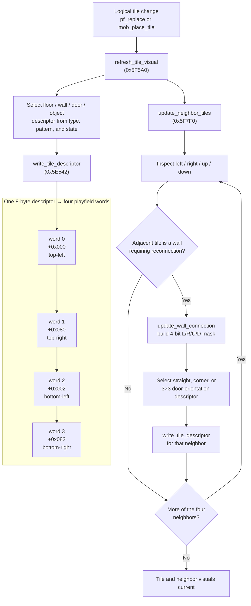
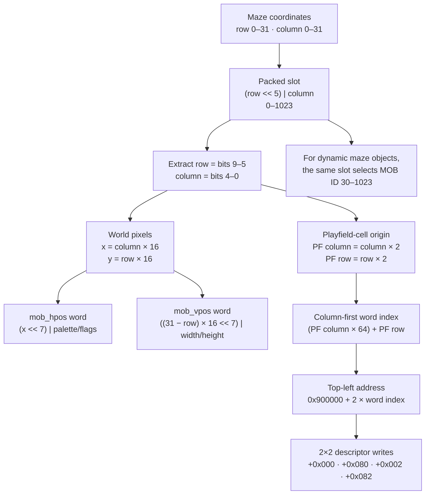
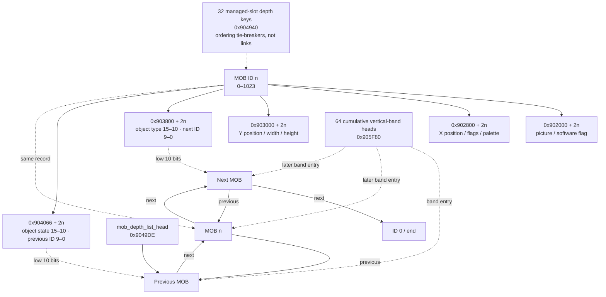

# Gauntlet II — Game Subsystems

*In-depth analysis of all major game subsystems in the Game ROM (row76.bin).*

---

## 1. MOB ID System & Maze Position Abstractions

**Confidence: Verified** for ranges, fixed assignments, and position encodings.

### 1.1 MOB Hardware Arrays

The hardware supports 1024 MOB slots (IDs 0–1023). Each MOB has 4 words of hardware state in parallel VRAM arrays:

| Array | Base Address | Per-MOB offset | Contents |
|-------|-------------|---------------|----------|
| `mob_picture` | `0x902000` | id × 2 | Tile number (bits 14-0), software flag (bit 15) |
| `mob_hpos` | `0x902800` | id × 2 | X position (bits 15-7), flags (bits 6-4), palette (bits 3-0) |
| `mob_vpos` | `0x903000` | id × 2 | Y position (bits 15-7), spare (bit 6), width-1 (bits 5-3), height-1 (bits 2-0) |
| `mob_link` | `0x903800` | id × 2 | Maze object type (bits 15-10), next link (bits 9-0) |

Plus one software-only parallel array:

| Array | Base Address | Per-MOB offset | Contents |
|-------|-------------|---------------|----------|
| `mob_state_link` (`mob_anim`) | `0x904066` | id × 2 | Object-specific auxiliary state (bits 15–10) plus universal backward link (bits 9–0) |

### 1.2 MOB ID Assignments

**Fixed IDs (0–29):**

| ID Range | Purpose |
|----------|---------|
| 0 | Linked-list null terminator |
| 1–4 | Player shots |
| 5–8 | Demon shots — also where `dragon_fire_setup` puts the dragon's fire |
| 9–12 | Lobber shots (the only channels that use the 0x479C2 arc accumulator) |
| 13–16 | Shot explosion animations |
| 17–20 | Floating score popups |
| 21–24 | Player exit animations |
| 25–29 | Transporter animations (5 slots) |

**Dynamic IDs (30–1023):** maze objects — monsters, generators, items, doors, exits, transporters, forcefields.

### 1.3 Two Levels of Position Abstraction

**Slot positions** (maze grid): A 10-bit value encoding row (bits 9:5) and column (bits 4:0) in the 32×32 tile maze grid. Used in `mob_link`, the tport/exit position tables, and slot-based collision detection.

**Pixel positions**: The actual pixel X/Y stored in `mob_hpos`/`mob_vpos`
(bits 15–7 = pixel coordinate, so one pixel is 0x80 field units). For an
unadjusted maze slot, `pixel_x = column × 16` and the vertical field is
`(31 − row) × 16` — it counts up from the playfield floor — and both words are
built together as `slot << 11`. Individual object constructors may then apply
sprite-origin corrections.

---

## 2. MOB Animation System

**Confidence: Verified** for state fields, lookup indexing, and live animation
paths unless an individual legacy entry is labeled otherwise.

### 2.1 Multiplexed MOB State/Back-Link (`0x904066`)

Each slot has a word at `0x904066 + mob_id × 2`. The old name `mob_anim` describes ordinary monsters but not the array's general role:

| Object/use | Bits 15–10 |
|------------|------------|
| Ordinary monster | Bits 15–13 animation counter; bits 12–10 direction |
| Player MOB | Player number, recovered with `state >> 10` by shot-hit handling |
| Door tile | Four-bit adjacent-door/shape mask in bits 13–10 |
| Forcefield hub (type 0x3F) | Segment/graphic variant; `pf_floor_update` selects table 0x5BA70 from the upper state bits |
| Movable wall | Hit accumulator in units of 0x400; dissolves at 0x6400 (25 hits) |

Bits 9–0 always hold the previous MOB ID in the software depth-sorted list. A precise general name is therefore `mob_state_link`; documentation retains `mob_anim` as a historical alias where discussing monster animation.

### 2.2 Player Animation Modes

Players have four animation modes, selected by `main_move_players` at
0x4AB08–0x4AC2A after movement/forcefield processing. `direction` below is the
ROM-facing value (up, up-right, right, ... up-left), and every table is indexed
by character first:

1. **Standing/idle:** Tile from `anim_table_idle` (0x58A4A), indexed by
   `(direction, char_type × 8)`. The counter does not advance.

2. **Walking:** Tile from `anim_table_walking` (0x58A8A), indexed by
   `(anim_counter/4 & 3, direction, char_type × 32)`. The counter increments
   after the lookup only when `player_try_move` did move.

3. **Fighting:** A nonzero `player_fighting_dir` selects
   `anim_table_fighting` (0x5884A), indexed by
   `(anim_counter/2 & 7, direction, char_type × 64)`, then increments the
   counter. The fighting-direction word is the active-combat latch; the picture
   table uses the current facing.

4. **Shooting:** `player_shooting` selects `anim_table_shooting` (0x5874A),
   indexed by `(anim_counter/4 & 3, direction, char_type × 32)`. The
   held-Fire gate in `main_handle_shots` (0x47B72–0x47BF6) resets the counter
   and arms this state; `main_move_players` increments it and calls
   `player_create_shot` when the prior counter equals that player's
   `fighting_anim_end` word (the shipped values are all 3).

**Invisibility flickering:** When the invisibility power-up is active with a short timer remaining, the `invisibility_flash_masks` table (0x58070) ANDs a frame-dependent mask with the frame counter. When the result is zero, the player's MOB picture is set to `0x1709` (blank/invisible) — creating a flickering effect.

### 2.3 Monster Animation

Monsters use direct tile lookup tables (64 entries per monster type). Monster animation advances by incrementing the animation counter in `mob_anim` bits 15-13. Direction bits (12-10) select the facing direction, which is combined with the animation counter to select the tile from the type's animation table.

### 2.4 Player Palette Handler Stubs

**Confidence: Verified.** Player setup selects one power-cycle and one
hurt-cycle handler from the character-indexed pointer tables at 0x57842 and
0x57852, then writes those addresses into the eight RAM JMP stubs at
0x905F00–0x905F2F. VBLANK calls the installed stubs with the cycle byte offset
in D0 and source/destination palette pointers in A1/A2. The eight ROM leaves at
0x404A0–0x40527 are therefore live callable code even though no static direct
call targets them; each preserves registers and copies the character-specific
palette words for its power or hurt effect.

---

## 3. Monster System

**Confidence: Verified** for dispatch, movement/combat contracts, type ranges,
and table consumers.

### 3.1 Main Entry Point (`monsters_everything`, 0x40E6A)

Called once per frame. Iterates all MOB slots, dispatching to per-monster-type handlers. Manages monster health, shot generation, and generator spawning.

Before dispatch, `main_move_monsters` builds the two culling origins at
0x904A62/0x904A64. The tests at 0x40FF6–0x4101A are unsigned 16-bit
subtractions over the `pixel << 7` position words, so overflow is the
horizontal or vertical seam of one 512-pixel maze, not an error: `512 << 7` is
exactly 0x10000, so plain 16-bit arithmetic wraps at the seam on its own.
Horizontally the accepted span is 0x7F80 units (255 pixels); vertically it is
0x8380 (263 pixels) in the upward coordinate frame. A port that rescales the
position field has to rescale this modulus with it, or seam-visible monsters
freeze as soon as the camera register wraps from 0 to 511.

The preceding SLIP-chain window wraps independently. At 0x49076 and 0x490AC
the ROM computes its stop/start lookups from `(pf_vscroll_lo + 0x118) & 0x1F0`
and `(pf_vscroll_lo - 8) & 0x1F0`, then indexes the word table through its
biased `priority_bucket_heads_tail` base at 0x905F82. Both the culling
predicate and this chain arc must wrap. Clamping either lookup at band 63
omits the row-zero side of the arc when the camera crosses the vertical seam,
leaving visible monsters neither moving nor animating.

### 3.2 Monster Dispatch

`monsters_everything` does NOT use a jump table. Instead, it uses a single shared handler with conditional branches:

```
1. Extract type from mob_link bits 15-10
2. Is type a generator (types 28–45)?
   YES → generator spawning code (0x41026)
3. Is type a super sorcerer (26)?
   YES → special sorcerer placement/teleport handler (0x4106A)
4. ALL other monster types (18-25, 27) → shared handler at 0x4119A
```

### 3.3 Shared Monster Handler (0x4119A)

Uses `mob_hpos` flag bits to determine monster state:

| Bit 5 | Bit 4 | State | Behavior |
|-------|-------|-------|----------|
| 1 | x | Moving | Advance the moving-bank animation, then enter the shared movement/collision body at 0x4126A |
| 0 | 1 | Attacking | Advance the attack animation by 0x2000 per step; on carry, clear bit 4 and call `monster_find_and_shoot`, otherwise select the attack animation bank |
| 0 | 0 | Idle | Apply the `((slot \| 2) ^ frame) & 0x1E` turn stagger, call `monster_find_and_shoot`, then fall into the movement body |

The bit-4 state is an *attack-animation* state rather than a separate pursuit
mode; both it and the idle state reach `monster_find_and_shoot`, and both fall
through to the same movement/collision body, which writes the H/V words and
calls `move_mob_slot` on a clear destination or `monster_playerhit` when the
destination holds a player (0x41336–0x413C2).

**The `D6` monster-index offset. Confidence: Verified** by disassembly at
0x40FAE–0x41022 and 0x411BA–0x41460. Throughout the loop body `D6` is **not**
an object type. `monster_loop_core` loads the `mob_link` high byte and masks
0xFC, giving `object_type × 4`, then subtracts 0x48 (`18 × 4`), leaving

```
D6 = (object_type − MAZEOBJ_MONST_GHOST) × 4 = monster_index × 4
```

a byte offset with a four-byte stride into the ten-record monster-index tables
(`monster_anim_idle_ptrs` 0x40DB2, `monster_anim_moving_ptrs` 0x40DDA,
`monster_oddangle_table` 0x40E1E) and into the per-family stack configuration
read at `0xA(A7,D6.w)`. The surrounding bounds tests use the same scale:
`bcs` after the subtraction rejects types below 18, `cmpi.w 0x6C` (`27 × 4`)
rejects types above 45, and `cmpi.w 0x24` (`9 × 4`) is the creature/generator
split at type 27.

The former text quoted these offsets as "type" values, which contradicted the
Maze Object IDs enum and §3.2 (the latter correctly names Super Sorcerer 26).
The correspondence is:

| `D6` offset | Monster index | Object type | Name |
|-------------|---------------|-------------|------|
| 0x0C | 3 | 21 (0x15) | Lobber |
| 0x10 | 4 | 22 (0x16) | Sorcerer |
| 0x1C | 7 | 25 (0x19) | Acid |
| 0x20 | 8 | 26 (0x1A) | Super Sorcerer |
| 0x24 | 9 | 27 (0x1B) | IT |

**Special-case handling within the attack (bit 4) state. Confidence:
Verified** at 0x411D2–0x4121E and 0x413E6–0x41428:

- **Sorcerer** (offset 0x10, type 22): branches straight to the shared
  movement/collision body at 0x4126A, bypassing the frame gate, the
  attack-animation advance, and `monster_find_and_shoot`. The former claim that
  it "skips physical movement; only animates and shoots from distance" was
  **Contradicted**; it is the shooting path that is skipped. Sorcerers do
  relocate, but their `monster_anim_moving_ptrs` entry is NULL (§7.2 of
  `05_data_reference.md`), so they reuse idle pictures while doing it, which is
  the origin of the "sorcerers don't visually move" reading.
- **Acid** (offset 0x1C, type 25): loads the literal 0x1E and ANDs it with the
  frame byte at 0x413FA, so the puddle acts only when `frame & 0x1E` is zero,
  i.e. once every 32 frames. The former "fixed direction advance value"
  description was **Contradicted**: 0x1E is a rate mask, not a direction. The
  acid path also substitutes this literal for its own
  `monster_oddangle_table` +1 byte (which is 0x02).
- **IT** (offset 0x24, type 27): takes its rate mask from
  `monster_oddangle_table[D6+1]` through the same gate, then selects
  `anim_tiles_it_special` for its chase pictures.
- **Lobber** (offset 0x0C, type 21): selects `anim_tiles_lobber_throw` where
  every other family selects `anim_tiles_monster_special_attack`
  (0x41208–0x4121E). This fourth special case was absent from the former list.

In the idle (neither bit) state the handler first applies a per-monster turn
stagger, `((slot | 2) ^ frame) & 0x1E`, and only then calls
`monster_find_and_shoot`; acid instead rolls a fresh random direction
(0x41222–0x41250).

**Monster speeds:** **Confidence: Verified** by disassembly at
0x40EEE–0x40F58. `monsters_everything` builds a seven-longword per-family
configuration on its own stack before walking the chain. All families start at
speed 0x80. The `level_flags_2` fast bits raise a family to 0x100, but only on
frames where bit 1 of the working frame word is set, so a "fast" family
averages roughly 1.5× the base rate rather than 2×. The separate override table
at 0x40E02 is then applied from the `level_flags` odd-angle bits under mask
0x73, patching the high byte of the same stack records for ghosts, grunts,
sorcerers, auxiliary grunts, and Death; the demon and lobber odd-angle bits are
outside the mask and have no record to install. The former claim that each
monster's movement is gated per frame by `random(32)` against its speed was
**Contradicted**: that comparison belongs to `handle_generate` (§3.4).
While `monster_slowmo_timer` (0x9048B2, historically `poison_timer`) is
non-zero the entire monster pass is skipped on even frames, halving every
monster's update rate. **Confidence: Verified** at 0x40EB0–0x40EE8: the timer
is decremented, sound 0x39 fires as it reaches zero and 0x38 at 0x1E, and
`btst #0,d6` / `beq 0x4152C` drops the whole walk on even frames. Its only
other reader is `maze_new_level_setup`, which clears it; **no player-movement
code reads it**, so this is a global slow-motion effect on monsters rather
than a player debuff.

#### Super Sorcerer placement

**Confidence: Verified.** `supersorc_place` (0x5FDE0) relocates an existing
Super Sorcerer MOB rather than allocating one. It starts with the player index
in D0, tries all four players cyclically, and skips inactive players. For each
active player it tests three directions behind that player's facing direction:
straight back, then the two adjacent directions. The parallel tables at
0x5FDAC/0x5FDB2 supply direction biases `{0,-1,+1}` and required clear runs
`{4,3,3}`. Candidate cells must stay within rows 1–31, be visible, and be
empty except that the target Super Sorcerer's own slot is allowed. The walk
starts from `active_mob_ids[player]` itself, not a cell re-derived from the
player sprite's corrected H position. A second
eight-cell proximity scan rejects a destination if any MOB is within 0x7C0
in both rendered axes. On success the routine writes H as
`column*16-4`, V at the row anchor, preserves only low bits 0–5 of both words,
faces back along the chosen probe direction, and returns the packed destination
tile in D0.w;
after exhausting every player/direction it returns zero. The normal-stack
`supersorc_place_helper(target_mob_slot, starting_player_index)` at 0x5FDB8
loads the fixed MOB-array bases and converts the physical slot to the doubled
byte offset required by the register body.

### 3.4 Generator Spawning (inline in `monster_loop_core`)

**Confidence: Verified** by disassembly at 0x40F5C–0x41056 and
0x492C0–0x4930E. When the loop encounters a generator type (28–45) it first
applies a turn stagger: the generator acts only on the frame where low bits of
its doubled MOB slot match low bits of the working frame word (mask 0x1E), so
every generator in a level gets one turn per sixteen frames.

The number computed before the walk is a **spawn probability out of 32**, not a
live population count. It is `monster_spawn_probability_table[((game_settings & 0xE0) >> 3)
+ players_active − 1]` plus the signed `monster_spawn_probability_bonus` byte (0x90405F),
clamped to `level × 2` on every level except level 1, and forced to zero when
`frame_overflow` (0x904916) is set. `handle_generate` compares it against
`getrandom(32)` and returns without spawning when the random value wins. The
former description referenced a `ram.monster_count` variable and a
max-monsters-per-type cap; neither exists in the shipped image
(**Contradicted**).

`handle_generate` (0x492C0) is the generator spawn routine called from the type->0x24 branch of `monster_loop_core` (0x41026). Its arguments are the generator's maze/MOB slot, generated monster type index, and spawn probability. On success it chooses a random starting cardinal direction, scans as many as eight neighboring cells using the padded tables at 0x57B50/0x57B68/0x57B80, requires a traversable empty cell, and creates the appropriate tiered monster there. In the special negative game state, `monster_generation_retry_timer` replaces the random probability gate.

### 3.5 Monster Find and Shoot (`monster_find_and_shoot`, 0x41750)

Finds the nearest player within range. Sets monster facing direction. Calls `find_unused_shot` and `monster_create_shot` if attack conditions are met. Target player selection accounts for IT status (the IT player at 0x9049DC is evaluated first, at 0x41762, biasing selection toward the cursed hero; otherwise the nearest player by summed absolute axis delta wins, 0x417B4–0x4180E). Ordinary directional shooters resolve the aim to one of eight compass directions by comparing the two absolute player-axis deltas against per-class thresholds in `monster_shoot_axis_thresholds` (0x40D8A).

**Confidence: Verified.** **Lobber target leading (0x41946–0x41A22).** The lobber is the one shooter that predicts the target's future position rather than aiming at its current cell. Its branch:

- **Range gate (0x41946–0x41960).** Throw only when at least one absolute axis delta is ≥0x14 *and* both are <0x2C — a mid-range annulus. Too close reverses direction and bails (0x41876); too far bails outright.
- **Lead vector (0x41980–0x419CA).** For the chosen target (offset in `-0xC(a6)`), read `player_character` (0x9048E8→`d1`) and the target's **achieved movement word** (0x9048F0→`d6`). Each axis actually moved clears its active-low direction bit; 0xF0 means stationary. The neutral nibble maps to direction 8, whose padded entries at 0x580E8/0x580FA are zero, so a still or blocked player contributes no velocity lead. A power bit (`btst #0,0x19(a1,d0)` at 0x4198A) adds 8 to the character index, selecting the powered half of `lobber_lead_distance` (0x580C8). The scalar is multiplied by the selected unit vector and added to four times the current separation.
- **Velocity store (0x419E4–0x41A10).** After `monster_create_shot`, the per-direction seed `lobber_shot_spawn_h_offset`/`_v_offset` (0x57BB8/0x57BC8) is scaled and subtracted from the aim to yield the launch velocity, written to `lobber_shot_vec_h`/`_v` (0x9048F8/0x904900) for the chosen shot slot. A lobber-throw sound (0x49) is played at 0x41A14.
- **Flight (0x479C2–0x47A58).** A lobber channel is the one projectile class that never reads `shot_velocity_x/y`. `monster_create_shot` seeds `lobber_shot_h_accum`/`_v_accum` (0x904A66/0x904A6E, indexed by `shot_slot - 9`) with the masked spawn position at 0x49216/0x4922A, and every frame `main_handle_shots` does `accum += vec`, then rebuilds the MOB word as `(accum & 0xFF80) + (word & 0x7F)` — position field from the accumulator, palette/flags (H) and packed sprite size (V) left exactly as they were. The seven bits under the position field are the sub-pixel remainder, which is what lets a lead of, say, 0xC0 per frame advance 1.5 pixels a frame instead of rounding to 1 or 2.

The demon branch (0x41A2E) uses `monster_shooter_in_view` and a maze-cell line-of-fire walk but no character/facing lead; it fires along `d3`'s compass direction.

**Shot spawn geometry (`monster_create_shot`, 0x49192–0x49270).** The projectile inherits only the shooter's *position*: 0x49192/0x491A2 mask `mob_hpos`/`mob_vpos` with 0xFF80 before anything else, so the shooter's palette (which for a monster is its health nibble) and its 3×3 packed sprite size are discarded. The per-direction muzzle offset is added on top, and then three small constants land **under** the position field, replacing the low byte:

| constant | site | branch | meaning |
|---|---|---|---|
| `+0xD` | 0x491BA | demon only | palette bits 3–0, combined with the shared `+1` below |
| `+1` | 0x49258 | both | H low byte becomes 0xE for a demon shot and 1 for a lobbed rock; strength bits 0x30 stay clear |
| `+9` | 0x4926E | both | V low byte = packed sprite size, width−1 = height−1 = 1, i.e. a 2×2-tile 16×16 px projectile |

They are not pixel offsets — reading `+0xD`/`+9` as a 13 px right and 9 px up displacement misplaces every demon fireball by most of a cell and gives it the shooter's palette instead of its own.

### 3.6 Death (`death_potion_score`, 0x49446 and `death_damage_accumulate`, 0x49A3C)

**Confidence: Verified.** The former potion-AOE description was
**Contradicted**. `death_potion_score(uint16 doubled_death_mob_offset)` does
not scan or damage any object. It indexes the parallel tables at 0x579E2 and
0x579D2 with `death_hits & 7`, displays the selected floating-score variant at
the Death MOB, and returns the corresponding score in D0.l; its caller adds
that value to the player score.

`death_damage_accumulate(uint16 player_index, uint16 death_mob_slot, uint32
damage)` adds the low damage word to that player's counter at 0x904B3A. When
the total becomes greater than 200, it clears the counter, starts a
transporter-cycle effect on the supplied Death slot, and removes that MOB.
The monster/player contact path adds 4 normally or 3 when `player_powers` byte
1 bit 1 is set; a player supershot adds a fixed 25. Thus eight supershots leave
the counter at 200 and the ninth dismisses Death. Ordinary shots increment the
separate global `death_hits` word but do not add to this counter. The counter
belongs to the player rather than a Death MOB, so it can accumulate across
multiple Death MOBs within one level. Successful `player_start_inner`
placement clears it; `main_start_game` uses that path for active players on a
normal level transition, and `player_join` uses it for a mid-level join. There
is no all-monster or player AOE loop in either helper.

Every resolved contact also calls `player_hurt_speech_timer` (0x49A98). Its
per-player word at 0x904AFA is predecremented; a negative value reloads with
`getrandom(8) + {0,8,12,14,20}[active_players]`. Acid-afflicted players stop
after that first draw. Others draw once from their character's 4/10/10/9-entry
voice bank at 0x57AAE and submit the selected sound through `sound_play`.

### 3.7 Player Hit (`monster_playerhit`, 0x495A6)

Called from monster/player collision dispatch when a monster overlaps a player. It selects contact damage from the 64-word `monster_contact_damage_table` at 0x57A2E, using the contact class and player character and selecting the powered-player half when applicable. It then applies the type-specific collision behavior, including invincibility checks and hurt/low-health audio where appropriate. The `shothit_dist_H/V` words at 0x904028/0x90402A are collision-distance scratch values used by shot and MOB probes; they are not damage tables.

### 3.8 Monster / Combat Calling Contracts

**Confidence: Verified.** `monsters_everything(uint16 first_mob_offset)` is a
frameless wrapper: after saving `D2-D7/A2-A6`, it reads the low word of its
normal first stack argument at 0x32(A7). The caller supplies a doubled MOB-list
head from the active priority bucket. It returns no value.

The entries at `monster_loop_core` (0x40FAE), `monster_special_handler`
(0x4119A), and `monster_update_anim_tile` (0x414A4) are not ordinary callable
functions. They are branch targets inside the saved-register/local-stack frame
of `monsters_everything` and continue to its iteration or epilogue. The BSR-only
`monster_find_and_shoot` additionally consumes the caller-pushed monster-type
word at 8(A6) after creating its own frame. `find_unused_shot` returns the
selected doubled shot offset in `D4.w` with Z set only for a free slot;
`monster_shooter_in_view` returns `D4.l=-1` in view and zero outside.

The standard stack contracts are:

- `monster_create_shot(monster_slot, direction, shot_slot)` → void
- `handle_generate(generator_slot, generated_type, spawn_probability)` → void
- `monster_playerhit(player_slot, monster_slot)` → void
- `shot_mob_collision(shot_mob_slot, shooter_id)` → target slot or `-1` in `D0.w`
- `resolve_shot_hit(target, shooter_id)` → `D0.l`, zero survives and `-1` is consumed
- `shot_onscreen_check(target, horizontal_limit, vertical_limit)` → `-1` in range, zero outside
- `shot_reflect_calc(target, shooter_id)` → reflected direction in `D0.w`
- `wall_crumble(packed_slot, damage)` → `-1` destroyed, zero remains
- `dragon_shot_hit(target, shooter_id)` and `shot_impact_spawn(target, shooter)` → void

`shot_collision_candidate_core` and `dragon_shot_hitbox_adjust` are register
leaves. The candidate helper retains/tags the candidate in `D0.w`, returns the
candidate type/result or `-1` in `D2.w`, and exposes rejection through N. The
dragon helper adds 0x1000 to `D0.w` only when the shot overlaps the moving head
hitbox. Complete register inputs and control-transfer sites are in
[`generated/monster_combat_contracts.csv`](generated/monster_combat_contracts.csv).

gauntpy resolves a probed cell to its own occupant. A live hero is one of those
occupants, because its record migrates into the cell it stands in (§4.2), so
the shooter's own hero can never displace a co-located sorcerer.

---

## 4. Player System

**Confidence: Verified** for state transitions, inputs, movement, damage, and
the callable contracts summarized here.

### 4.1 Per-Frame Player Processing (`main_move_players`, 0x4A53A)

Processes all 4 player slots each frame. Four main sections:

1. **Game mode gate:** If `game_mode ≥ 0` (normal gameplay): skip demo section. If `0xFFFD` (DEMO): use demo playback. If TITLE/SCORES/LEGEND: skip entirely.

2. **Demo playback:** Reads 2-byte entries from per-player demo streams. Entry format: `[timer_byte, joystick_byte]`. Special values: `0xFF` = dialog-message command, `0xFE` = player switch/end-of-sequence.

3. **Per-player loop:** For each player, dispatches on `player_status`:
   - Status `0x20` (secret winner name entry): run `secret_name_entry_update`
   - Status `0x04` (dying): run death sequence
   - Status `0x08` (dead/respawn wait): cycle idle animation; when counter reaches 0x20, transition to removed and call `show_continue_prompt` if no players remain
   - Active gameplay: update the 60-frame damage sample, power-up timers,
     input, movement, tile interactions, shooting, and the per-player ROM
     picture selection in §2.2. This happens for every active slot, not in a
     host-only presentation pass.

Poison dizziness is part of that input step, not a speed reduction. Poison
food/potions load 0x4B0 into the per-player word at 0x905F48. At
0x4A892-0x4A8EA the loop decrements it, and while it remains nonzero in normal
play replaces the active-low joystick direction nibble through the 4x16 byte
table at 0x4A4FA. The row is `frame_counter & 0x30`; Fire and Magic bits are
preserved. Holding Up maps to Up+Right, Up, Up+Left, Up over the four phases.
The DEMO arm bypasses this remap, and a timer that decrements to zero no longer
affects that frame's input.

4. **Post-loop:** When the idle timer exceeds its configured threshold,
   `open_timed_doors` removes every active type-0x0D/0x0E door object and plays
   sound 0x12 ("Doors Open"); independently, trigger trap-wall conversion if
   the step counter reaches 21000. 

### 4.2 Player Movement (`player_try_move`, 0x41BF0)

**Confidence: Verified**, except the meaning of a zero return from the four
door-traversal helpers, which is a **Strong inference** from every consuming
branch.

The core collision-checked movement function takes three normal stack
arguments, `uint16 player_index, int16 delta, uint16 movement_flags`, and
returns its movement result in `D0.w`: `0x00F0` means no movement and every
other observed value means movement occurred. It is a frameless wrapper, but
saves `D2-D7/A2-A6` before reading the arguments at their resulting stack
offsets. It handles:

- Orthogonal and diagonal movement with wall collision
- Door traversal (calls `door_traverse_right/left/up/down`)
- Squeeze-through corner geometry check
- Ray-march functions for each direction

The internal movement graph does not use the normal stack ABI. The reentry at
`player_try_move_core` receives the doubled player index in `D0.w`, delta in
`D6.w`, flags in `D7.w`, and the MOB arrays in `A2-A4`. Directional tile probes
receive the current doubled slot in `D2.w` and coordinates in `D3/D4`; they
return the candidate in `D1.w` and collision status in carry. The squeeze
helper receives candidate/current/player offsets in `D1/D2/D5`, returning a
boolean in `D0.l` with Z set from that result.

The primary move is transactional by axis. The core adds the complete `D6`
speed word (1–3 pixels) to H once, probes that endpoint, and retains or rolls
back the whole H delta. It then does the same for V using the resolved H. It
does not probe ordinary movement one pixel at a time. The `D6=0x80` calls
inside collision arms are distinct recursive response moves with newly selected
flags.

The four `mob_probe_*` stack leaves take `uint16 mob_slot` and return the first
blocking slot in `D0.w`, or `-1` when clear. The up/down probes can instead
return `0x0400` at the vertical boundary; callers therefore must not treat all
nonnegative values as actual MOB slots. Their shared candidate helper is a
BSR-only register entry and returns its blocking predicate in carry. A named
neighbour is not automatically blocking: `mob_probe_candidate` (0x407A6)
requires the candidate and proposed player anchors to be less than 0x7C0 apart
on **both** axes. Software wall markers first pass through the rounded
`((H+0x280)&0xF800)-0x200` / `(V+0x100)&0xF800` anchor conversion. Omitting
that distance gate turns each three-cell probe into a coarse whole-row/column
barrier.

The movement core retains the live player record slot from
`active_mob_ids[player]` in D2 for that complete transaction. Its private probe
family is asymmetric: `probe_left`/`probe_right` (0x426D4/0x4270C) inspect only
the one horizontally adjacent cell, while `probe_up`/`probe_down` inspect the
forward cell and its two horizontal flanks. These are not aliases of the four
public `mob_probe_*` stack leaves, whose generic three-cell shapes remain useful
to other actors. Direct ROM execution at maze 17 pixel `(268,15)` moves
left/right by two pixels because a pixel-derived row-zero flank is never part of
the private horizontal lookup.

The vertical top edge has a separate coordinate gate at
`probe_up` 0x425D0-0x425DE. When D2 is at most 0x007E -- every doubled row-one
slot -- the routine does not read row-zero MOB pictures. It loads `0xF080` and
compares that with the proposed full D4 V word, including its encoded sprite
size bits. This matters after the frame loop assigns reserved slots 1-16 to
shots and effects, overwriting the wall markers installed during maze setup.
For a live 3x3 hero, direct ROM execution stops upward movement at screen Y=16
and Up+Right continues horizontally there. Treating those transient slot
pictures as the ceiling instead lets the hero reach Y=10 and eventually target
the reserved row during diagonal movement.

The bottom edge is likewise private coordinate state. In row 31, `probe_down`
does not return the public probe's `0x0400` sentinel. It permits the proposed V
word while it remains nonnegative, allowing a 3x3 hero to reach screen Y=496,
and blocks once the next subtraction would enter the signed half of the word.
This behavior is required by all three actors in the shipped demo and agrees
with MAME 0.289.

Three complete gauntpy state captures also confirm the ordinary vertical
triplet's narrowest case. Down at `(365,223)` between slots `0x1F6`/`0x1F8`,
Down at `(299,463)` between `0x3D2`/`0x3D4`, and Up at `(235,352)` between
`0x2AE`/`0x2B0` all find an empty center but collide with a flank. The high-bit
arm of `tile_lookup_core` at 0x42688 rounds the wall's live H word and subtracts
`0x200` (four pixels) before the strict `< 0x7C0` test. With the flanking wall
records 32 pixels apart, the only clear hero anchors are therefore X=364, 300,
and 236, not the uncorrected visual midpoints. Crucially, the blocked-axis wall
arms at 0x42108-0x421B8 and 0x4233C onward do not merely reject the full-speed
move. They round that axis to a one-pixel retry and nudge the other axis away
from the obstructing flank. Holding the vertical direction automatically moves
the three captured heroes onto X=364, 300, and 236, then enters on the next
frame; no manual left/right alignment is required.

A fourth capture at level 20 / maze 19 `(491,320)` exercises the same response
against the non-wrapping right edge. Down finds left flank `0x2BE`; the response
must move the hero anchor to X=492 before the next frame enters. This is inside
the ROM's literal 0x7000 H-anchor window from a `scroll_hpos_origin` of 284.
Shrinking that gate by the 24-pixel sprite width rejects a valid game-side
response and recreates the stuck narrow entrance only at the level edge.

#### 4.2.1 Character stat selectors

The permanent stat bits do not select one combined character record. Each
consumer builds its own index:

- Movement speed (0x4A92C-0x4A95C) tests Speed bit 0 and indexes the parallel
  eight-word tables at 0x580A8/0x580B8 by `character + 4*powered`.
- Player-shot damage (0x4AFA6-0x4B00E) tests Shot Power bit 4 and indexes the
  twelve-byte base/random tables at 0x596B6/0x596C2 by character or
  character+8. A supershot replaces the result with 3.
- Player-shot velocity (0x47846-0x478A6) separately tests Shot Speed bit 3 and
  indexes the signed X/Y tables at 0x576E2/0x57792 by
  `character*8 + direction + (0x28 if powered)`.
- Incoming contact damage (0x497CE-0x49824) tests Armor bit 1 and adds 0x20
  entries to the character/contact-class index into 0x57A2E. Monster shots add
  4 to their 0x596CE character index; forcefields add 4 longword records into
  0x5813C. These are distinct armor tables with the same power-bit selector.
- Hand combat (0x521AE-0x52438) tests Fight bit 2 and adds 4 to the character
  index for hand power 0x5B7D4 and generator power 0x5B7EC. The random hand
  addend is deliberately different: 0x5B7E4 is indexed by cabinet player
  position and contains `{0,0,0,2}`.

`mob_collision_test` (0x52192) is deliberately tri-state. Collectible and floor
types return -1 so movement proceeds and `player_tile_interact` handles them only
after the player record enters the new cell; zero blocks; a live melee branch
also blocks while it advances the fight animation. Horizontal motion is applied
before vertical motion, so a diagonal collision slides along the same axis as
the original. Movable-wall collision advances only the wall on that frame; the
hero stays put and retries on later frames.

This anchor geometry can look like a one- or two-pixel nudge into wall artwork:
the sprite is 24 pixels wide, while blocking is the strict `< 0x7C0` comparison
between corrected MOB anchors, not a host sprite-box intersection. Horizontal
motion is also committed before a blocked vertical axis. A direct probe of maze
17 pixel `(16,10)` confirms left/right/down movement and an up-only top-wall
block on both gauntpy and the ROM; the wrapped L/R seam is not a separate
failure there.

A maze-16 capture at `(41,288)` demonstrates the narrowest consequence. The
walls flanking cell 547 have corrected collision anchors 32 pixels apart. Since
each strict window extends just under 16 pixels, only hero H anchor 44 clears
both flanks at once. Direct ROM execution of `probe_up`/`tile_lookup_core`
returns wall 546 with carry set at X=41, matching gauntpy. The powered Elf's
2/3-pixel cadence can still reach X=44 (from the capture: Right, Right, Left),
after which Up succeeds. This is original alignment geometry, not a reason to
widen the collision window.

A reported maze-16 block at player coordinate `(396,176)` is not part of the
static collision geometry. With the live camera snapped to that player,
gauntpy advances Down to `(396,178)`; direct execution of `player_try_move`
against maze 16's nearby wall records agrees. The failing live session
therefore needs its transient MOB table and camera/RAM origins captured before
the responsible producer can be identified.

Unless `LFLAG4_PLAYER_OFFSCREEN` is set, each proposed axis also has to remain
inside the hardware window. The H anchor minus `scroll_hpos_origin` must be
below 0x7000; the V anchor minus `scroll_vpos_origin` must be below 0x7400
(0x41C52-0x41C6A, 0x42092-0x420AA, and their other-direction twins). These are
the gates that keep a hero out of the alpha/HUD region and prevent walking past
the bottom of the visible playfield.

#### The record migrates by cell (0x424CA-0x42526)

**Confidence: Verified** by disassembly of the `player_try_move_core` tail.

A hero is not exempt from "identity is location". Once the axes have been
resolved, the tail derives the cell the new H/V words name with the same
arithmetic `monster_loop_core` uses (0x41358-0x41374): add 0x400 to V, keep
the row bits with `andi.w #0xF800`, invert them (`eori.w #0xF800`, because V
counts up from the playfield floor while rows count down), then add the H
column taken as `(H + 0x600) >> 5`. The result is a packed slot, and because
both axes are 16-bit it wraps at either maze seam for free. In whole pixels the
column hands over half a cell along and the row at `y % 16 == 9`.

Three outcomes, in the ROM's order:

- **same cell** (0x424E8): only the two position words are written;
- **different cell, destination empty** (0x424EC): the position words are
  written into the source record, `active_mob_ids[player]` takes the new slot
  and `move_mob_slot` (0x5DE0A) relocates the five words -- picture, H, V, the
  object type, and the state word carrying the player index -- linking the
  destination first and clearing the source afterwards. `thief_track_victim_move`
  and `dragon_player_proximity` are then told about the new cell;
- **different cell, destination occupied** (0x42542): `player_tile_interact` is
  offered the cell first. A zero return abandons the move entirely and returns
  `0x00F0` *without* writing the position words; `-2` (a transporter) returns
  after the thief-route update; anything else falls back into the migration
  path now that the tile has been consumed.

The same tail exists for a pushed movable wall at `failed_door_post`
(0x427B4-0x42808), instruction for instruction.

The four movable-wall arms at 0x4280E-0x42A64 advance the wall by exactly
`0x80`, one native pixel, and return zero to the current movement axis. A base
Elf's requested step is `0x100`, so while pushing it alternates blocked frames
that move only the wall with clear frames that move the hero two pixels. Direct
destination testing stays on the shared `ray_march_*` family used by monster
movement. It does not call the similarly shaped private player probes; changing
probe families changes boundary ownership and corner geometry.
ROM execution and MAME 0.289 show the same 0/2-pixel hero cadence; smoothing it
in the renderer or forcing the hero forward on every push frame would change
the game-side MOB words.

gauntpy implements this in `players.migrate_player_record`, called from
`_apply_pixel_delta` after the position write and again after the tile pass in
`main_move_players`, so a consumed pickup lets the record follow the hero into
the cell it just cleared on the same frame. It never migrates into a managed
low slot (0-0x1F) and never overwrites an occupied cell.

Door traversal is a register/shared-stack convention: `D2.w` is the current
offset, `A2-A4` are MOB arrays, and the helper reads the caller's saved `D5`
coordinate from the stack. Its `D0.w` result is consumed through Z; all callers
use zero as the handled-path branch. The four ray marchers receive current
offset, clearance, coordinates, and arrays in `D2-D5/A2-A4`; they return a
candidate doubled offset or `-1` in `D1.w`, with N signalling failure, and set
bit 31 of `D2` on failure.

The complete checked contracts and direct control-transfer sites are in
[`generated/player_collision_contracts.csv`](generated/player_collision_contracts.csv).

### 4.3 Player Health

> **Correction:** Player health is a **32-bit longword** at `0x904980` (stride 4, 4 players), not a 16-bit word as REPORT.md claimed (verified — e.g., the acid damage path reads/writes `0x904980 + player*4` as longwords).

Health drain is handled by `main_health_countdown` (0x466F6). **Confidence: Verified** for the rate: it gates on `frame_counter & 0x3F` at 0x4670C and, for each active player, executes `subq.l #1,(a3,d0.w)` at 0x4675E — a flat **one point per player per 64 frames in every game mode**, with no character, power, or difficulty term. The former claim that the drain reads a per-class table was **Contradicted**; the table at 0x5813C is `forcefield_damage_table` and has a single consumer in §7.4. The routine also runs the low-health warning cadence: below 200 health, it increments `player_state_timer` (`0x904A26[player]`) modulo 0x8000 at 0x46BAC — once per frame, at a constant rate. A seven-word mask table at 0x576A8, selected by `health >> 5`, makes the heartbeat *sound* progressively more frequent as health falls (0x46BC0–0x46BE2); the health-number renderer uses the timer's low nibble for an 8-frames-dim/8-frames-normal pulse, whose cadence therefore does **not** change with health. At 200 health or above, the timer is reset to `0xFFFF` (disabled). The same RAM words are reused as death/name-entry countdowns when the player is no longer active; see §10.3.

**Confidence: Verified.** `player_damage_sample_update(uint16 player_index)`
(0x50E34), formerly misidentified as a pickup detector, advances a signed
60-frame window. At expiry it increments the sample count, checks low-health
damage thresholds and the one-shot low-health dialog/voice, accumulates pending
damage above 20 with saturation at 0x7D00, and uses the cumulative average for
contextual damage speech. It then reloads the timer to 60 and clears pending
damage. Tile pickup handling instead occurs through the movement/collision
dispatch in §4.6.

When coins are inserted for an active player (`coincheck`): adds health from table at 0x57862 indexed by `(game_settings & 0x1F)`.

### 4.4 Player Joining

**Confidence: Verified.** `player_join(uint8 player_index)` (0x48BB6) is the
outer wrapper. It calls `player_start_inner(uint16 player_index)` (0x48BEC),
which finds a usable spawn tile, creates the player MOB, installs the two
character-specific RAM jump stubs, initializes per-player movement/effect
state, increments `level_players_active`, and returns -1 on success or 0 when
no usable spawn position exists. Only after success does the wrapper call
`player_join_finalize(uint16 player_index)` (0x48A36). The finalizer performs
coin initialization when necessary, persists configuration through OS 0x1CC,
sets the player's status/on-level state, plays the character join sound,
redraws the HUD, and calls `speech_welcome`.

When the cabinet is in DEMO or free-play mode and the chosen position is still
empty, the finalizer first runs the full player-credit initialization
(0x48A48–0x48A70). DEMO therefore starts and joins players with 2000 health.
Paid starts and post-death continues take the full starting-health entry selected
by `game_settings & 0x1F`; the smaller per-coin increment is only for adding a
coin to a player who is already active.

The ordinary next-level survivor loop is deliberately not this join wrapper.
At 0x4823C-0x4828A it calls `player_start_inner` directly, restores player
status 1, redraws the info panel through `setup_infopanel`, and clears that
player's trick byte. It never calls `player_join_finalize`, so a surviving
player does not replay the join sound, `WELCOME`/character speech, or the
finalizer's join-time field resets at every maze.

The first player uses `maze_player_start_slot`. Later players do not need another
PLAYERSTART marker: 0x48C1A–0x48C92 tries left, right, up, and down around each
existing player's current cell, accepting the first empty on-screen candidate.
`maze_scan_objects(-1)` chooses that first-player slot randomly from the decoded
PLAYERSTART records, stores it at 0x9049E0, and replaces the selected marker with
floor. Every non-selected start then takes the scanner's shared loser arm:
LFLAG4 bit 6 marks it with hpos bit 4, otherwise `pf_replace(..., floor)` removes
it too. Treasure rooms never set that fake-exit bit, so all of their one-to-five
stored start records become ordinary floor before play. The saved word therefore
remains authoritative after death; a continue must not search the live MOB table
for a marker that setup deliberately removed.

### 4.5 IT Mechanic

**Confidence: Verified.** `player_it_label_set(uint16 player_index)` (0x45866)
is the presentation half of an IT transfer. If the requested player is not
already the tracked IT player, it draws the letters "IT" (chars 0x49/0x54,
attribute `0xB000 | p<<10`, distinct from the ordinary player-text family) into
that player's HUD column at `0x905048 +
(p*5+8)*128`, plays the character-specific "you're IT" speech from
`speech_charname_tbl` (0x596F6), then sound 0xD4 for the first IT assignment
or 0xD3 for a transfer.

`player_it_label_clear(uint16 player_index)` (0x4590E) erases the two-tile
label. Neither helper writes the IT player variable: the transfer caller
clears the old label, draws/announces the new one, and then stores the new
player in 0x9049DC.

The IT player variable is at `0x9049DC` (0xFFFF = nobody is IT).

The label flashes without rewriting either glyph. Every 16 frames,
`game_vblank` 0x40328-0x4037A selects phase bit 0x10 and rewrites colors 1-3 of
alpha palettes 12-15 at 0x910062-0x91007E. One phase copies each palette's dark
color 0 over all three entries; the other restores the corresponding
`alpha_palette_init` ramp from ROM 0x5AD80. Alpha RAM remains authoritative for
the label, and live alpha color RAM supplies the animation.

There is also a player-to-player transfer inside `player_try_move_core`
0x41DAC-0x41DEC. Only a mover who is already `player_it` can tag the collided
hero: the old label is cleared, the new one is drawn and announced, the global
word changes to the recipient, sound 0x35 plays, and the recipient receives a
0x40-frame stun. The whole arm is gated on nonzero `movement_type`, so recursive
collision retries cannot transfer it. Touching the IT creature is the separate
first-assignment path.

### 4.6 Tile Interaction (`player_tile_interact` / `tile_occupant_interact`, 0x511AC)

Large dispatch by tile type (from `mob_link >> 10`). Handles:
- Food: FOOD000/FOOD001-3 add 100, RFOD001 (0x277B) indexes the
  20-entry adaptive-health table and displays its matching +25…+200 popup,
  and PFOD001 (0x25ED) poisons for 50
- Keys (0x13)
- Treasure (0x26, calls `player_add_score_with_mult`)
- Doors (check key count)
- Transporter (calls `player_tport`)
- Exit (calls `player_exit_sequence`)
- Trap triggers: the trigger becomes floor and `maze_place_object_types`
  removes its matching type-7/8/9 wall group
- Stun floors: the character table adds 120/45/120/60 frames and selects
  sounds 0x32/0x34/0x32/0x33
- IT tile (0x35)
- Acid puddle (0x36 — applies acid slow effect)
- Slow-motion (0x37)

Keys and ordinary potions share a 12-item capacity. The key arm at
0x51458-0x514CE and good-potion arm at 0x516E4-0x5176C add only while
`player_keysnum + player_potionsnum <= 11`; otherwise they show first-encounter
record 25. A full player leaves the pickup unhandled while an active player can
still accept that item. The shot-resistant variants retain their distinct final
discard arms, but no full player receives another inventory byte.
On successful ordinary-potion collection, 0x51778 sends command 0x26—the same
treasure/potion pickup sound used by the related item arms—before
`player_inv_update`; 0x0E belongs to the red player's exit sequence.

Shot resistance does not make an item permanent after collection: both potion
types and both food types are removed when picked up. The special score bag
uses `special_bonus_score` (0x904B56), displays popup index
`special_bonus_score / 1000 + 1`, and awards that value through the current
multiplier. Fresh level setup writes 100 at 0x44166. Dragon death replaces it
with 2000 at 0x54418 after creating a score bag and a randomized hidden potion
at the two facing-dependent offsets around the removed dragon. The second
offset is cumulative from the first, leaving both prizes inside the released
2×2 footprint; the preceding dissolve is centered by an eight-pixel H/V
adjustment.

Hidden potion type 61 is a picture-indexed permanent upgrade before it is an
inventory potion. At 0x518D2 the ROM computes
`item_id = (mob_picture-0xA728)>>2`, yielding IDs 0–5 (armor, speed, magic,
shot power, shot speed, fight), and calls `player_give_item_with_message`.
Only when that bit is already owned does it fall through: it adds a potion when
keys plus potions are below 12, otherwise awards 100 points in solo play, and
otherwise leaves the object unhandled.

The collision machinery identifies the player's logical cell from the
sprite-center horizontal anchor (`x + 12`) and the ROM vertical handoff. A
fixed-record port must offer the center cell to this dispatch as well as the
top-left pixel cell; otherwise a hero straddling two rows walks across potions,
transporters, and other pickups without touching them.

**Confidence: Verified.** Its checked contract is
`player_tile_interact(uint16 tile_mob_slot, uint16 player_index)`. It returns
D0.l=-1 when the dispatch handled or consumed the interaction and zero when
the tile is unhandled. Sound calls use a fixed `sound_play` pointer in A2.

Locked treasure (type 0x2F) is intentionally unhandled by this function's jump
table. Its branch belongs to `mob_collision_test` at 0x52606: no key blocks and
shows first-encounter record 27; a key is spent, the player is stunned for 30
frames, and getrandom(8 + 2*players) selects Death, a key, coins, potion, or food
(the demo forces coins).

#### 4.6.1 Potion magic (`main_handle_potions`, 0x46FEA)

Normal play requires the debounced Magic edge; demo play reads active-low bit 0
of the current recording directly. A successful use stores the player index in
`potion_player`, consumes inventory, and writes alpha-palette color
`7 + player*4` into `playfield_color_latch` (0x90401E). VBLANK publishes that
word at playfield color RAM 0x910510. The next main-loop pass restores the
ordinary floor color from 0x904020, so the flash is a game-side, one-field
palette write rather than a renderer effect. Shot-triggered potions perform the
same write and store `player + 4`.

`main_handle_potions` runs before `main_move_players` in the gameplay band and
does not read `player_stundelay`. Its gates at 0x47000-0x4707A are only active
MOB, Magic input, maze number below 115, and a nonzero potion byte. A stunned
player may therefore drink a potion; movement remains suppressed later in the
frame and the stun timer is not cleared.

The handler then calls `dragon_any_segment_near_screen` (0x54AF8), which applies
`tile_near_screen_test` to all four packed segment cells. An on-screen active
dragon gains state bit 1 and remains frozen in `main_handle_dragon`. A second
potion clears that bit, sets sleeping/wake bit 0, and writes -49 to
`dragon_anim_ctr`, reversing the dragon toward sleep. During an existing
sleep/wake transition, magic starts a +49 count from zero or negates a negative
count and plays sound 0xD5.

Stun has no countdown, but it is not a permanent safe state.
`dragon_player_proximity` (0x549EA) clears bit 1 when an event enters the
dragon's wrapped 10x10 proximity rectangle. Player movement supplies its
previous/current cells; shot and interaction events pass zero/current. In
particular, the dragon shot handler calls this routine before
`dragon_shot_hit`, so the first shot at a stunned dragon clears stun before the
hit is evaluated. The reversed -49 sleep transition likewise stops at zero
until a new entry event starts the positive 49-frame wake.

The later `monsters_everything` call compares 0x90401E with 0x904020 and branches
to the potion scan instead of running the ordinary monster update pass. It scans
only the cull rectangle, so surviving targets do not also move or attack on the
potion frame. IT is immune. Before the 28x16 table lookup, a phasing Super
Sorcerer has its movement/attack
flags and high animation state cleared and receives visible Sorcerer art; an
idle Acid puddle receives its first Acid frame, attack/stun flag, and cleared
high animation state. Other eligible states use
`potion_effect_matrix` (0x5DA98): character columns 0-3, shot columns 4-7,
enhanced-magic columns 8-11, and shot-plus-enhanced columns 12-15. Zero removes
the target; nonzero monster entries subtract tier strength, while generator
entries replace the generator type and picture.

For the Super Sorcerer, the legend's `STUN` result is not a persistent
immobilization state. The potion scan at 0x415AC-0x415DC reveals every phasing
Super Sorcerer inside the cull rectangle, then skips that target for the rest of
the potion frame. On later monster passes its cleared flags select the ordinary
idle phase at 0x4112C; its animation counter advances and it may fire at
0x41142. Off-screen phasing Super Sorcerers are not scanned and remain hidden.

### 4.7 Score With Multiplier (`player_add_score_with_mult`, 0x5214C)

**Confidence: Verified.**
`player_add_score_with_mult(uint16 player_index, uint16 base_score) -> void`
adds `base_score × ram.player_bonusmult[player]` to the player's 32-bit score
accumulator at `0x904990` and sets score-redraw bit 0. It does **not** call
`highscore_check`; the former claim was contradicted by its complete body.

**Thief wealth calculation** (for thief targeting, `thief_target_calc`, 0x4DFF6):
- Shot power: +0x3E8
- Extra speed: +0x2BC
- Extra shot speed: +0x1F4
- Extra magic power: +0x12C
- Extra armor: +0xC8
- Extra fight power: +0x64
- Potions: +0x3 each
- Bonus multiplier: +0x1 each
- Keys: +0x2 each

---

## 5. Maze / Level System

**Confidence: Verified** for record selection/decompression, setup order,
flags, and maze-object scans.

### 5.1 Maze Lookup (`find_maze`, 0x40C78)

Maps maze number → data pointer + slapstic bank. See `06_maze_catalog.md` for complete maze table.

### 5.2 New Level Setup (`maze_new_level_setup`, 0x438AE)

Called when transitioning to a new level:
1. Resets thief timer and target to 0xFF
2. Clears bit 0 of `dialog_once_flags` (the per-level fake-exit repeat-taunt latch)
3. At level 6, sets the treasure-room interval (`0x904B80`) to `getrandom(3)+3`
4. Calls `slapstic_cmd_bitwise` to switch ROM banks
5. Calls `maze_setupnew` with `ram.cur_maze_ptr`
6. Sets up secret room state from maze byte 0
7. Calls `maze_scan_objects(0xFFFF)` to choose `maze_player_start_slot` and process every PLAYERSTART loser
8. Calls `scroll_to_slot` to center the view at level start
9. Clears the transporter and exit position tables (`0x910700` and `ram.exit_pos_table` at `0x910740`)
10. If LFLAG4 `TrapsRandom` is set, draws `getrandom(3)` once and rotates every type-10/11/12 trap identity by that common offset modulo three.
11. Scans all `mob_link` slots to repopulate transporter/exit tables and initialize the random-wall low/current/target cursors.
12. Below maze 115 and above level 6, chooses one authored type-49/50 food uniformly, changes its picture to adaptive food `0x277B`, and normalizes its type to 49.
13. Runs exit selection. LFLAG3 `WallsDeletable1` then draws one trap group and
    calls `maze_place_object_types` for its type-10/11/12 trigger; `WallsDeletable2`
    removes the drawn group and the next cyclic group. Each call replaces both
    that trigger type and its corresponding type-7/8/9 wall family with floor,
    subject to the LFLAG4 `TrapsLocal` near-screen gate.
14. On secret mazes, runs the challenge-target transformation described in §10.6 after the position-table scan, then clears the reserved low MOB pictures used by ordinary play.

The Python representation initializes random-wall cursors eagerly during this
setup. It derives the transporter table as an ordered live-MOB scan because the
stored values are the packed slots themselves. Reachable level loads replace
the complete `MobTable`, which is equivalent to the secret path's explicit
reserved-picture clear.

### 5.3 Maze Decode (`maze_decode`, 0x4C1BC)

Decompresses maze data from the slapstic ROM into playfield RAM. See `05_data_reference.md` §3.19 for the verified bytecode encoding (note: 0xC0–0xDF skip *without* adding a wall; only 0xE0–0xFF add one).

Verified decoder mechanics: header bytes 7/8/9/0xA (HT1/HT2/VT1/VT2) are copied to 0x904866/68/6A/6C; the "last type" register initializes to **HT2**; the tile cursor starts at slot 0x20 (row 0 is not emitted by this function); compressed data begins at maze+0xB and game decoding loops until the cursor reaches 0x400. Immediately after the decoder returns, `maze_setupnew` calls `maze_place_object(0, 2, 0x20)` at 0x44C18, synthesizing row 0 as 32 solid-wall markers. MAME write watches observed all 32 picture/H/V/link records and no row-0 write inside `maze_decode`. The game does not test a terminator byte. The stored ROM records nevertheless end in a zero delimiter after the final consumed byte; offline extraction uses adjacent pointer-table entries for record length and verifies this delimiter. For bytecodes 0x40–0x7F, `(b>>4)&3` selects HT1/VT1/HT2/VT2 via the pointer table at 0x59B54; the run count always comes from the bytecode's low nibble (+1); the H/V type byte contributes the mode (top 2 bits, §3.20) and the element (low 6 bits). Horizontal runs use `maze_tile_write` (consecutive increasing slots, returns next cursor); vertical runs use `maze_tile_write_at`, which writes successive elements at decreasing slots (`-0x20`, or `-0x1F` in the odd-angle case) while advancing the main cursor by 1. **Confidence: Verified.**

**Reserved row-0 alias and shot-boundary behavior.** Maze row 0 would occupy
MOB slots 0–31, but the same low slots are reserved at runtime: slot 0 is the
null link, slots 1–12 are the player/demon/lobber shots, and slots 13–29 hold
shot explosions, score popups, exit animations, and transporter effects. The
row-0 wall fill above supplies the initial static-wall markers used to render
the playfield; those MOB records are subsequently free to be overwritten by
their reserved effects. The shot collision code therefore cannot use row 0 as
an ordinary MOB collision row. `shot_collision_candidate_core` (0x40A78)
rejects a doubled candidate offset below 0x40, while its off-maze path folds an
eligible wrapped probe by one complete 0x800-byte MOB-array span. For the
reachable top-edge case this lands on slots 0x3E0–0x3FF, maze row 31. Thus row
31 supplies the opposite-edge collision records that a naive 32×32 lookup
would expect to find in row 0. This is a collision/probe alias, not duplicate
maze data: rows 0 and 31 are not stored as identical rows. **Confidence:
Verified** from 0x40A78–0x40AA6, the fixed low-slot assignments, and the
setup-time row-0 writes.

### 5.4 Maze Object Placement (`maze_place_object`, 0x45E40)

Central dispatcher called by `maze_decode` for each object token. Creates MOBs for:

Its ABI is `maze_place_object(uint16 start_slot, uint16 object_type,
uint16 count)`, returning the next slot (`start_slot + count`) in `D0.l`.
Besides decoder tokens, `maze_setupnew` uses this counted form to create the
32-cell wall row described above.

- **Marker types** (walls, traps, forcefields): writes `mob_picture = 0x8000/0x8001/0x8003`. Post-decode scan renders actual playfield tiles.
- **Dragon (type 0x3C):** Special multi-slot handling — occupies 2×2 maze
  cells. After ordinary mirroring, 0x46104–0x46148 moves a horizontally mirrored
  anchor one column left and a vertically mirrored anchor one row down, keeping
  the same 2×2 footprint. Calls dragon setup at 0x5496E. **Suppressed** (written
  as empty) when `game_mode` == 0 and `levelnum_current` < 12 (and level ≠
  9999) — dragons never spawn from maze data before level 12 in a normal game.
- **Invulnerable food (type 0x32):** Random variant selection via `getrandom(3)` from the three-word table at 0x58F20.
- **All other types:** Standard placement using master parameter tables (0x5858C–0x5868C):
  1. Look up the base picture from `mazeobj_base_picture_tbl[type]`
  2. Load the low-nibble horizontal size/monster tier from `mazeobj_hsize_tier_tbl[type]`
  3. Compute H/V positions using `mazeobj_hpos_correction_tbl[type]` and `mazeobj_vpos_offset_tbl[type]`
  4. Call `mob_create(slot, tile, hpos, vpos, type, object_state)`

### 5.5 Level Flags Load & Randomization (`maze_load_pickup_config`, 0x436FE)

Assembles maze header bytes 1–4 (`level_flags_1..4`) big-endian into the **level-flags longword at 0x90491C** — the variable historically called `ram.maze_pickup_config` *is* this long (byte 0 = LFLAG1 at 0x90491C, byte 1 = LFLAG2, byte 2 = LFLAG3, byte 3 = LFLAG4; see the §3.12 enums in `05_data_reference.md`, all verified reader-by-reader).

The entire randomization below is skipped when `levelnum_current` == 9999 (0x270F) or `game_mode` < 0 (attract mode) — ROM 0x4374C–0x43760, `cmpi.w #0x270F` then `tst.w`/`bge`. In those cases the base header flags are the final value.

Otherwise: LFLAG1 bits 2–3 (long bits 26–27) are XOR'd with `getrandom(4)` every level. On deep levels the game ORs in extra hazards.

**Mazes 5–101** (`level%400`): > 297 → `get_random_maze_flags()`, then + 0x30 (WrapV|WrapH) unless LFLAG4 bit 2 (TrapsLocal); > 200 → random flags only; > 103 → 0x30 (WrapV|WrapH) **unless TrapsLocal** — the >103 tier is gated by the same `btst #2,LFLAG4`/`bne` at 0x437C8 as the >297 tier, not an unconditional OR.

**Treasure mazes 104–114** (`level%160`) — a graduated three-tier threshold, parallel to the mazes-5–101 rule, **not** an unconditional OR: > 120 → 0xB0 (PLAYER_OFFSCREEN | WrapV | WrapH); > 80 → 0x80 (PLAYER_OFFSCREEN only); > 40 → 0x30 (WrapV | WrapH); ≤ 40 → nothing.

**Confidence: Verified** by disassembly (capstone, `row76.bin` @ 0x43774–0x4381A). *Contradicted and corrected:* the former one-line summary gave the treasure rule as unconditional "0xB0 (wraps + offscreen)" and omitted both the level==9999/attract skip guard and the TrapsLocal gate on the mazes-5–101 >103 tier.

### 5.6 Level-number gates

`levelnum_current` is independent of the selected maze after level 5. The
complete direct level-dependent behavior is:

| Level condition | ROM owner | Effect |
|---|---|---|
| level 1 | 0x40F82, 0x44C7E, 0x46B58 | Generator probability is not capped by `2*level`; no continue prompt; all-dead attract dwell is 600 rather than 1501 frames |
| level ≥3 | 0x43F96–0x441E0 | Two random draws may add either the special potion or poisoned food |
| level 6 | 0x438E4, 0x44DCA | Seeds the treasure-room interval; secret/treasure substitution still waits for a later transition |
| level ≥6 | 0x43F68, 0x4E432 | Enables the three-level hidden-potion cadence and thief scheduling; the thief probability is still zero on levels 6-7 |
| level >6 | 0x43AF0, 0x44DCA | Converts one authored food to adaptive food below maze 115 and allows secret/treasure substitution |
| level ≥12 | 0x45E6A, 0x4394E | Maze-authored dragons survive placement and trick 9 may arm |
| level >30 | 0x4D33E | Treasure rooms may select a 1-in-16 fake spoken countdown |
| every level | 0x40F82, 0x4E568, table 0x571DA | Generator chance is capped at `2*level` except level 1; thief delay scales through level 106; forcefield delay profile uses `level & 3`; ordinary/treasure hazards use the modulo-400/modulo-160 tiers above |

Maze-number gates remain separate: thief setup excludes only mazes 115-116,
random pickups skip mazes 115+, and treasure/secret branches use their own
104/115 boundaries.

`get_random_maze_flags` (0x436CC): selects a random entry from a 13-entry ROM table at 0x57012. If LFLAG4 bit 2 (TrapsLocal) is set and the result is 0x80, overrides to 0x2.

`level_splash` (0x4BE24–0x4C1B2) is another level-flag consumer, not merely the
large `LEVEL:` heading. It writes game-side alpha-RAM notices for hidden-potion
cadence and LFLAG4 ShotStun, ShotHurt, and PlayerOffscreen; LFLAG2
InvisibleAllWalls; LFLAG1 InvisibleTrapWalls; and LFLAG3 ExitMoves. The
all-walls notice suppresses the narrower trap-walls notice. One shared local
allows at most one speech command: hidden potion, invisible trap walls, and
moving exit each roll one chance in four only while no earlier notice spoke,
while ShotStun/ShotHurt speak immediately in that order. The routine then
writes fixed `FIND EXIT TO NEXT LEVEL` text on level 1, otherwise consumes
`secret_need_hint` or selects one of nine two-line gameplay tips with
`getrandom(9)` on ordinary mazes. Reduced-text mode suppresses that final
ordinary tip, not the flag notices. The literal records are at
0x598B8–0x5999B and the two random-tip pointer tables at 0x59736/0x5975E.

#### Random pickup setup (`maze_addrandompickups`, 0x43F68)

This routine runs after the new level's party is placed. It first consumes
`level_next_potion`: from level 6 onward, zero places type 0x3D and reloads the
counter to 3. The low three bits of LFLAG3 are then the base signed pickup
delta. On ordinary mazes, a nonzero caller flag adjusts that delta using the
active-player count, the sole active character in solo play, operator
difficulty bits 5–7, and the signed spawn-probability bonus minus class bytes
`{3,0,4,0}` at 0x40E66.

A positive delta places type-0x31 food. A negative delta calls
`maze_scan_objects` to remove food through a forward-only randomized sweep:
the scan pointer never rewinds, so food passed before one selection cannot be
selected later. This pointer ownership is part of the RNG contract.

The common tail restores escaped mugger/thief loot and, from level 3 onward,
uses two bounded draws to optionally place either type 0x33 with picture 0x20FC
or type 0x31 with picture 0x25ED. Treasure and secret mazes at 0x73+ skip the
routine entirely.

### 5.6 Slapstic Bank Switching (`slapstic_cmd_bitwise`, 0x43826)

Issues the bank-switch command sequence to the Slapstic chip. Reads current bank from `0x904B8C`, uses ROM tables at 0x57046 and 0x5704E to compute access addresses, performs the required read-write sequence to latch the bank.

---

## 6. Attract Mode & Demo Playback

### 6.1 Attract State Machine

**Confidence: Verified.**

Four attract screens cycle in sequence:
1. **SCORES** (0xFFFF): Timer 0x258 (~10 sec). Calls `attract_highscores` (0x4A124): shows 4-way-split high-score-per-coin display.
2. **TITLE** (0xFFFE): Timer 0x5DD (~25 sec). Sets up title screen; manages logo color cycling and scroll animation. Every 13th cycle: refreshes EEPROM settings. If attract sounds enabled: plays theme 0x3B.
3. **DEMO** (0xFFFD): Timer 0x1C20 (~119 sec). Calls `attract_demo_init` (0x449D4): loads demo level (maze 102) and resets frame counter. Player 1 demo is active in standard attract.
4. **LEGEND** (0xFFFC): Timer 0x258. Clears the playfield, draws legend art, and calls `load_legend_page` (0x4CD1C). That routine always loads maze 103 and dispatches selector 0 to the overview page, selector 2 to the rules page, and other values to the monsters page.

The DEMO and LEGEND setup paths are distinct. `attract_demo_init` (0x449D4)
loads maze 102 and installs the player-1 Elf input stream at 0x581C4;
`load_legend_page` (0x4CD1C) loads maze 103 as the background for one of the
three explanatory pages. The former `load_demo_level` name at 0x4CD1C was
therefore **Contradicted**.

MAME 0.289 confirms the alpha-layer distinction: LEGEND's 29×30 opaque blank
curtain intentionally hides maze 103 behind black text space, while the
following SCORES screen retains maze 103 and uses opaque boxes only for its
four ladders. The cyan maze remains visible between those boxes, including the
complete one-cell row above the two upper ladders; their opaque spans begin on
alpha row 1, not row 0.

`draw_legend_rules_page` uses `alpha_clear_rect(column, width, row, height)`;
the six calls at 0x4D088-0x4D0EC reveal `(0,5,2,5)`, `(0,5,10,9)`,
`(0,5,22,7)`, `(22,7,2,5)`, `(24,5,11,6)`, and `(24,5,20,9)`. The last two
remain left of the status panel. `draw_legend_monsters_page` separately clears
`(16,10,3,14)` and expands the 42 records at 0x5A56E into ten creature names
and the lower Fight/Shoot/Magic matrix.

### 6.2 Demo Data Format

Demo input streams are stored at ROM 0x5818C+. Format: 2-byte entries.

| Byte 1 | Byte 2 | Meaning |
|--------|--------|---------|
| ≤ 0xFD | — | Normal timer value (countdown between events) |
| 0xFF | argument | Dialog-message command; argument indexes `dialog_tip_ptrs` at 0x5815C |
| 0xFE | packed | Join command: hi nibble = **character class**, lo nibble = player slot. Writes the class to `player_character` (0x9048E8 + slot × 2), calls `player_join` (0x48BB6) on that slot, sets its timer to 1, and reloads its pointer from the ROM table at 0x58098. |

**Contradicted and corrected:** the 0xFE payload's high nibble was previously
described as a direction. The 0xFE arm at 0x4A5B2–0x4A5DE shifts it right four
bits and stores it with `move.w d1,(a4,d0.w)` where A4 = `player_character`
(0x9048E8), then calls `player_join`. It is a character class (0 = Warrior,
1 = Valkyrie, 2 = Wizard, 3 = Elf), matching `attract_demo_init`'s own
`move.w #3, 0x9048EA` for the Elf. The record is also not an end-of-sequence
marker: a stream ends with an ordinary record whose duration byte is 0, which
parks the timer at zero so the pointer never advances again while the input
consumers keep reading that record's second byte.

In the shipped streams the two 0xFE records are `FE 20` (slot 0 as Wizard) and
`FE 03` (slot 3 as Warrior), both in the player-1 stream at 0x58234/0x58236.

The demo data pointer for each player is at `0x904B66[player × 4]` (longword). The frame timer is at `0x904B76[player]` (byte).

The second byte is an active-low joystick value for normal input records:

| Bit | Function | 0 = Pressed |
|-----|----------|-------------|
| 7 | UP | Moving up |
| 6 | DOWN | Moving down |
| 5 | LEFT | Moving left |
| 4 | RIGHT | Moving right |
| 3 | (spare) | Not connected |
| 2 | (spare) | Not connected |
| 1 | FIRE | Attacking |
| 0 | MAGIC | Using potion |

For example, `0xB3` presses DOWN; `0xF3` supplies no input.

The four input consumers select the source independently. In
`main_handle_potions`, 0x47012-0x4704A reads the debounced `0x1C` Magic edge only
when `game_mode == 0`; otherwise it tests active-low bit 0 directly in the
current record at `demo_ptr[player]`. Feeding only the hardware debounce
register cannot reproduce the recorded potion use.

| Player | ROM Address | Exact size | Notes |
|--------|-------------|------------|-------|
| Player 0 | 0x5818C | 56 B | 28 command pairs; not active in the standard demo |
| Player 1 | 0x581C4 | 150 B | 75 command pairs; active Elf stream in the standard demo |
| Player 2 | 0x5825A | 2 B | One minimal command pair |
| Player 3 | 0x5825C | 48 B | 24 command pairs through 0x5828B |

The initial pointer table is at ROM 0x58098 (four longwords).

### 6.3 Demo Setup (`attract_demo_init`, 0x449D4)

When transitioning to DEMO mode, the routine hides the maze, rebuilds the
information panel, clears dialog flags, loads maze 102, and runs new-level
setup. It selects player 1 as the Elf, joins that player, installs pointer
0x581C4 and its first timer byte, and clears the pointers and timers for
players 0, 2, and 3.

The join call takes the DEMO branch of player credit initialization and assigns
2000 health. The two later `FE` records use the ordinary adjacent-player spawn
search. The recorded Elf collects the row-straddling potion, uses it near the
end, and reaches the exit; treating the hero's fixed host record as its logical
cell, or clipping the scripted hero to a camera held by lagging joined actors,
breaks that sequence. The late Magic record must also reach the potion
consumer directly: it spends the inventory byte, clears the on-screen monsters,
and raises the ordinary potion-use dialog before the final run to the exit.

The ordinary transporter landing also calls `dialog_first_encounter` with mask
0x01000000 at 0x50840-0x5084C. Its 150-frame message freezes
`main_move_players`, including `demo_ptr` and `demo_timer`, while the
transporter phase animation continues in the score/effect loop outside the
dialog-gated world band. A fresh MAME 0.289 trace therefore lands at slot 486
`(92,240)` during the still-live `32 D3` record, then resumes enough LEFT input
to reach slot 483 `(44,242)` before the next record. Omitting the dialog consumes
that input during the dissolve and strands the Elf against the wall below.
Host-side gameplay-hint suppression must therefore remain inactive in DEMO;
it is not permitted to bypass this game-side timing event.

When every recorded actor has finished the status-8 exit animation,
`level_players_active` reaches zero but the normal level transition is not
committed. `main_start_game` 0x48026-0x480E2 sees the status-2 players, waits
for shared effect pictures 13-16 to clear, and takes its explicit DEMO arm at
0x480B6: `player_resetall`, `attract_timer = 0`, and immediate dialog teardown.
The later `main_attract` call decrements that timer below zero and rotates DEMO
to LEGEND. The actors and their computed `level_next` never become a playable
level.

### 6.4 Attract-Mode Interruption

During attract mode, the game checks the raw input words at
`player_input_raw` (0x904920) for **all four** positions, tested in pairs.
With paid pricing (`two_player_mode` 0x9049E2 nonzero) it masks with `0x03`,
so either FIRE or MAGIC qualifies; in free play (multiplier 0) it masks with
`0x02`, so only FIRE does. The words are active low, so a masked value equal
to the mask means nothing is pressed.

**Contradicted and corrected:** the former note named only 0x904922/0x904924
and described the input as transferring to gameplay. Neither holds. There are
five separate test blocks, and each one restarts an *attract screen* rather
than starting a session:

| Block | Positions | Input | `start_attract_screen` argument |
|-------|-----------|-------|--------------------------------|
| 0x4460E | 1, 2 (blue, yellow) | FIRE/MAGIC | −1 (SCORES) |
| 0x44694 | 0, 3 (red, green) | FIRE/MAGIC | −2 (TITLE) |
| 0x44716 | 0, 3 (red, green) | joystick direction | −3 (DEMO) |
| 0x4477E | 1, 2 (blue, yellow) | joystick direction | −4 (LEGEND), with `attract_legend` reset to 2 |
| 0x447F8 | 1, 2 (blue, yellow) | joystick direction, LEGEND only | next legend page, or −1 when the last page has shown |

Entering gameplay is a separate path that runs every frame regardless of mode.
`start_attract_to_game` (0x44204) has exactly three callers: `coincheck` at
0x42BE2 (a coin arriving while `game_mode` < 0 and either no player has health
or the mode is DEMO), `main_start_game` at 0x484B8 (free play only, on a
debounced **Magic** press edge), and `main_attract` at 0x448CE (attract timer
expiring in mode 0 with a player still holding health).

**Contradicted and corrected:** that edge was previously labelled FIRE. The
pattern `main_start_game` matches is `(debounce_A[player] & 0x1F) == 0x1C` at
0x48402–0x48416 over `debounce_shift_magic` (0x905F58), and §15 shows
`input_debounce` filling that register from raw input **bit 0**, which
`05_data_reference.md` §3.11 names `JOY_MAGIC_BIT`. Two independent readings
confirm the assignment: `main_handle_potions` — the Magic/potion handler —
tests the same register with the same mask at 0x47020 and, in demo mode,
`btst #0` of the demo record byte (§6.2 labels bit 0 MAGIC); while shooting is
gated on bit 1 at 0x4A9DE and 0x4ABFA. The start/join/character-commit press
therefore sits on the Magic line. `0x1C` is three frames released followed by
two frames held, because `roxl.w` shifts the newest sample into bit 0 and the
switches are active low.

The screen-switch tests tabulated above are a *different*, genuinely FIRE-only
comparison: they mask the raw input words with `0x02` at 0x4463E under free
play (`0x03` — either button — with paid pricing at 0x44616). The two must not
be merged.

The input thresholds are exactly 60 frames below each screen's loaded timer,
creating a one-second input lockout rather than changing screen duration:

| Mode | Threshold | Loaded timer |
|------|-----------|--------------|
| SCORES (0xFFFF) | 0x21C | 0x258 |
| TITLE (0xFFFE) | 0x5A1 | 0x5DD |
| DEMO (0xFFFD) | 0x1BE4 | 0x1C20 |
| LEGEND (0xFFFC) | 0x21C | 0x258 |

LEGEND has multiple sub-screens tracked by `attract_legend` (0x90491A),
initially 2 and counting down.

That one-second lockout gates **screen switching only**. `start_attract_to_game`
is reached from `coincheck` and `main_start_game`, both of which run every
frame in every mode and consult neither threshold, so a coin or a qualifying
press can begin a session at any point in an attract screen's life.
**Confidence: Verified.**

---

## 7. Transporter & Forcefield Systems

### 7.1 Transporter Animation

**Confidence: Verified.** Transporter-effect MOBs use pictures 0x924–0x95A.
`tport_cycle_start` (0x47C0E) chooses an effect MOB in slots 0x0D–0x10 — the
shot-explosion block of `01_hardware.md` §8.7, reused as the four sparkle
channels for transporter arrivals and dissolving movable walls; the separate
pad-animation block is slots 25–29 —
initializes its picture to 0x924, copies the source MOB's tile-aligned position,
inserts it into the depth list, and initializes one of the four byte animation
counters at 0x90497C–0x90497F to 0xFF.  Loop 3 of `main_score_update`
(0x4715E), not a separate function at 0x47DAE, increments those counters every
frame; on even counter values it indexes `score_star_picture_cycle` (0x576B6)
and removes the effect after counter/2 reaches 0x0E.  Address 0x47DAE is the
unrelated, checked `shot_impact_spawn(target_slot, shooter_slot)` routine.

The four byte counters deliberately overlap the last two words of the broader
`mob_depth_key` storage view.  They are animation-channel state, not
"transporter active flags."

Transporter position table: `tport_pos_table` at `0x910700` (word array[32]), populated during level setup.

### 7.2 Teleportation Sequence

When a player touches a transporter:
1. `player_tport` (0x50224) → `tport_player_flash` (0x50616): saves player MOB picture, sets picture to 0x1709 (flash frame)
2. `tport_player_move` (0x50662): rechecks candidates with `tport_check_dest` (0x50ADE), removes the old player record, resolves or clears a permitted occupant at the landing cell, recreates the player there, handles IT/thief route state, and calls `handle_tport` at the destination
3. `handle_tport` (0x47CFE): copies player position to an animation slot and creates the `tport_create_splodey` effect
4. `tport_restore_player_picture` (0x50B88), the one-argument completion leaf used when the per-player movement state reaches 0x10, maps the player index through `active_mob_ids` and restores that MOB's picture from `tport_saved_picture[player]`

`tport_check_dest(destination_mob_slot, player_index)` (0x50ADE) returns 1
for a blocked destination and 0 for a usable one.  Blocking cases include an
empty/reserved MOB picture, wall types 0x2F/0x3C/0x3E, and door types 0x0D/0x0E
when the player has no key.

A non-blocking occupied landing is intentional. At 0x508BA–0x509C8 the old
player MOB is removed first, `resolve_move_tile_interaction` handles the
destination, any surviving ordinary occupant is cleared, and `mob_create`
installs the player in that slot. This is why Transportability can land on and
replace monsters (including the secret-task demon/Death cases), as well as
collect or clear other object types accepted by `tport_check_dest`.

Corner-squeeze transport has a separate landing exception. The player arm at
0x5015C clears `player_tport_type` instead of storing a destination pad. When
`tport_player_move` sees that zero at 0x50788 and the selected landing contains
picture 0x8000, it calls `pf_replace(landing, 0)` unless the object type is the
0x3F forcefield hub. The later destination check therefore accepts the cell and
the player replaces it. This is why Transportability can erase most wall tiles
when it lands on them, while protected hubs and edge/boundary cases remain.

The pre-landing path scan at 0x42744 also precedes ordinary tile interaction.
With Transportability, keys, food, potions, treasure, and power-ups encountered
as the blocking cell initiate the corner transition instead of being collected.
If the selected landing cell itself contains an accepted item, the normal
0x50934 interaction still collects it during relocation.

The move milestone is iterative, not an instantaneous jump to a preselected
cell. `tport_player_move` rotates the live joystick direction through the
eight-entry table at 0x5B71C until a usable neighbour of the destination pad is
found. It removes/recreates the player there and calls `handle_tport` again at
0x509DE, moving the reappearance sparkle from the source to the destination.
MAME 0.179 confirms the shipped demo moves player 1 from slot 492 `(180,240)`
to slot 486 `(92,240)`; the effect changes to the destination on phase 22.
For an ordinary pad (`player_tport_type != 0`), the successful candidate path
first calls `dialog_first_encounter(player, 0x01000000)` at 0x50840-0x5084C.
Corner transport skips this call.

**Display-origin clarification.** `scroll_hpos_origin` at 0x904AC2 remains
`(pf_hscroll - 8) << 7` for player/shot boundary arithmetic. It is not the
tilemap crop origin. Updated MAME 0.289 screenshots and RAM traces align visible
playfield pixels directly at `pf_hscroll`: demo value 5 has zero pixel offset
against gauntpy only when the renderer also starts at world X=5.

### 7.3 Forcefield Segment Format

Each entry in the forcefield segment table at `0x910780` is a 16-bit word (terminated by 0):

| Bits | Field | Description |
|------|-------|-------------|
| 15 | direction | 1 = horizontal, 0 = vertical |
| 14 | wrap | 1 = wraps around maze edge |
| 13–10 | length_m1 | Length minus 1 (0–15 → 1–16 tiles) |
| 9–0 | hub_slot | Slot position of forcefield hub (row × 32 + col) |

`pf_isff` (0x5FC5E): iterates the segment table. For each entry:
1. Extract hub_slot from bits 9-0; compute delta = query_slot - hub_slot
2. If bit 14 (wrap): adjust delta for maze edge wrapping
3. If delta ≤ 0: no hit
4. If bit 15 (horizontal): hit if delta < length
5. If vertical: check same column, then check delta/32 < length

### 7.4 Forcefield Color Cycling (`main_cycle_tport_and_ffield`, 0x40528)

Part 1 (transporter): 2-bit sub-frame divider at `0x904034` ticks every 4th frame. Position counter at `0x904030` bounces 0→5→0 via direction word at `0x904032` (±1).

The resulting `tport_cycle_pos` selects one of the six 16-byte palette blocks
at 0x5AFAE for the VBLANK color copy.  This is palette animation and is
independent of the effect-MOB picture sequence in §7.1.

The pad itself is a live 2×2 **playfield stamp**, tiles 0x49E–0x4A1, rendered
through playfield palette 4; marker picture 0x8001 does not name a MOB sprite.
VBLANK copies six words from the selected 16-byte record into palette entries
8–13, producing the moving highlight.

The same VBLANK block pulses special-floor palettes on alternating fields.
Playfield palette 1 (traps) moves by 0x1011 between 0x4044 and 0xA0AA;
palette 2 (stun) moves by 0x1110 between 0x2220 and 0xEEE0. The selected
floor-pattern color indices come from the byte tables at 0x405C8 and 0x405D8.

Part 2 (forcefield): Step counter at `0x904049` cycles 0→7. Each step's duration = ROM table value + random(8). On even steps: reads one of 4 color words from ROM table at 0x405C0, writes to `forcefield_color` at `0x904046`. On odd steps: writes 0 (blink off). Game VBLANK copies that live word into the three selected playfield palettes at offset 0x40 (0x403B2–0x403C0), so a host renderer must re-palette the segment cells each frame rather than leaving the level-load raster cached.

Segment setup recognizes a partner hub before treating its 0x8000 marker
picture as a blocker. Real FORCEFIELDHUB records use that marker; testing it
first builds an empty one-shot table and leaves later lit phases harmless.

**Forcefield contact damage. Confidence: Verified** by disassembly at
0x4AA42–0x4AAB8 inside `main_move_players`. The check begins with
`tst.w 0x904046` and skips the whole damage branch while the live field colour
is zero, so a blinked-off field is harmless. While the field is lit, each
frame of contact charges the player a per-character amount read from
`forcefield_damage_table` (0x5813C) as a longword at index
`character + 4 × armor-power` (`btst #1,1(a0,d0.w)` on `player_powers` at
0x4AA82 selects the armoured half): `{2, 2, 6, 4}` for Warrior, Valkyrie,
Wizard, Elf, and `{1, 1, 5, 3}` with extra armour. A byte scan of the whole
128 KB image for the 32-bit literal 0x0005813C finds exactly one reference,
the `lea` at 0x4AA96, so this is the table's sole consumer; the former
`health_drain_table` name and its "per tick, indexed by difficulty" gloss were
**Contradicted** — the time-based drain is the flat `subq.l #1` in §4.3.
Contact also arms the looping hurt/silencer sound timers in §21.
The branch then writes 0x12 to `hurt_cooldown[player]` at 0x4AAFC-0x4AB06.
On the following VBLANK, 0x401DE-0x40304 subtracts six and copies the
player-position/character-specific hurt colors into that hero's live MOB
palette. Continued contact reloads 0x12 after every VBLANK; after the hero
leaves, the remaining 0x0C→0x06→0 sequence completes.

---

## 8. Dragon System

**Confidence: Verified** for state-machine entries, segment rendering, shot
allocation, and proximity/fire contracts.

### 8.1 Dragon State (`main_handle_dragon`, 0x54454)

Dragon state is encoded in `ram.dragon_state` (`0x904890`) as a bitmask:

| Bit | Meaning |
|-----|---------|
| 0 | Sleeping / wake transition (normal active state is 0) |
| 1 | Stunned |
| 2 | Turning |
| 3 | Locked firing pose (sustained close-range flame) |

**Wakeup:** `dragon_player_proximity` (0x549EA) receives previous/current packed
cells. It reacts when current enters the wrapped rectangle from head column
-4..+5 and row -5..+4 while previous is zero or outside. Sleeping state with a
zero/negative counter starts or reverses the positive 49-frame wake.

**Active:** Tests the current path byte's fire trigger, allocates a shot with
`dragon_find_free_shot_slot`, calls `dragon_fire_setup` when possible, chooses
movement state with `dragon_choose_move_direction`, and updates the rendered
segments with `dragon_update_segments` when the movement phase requires it.

**Stunned:** `main_handle_dragon` freezes path/pose/fire work while bit 1 is set;
0x90487C remains the independent fire cooldown. A proximity-entry event clears
stun immediately and plays sound 0xD5. Because shot collision invokes proximity
first, the dragon cannot remain harmless while the player shoots it.

### 8.2 Dragon Movement and Attacks

`dragon_choose_move_direction` (0x53E4A) compares the dragon with active
players, probes candidate maze cells, selects the best unobstructed direction,
and updates the packed movement state, facing, and signed animation phase.
The low nibble selects the player (4 means none), bits 4–7 hold the cardinal
facing, and the high byte is the selected player's forward-axis distance in
16-pixel cells. Directly above/right/below/left maps to compass 0/2/4/6.

The obstruction test is also a target-publication gate, not merely a later
movement veto. At 0x53FE0-0x5400C either leading footprint cell containing
picture 0x8000 skips that player before its index, direction, or distance can be
selected. Consequently a close aligned player behind that leading wall does not
activate sustained flame lock. Directly above/right/below/left maps to compass 0/2/4/6.
No-target state is `4 | facing<<4 | 0x1000`.

`dragon_update_segments` (0x53D10) reads the current path pose and facing,
updates the four dragon segment MOB positions/pictures from the pose tables,
and clears the turning/update bit when the segments reach the required
alignment.

`dragon_fire_setup` (0x54748, formerly `_x100`/`dragon_fire_attack`): fires one projectile into the monster-shot channel `dragon_find_free_shot_slot` handed it. Sets `dragon_fire_cooldown` (0x90487C) = 8; the *owner* recorded in `active_mob_ids` (0x9048C8) is `dragon_seg_mob_ids[tbl_0x5D4B8[pose + facing*2]]` (a signed-byte index into the 4-word segment MOB-id array at 0x904894), while the spawn position is masked (`& 0xFF80`) out of `dragon_seg_mob_ids[0]` at 0x547DC/0x547EE. Every per-channel word is indexed by `shot_slot - 1`, not by the MOB slot: `active_mob_ids[shot_slot-1]` (0x547CA), `shot_direction[shot_slot-1] = dragon_facing` (0x9049C4, 0x547D8) and `shot_anim_lifetime_counter[shot_slot-1]` (0x904B02, 0x54816/0x548AE).

**Two branches, chosen by the caller (0x546D6–0x546E2).** The caller sign-extends `dragon_move_state`'s high byte — the winning candidate's forward-axis distance in cells, stored as `dist << 4` at 0x5406A — and passes 1 when it is ≤ 3:

| | close-range breath (0x5480A) | long-range fireball (0x54894) |
|---|---|---|
| `shot_anim_lifetime_counter` | 0x13 | `shot_counter_reload[shot_slot-1]` |
| picture table | `special_projectile_picture_table` (0x58E3E) at `(facing & 6)*10 + counter` | `projectile_picture_table` (0x58B8A) at `facing*2 + 0x20 + counter` |
| H word low byte | `0x30 + 8` = 0x38 — the **max-tier** strength bits plus palette 8 | `0x20 + 0xE` = 0x2E — tier-2 bits plus palette 0xE |
| V word low byte | 0x12 (3×3 tiles) | 0x09 (2×2 tiles) |
| H muzzle offset | `tbl_0x5D428[facing>>1] + tbl_0x5D4C8[pose]` | `tbl_0x5D4C8[pose]` |
| V muzzle offset | `tbl_0x5D430[facing>>1] + tbl_0x5D4E8[pose]` | `tbl_0x5D4E8[pose]` |

Because the breath's H word carries 0x30, `main_handle_shots` treats it exactly as a max-tier monster shot: the fixed large collision box (0x4094C), the 0x50 velocity block, motion only on even frames (0x478CE), the `special_projectile_picture_table` animation, removal when the counter reaches zero (0x477E8), and the tier-3 row of `monstshot_damage_tbl` — the row that raises the "shoot the dragon's head" dialog and spends the *Don't Get Hit* objective. The setup finishes by depth-placing the channel from the words it has just written (0x54952).

The `0x12` V low byte is also authoritative display geometry: width and height
are both three tiles. Although the picture comes from a projectile table, it is
not an ordinary 2x2 projectile and must be decoded as the live 3x3 MOB.

After target selection, the muzzle-alignment check runs. Within three cells,
a vertical-facing dragon locks when horizontal error is between −17 and +18
pixels; a horizontal-facing dragon locks when vertical error is within 17
pixels. The locked bit holds a fire phase instead of advancing the path, which
creates the sustained flamethrower rather than a single puff.

`dragon_find_free_shot_slot` (0x540E8) scans the **ordinary monster-shot** MOB slots
8 down to 5 and returns the corresponding logical subslot 4 down to 1, or zero
when all four are occupied; the caller adds 4 back to recover the MOB slot. The
dragon therefore has no projectile channels of its own — its fire shares slots
5–8 with demon fireballs, and never uses the lobber channels 9–12. It is called
when the current path byte's fire bit is set, `dragon_fire_cooldown` == 0, and
`(dragon_move_state & 0xF) < 4`.

### 8.3 Dragon Path System (fully decoded)

The path table at 0x5D578 is **5 path programs × 16 bytes** (0x5D578–0x5D5C7), *not* 128×16. The current program is `dragon_path_num` (0x904886, 0–4); the byte index is `dragon_anim_ctr` (0x904892) >> 3, so the path phase advances every 8 frames and wraps at 128.

**Path byte format:** bit 0 = fire trigger; the **pose is `byte >> 1`** (0–3). The ROM builds *two different indices* out of that byte, and they are not interchangeable:

| index | formula | width | tables | disassembly |
|---|---|---|---|---|
| pose index | `(byte >> 1) + facing*2` | 16 | `dragon_fire_segment_tbl` 0x5D4B8, `dragon_pose_hdelta/vdelta` 0x5D4C8/0x5D4E8 | 0x53D5C–0x53D70, 0x54790–0x5479E |
| head index | `byte + facing*4` | 32 | `dragon_head_pics` 0x5D528, `dragon_head_hdelta/vdelta` 0x5D438/0x5D478 | 0x54616–0x54626 |

The head index is exactly `2 × pose index + fire bit`, so each (pose, facing) owns an adjacent **mouth-closed / mouth-open** pair, and the delta tables differ within each pair along the facing axis: the head lengthens in the direction the dragon is facing when it opens its mouth (facing 0/4, the vertical pair, move in V; facing 2/6 move in H). Reading the head tables with the 16-entry pose index therefore both picks the wrong frame and can never reach the second half of the table.

Head rendering per phase boundary writes `mob_picture[dragon_seg_mob_ids[0]]` from 0x5D528 and produces `dragon_head_hpos/vpos` (0x904882/84) as `(delta + segment word) & 0xFF80` — position field only, no palette and no sprite size (0x5466C/0x5469E). **Contradicted and corrected (twice):** an early note gave `byte + facing*4` for *everything*, which is wrong for the fire/segment tables; the correction then applied `(byte >> 1) + facing*2` to everything, which is wrong for the head tables — it was verified against 0x53D5C–0x53D70, the *fire* path, and never against 0x54616.

**Sustained fire:** while locked-in (state bit 3), a fire byte at a phase boundary holds the counter until the fire cooldown expires (continuous flame), otherwise the counter advances mod 128.

**Damage rules** (`dragon_shot_hit`, 0x54112, called from `resolve_shot_hit`): hits only count when the fire bit is active (mouth open) and the dragon is not sleeping/turning; each hit plays sound 0x3A, increments `dragon_hits` (0x904880) — the 9th kills the dragon — and switches to a new random path (getrandom(5)), fast-forwarded to the first byte matching the current pose so the animation stays continuous. Before the impact tail, 0x541E8–0x5422A rewrites the primary segment's hpos palette nibble as `5 + (11-hits)/3`: hits 1–2 use palette 8, hits 3–5 palette 7, and hits 6–8 palette 6, visibly darkening the dragon in three bands.

`dragon_shot_hitbox_adjust` (0x54B68) compares the shot against the separately
tracked moving-head coordinates and adds `0x1000` to the doubled candidate index
on overlap. `shot_mob_collision` then shifts right once, so
`resolve_shot_hit`/`dragon_shot_hit` receive the packed slot tagged with
`0x0800`. The damage handler's `target >= 0x400` gate depends on that tag;
returning only the bare segment slot makes every player shot look like a miss.

### 8.4 Dragon ROM Data

| ROM Address | Content |
|-------------|---------|
| 0x5D438 | `dragon_head_hdelta` — 32 head hpos delta words, indexed by `path byte + facing*4` |
| 0x5D478 | `dragon_head_vdelta` — 32 head vpos delta words, same index. The V axis grows upward, so a positive entry walks the head *up* the screen |
| 0x5D4B8 | `dragon_fire_segment_tbl` — 16 signed bytes: which segment MOB the fireball spawns from, indexed by `(path byte >> 1) + facing*2` |
| 0x5D4C8/0x5D4E8 | `dragon_pose_hdelta` / `dragon_pose_vdelta` — 16 pose/facing muzzle-offset words per axis, same 16-entry index |
| 0x5D428/0x5D430 | `dragon_breath_hdelta` / `dragon_breath_vdelta` — 4 words each, indexed by `facing >> 1`; only the close-range breath branch adds them |
| 0x5D508 | `dragon_body_pics` — 16 animation/facing picture words |
| 0x5D528 | `dragon_head_pics` — 32 head picture words, indexed by `path byte + facing*4`; values run 0xA100–0xA2F0 |
| 0x5D568 | 8 further picture words, selected outside the per-phase head update |
| 0x5D578 | `dragon_path_programs` — 5 × 16-byte path programs (see 8.3) |
| 0x54BD6 | `dragon_head_hitbox_offsets` — five padded words forming four overlapping H/V pairs for the cardinal head hitbox |

The dragon data ends at 0x5D5C7. The region 0x5D5C8–0x5DA15, formerly misattributed to the dragon path table, contains the 16-entry playfield palette table, special palettes/color ramps, and the "SECRET CODE" contest strings — see `05_data_reference.md` §5.

---

## 9. Thief / Mugger System

**Confidence: Verified** for state transitions, targeting inputs, collision
callbacks, transport behavior, and route-table effects.

### 9.1 Thief State Machine (`main_thief_anim`, 0x4E8DC)

States (in `ram.thief_mode`, `0x904BA0`):

| Mode | Behavior |
|------|----------|
| THIEF_DEAD (0) | Not deployed |
| THIEF_PURSUE (1) | Approaching target player |
| THIEF_ESCAPE (2) | Fleeing after stealing |
| THIEF_DODGE (8) | Dodging obstacles |
| THIEF_ENTER_OK (16) | Entering the level |
| THIEF_IS_MUGGER (128) | Mugger variant |

When overlapping target player: steals an item or health (calls `thief_steal_from_player`, 0x4E1FE). Exit when thief reaches the maze edge calls `thief_exit` (0x4E122).

Deployment is visible state, not an instantaneous sprite write. After
`mob_create`, 0x4DF7E calls `tport_cycle_start(start, victim)`, placing the
shared 3x3 transporter effect in a fixed effect channel while the visitor begins
its 0x3C-frame entrance pause. The successful escape-at-start arm similarly
calls `tport_cycle_start` at 0x4EC20 before `moblist_remove_and_clear`, so both
arrival and departure use the same poof animation.

The deployment H argument is not the raw cell origin. At 0x4DF54-0x4DF64 the
ROM computes `slot * 0x800 - 0x200 + palette`, whose 16-bit position field is
`cell_x * 16 - 4`. This matches the thief transporter destination anchor. The
common movement handoff's +12-pixel body bias assumes that correction; omitting
it shifts the visitor four pixels right and makes a two-cell corridor look like
one centered path instead of two cell-owned lanes.

**Escape taunt. Confidence: Verified** at 0x4E960–0x4E992. When the escape
animation counter passes 0x3B, `getrandom(2)` selects one of two *pitch*
variants, not a player. Index 0 plays sound 0x62 plus speech 0x63 and index 1
plays sound 0x64 plus speech 0x65, i.e. the high- and low-pitched pairs of
“HEE HEE HEE” / “YOU CAN'T CATCH ME!” in `refs/soundcmds.csv`. The tables at
0x5B6FA and 0x5B702 are therefore pitch pairs; their `thief_`/`mugger_` names
are historical and do not reflect the selector.

**Mugger selection. Confidence: Verified** at 0x4E516–0x4E568 inside
`thief_timer_set`. The routine returns without scheduling when both
`THIEF_ENTER_OK` (bit 4) and `THIEF_ENTER_OK_MUGGER` (bit 5) are already set.
Otherwise, with bit 5 clear, `getrandom(32) < 16` makes the next visitor a
mugger; if that roll fails, bit 4 (thief already used) forces a mugger anyway.
`ram.thief_speed` (0x9048BC) is then loaded with **0x180 for the mugger and
0x200 for the ordinary thief**, so the mugger is the *slower* of the two. These
are the same per-frame movement units as the player speed table (Elf 0x100,
others 0x80).

**Escape cleanup and returned loot. Confidence: Verified** at
0x4EB9A-0x4EC50 and 0x44166-0x441A6. On the escape route's first return to the
recorded start cell (with a different predecessor), the live thief/mugger MOB
is removed and both current-slot words are cleared. Carried loot is copied to
the next-level longwords. `maze_addrandompickups` later restores mugger food
and thief loot with `maze_randomplace`'s `getrandom(0x3E0)+0x20`, then `+0x51`
modulo 0x400 until it finds an empty non-reserved cell. An encoded multiplier
bag restores `special_bonus_score` from the longword shifted right six. The
routine's opening `mazenum_current < 0x73` gate excludes secret rooms.

### 9.2 Thief Targeting (`thief_target_calc`, 0x4DFF6)

Calculates player "wealth" using weighted sum of: shot power, extra speed/shot speed/magic power/armor/fight power, potions, bonus multiplier, keys. Selects wealthiest active player as target. Stores in `ram.thief_victim` (`0x904B9A`).

Scheduling establishes route ownership before the delay begins.
`thief_setup` (0x4E432) calls `thief_target_calc`, copies that player's current
packed cell into both `thief_start_location` and `thief_victim_pos`, and only
then calls `thief_timer_set` (0x4E4D8) to load `thief_enter_time`. Consequently
every victim cell handoff during the entire arrival countdown reaches
`thief_track_victim_move` and extends the low-nibble pursuit trail. Deployment
at 0x4DEDC creates the visitor at the saved old player cell, not at the
victim's then-current position; the accumulated trail is what connects the two.
After creation the same timer is reused for the 0x3C-frame entrance pause before
`main_thief_anim` begins moving the MOB.

**Confidence: Contradicted.** The former name was corrected: the distinct routine at 0x4FCF0
does not calculate wealth. `thief_find_aligned_shooter()` scans players 0–3,
requires an active player MOB, requires that player's shot direction to be
opposite `thief_direction`, applies horizontal/vertical wrap, and uses the
eight-direction dispatch table at 0x4FE08 to require exact ray alignment. It
returns the first matching player in D0.l or -1. `main_thief_anim` then calls
`thief_begin_dodge` (0x4E1B8), latches that player/direction in
0x904060–0x904062, and later calls `thief_end_dodge` (0x4E172) when the live
shot direction changes. Those two helpers set/clear thief-mode bit 3, toggle
the low pursue/escape bits with XOR 3, and repair `thief_next_pos`; they do not
mark an item stolen or abort a theft transaction.

`thief_track_victim_move(new_packed_pos, player_index)` (0x4E630) is called
from player movement and transporter paths. If the player is the current
`thief_victim` and the position changed, it records the direction from the old
position in the low path-grid nibble and updates `thief_victim_pos`. It does
not erase a MOB or write a blank tile.

The high nibble is built while the visitor follows that low-nibble trail.
Whenever it reaches its selected next cell, `thief_move_engine` writes the
opposite of the pursuit direction there, but only if that high nibble is still
empty and the visitor is not already escaping. The result is a reverse route
from the victim back toward `thief_start_location`; transporter completion
writes the same kind of reverse edge at its destination. Switching to escape
mode therefore changes which nibble `path_grid_get_direction` reads rather than
running a new path search.

`thief_compute_path` (0x4F912) is a route consumer, not a fallback pathfinder.
It saves `thief_path_direction`, reads the selected grid nibble at the current
cell, and replaces the saved direction only when that nibble decodes to 0–7.
An unset nibble (decoded value 8) therefore continues the previous direction;
on freshly reset state that direction is zero, upward. Any caller that invents
a spawn without the scheduling/breadcrumb phase can send the visitor straight
into the top boundary even though open floor exists elsewhere.

The grid is reset by display memory ownership rather than `thief_setup`.
`path_direction_grid` starts at 0x905054, the byte view of hidden alpha columns
42-63. The 22 hidden words cleared on each row by `maze_show` 0x4526A and
`maze_hide` 0x4529A cover all 44 route bytes for each of the grid's 24 rows.
Thus no pursuit or escape nibble survives a normal level handoff.

`thief_handle_tile_collision` does not merely wait behind another creature.
For object types 18–45 (ordinary monsters through generators), first contact
stores `thief_direction + 1` in `thief_collision_direction_code` and clears
the shared `thief_stolen_item` counter. The collision animation increments
that counter once per thief frame. Once it is greater than 15, the next
contact calls `shot_impact_spawn` with the selected victim as effect owner,
removes the blocking MOB, clears the collision code, and returns blocked for
that frame. The visitor then resumes its route through the vacated cell.

The ordinary movement engine is anchor-based rather than cell-coarse.
`thief_move_engine` (0x4EE7A) writes each proposed H or V word, then calls
`thief_probe_axis` (0x4EE0A) with one of the generic `mob_probe_*` callbacks.
Those callbacks test the three cells ahead against the proposed live anchor.
If no candidate overlaps, the full thief/mugger speed is retained. An occupied
candidate goes through `thief_handle_tile_collision`; its enclosing directional
arm restores the proposed axis before continuing, whether the object is a
wall, player, pickup, or non-solid transporter/floor marker. The common tail at
0x4F4A2 derives the destination MOB slot from `(H + 0x600) >> 11` and the
corresponding `V + 0x400` row arithmetic, then calls `moblist_replace` only when
that biased destination is empty.

High-bit wall candidates have an earlier special response inside each
directional arm. When the collision is a horizontal flank more than 0x200 from
the thief/mugger anchor, the engine nudges H one pixel away and calls the
opposite horizontal probe; horizontal travel has the symmetric one-pixel V
response. Frame 3876 on maze 15 captures the down arm at `(241,127)`: right
flank `0x130` blocks the full three-pixel mugger step, so 0x4F278-0x4F2C2 moves
left to X=240. Repeating the requested direction then clears the one-cell lane.
Stopping after the shared probe leaves the actor permanently compact and idle.

The generic vertical probes keep their ROM boundary tests. `mob_probe_down`
0x40732 reads the proposed live V word for a row-31 actor and returns clear while
it is nonnegative, only returning `0x400` after the sign changes.
`mob_probe_up` 0x406B6 similarly compares the live word with `0xF080` in the
top two slot rows. These tests allow a flank response at the vertical seam; an
unconditional row check traps the frame-29864 thief at `(508,492)`.

This ordering is observable in maze 15. With a thief at native screen
coordinate `(12,304)` in slot `0x261`, moving east toward the wall marker at
`0x262`, direct ROM execution leaves H at 12. Waiting for the uncorrected sprite
origin to reach X=32 instead lets the 24-pixel actor sink to X=28 while its MOB
identity remains in the open cell.

### 9.3 Thief Timer (`thief_timer_set`, 0x4E4D8)

Calculates next thief appearance based on target player wealth and current level number. Lower wealth → longer delay. Higher levels → shorter delays. Stored at `ram.thief_enter_time` (`0x904B9E`).

**Confidence: Verified** for the delay arithmetic at 0x4E568–0x4E620. Let
`W = (player_score >> 13) / inserted_coins` and
`D = 50 − (min(level − 6, 100) >> 1)`, so `D` falls from 50 at level 6 to 0 at
level 106. On an ordinary maze, with `W` clamped to 15, the delay is
`((20 − W) + getrandom(W + 10 + D)) × 60` frames; the final `× 60` is the
`asl.l #2` / `asl.l #4` / `sub.l` sequence at 0x4E618–0x4E61E. Treasure rooms
(`mazenum_current >= 0x68`) take the tighter branch at 0x4E5D4: `W` clamped to
5, `D = 3 − (min(level − 6, 100) >> 5)`, and a base of 10 instead of 20.

### 9.4 Thief Scheduling (`thief_setup`, 0x4E432)

**Confidence: Verified** by disassembly at 0x4E43A–0x4E498. A level gets a
thief only when `game_mode >= 0`, `mazenum_current < 0x73`, and
`levelnum_current >= 6`; the roll is then `(level >> 3) > getrandom(8)`, so the
probability is `(level >> 3) / 8` — nothing on levels 6–7, 1/8 on levels 8–15,
2/8 on 16–23, and certain from level 64. **Contradicted and corrected:** the
maze gate is not "a normal maze". `0x73` is 115, so treasure rooms 104–114
qualify and only the two secret-room layouts, 115 and 116, are excluded.

---

## 10. Scoring, Coin & Dialog Systems

**Confidence: Verified** for callable contracts, score/coin arithmetic, dialog
record selection, and observed OS service use.

### 10.1 Coin Detection (`coincheck`, 0x42B6A)

Called every frame. Change-detection pattern: compares `ram.coin_counters` (`0x904FEC`) against cached `ram.last_coin_state` (`0x9049EA`). If they differ, processes all 4 player slots.

Per-player logic:
- If all players have zero health OR `game_mode` is DEMO, AND `game_mode` < 0: call `start_attract_to_game` (0x42BE2). The extra DEMO test at 0x42BD0 exists because the demo's scripted heroes do hold health.
- If player HAS health (active re-coining): add health from `0x57862` table, set redraw flag
- If player has NO health (new player joining): call `player_coindrop` (0x488CA)

**Where the coin counters come from (Verified).** `coincheck` only polls
`0x904FEC`; it never reads a coin port. That word is written exclusively by OS
`process_coins` (0x35C4, API 0x16C), whose sole caller in the whole OS ROM is
`process_sound` (0x41FA, API 0x15A) at 0x4216. The **coin switches are wired
to the sound board**, and the game learns about them as the reply to a sound
command:

1. The tail of `game_vblank` calls API 0x15A at 0x40496, using the 16-bit
   absolute form `4EB8 015A` (which is why 32-bit `jsr.l` scans miss it).
2. `process_sound` submits command **0x03** through the shared
   `send_sound_command` body at 0x4198 with a one-byte reply directed at its
   status block base 0x904F8E.
3. The sound CPU's write of its response latch raises IRQ6. The game's hook at
   0x4001E is `jmp 0x17E`, tail-entering OS `sound_receive_irq_body` (0x427A),
   which stores the byte at the installed destination.
4. Next frame, `process_sound` compares the new byte at 0x904F8E against the
   saved previous byte at 0x904F8F and calls
   `process_coins(current, previous)` on any difference. Each byte packs four
   two-bit per-channel coin counters; `process_coins` computes
   `(current + 4 - previous) & 3` per channel and rejects deltas above one.
   **Contradicted and corrected:** the operand order was formerly given as
   `previous + 4 - current`, which inverts the sense of the delta.

`refs/soundcmds.csv` labels command 0x03 "Stop playing? (used during idle)".
That entry is a guess in the supplied labels; the OS uses it as a status and
coin poll.

### 10.2 Floating Score Display (`playfield_showscore`, 0x49498)

**Confidence: Verified.**
`playfield_showscore(uint16 source_mob_slot, uint16 popup_type_index) -> void`
scans `ram.score_display_timer` (`0x90493A`, 4 slots) for a free slot. It
copies the source MOB position, selects a picture from the 15-longword table
at 0x579F2, offsets the popup by type, and places it for 60 frames. If all
four popup channels are occupied it returns without replacing one.
The adaptive food path calls it with the parallel byte table at 0x5B774; the
special score-bag path derives the popup index from the value at 0x904B56.

### 10.3 High Score Check (`highscore_check`, 0x49D0E)

**Confidence: Verified.**
`highscore_check(uint16 player_index) -> void` calls OS `rank_high_score`
(0x1C6) with the player's character class and 24-bit **score-per-coin** value
from `0x904B1A`, not the raw score and not OS 0x1AE. If the value ranks in the
top 10, it stores the rank in `ram.player_highscore_rank` (`0x904A4A`) and
sets `ram.player_status = 0x04` (name entry mode).

It also initializes `player_state_timer` (`0x904A26[player]`): a qualifying score gets 0x0A8C (2700 frames, 45 seconds) for initials entry, while a non-qualifying score gets 0x0258 (600 frames, 10 seconds) for the GAME OVER display. `player_death_sequence` and the per-player loop decrement this timer. This is the death-state reuse of the live player's low-health warning counter.

### 10.4 First-Encounter Dialogs (`dialog_first_encounter`, 0x4C440)

**Confidence: Verified.** The checked contract is
`dialog_first_encounter(player_index, encounter_mask, [numeric_value])`.
The third word is consumed only by the numeric-message record; ordinary
callers deliberately pass only player and mask. The function returns 1 in
`D0.l` when the selected dialog has a speech entry and 0 otherwise, including
already-seen/no-record paths. It uses `ram.dialog_first_encounter_flags`
(`0x9049E4`) as a 32-bit bitmask, chooses message records through the pointer
tables at 0x5A200/0x5A300, and plays sound 0x1C when it displays the box.

### 10.5 Continue Prompt (`show_continue_prompt`, 0x44C7E)

**Confidence: Verified.** This is the routine that conditionally draws the
five-line continue prompt. It first requires `level_players_active == 0`, a
level other than 1, an enabled display timer, and every player status to be
either zero or character-select (`0x10`). It does not decrement
`level_players_active`; the former `update_maze_player_count` description was
**Contradicted**.

Text is drawn through the fixed OS `draw_string` service in `A2=0x25A`:
```
LEVEL: [N]
PRESS START
WITHIN    SECONDS
TO CONTINUE GAME
AT THIS LEVEL
```

Sound 0x3B ("Gauntlet II Theme Song") plays when shown, and
`title_intro_state` is set to 1. The shared attract/display timer `0x904B7C`
must not contain its disabled sentinel (`0xFFFF`).

The four spaces in `WITHIN    SECONDS` are a live field, not final text.
`main_attract` decrements `attract_timer` at 0x445D4-0x445DA and, on each full
second in this NORMAL/no-player state, writes `attract_timer / 60` through OS
small decimal 0x260 at alpha column 13, row 14, width 2 (0x44984-0x449B6).
Leaving that separate writer out produces a permanently blank countdown.

`show_level_end_bonus_screen` (0x4D476) is a separate no-argument routine.
It clears the alpha display and renders the end-of-level treasure calculation
using the strings at 0x5AB1A–0x5AB63: ordinary treasure rooms award the
displayed `100 × players × coins × treasures` result, while the secret-room
path can award `5,000 × coins`. It removes departing player sprites, restores
the saved secret-room counters, changes game mode, runs `secret_check`, and
loads the saved next maze/level. 

The reachable countdown transition produces only the post-room tally. At an
ordinary level end, a value of one is decremented to zero and the transition
continues without calling the tally; `show_level_start_screen` then sees zero
and interleaves the room immediately. Leaving or timing out inside the treasure
room takes the `mazenum_current >= 104` branch at 0x4A756 and calls the tally for
the collected treasure. The ROM also contains an already-zero ordinary-state
branch from 0x4A77A to 0x4A78C, but normal setup cannot begin an ordinary level
in that state. Direct-start/resumed hosts must not turn that unreachable residue
into a visible pre-room screen.

For an ordinary transition, `main_start_game` decrements
`global_delay_timer` at 0x4817C outside the dialog-gated gameplay band. At
zero it resumes the level and calls `maze_show` (0x4526A), which clears alpha
columns 0–28 and 42–63 on every row while preserving the opaque status-panel
columns 29–41. Omitting that teardown leaves the level splash covering live play.
The ordinary `LEVEL:` descriptor starts at alpha column 4; its colon uses the
OS large font's one-cell quad `(0x6D, 0x6D, 0, 0)`, leaving column 15 blank
before `display_large_decimal_value` begins its three-character field at 16.

`secret_check_winner` (0x4D1A4) supplies the secret-room award predicate. It
checks the active challenge code and the entrant's progress (and scans the
playfield for challenge 0x53), returning -1 when the 5,000-per-coin bonus is
earned and 0 otherwise.

### 10.6 Secret Room (verified by disassembly)

Secret-room availability is paced by a pair of level counters:

- `secret_possible_counter` (0x904878) counts down **once per level** (decrement site 0x4A748); both it and `secret_possible_start` (0x90487A) initialize to 20 at game init (0x43312). When the countdown reaches 0, `maze_new_level_setup` may activate a secret room by loading the maze's secret-room config byte into `0x904065` (the ordinary 0x01–0x11 trick ID; see §3.17 in `05_data_reference.md`).
- `secret_check` (0x486FE) runs at level transitions (from `main_start_game` at 0x480EC when the between-level delay `0x904A4E` expires, and from the `show_level_end_bonus_screen` epilogue at 0x4D8DC). If a secret room was active (`0x904065` ≠ 0): when a valid player (0–3) is in `0x904063`, it records the maze number into `secret_prev_maze` (0x904870) and adds 15 to the start value (clamped at 40) — secret rooms become rarer after a win; when nobody entered, it subtracts 2 (floor 4) — they come sooner. Either way the countdown reloads from the start value.
- `secret_getname` (0x54EC6) handles the winner: with EEPROM settings bit 13 set it opens the name-entry screen (buffer 0x904AA4 = 'A' + spaces, `player_status` = 0x20, "ENTER YOUR" / "'LAST-NAME FIRST-NAME'" prompts); otherwise `player_status` = 2 and a short between-level delay.
- Secret-room entry stores inventory through reused bytes, not a private
  structure: keys replace `monster_spawn_probability_bonus` at 0x90405F,
  potions replace player 0's key byte at 0x90405A, and supershots use 0x905F6D.
  The entrant's indexed inventory is then cleared and
  `update_monster_spawn_bonus_from_score_per_coin` immediately adds into
  0x90405F. Payout reads those same bytes after adding restored keys first.
  This produces a shipped winner-zero quirk: its potion scratch is cleared with
  its keys, and the subsequently restored key total becomes the potion addend.
- `secret_name_entry_update` (0x54FE8), selected only by status 0x20, edits
  that winner's name using `ram.secret_player`, calls the live character-step
  and small-character draw helpers at 0x55440/0x554B6, and invokes
  `secret_code_build` when entry completes. `secret_getname` initializes the
  byte repeat delay to 0xA0, so the first held direction waits 160 frames; later
  repeats accelerate to 8-13 frames exactly like ordinary initials entry.
  Fire or Magic commits the current character. Each non-backspace commit advances
  the cursor and reloads the hidden timer to 0x0385; reaching byte 29 completes
  immediately, while expiry below five fills the remaining bytes with spaces.
  The shipped screen draws no countdown, completion instruction, or control
  legend.
- After name entry, `secret_code_build` (0x54BE0) replaces the same buffer with a six-symbol `XXX-XXX` code. It CRC-CCITT-hashes the entered name while ignoring spaces, derives three symbols from that hash, derives three more from the packed previous-maze/trick/challenge state, and interleaves the groups through the 32-character alphabet at 0x54CA6. Atari can therefore verify positions 0/2/5 from the submitted name and decode the other three positions without asking the player for those state fields. The 256-word CRC table occupies exactly 0x54CC6–0x54EC5.
- Before that result is displayed, 0x5528A-0x552DA writes 29 opaque blank
  small glyphs across the winner's editor row. The result page replaces the
  name-entry page; it does not intentionally retain a prefix or trailing text.
- The seven result characters use game helper `name_entry_draw_large_char`
  0x4A44A rather than generic OS large ASCII text. Its hyphen arm writes raw
  glyphs `0x7C/0xFE/0xFC/0x7E`; the OS ASCII map would turn `'-'` into the
  zero-shaped index-0 quad.
- After a player earns the secret challenge, `show_level_start_screen` (0x44DB4) saves the maze trick in `0x904064`, replaces `0x904065` with a random task code 0x50–0x5D, selects a time limit from tables at 0x57360/0x5737C, and displays the optional task qualifier from the 14-record table at 0x573D4. It initializes the secret maze number to 115, compares the task against 0x57, and increments the maze number for tasks 0x57–0x5D before calling `maze_select_bank_special`; tasks 0x50–0x56 therefore use maze 115 and tasks 0x57–0x5D use maze 116. Code 0x5A is valid: its qualifier is “AFTER REMOVING ALL TREASURE,” and a supershot hit on ordinary treasure increments the player's progress.
- Neither stored secret maze contains an exit. During `maze_new_level_setup`, 0x43C20–0x43D10 selects one generator type from the 14-word table at 0x57056, indexed by challenge code minus 0x50. The scan converts every matching type-0x28–0x2D generator into an exit and removes the other generators in that range. It also replaces ordinary object types 0x13–0x18 with hidden potions whose pictures are `0xA728 + 4 * (type - 0x13)`. The generated exit is therefore part of challenge setup, not compressed maze data or a renderer overlay.
- The ordinary exit/transporter scan occurs before that secret transformation. Generated challenge exits are live collision/playfield markers but are not entered into the cleared ordinary exit-position table; no moving/choose-one logic applies to them.
- The same routine's 0x44F7E–0x450F8 display arm writes the complete 600-frame invitation into alpha RAM: `SECRET ROOM`, the winner's color and character, `YOU HAVE PERFORMED` / `A SECRET TRICK`, the small and large countdowns, and the optional qualifier descriptor. This is game-side video state, not renderer-composed text.
- The winner labels are OS large text, not ordinary alpha strings. At 0x44FB8/0x44FE4 the routine follows pointers to fixed-width ROM records (`" RED  "`, `" BLUE "`, `"YELLOW"`, `"GREEN "` and `"WARRIOR "`, `"VALKYRIE"`, `" WIZARD "`, `"  ELF   "`), then calls API 0x26C at columns 0 and 13 on row 7. Their leading/trailing spaces are positioning data: the large space glyph advances two alpha cells, so stripping the padding or using the small-font writer moves `RED` to the physical left edge. A direct MAME 0.289 call to 0x44DB4 confirms that the arcade intentionally presents the color and class as two widely separated fields; `RED` and `ELF` are not a single adjacent phrase.
- `secret_need_hint` (0x90486E) is a separate discovery latch, set when a secret wall opens (0x4B6B0) or the dragon drops its hidden reward (0x54414). `level_splash` consumes it at 0x4C04E–0x4C108: it writes `TO ENTER SECRET ROOM:`, then uses the selected upcoming maze header's objective when the availability counter is zero and the level-12 gate for trick 9 passes; otherwise it chooses one of the 17 hint strings randomly. The latch is cleared after the alpha writes.
- Trick progress/violations are recorded per player in `secret_tricks_flags` (0x904872). Ordinary-maze hooks in `resolve_shot_hit` include trick 5 (shoot food), trick 9 (get hit), and trick 17 (hurt another player); the same array is reused for challenge codes 0x50–0x5D. Tricks 1–4 and 10 are different: their successful movement paths write `secret_player` directly—transport beside Acid/Death (0x50C30), transport into an exit (0x50916), corner transport through a secret wall (0x507B8), or push a movable wall into an exit (0x42846–0x42A1A)—without incrementing the progress bytes.
- The seventeen strings at 0x59786 are hints, not unique specifications: tricks 1–4 all say `TRY TRANSPORTABILITY`, 5–6 both say `WATCH WHAT YOU SHOOT`, and 12/14 both say `DON'T BE GREEDY`. Their consumers distinguish them. In particular, trick 1 requires landing beside object type 0x19 (Acid), not a Demon; trick 4 is corner transport through a secret wall; tricks 5/6 require two food/secret-wall shots; and tricks 12/13/14 forbid keys-or-potions, food, and treasure respectively.
- Two English names are looser than their predicates. Trick 9 accepts when `secret_tricks_flags[player] & 3 == 0` at 0x52BF0–0x52BFC. Dragon fire increments that byte at 0x4B2A2, but the killing shot writes 2 at 0x54420–0x54444 unless the byte is already 1; consequently “kill the dragon without getting hit” is not an accurate specification of the shipped code. Trick 17 writes 1 as soon as a player shot resolves any player at 0x4B046–0x4B052, before the damage/stun gates and before the later shooter/victim comparison; a harmless hit, including a reflected self-hit, still fails it.
- `secret_check_winner` 0x4D1A4 gates the secret-room reward independently of finding the exit. Codes 0x50/0x51/0x5D require exact counts of six treasures/potions, 0x52/0x5B require three secret walls, 0x53 requires no remaining monster or generator, 0x56 requires the five-pad bitmask 0x3E, 0x5A requires all nineteen treasure removals, and 0x5C requires at least one IT event. Codes 0x54/0x55/0x57/0x58/0x59 have no extra progress predicate. The payout at 0x4D720 additionally requires the entrant to have reached exit status 2 or 8; only then does it award 5,000 points per coin and call `secret_getname`. The contest code editor opens only when game-settings bit 13 is enabled.
- Availability is sampled, not continuously consulted. `maze_new_level_setup` 0x43930–0x43958 tests `secret_possible_counter` and copies the current maze-header byte into `secret_trick_id` once; changing only the counter after setup cannot arm the maze already in progress. At exit, `player_exit_sequence` 0x52B40 checks the live task and may write `secret_player` before status becomes 8. After the dissolve changes that player to status 2, `show_level_start_screen` 0x44DD6–0x44E00 requires exactly that valid player/status pair before substituting maze 115/116.

---

## 11. Sound System

### 11.1 Sound Queue (`sound_play`, 0x4AD76)

Enqueues an 8-bit sound ID into a circular ring buffer (8 slots at `0x90404B`). Write head at `0x904053`, read head at `0x904054`. Drops silently if queue is full.

**Confidence: Verified.** `sound_play(uint8 sound_id) -> void`. When
`sound_holdoff` is zero it first calls OS `try_send_sound_command` (0x242):
an immediately accepted command is not queued; a busy result falls back to
the ring. While sound-board recovery is active it skips the immediate attempt
and queues directly.

### 11.2 Sound Dispatch (`main_update_sound`, 0x4AE20)

Called every frame. It skips work entirely when `frame_overflow` (0x904916) or
the recovery holdoff at 0x9049EE is nonzero. Otherwise it makes **at most
eight attempts**, exiting when the ring is empty or the attempt count reaches
eight. Each accepted byte is replaced with 0xFF and the read head advances
modulo eight; a short register delay loop separates commands.

**Contradicted and corrected:** a busy result from OS
`try_send_sound_command` (0x242) does not end the drain. At 0x4AE6E the
failure branch targets the delay at 0x4AE8E and falls through to
`addq.w #1,d2` / `bra 0x4AE40`, so the read head is left alone and the same
byte is offered again on the next attempt. A busy latch therefore costs one of
the eight attempts rather than the rest of the frame's drain.

The physical ring has eight byte slots but reserves one state to distinguish
full from empty, so usable capacity is seven. A full ring drops the new byte
without moving either index. `sound_queue_reset` fills all eight slots with
0xFF and zeroes both indices.

### 11.3 Sound Responses and Recovery (`sound_response`, 0x42D0A)

Called every frame. It polls OS 0x178; no response is reported as 0xFFFF.

**Contradicted and corrected: 0x9049EE is a sound-board recovery holdoff, not
a speech-in-progress counter.** The only site that stores a nonzero value into
it is 0x42DDA inside `sound_system_reset`, which loads 0xB4 (180 frames). A
byte-level scan of `row76.bin` for the 32-bit address finds references only at
0x42D14 (the `lea` in this routine), 0x42DDA, 0x4AD7E (`sound_play`) and
0x4AE36 (`main_update_sound`); nothing in the speech path touches it. The
0xFF test at 0x42D30 is therefore the post-reset acknowledgement from a sound
CPU that has finished booting, not a speech-completion signal. The
`sound_holdoff` name records that recovery role.

Response handling:
- A byte arrives while the holdoff is nonzero: 0xFF clears the holdoff (the
  board is back); any other value invokes `sound_system_reset`.
- A byte arrives while the holdoff is zero: unexpected traffic, so
  `sound_system_reset`.

Idle handling, when no byte arrived:
- Nonzero low three bits in `sound_queue_state` (0x9049F0) force a reset. This
  word receives the one-byte reply to the status query below, so those bits
  are the sound board's own error report.
- Otherwise, if the holdoff is nonzero it is decremented, and reaching zero
  without the 0xFF acknowledgement triggers another reset.
- Otherwise the idle timer (0x9049F2) is decremented, and on going negative
  the routine clears `sound_queue_state` and sends status command 0x07 through
  OS 0x172 with a one-byte reply directed at 0x9049F1. A successful send
  reloads the timer to 0xF0 (240 frames) and clears retry count 0x9049F4. A
  failed send clears the timer so the next frame retries immediately and
  increments the retry count; above 0xB4 (180) it performs a full reset.

Targeted MAME tracing through the 6502 NMI dispatcher identifies command 0x07
more precisely: it replies with an eight-bit sound-board fault bitmap, then
sets foreground-loop and IRQ liveness sentinels that normal execution must
clear before the next diagnostic poll. The OS sound test decodes bits 0–7 as
speech, music, interrupt, two RAM, and three ROM failures. Command 0x06 is the
companion command-count query; it replies 0xDB, the exclusive upper bound for
the 219 command IDs 0x00–0xDA. Command 0x00 follows the ordinary queue path but
dispatches to a full engine reinitialization that clears the queue, voice
links, and all 30 active voice records—its operative result is stop-all.

`sound_system_reset` (0x42DC8) calls OS 0x254 with (0, 0), sets the 180-frame
holdoff, clears `sound_queue_state` and the retry count, and resets the ring.

### 11.4 Speech (`sound_speech_play`, 0x4AD4E)

**Confidence: Verified.** `sound_speech_play(uint8 sound_id) -> void` calls
`sound_play` only when bit 11 of `game_settings` (`0x904A24`) is clear. Used
for speech samples that should be silenced by the "Disable Speech" setting.

### 11.5 Sound IDs Used by the Main Loop

**Confidence: Verified** for command values and ROM call sites. Human-readable
descriptions inherit the supplied `generated/soundcmds.csv` labels.

| ID | Sound |
|----|-------|
| 0x01 | Silence |
| 0x02 | "Noisy" (level start ambience) |
| 0x09–0x0C | Player join sounds (by player index) |
| 0x0D | Food pickup |
| 0x0E–0x11 | Level exit sounds |
| 0x13 | Key pickup |
| 0x18–0x1B | Heartbeat (low health, by player index) |
| 0x1C | Message appears on screen |
| 0x1D | Potion use |
| 0x20 | Death Touches Player (start loop) |
| 0x21 | Death Silencer (stop loop) |
| 0x26 | Treasure pickup |
| 0x27 | Trap/walls turn to exits |
| 0x28 | Teleport |
| 0x29 | Thief arrival warning |
| 0x2B | Cyclic Walls |
| 0x2D | Mugger arrival warning |
| 0x2E | Player Touches Force Field (start loop) |
| 0x2F | Force Field Silencer (stop loop) |
| 0x31 | Exit moving |
| 0x35 | IT sound |
| 0x3B | Gauntlet II Theme Song (secret room theme) |
| 0x3C | Music fade-out |
| 0x44 | No potion |
| 0x62–0x65 | Thief speech (by player index) |
| 0xBD–0xCC | Character announcement speech ("RED WARRIOR" through "GREEN ELF") |

**Contradicted and corrected:** 0x29 and 0x2D were previously labelled
"Super-thief spawn" and "Normal thief spawn". They share a single call site at
0x4DFC0–0x4DFD8 in `main_start_thief`, which does
`btst.b #7, 0x904BA1` on `thief_mode` and pushes 0x2D when the bit is set and
0x29 when it is clear. §9 and `thief_timer_set` establish that bit as the
mugger-variant selector, so the supplied `refs/soundcmds.csv` labels ("Thief
Warning" and "Mugger Warning") are the ones the code supports.

Two further command values with literal call sites, absent from the table
above: **0x12** ("Doors Open") is pushed at 0x47FF4 after a 0x400-slot scan
for vertical-door objects finds at least one, and **0x2A** ("Treasure Chest
Opens") at 0x52644.

### 11.6 Static host playback boundary

`gauntpy` preserves the complete game-side transaction through the accepted
command byte. `sound_play` and `main_update_sound` append each byte accepted by
the modeled latch to `GameState.sound_log`; the pygame harness consumes only
new entries from that stream. It does not rewrite a producer, bypass the
main-CPU ring, or report playback completion into game RAM.

The host does not emulate the 6502 or synthesize YM2151, POKEY, or TMS5220
output. It maps accepted bytes to local `0xNN_*.wav` recordings while preserving
the sound-ROM command semantics needed at that boundary:

- Type-5 commands 0x21, 0x2F, and 0x39 stop active recordings for target
  type-7 commands 0x20, 0x2E, and 0x37.
- Type-9 command 0x3C fades target command 0x3B. Type-10 command 0x41 fades
  the status-2 treasure-music family 0x3D-0x40.
- Type-11 speech uses one current phrase and seven usable pending entries. A
  full ring rejects every arrival; otherwise lower priority is rejected, equal
  priority appends, and higher priority flushes pending phrases without
  interrupting the current phrase.
- Filter commands 0x01/0x02 and mixer commands 0xD6-0xD9 change host playback
  levels but never alter the accepted game-side stream.
- Accepted type-7 commands are not necessarily independent sounds. Allocation
  is per physical channel and priority; an equal-priority arrival replaces the
  existing channel member. Commands 0x37 and 0x38 both use priority 8 on YM
  channel 8, so the end cue at `monster_slowmo_timer == 0x1E` replaces the
  slow-motion loop before command 0x39 stops its target at zero.

This is a representation boundary, not evidence for sound-ROM synthesis or
waveform timing. The command types, targets, priorities, and queue behavior are
verified in the companion sound-ROM project's `docs/04_subsystems.md`,
`docs/08_command_reference.md`, and generated command/control catalogs.

---

## 12. Exit System

**Confidence: Verified** for lookup/index semantics, movement, animation, and
level-transition contracts.

### 12.1 Player Exit Sequence (`player_exit_sequence`, 0x52B40)

The checked call contract is
`player_exit_sequence(player_index, exit_mob_slot, exit_type) -> void`.

Player exiting state machine:
1. Play exit sound (0x0E–0x11 by player)
2. Run `exit_create_player_anim` (0x5DF80): create player exit animation MOB
3. Set player state to "exiting"
4. Call `maze_checknum` (0x52ECA) and advance to next level when all exiting players are done

The tile-interaction caller has a separate fake-exit arm at
0x513DA-0x51424. H-position bit 4 selects it; the ROM displays first-encounter
record 30 and calls only `moblist_remove_and_clear` at 0x51404. It does not call
`pf_replace` or another descriptor writer, so the collision marker disappears
but the exit-shaped playfield cell remains visible.

### 12.2 Moving Exit (`main_exit_move`, 0x5287C)

When the maze has the ExitMoves flag, the routine walks the exit slots collected
during setup, using the stride table at 0x5B7FC; it does **not** call the random
pickup placer. The old and new cells run complementary eight-step descriptor
animations, then the selected exit rests for 0x12C frames. Plays sound 0x31.
At relocation, 0x52984-0x529D0 writes a new 0x8001 marker and derives its H/V
words from the destination slot before clearing the old marker. This is not a
record move: preserving the old H/V words would anchor a later player-exit
animation at the vacated cell.

Ordinary EXIT rests as descriptor `(0x039E, 0x039F, 0x0006, 0x0006)` at
0x5C8A0. EXITTO6 is visibly distinct:
`(0x039E, 0x039F, 0x03A0, 0x03A1)` at 0x5C8A8.

### 12.3 Exit Position Table

The exit position table (`ram.exit_pos_table`) begins at `0x910740`, immediately
after the 32-word transporter table at 0x910700. It is populated during level
setup by scanning all `mob_link` slots. `exit_get_id(packed_exit_pos)` returns a
zero-based index into this table; a miss returns `level_exit_count`.

---

## 13. Tile Rendering Pipeline

**Confidence: Verified** for the live wrapper/core chain, descriptor formats,
and neighbor updates; the explicitly named legacy entry remains **Strong
inference**.

A logical maze-tile change selects and writes one 2×2 playfield descriptor,
then revisits adjacent walls so their connectivity-dependent graphics remain
consistent with the changed center tile.



### 13.1 Tile Visual Update Chain

When a tile changes (wall placed/removed, door opened, etc.):

```
pf_replace (0x5F31E) or mob_place_tile (0x5F310)
    └→ refresh_tile_visual (0x5F5A0)
        ├→ write_tile_descriptor (0x5E542)  [write 2×2 tiles to VRAM]
        └→ update_neighbor_tiles (0x5F7F0)
            └→ update_wall_connection (0x5F876)  [for each adjacent wall]
                └→ write_tile_descriptor (0x5E542)
```

**Confidence: Verified** for the normal entries. `refresh_tile_visual_stack`
(0x5F598) is the shipped two-word stack wrapper and falls through to the
D0/D1 register core at 0x5F5A0. **Confidence: Strong inference** for
`refresh_tile_visual_legacy` (0x5F644): it is a complete but unreferenced
register entry that distinguishes type-2 wall from floor and shares the live
redraw epilogue, consistent with a retained legacy implementation.

### 13.2 Tile Descriptor Format

Each tile descriptor is 8 bytes = 4 words, written to VRAM positions for a 2×2 tile block:

| Word | VRAM Offset | Position |
|------|------------|----------|
| Word 0 | +0x000 | Top-left |
| Word 1 | +0x080 | Top-right (one playfield column right) |
| Word 2 | +0x002 | Bottom-left (one playfield row down) |
| Word 3 | +0x082 | Bottom-right |

The offsets follow from the column-first playfield grid of §7 in
`doc/01_hardware.md`: word index is `column × 64 + row`, so one word (+2
bytes) advances the row and moves **down**, while 64 words (+0x80 bytes)
advance the column and move **right**.

**Contradicted and corrected:** words 1 and 2 were previously labelled
bottom-left and top-right, which implied a row-first grid and contradicted
the verified column-first layout. **Confidence: Verified** from the address
arithmetic in `write_tile_descriptor` (0x5E542), which forms `0x900000 +
(column << 8) + (row << 2)`, and independently from `python-gex`, whose
validated wall stamps store the four tiles in top-left, top-right,
bottom-left, bottom-right order.

### 13.3 Wall Connectivity

`update_wall_connection` (0x5F876): builds a 4-bit connectivity bitmask (left/right/up/down) by examining orthogonal neighbors via `get_wall_type` (0x5F77A). Indexes lookup tables:
- `0x5F9CE`: straight walls (16 entries)
- `0x5FACA`: corner walls (9 entries)
- `0x5FBDC`: `door_gfx_type3`, a 3×3 table for isolated type-3 door orientation (9 entries)

Writes tile type, scroll attributes, and shape index to `0x902000/0x902800/0x903000/0x904066`.

---

## 14. Score Display & Info Panel

### 14.1 Info Panel (`setup_infopanel`, 0x452D0)

**Confidence: Verified.** `setup_infopanel(int16 player_selector) -> void`.
A nonnegative selector redraws one player's alpha-panel state; `-1` clears
and rebuilds the whole panel/screen presentation. The body dispatches on
player status and shares the numeric score/health renderers at 0x45940 and
0x459A2 plus inventory and GAME OVER rendering. It caches fixed OS text
services in A2/A3 for its many calls.

The four player positions use opaque dark red, blue, yellow, and green alpha
backgrounds even while inactive. `init_display` copies ROM 0x5AD1E into alpha
color RAM 0x910000 and 0x910100; `setup_infopanel` fills alpha RAM with opaque
spaces carrying attributes 0xD000/0xD400/0xD800/0xDC00. Resolving color zero
through those live palettes yields `(50,0,0)`, `(0,0,50)`, `(33,33,0)`, and
`(0,50,0)` under the hardware/MAME IRGB conversion. The name row uses the
central six cells and the following three rows fill all thirteen panel cells.
`player_inv_update` also writes the six low-byte permanent-power bits on the
name row. Starting from alpha column 29, the byte offsets at 0x5732E
`{11,10,3,2,1,0}` select columns `{40,39,32,31,30,29}`; the corresponding
complete words at 0x57334 are written when bits 0–5 are set.

The header is conditional. A whole-panel rebuild first fills alpha columns
29–41, rows 0–6 with opaque spaces (0x452F2–0x45312). For
`mazenum_current < 0x68`, it then writes the five-row dungeon-logo glyph block
and `LEVEL n`. At 0x68 or above, it leaves that region blank except for the
0x5758E descriptor, `TIME:` at column 34, row 1 (0x45314–0x4537C). The large
bonus-room countdown occupies row 2 below it.

### 14.2 Score Display (`main_score_display`, 0x457C0)

Called every frame, but skips TITLE (0xFFFE) and SCORES (0xFFFF). It selects
one player per frame using `frame_counter & 3` and redraws only fields whose
update conditions require it:

- Score redraw requires bit 2 of 0x904007 and update bit 0, then uses
  `draw_player_score` (0x45940) to render the seven-digit `player_score` at
  0x904990 through OS `display_decimal_value` (0x260), with the flash
  attribute from table 0x57350. It clears update bit 0 afterward.
- Health redraw uses update bit 1 or health below 0xC8 and
  `draw_player_health` (0x459A2). It renders the bonus multiplier when greater
  than one and the five-digit health value at 0x904980. During the dim half of
  a low-health pulse it shifts the palette by −0x1000; acid-slowed players use
  −0x2000. It clears update bit 1 afterward.
- `player_it_label_set` (0x45866) draws and announces the IT label, but its
  caller owns the tracked IT state. Its two cells use `0xB000 | player<<10`,
  not the ordinary player-text attribute.

gauntpy's host diagnostics do not enter this path. The optional F1 side panel
captures a read-only snapshot after the game frame and renders it with a
host-owned PIL surface. Mode, maze, camera, RNG, demo pointers, MOB counts, and
player coordinates therefore remain inspectable without changing alpha RAM or
other modeled memory, or claiming an arcade call site. Its `RENDER` duration directly times game-raster
composition, surface conversion/scaling, and the game-window blit. It excludes
the 60 Hz wait, diagnostics-panel rendering, and display swap, so it is render
cost rather than presentation cadence.
F4's complete JSON snapshot is likewise host owned. Loading one reconstructs
the typed modeled RAM, MOB tables, decoded
maze, path grids, display memory, and RNG seed, then resumes at the repeated
frame body. It deliberately does not call `one_time_init` (0x4327A), level
setup, or any display rebuilder; those would overwrite the captured state.

### 14.3 Logo Color Cycling (`main_logo_updcolors`, 0x4DCBA)

`title_logo_init` (0x4DA3E) is the separate no-argument initializer called only by the TITLE branch of `start_attract_screen`. It initializes the brightness sequence and timers, clears ten MOB-color words, then constructs the multi-row logo from MOB slots beginning at 0x21 by writing picture, H/V position, and link arrays. It selects the full or short four-byte motion program at 0x5AC2E/0x5AC4E from `title_intro_state`, backs the pointer up one record for the update routine's pre-increment convention, and starts the logo off-screen with `scroll_apply(-128, 0)`. The routine has its own frame and returns at 0x4DCB8; it is not a tail of `scroll_apply`.

**SCORES mode:** Calls `score_screen_color_cycle` (0x4DE76): every 16th frame,
saves the final four words of alpha color-RAM block 144–159, shifts the
preceding twelve words forward by four, and restores the saved group at the
front. The signed loop seeded with `moveq #0xB` executes twelve moves, not
eleven, rotating the complete 16-word palette and creating a scrolling rainbow
on the high-score text.

**TITLE mode:** Two nested timers:
1. **Outer timer** (`0x904A18`): When negative, resets from ROM value at 0x5BA68. Copies 7 words from `0x910206` to `0x910204` (scrolling rainbow on logo text). Repeats for 10 rows.
2. **Inner timer** (`0x904A1A`): When negative, resets from ROM 0x5BA6A. Adds `color_direction` to brightness accumulator, clamps between ROM bounds, negates direction on bounds (pulsing). Updates color RAM at `0x910332`.

The title artwork must remain palette-indexed until this step. Caching a final
RGBA raster freezes the logo even if the counters advance; each rendered frame
must apply the live ten-palette shift and the injected brightness/color word.

Also: scroll animation driven by 4-byte records at ROM pointer `0x904A10`: `[timer, X_delta, Y_delta, Y_addend]`. Calls `scroll_apply` (0x4D956) with pixel-scaled deltas.

---

## 15. Input Debouncing (`input_debounce`, 0x40644)

**Confidence: Verified** from the hand-written rotate/shift implementation and
all four hardware-word reads.

Hand-written assembly (telltale `roxl` instruction — no C compiler would generate this).

For each of 4 players:
1. Read raw input word from hardware port (`0x803000 + player × 2`)
2. Store raw value to `player_input_raw` (`0x904920 + player × 2`)
3. Shift bit 0 of raw input into debounce shift register A (`0x905F58 + player × 2`) via `lsr.w #1, d0; roxl.w addr`
4. Shift bit 1 into debounce shift register B (`0x905F60 + player × 2`)

The shift registers accumulate 16 consecutive frames of each input bit. ANDing multiple bits in the shift register requires N frames of consistent input (eliminates switch bounce).

The Python playable host preserves this boundary. Keyboard keys and the first
connected gamepad's D-pad/left stick and Fire/Magic buttons are composed into
the same active-low raw word before `input_debounce` runs; controller support
does not bypass or duplicate the game routine. Gamepad coin and pause controls
remain host edge actions, just like their keyboard equivalents.

---

## 16. Treasure Room System (`main_treasure_timer`, 0x4D29E)

**Confidence: Verified** for timer thresholds, speech selection, timeout, and
bonus-screen transition.

Handles the treasure room countdown. When the player enters a treasure room:
- `show_level_start_screen` selects its d3=1 branch and displays the large
  `TREASURE ROOM` title plus `YOU HAVE X SECONDS TO COLLECT TREASURES` and
  `YOU MUST EXIT TO RECEIVE BONUS POINTS` from ROM 0x572C6–0x57325
- Counts down the timer (stored at `ram.treasure_timer`, `0x9049E8`)
- The entry page writes the initial small value at column 14,row 11 and the large
  status-panel value at column 34,row 2. On each full second,
  `main_treasure_timer` refreshes the latter through OS 0x272 and normally speaks
  the matching ZERO–TEN sound from the 11-longword table at 0x5AB64. Both ROM
  call sites use `(column=34,row=2,width=2,space-pad,attribute=0x8000)`; for a
  one-digit count the leading large-space glyph consumes two cells, so the
  visible digit begins at column 36 by design
- `setup_infopanel` clears the ordinary dungeon logo and level field from the
  first seven status-panel rows and writes `TIME:` at column 34,row 1
- At 10 seconds on levels above 30, a 1-in-16 gate may choose one of four fake spoken countdowns. The pointer table at 0x5ABE0 selects a five-number sequence at 0x5AB90–0x5ABDF for displayed seconds 10–6; at 6 it follows with JUST KIDDING or FOOLED YOU from 0x5ABF0
- Without a fake countdown, displayed second 6 has a 1-in-4 chance to play one of four warning lines from 0x5AC08, with a parallel 1/2-second suppression count from 0x5AC18
- At 0, selects a timeout line from 0x5ABF8 (settings bit 11 forces ZERO; otherwise random among ZERO, BETTER LUCK NEXT TIME, ZERO, and LOOKS LIKE YOU LOSE)
- When the timer reaches zero and at least one player remains, calls `show_level_end_bonus_screen` (0x4D476)

Sub-function 0x4D900 (`count_active_players`): counts players with status 1/2/8/0x10.

Treasure room mazes are indexed 104–114 (T1–T11) in the maze catalog.

---

## 17. Camera Scroll System (`main_scroll_playfield`, 0x46CAA)

**Confidence: Verified** for anchors, deltas, bounds, and scroll-register
shadow writes.

Level setup uses the separate `scroll_to_slot` entry (0x46C5E) immediately
after selecting `maze_player_start_slot`. For packed row/column `(r,c)`, its
unclamped register target is `x = c*16 - 4 - 0x68`,
`y = 0x1E8 - ((r<<5 XOR 0x3E0)>>1) - 0x6C`, then
`scroll_set_position` applies the ordinary wrap/clamp rules. This is a
single-cell snap, not the party-extent algorithm below.

Computes the ideal scroll position based on all active players' positions, then smoothly scrolls toward that target. Only runs during GAMEMODE_NORMAL or GAMEMODE_DEMO, and only when `level_players_active > 0`.

**Algorithm:**

1. **Compute player extent:** Seed min/max with the current camera center
   (`horiz + 0x68`, converted vertical center `scroll_y + 0x74`). Fold every
   player into the 512-pixel window centered on the current scroll register,
   not relative to the first player. While expanding the extrema, a separation
   greater than `WAYOFFSCREEN = 0x140` shifts the outlier by 200 pixels; it does
   not clamp the whole extent to 0xC8.

2. **Compute target scroll:** `target_x = (min_x + max_x) / 2 - 0x68`; `target_y = 0x1E8 - (min_y + max_y)/2 - 0x6C` (Y is inverted for screen coords).

3. **Smooth scroll:** Compare target vs current (`0x904008` / `0x90400A`). If delta ≥ 3: step left/right by 2. If delta ≤ -3: step the other direction. Otherwise snap to target.

4. **`scroll_set_position` (0x46F56):** Without edge scrolling, horizontal
   register bounds are 0x005–0x124 and vertical bounds are 0x001–0x118.
   Both results are finally masked to nine bits. Camera-relative seam folding
   is essential: comparing a target such as −72 directly with register 440
   leaves a permanent −512 delta and produces endless leftward scrolling.

**RAM used:**
- `0x904BD8` `player_tile_or_tport_dest`: per-player tile position outside a
  transport, destination slot during one
  transition
- `0x904BCE` `player_tport_phase`: transport phase; its sign also supplies the
  camera's in-maze eligibility view
- `0x9048C8`: per-player MOB slot
- `0x90491F` bit 5: X-wrap flag; bit 4: Y-wrap flag

---

## 18. Cyclic Wall System (`main_walls_cyclic_move`, 0x5E62A)

**Confidence: Verified** for tile selection, timing, replacement, and redraw
paths.

Manages walls that cycle through open/closed states on a 120-frame (2-second) timer. Only active when `level_flags` bit 3 (`0x90491E`) = CyclicWalls.

**Gate:** Also checks that at least one player has a non-zero MOB slot. Decrements timer at `0x90401A`; when it hits zero, resets to 0x78 (120 frames) and proceeds.

**Cycle phases (0x90401C):** 3 phases (1, 2, 3 cycling). Plays sound 0x2B ("Cyclic Walls") when triggered.

**Tile iteration:** For each tile 32–1023, reads a cycle-assignment byte from Color RAM Spare (`0x910600 + tile/4`). Each byte encodes which cycle phase a group of 4 tiles belongs to (2 bits each). Zero = not a cyclic wall.

- **Match old phase AND tile has wall (mob_picture = 0x8000):** REMOVE wall — zero all 4 VRAM arrays for this slot.
- **Match new phase AND tile is empty (mob_picture = 0):** PLACE wall — write wall type code `(6 + phase) << 10` to link array, compute pixel X/Y from tile position.

Every 64th tile: clears VBLANK semaphore at `0x904002` to yield to display system (prevents tearing during long iterations).

Post-processing: calls `wall_remove_playfield_update` (0x5E888) or `wall_place_playfield_update` (0x5F024) for each modified tile.

Two independent leaf routines follow this function in ROM and must not be treated as cyclic-wall tail blocks:

- `maze_place_object_types` (0x5E7A6) takes one longword stack argument whose low byte is an object type. It scans MOB slots 0x20–0x3FF, accepts `mob_link >> 10` equal to either that type or `type - 3`, optionally rejects off-screen tiles when level-flags byte 4 bit 2 is set, and calls `mob_place_tile(slot, 0)` for each match. **Corrected:** it reports a match only for the `type - 3` arm — it returns 1 when at least one type-3-relative slot was converted, and otherwise 0, so a run that only matched the literal type still returns 0. During level setup LFLAG3 bit 4 selects one random type 0x0A–0x0C; bit 5 selects one and then its next cyclic neighbor, removing one or two wall families before play. `player_tile_interact` calls the same routine after replacing a stepped-on trap.
- `maze_convert_walls_to_exits` (0x5E80C) takes no arguments and scans the same MOB-slot range. It converts picture 0x20F6 and generic wall markers (`mob_picture == 0x8000`) other than forcefields (type 0x3F) by calling `mob_place_tile(slot, 0x10)`. It returns 1 if it converted at least one slot. `main_move_players` calls it when `escape_timer` reaches 0x5208 (21,000 frames), producing the documented all-walls-become-exits escape behavior.

**Confidence: Verified.** The two visibility pairs use exact -1/0
predicates. `tile_on_screen_d4` and stack wrapper `tile_on_screen_test` return
-1 inside the tighter render window; `tile_near_screen_d4` and
`tile_near_screen_test` return -1 inside the wider cyclic-wall/dragon window.
All four return zero outside. The D4 entries save registers and branch into
the corresponding stack wrapper's shared body; dragon code reaches the wider
stack entry indirectly through A2.

Their H/V comparisons are unsigned word arithmetic too. Consequently a camera
near column 31 considers a cell near column 0 to be a small positive distance
ahead. The same applies vertically. This wrap is required by Super Sorcerer
candidate placement and by the transporter destination screening call sites;
plain signed host subtraction incorrectly rejects valid cells across the seam.

The floor renderer likewise has two entries: `pf_floor_draw_xy` receives X/Y
in D0/D1 and skips the normal argument loads, while `pf_floor_update(x,y)`
reads two stack words. Both select forcefield, exit, special-floor, and random
floor descriptors before calling register stamper `pf_stamp_update_regs`.
`pf_stamp_update(position, descriptor4, addend)` is the normal frameless form;
both forms write the four descriptor words to the corresponding 2×2
playfield cells after adding the same palette/base value.

`pf_isblankfloor` was previously documented with inverted polarity and object
type. It returns -1 when the picture is 0x8000 and the object type is **not**
0x3F, with packed row 0 accepted through an OR rather than reading the arrays;
otherwise it returns zero. The stack wrapper at
0x5EA26 is retained but has no discovered direct site. The related
`pf_is_connectable_floor_xy` applies the same base test plus the level-flag and
object-types 7–9 exclusions used to choose neighboring floor connectivity.
This correction is **Verified**.

**Confidence: Verified.** `pf_wall_draw` (0x5EAB8) receives X/Y in D0/D1; the newly indexed
`pf_wall_draw_stack(uint16 x, uint16 y)` at 0x5EAC2 loads the same values from
the normal stack and falls into the shared body. The stack entry is present in
the shipped ROM but has no discovered direct control site. Both compute an
eight-neighbor connectivity mask and select the pattern-specific four-word
descriptor documented in `05_data_reference.md`.

`mob_place_tile` (0x5F310) is the register form with packed slot in D0 and new
object type in D1. `pf_replace(uint16 packed_slot, uint16 new_object_type)`
(0x5F31E) is the normal-stack form. They share all replacement logic:
unlink/clear an old dynamic MOB where required, update picture/link fields,
redraw the changed cell, update adjacent doors, create special multi-cell
objects, and reserve the dragon footprint for type 0x3C. Both return void.

Door classification is exact: `pf_isdoor` and `pf_isdoor_stack` return class 1
for pictures 0x9D18–0x9D3B, class 2 for 0x9D3C–0x9D7B, class 3 for
0x9D7C–0x9DAC inclusive, and zero otherwise. The surrounding-door register
and stack entries wrap coordinates to 0–31 and redraw each of the four
neighbors only when this predicate is nonzero. `pf_door_draw_xy` takes X/Y in
A0/A1 and the class in D0; `pf_door_draw(x,y,class)` is its normal-stack form.
Both derive orientation/connectivity, write the selected **MOB picture** and
its H/V words for that door cell, and store the four-bit neighbor mask in
`mob_state_link` bits 13–10. Doors are therefore rendered by the MOB layer,
not baked as 2×2 playfield stamps. Treating `door_gfx_by_neighbors` as a
playfield descriptor creates extra artwork below horizontal runs because its
words are picture numbers, not four sequential tile numbers.

---

## 19. Random Wall System (`main_walls_random_move`, 0x5E41A)

**Confidence: Verified** for scan criteria, RNG threshold, picture toggling,
and refresh call.

Manages randomly appearing/disappearing walls (WALL_RANDOM type = 6). Each processing cycle, walks the MOB list and randomly toggles visibility of WALL_RANDOM tiles.

**Timer (`0x9048A6`):** Negative = disabled. Zero = process. Positive = countdown. After full processing: reset to 0x78 (normal mode) or 0x3C (attract mode).

**Toggle logic:** For each WALL_RANDOM tile encountered, calls `random_word(32)`. If result > 15 (50% chance): XOR `0x8000` in `mob_picture[tile]` — if now zero, wall removed; if non-zero, wall appeared. Calls `refresh_tile_visual` (0x5F5A0) to update display.

**Tracking state:**
- `0x9048A2`: random wall target index
- `0x9048A4`: random wall current index
- `0x9048A0`: random wall low water mark

Maze setup establishes these bounds while scanning `mob_link`: object type `0x06` is `MAZEOBJ_WALL_RANDOM`, and the first such tile initializes both `0x9048A0` and `0x9048A2`. It is not a player-start or trapped-area marker.

---

## 20. EEPROM Persistence (`eeprom_timer`, 0x431EE)

**Confidence: Verified** for timer value, comparison set, write buffer, and OS
calls.

Called every frame. Uses a countdown timer to write game settings to EEPROM approximately every 10 minutes (36,000 frames).

**Timer:** Pointer stored at `0x904012` points to the timer longword. Decrements each frame. When zero: resets to 0x8CA0 (36,000 frames).

**Change detection:** Compares 6 RAM values against cached "last written" copies:

| RAM value | Cache | Description |
|-----------|-------|-------------|
| 0x904010 (word) | 0x904B8E (byte) | Stats byte 1 |
| 0x90400E (word) | 0x904B8F (byte) | Stats byte 2 |
| 0x904018 (word) | 0x904B90 (byte) | Stats byte 3 |
| 0x904016 (word) | 0x904B91 (byte) | Stats byte 4 |
| 0x904B86 `games_played_counter` (word) | 0x904B92 (word) | Persistent completed-game/statistics counter |
| 0x904A24 (word) | 0x904B94 (word) | Game settings |

If ALL match: no write. If ANY differ: calls `eeprom_write` (0x43192) to copy all 6 values to write buffer at `0x904B8E` and flush via OS 0x24E.

### 20.1 Operator Options Hook

**Confidence: Verified.** The OS calls the game header veneer at 0x40048,
which tail-jumps to `game_options_display` (0x5317C). That body passes the
442-byte tagged descriptor/text stream at 0x5318C–0x53345 to OS API 0x248.
The stream describes reset/default choices, attract sound, difficulty, health
per coin, coins to start, secret codes, speech, and reduced-text settings.

---

## 21. Forcefield and Death Sound Timers (`main_handle_death`, 0x4664C)

**Confidence: Verified** for timer state and emitted command IDs.

Manages two per-player **looping sound** timer systems:

**Forcefield hurt timer** (`0x904B4A[player*2]`): If negative, new contact — plays sound 0x2E ("Player Touches Force Field"), negates to start countdown. Decrements each frame. When reaches 0: plays sound 0x2F ("Force Field Silencer").

**Death touch timer** (`0x904B42[player*2]`): If negative, new contact — plays sound 0x20 ("Death Touches Player"), negates. When reaches 0: plays sound 0x21 ("Death Silencer").

Pattern: game code sets these to negative values (e.g. −30) when damage starts. This function detects the negative, plays start sound, flips to positive, counts down, then plays stop sound. Creates timed looping sound effects that automatically end.

---

## 22. Character Selection (`character_select_input_update`, 0x42DF4)

**Confidence: Verified** for input gates, state transitions, and player setup
calls.

Per-frame character selection handler. Iterates 4 player slots. For each slot with status = `0x10` (selecting character):
- Reads joystick from `0x904920[player*2]+1`
- Tests directional bits in priority order: bit 7 clear → Warrior (0), bit 5 → Valkyrie (1), bit 6 → Wizard (2), bit 4 → Elf (3)
- If selection changed from stored value at `0x9048E8[player*2]`: writes new selection and calls `setup_infopanel(player)` (0x452D0) to redraw that player's HUD

The routine does not search for an unused character and there is no separate
`player_cleanup_slot` entry at 0x452D0. Those earlier descriptions were
**Contradicted**.

---

## 23. Slot vs. Pixel Position Abstraction

**Confidence: Verified** for bit layouts, coordinate conversion, playfield
mapping, path-grid semantics, and MOB-creation stack layout.

One packed maze slot feeds two parallel coordinate representations. MOBs use
16-pixel world coordinates packed into their H/V words, while static maze
graphics expand to a 2×2 block of 8-pixel cells in column-first playfield RAM.



### 23.1 Slot Positions (Maze Grid Coordinates)

The maze is a 32×32 tile grid. A **slot index** is:

```
slot_index = row × 32 + column    (range 0–1023)
encoded_pos = (row << 5) | column  (bits 9-5 = row, bits 4-0 = column)
```

Used by `calc_direction` (0x510FC) and position comparison functions. The slot index directly corresponds to a MOB ID in the dynamic range.

### 23.2 Pixel Positions (Playfield Coordinates)

MOBs are positioned in pixel coordinates on the 512×512 playfield:
```
pixel_x   = column × 16          (stored in mob_hpos bits 15-7)
vertical  = (31 − row) × 16      (stored in mob_vpos bits 15-7)
```

Values are pre-shifted left by 7 bits in VRAM (with size/palette in the low
seven bits), so one screen pixel is 0x80 field units and `maze_place_object`
builds both words as `slot << 11`. The vertical field counts **up** from the
playfield floor to the bottom edge of the object's 16-pixel maze cell, not
down to the top edge of an arbitrarily tall stamp; the downward screen row is
`496 − vertical`. The motion-object hardware draws extra tile rows upward from
that anchor: the top of a sprite `h` pixels tall is at downward `512 −
vertical − h`, so a 3×3 hero or monster begins at `pixel_y - 8` and a 4×4
dragon at `pixel_y - 16`. Horizontally the ROM applies the separate
`mazeobj_hpos_correction_tbl`; 3×3 heroes and monsters begin four pixels left
of the cell. Simulation cell lookup must undo that `-4` H correction, while
rendering must undo the vertical overhang.

### 23.3 Playfield RAM Mapping

The playfield RAM (0x900000) uses a 64×64 tile grid of 8×8 pixel tiles, stored column-first. Each maze tile (16×16 pixels) maps to a 2×2 block:
```
pf_offset = (col × 2) × 64 + (row × 2)   ; top-left 8×8 tile
```

### 23.4 Movement, path-grid, and door records

**Confidence: Verified.** `tile_occupancy_test(candidate_packed_slot)` accepts
only slots strictly greater than 0x20 and below 0x400. The candidate picture
must be empty, and none of its eight neighboring cells may contain a rendered
MOB within 0x7C0 units on both axes. It returns D0.l=-1 when usable and zero
when rejected.

The direction grid at 0x905054 uses 44 logical columns with a 0x80-byte row
stride. Each byte packs two `direction+1` values. Normal mode reads the low
nibble; thief-mode bit 1 reads the high nibble. An unset or invalid nibble
returns direction 8. The low-nibble setter always replaces its nibble. The
high-nibble setter is disabled while thief-mode bit 1 is set and otherwise
writes only when that nibble is empty. `calc_direction(from_slot,to_slot)`
honors the horizontal/vertical wrap flags and returns 0–7, or 8 when the
positions are equal.

`door_open_start(packed_door_slot, player_index, door_object_type)`
populates that player's two words in `door_endpoint_pos`/`door_endpoint_dir`.
Door pictures at or above 0x9D7C use direction pair 0/2; pictures at or above
0x9D3C use 3/1. For the remaining door class, object type 0x0E scans vertical
then horizontal and 0x0D scans horizontal then vertical. The scanners inspect
only the immediate above/below or left/right cells, append at most two
endpoints, and return the next endpoint index. Vertical direction codes are
0/2 and horizontal codes are 3/1. The common tail then calls
`main_open_doors`, so this routine starts the opening rather than merely
recording endpoints.

### 23.5 `mob_create` Argument Layout (0x5DC58)

| Stack Offset | Argument | Description |
|-------------|----------|-------------|
| +0x06 | mob_id | Slot number (0–1023) |
| +0x0A | tile_number | Base tile for mob_picture |
| +0x0E | hpos_palette | Horizontal position with palette in low bits |
| +0x12 | vpos_size | Vertical position with tile dimensions in low bits |
| +0x16 | maze_obj_type | MAZEOBJ_* type stored in mob_link bits 15-10 |
| +0x1A | object_state | Initial upper state stored in `mob_state_link` bits 15-10 (direction/animation for ordinary monsters, but another object-specific value for players, doors, and effects) |

---

## 24. MOB Linked List Details

**Confidence: Verified.** MOBs form one doubly linked depth/priority chain:
`mob_link` bits 9–0 hold the next slot and `mob_state_link` bits 9–0 hold the
previous slot. `mob_depth_list_head` at 0x9049DE is the global head. The
64-word table at 0x905F80 stores cumulative starting heads used to enter that
same chain at a vertical/priority band; 0x905F82 is its 63-word tail view, not
a second independent 64-word array.

Every MOB ID indexes five parallel word arrays. The low ten bits of the two
link/state words make the shared chain doubly linked; the global head and all
64 vertical-band heads enter that same ordered chain at different positions.



The 32 words at 0x904940 are `mob_depth_key` values for the managed low MOB
slots. They break ordering ties and record the explicit key supplied to the
0x5DF5A–0x5DF9C placement wrappers; they are not a second backward-link table.
The former description was **Contradicted**.

The removal APIs intentionally differ:

- `moblist_remove` / `moblist_unlink_regs` repairs links and heads but
  preserves picture/H/V plus the upper object type/state bits.
- `moblist_remove_and_clear` / `moblist_remove_and_clear_regs` repairs the
  same structures and zeros all five slot words.
- `move_mob_slot` (formerly `copy_mob_slot`) inserts the destination, copies
  the source fields, then falls through into unlink-and-clear for the source.
- `mob_depth_remove(physical_slot_minus_one)` is the companion for temporary
  depth-placed effects. It adds one to the argument, removes that physical
  slot, and clears only its depth key and link/state words; picture/H/V remain
  for the caller to clear or replace.

---

## 25. Score Update System (`main_score_update`, 0x4715E)

**Confidence: Verified** for loop partitions, timers, and effect transitions.

Three indexed loops run per frame, with an additional inline transition pass
between the first and second loops:

**Loop 1 (temporary popup timers):** Decrements timers at `0x90493A[d4*2]`. When zero, clears the picture for physical animation slot `d4+0x11` and removes its depth entry via `mob_depth_remove(d4+0x10)`.

**Loop 1b (shared thief/effect transition):** Animates the shared effect MOB at `0x902000[0x3A]`. At counter 5 it saves and unlinks the thief; at 0x0B it creates the temporary effect through 0x47CFE; at 0x10 it restores the thief; and at 0x17 or later it cleans up.

**Loop 2 (per-player transitions):** Uses the same milestone structure for per-player transporter/transition MOBs through helpers 0x50616, 0x50662, and 0x50B88.

**Loop 3 (effect MOB animations):** Updates the four `mob_effect_anim_counter` bytes at `0x90497C` and selects pictures from tables at 0x576B6, 0x576D2, and 0x576DA according to each counter's range.

Projectile movement is separate: `main_handle_shots` (0x474F6) is an
independent top-level main-loop call, not a `main_score_update` sub-function.
It processes the 12 projectile slots and advances their class-specific motion,
animation/lifetime, collision, and removal state.

---

## 26. Shot Hit Resolution (`resolve_shot_hit`, 0x4AF50)

**Confidence: Verified** for the computed dispatch, damage tables, object
handlers, reflection, and wall/item effects.

`resolve_shot_hit(target, shooter) → d0`: 0 = the shot survives (pierce/reflect/no effect), −1 = the shot is consumed (`mob_unlink(shooter)` + paired picture cleared). `target` is a MOB slot, or 0x400–0x7FF for a playfield tile (generic wall path). `shooter` is 0–3 for players, ≥ 4 for monster shot classes.

**Player shot damage:** base = `shot_damage_base_tbl` (0x596B6)[class] where class = `player_character` (+8 with the shot-power upgrade, `player_powers` byte 1 bit 4): Warrior 2, others 1, upgraded 2; classes 2 and 8 add getrandom(2) (`shot_damage_rand_tbl` 0x596C2). Supershot (`player_supershot` 0x905F68) forces damage 3.

**Dispatch:** target object type = `mob_link >> 10`. The computed JMP is at 0x4B336; its 62-entry signed-word displacement table `resolve_shot_hit_jumptbl` occupies 0x4B338–0x4B3B3 (124 bytes) and uses 0x4B338 as the branch base. The companion `mob_collision_test` (0x52192) dispatches through `mob_collision_object_jumptbl` at 0x52210, a **53-entry** displacement table of 106 bytes. Across the whole game ROM the twelve computed dispatches reach **81 distinct destinations**, all enumerated in `generated/control_targets.csv`.

**Player victims** (target hpos & 0xF ≥ 0xC; victim = `0x904066[slot] >> 10`): LFLAG4 bit 0 (ShotStun) → `player_stundelay` += 0x28 (clamp 0x5A), fighting dir cleared, `hurt_cooldown` = 0x12; LFLAG4 bit 1 (ShotHurt) → −2 HP; a supershot shooter does −10 HP; acid-slowed victims are immune. Monster shots use `monstshot_damage_tbl` (0x596CE)[character + 4×armor + shot-tier (shot hpos bits 4–5: +0x10/+0x18/+0x20) + 8×(class ≥ 8)] — per-character defense (Valkyrie best, Wizard worst).

**Monsters:** health/tier = the target's own **hpos low nibble**; per-type horizontal-size/tier bases are in `mazeobj_hsize_tier_tbl` (0x5864C: ghost/grunt/aux 4, demon 8, lobber/sorc/supersorc 0xB, generators 5). Damage is subtracted from hpos; if the nibble leaves [base−2, base] the monster is destroyed (`shot_impact_spawn` 0x47DAE sparkle + `moblist_remove_and_clear`), otherwise it survives as a weaker tier. Score = damage × class multiplier (ghost 10, grunt-class 5, Death/IT 1) via `player_add_score_with_mult`. Sorcerers are immune while their hpos phase flag (bit 4) is set unless hit by a supershot. Supershot pierces monsters (returns 0) except Death and IT.

**Death:** every player shot increments the separate global `death_hits`
(0x904A5C), but an ordinary shot does not add to the per-player Death-damage
counter. A supershot adds a fixed 25 through `death_damage_accumulate`; Death
contact adds 4 normally or 3 when `player_powers` byte 1 bit 1 is set. The
supplied Death MOB is dismissed only when the counter becomes **greater than**
200, so from zero the ninth supershot crosses the threshold. The counter can
span Death MOBs within the current level, but successful `player_start_inner`
placement resets it on normal level entry or player join. This implements the
"DEATH DIES AFTER TAKING UP TO 200 HEALTH" tip with a strict `> 200` test.

**Generators:** tier 1 destroyed by any hit; tiers 2/3 need damage ≥ 2/3, else they degrade: `mob_link -= damage << 10` (becomes the next weaker generator) with a picture update.

**Walls:** movable walls (type 3) accumulate 0x400 per player hit in `0x904066[slot]`; at 0x6400 (25 hits) they dissolve via `tport_cycle_start`. Secret walls use the ordinary level wall palette until hit, then play sound 0x30, are revealed (`pf_replace`) and roll a prize: d6 = getrandom(16), spawned only if d6 < players×2+2 — 0–1 Death(!), 2–3 treasure bag, 4/8 invulnerable potion, 5/7 invulnerable food, else hidden potion (random pic 0xA728+rand(6)*4); spawn pictures come from `mazeobj_base_picture_tbl` at 0x5868C. Destructible walls use pattern 5 with the level's wall color and crumble via `wall_crumble` (0x5303A). The `7-stage` crumble value addresses live playfield color RAM; it is not a wall-theme index, so a static host palette must retain the wall's level color rather than selecting unrelated theme 6 after one hit. Max-tier shots (shot hpos & 0x30 == 0x30) pass through walls. With the reflect power (`player_powers` bit 10), the new direction is computed by `shot_reflect_calc` (0x53818) and the shot bounces. The row-zero branch at 0x40A9A returns `0x400 + cell` for a shot entering the top boundary (rather than indexing the reserved MOB slots 0–31); that tagged playfield hit is what sends the top wall through the same reflection path.

`shot_impact_spawn` (0x47DAE) also distinguishes those tagged playfield hits.
For a target at or above `0x400`, 0x47E6A-0x47F80 normalizes the tagged cell for
depth placement but copies H/V from the live projectile MOB at `shooter+1`.
Ordinary MOB targets copy the target's coordinates, including the ROM's
four-pixel H adjustment for wider records. Stripping the tag before this call
can index a reserved shot channel and place the sparkle at unrelated stale H/V.

**Doors:** react only when on-screen (`shot_onscreen_check` 0x4AEA0 vs scroll registers 0x904026/28).

**Food/potions:** destroyed with per-character speech ("<name> … shot the food", table 0x596F6 + suffix 0x9A) and one-time dialogs (ids 2/0x40/0x80). Slow-motion variants are identified **by picture**: food pic 0x25ED sets `monster_slowmo_timer` (0x9048B2) = 0x258 at 0x4B8B0; potion pic 0x20FC sets it to 0x4B0 at 0x4B9EA; both play sound 0x37, catalogued in `refs/soundcmds.csv` as "Slow Motion" (0x38 "End of Slow Motion", 0x39 "Slow Motion Silencer"). The effect is on the monsters, not the shooter — see §3. Treasure and invulnerable food/potions break only with supershot.

**Dragon:** player shots route to `dragon_shot_hit` (0x54112, see §8.3); monster shots just despawn.

**Secret-objective hooks** (`0x904065`, progress in `secret_tricks_flags` 0x904872): ordinary trick 5 = shoot food, 9 = get hit by a strong monster shot, and 0x11 = shoot another player. Challenge code 0x5A (“AFTER REMOVING ALL TREASURE”) increments progress when a player's supershot hits ordinary treasure (type 0x2E). The 0x50–0x5D challenge namespace is installed by `show_level_start_screen`, so 0x5A is not an out-of-range maze trick.

`escape_timer` (0x9048C6) and `idle_timer` (0x90490C) reset on kills/destruction.
