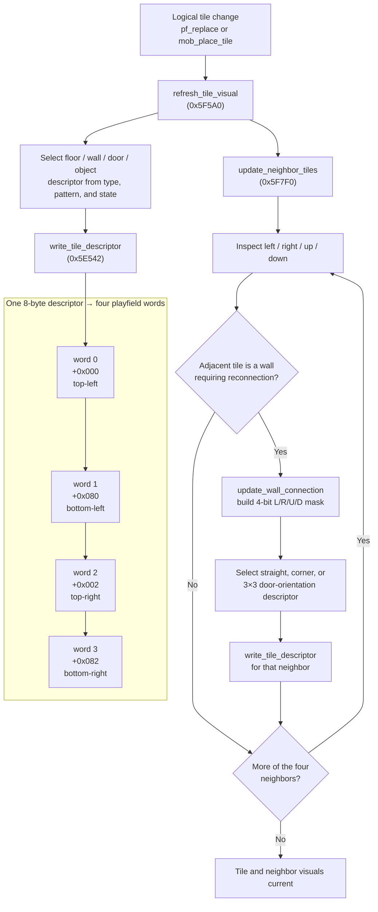
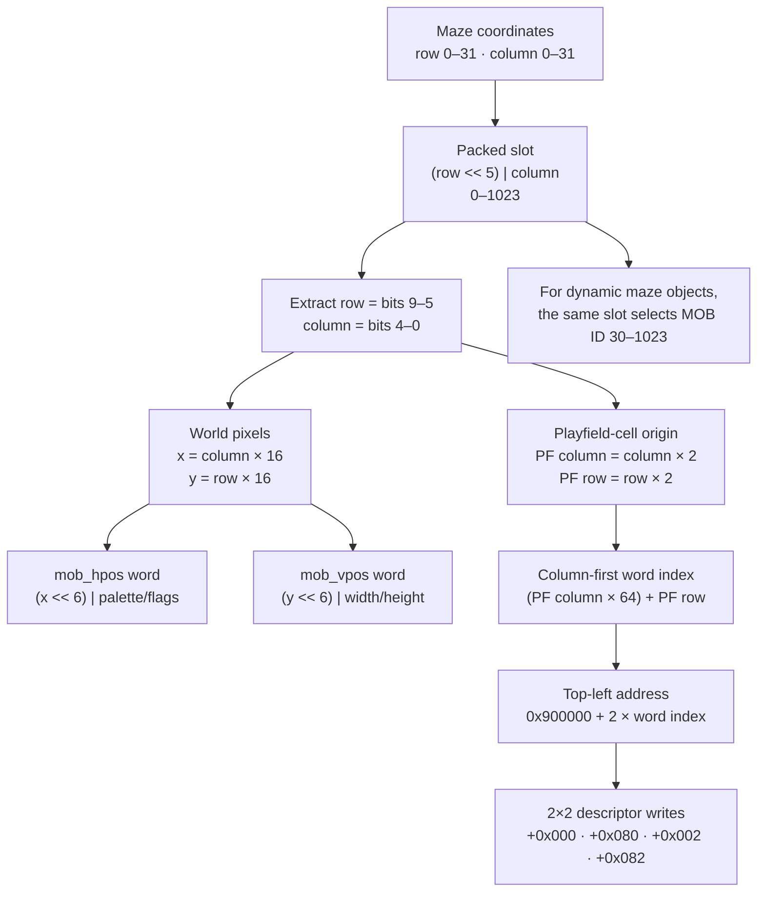
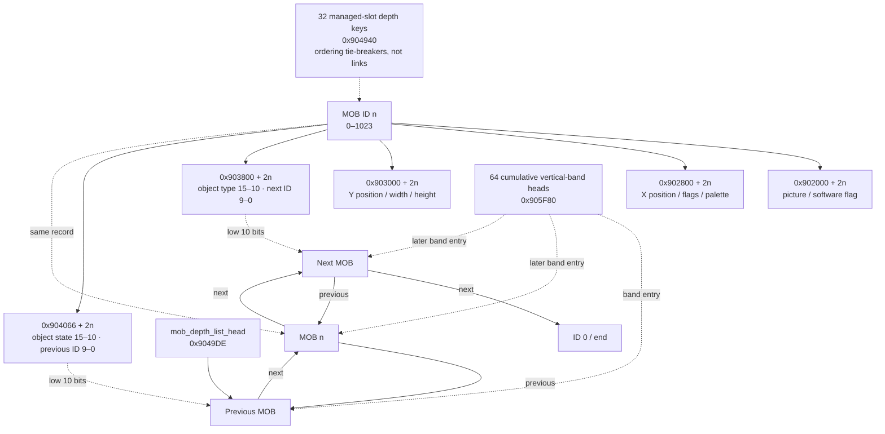

# Gauntlet II — Game Subsystems

*In-depth analysis of all major game subsystems in the Game ROM (row76.bin).*

---

## 1. MOB ID System & Maze Position Abstractions

**Confidence: Verified** for ranges, fixed assignments, and position encodings.

### 1.1 MOB Hardware Arrays

The hardware supports 1024 MOB slots (IDs 0–1023). Each MOB has 4 words of hardware state in parallel VRAM arrays:

| Array | Base Address | Per-MOB offset | Contents |
|-------|-------------|---------------|----------|
| `mob_picture` | `0x902000` | id × 2 | Tile number (bits 14-0), software flag (bit 15) |
| `mob_hpos` | `0x902800` | id × 2 | X position (bits 15-6), flags (bits 5-4), palette (bits 3-0) |
| `mob_vpos` | `0x903000` | id × 2 | Y position (bits 15-6), width-1 (bits 5-3), height-1 (bits 2-0) |
| `mob_link` | `0x903800` | id × 2 | Maze object type (bits 15-10), next link (bits 9-0) |

Plus one software-only parallel array:

| Array | Base Address | Per-MOB offset | Contents |
|-------|-------------|---------------|----------|
| `mob_state_link` (`mob_anim`) | `0x904066` | id × 2 | Object-specific auxiliary state (bits 15–10) plus universal backward link (bits 9–0) |

### 1.2 MOB ID Assignments

**Fixed IDs (0–29):**

| ID Range | Purpose |
|----------|---------|
| 0 | Linked-list null terminator |
| 1–4 | Player shots |
| 5–8 | Demon shots |
| 9–12 | Lobber shots |
| 13–16 | Shot explosion animations |
| 17–20 | Floating score popups |
| 21–24 | Player exit animations |
| 25–29 | Transporter animations (5 slots) |

**Dynamic IDs (30–1023):** maze objects — monsters, generators, items, doors, exits, transporters, forcefields.

### 1.3 Two Levels of Position Abstraction

**Slot positions** (maze grid): A 10-bit value encoding row (bits 9:5) and column (bits 4:0) in the 32×32 tile maze grid. Used in `mob_link`, the tport/exit position tables, and slot-based collision detection.

**Pixel positions**: The actual pixel X/Y stored in `mob_hpos`/`mob_vpos`
(bits 15–6 = pixel coordinate). For an unadjusted maze slot,
`pixel_x = column × 16` and `pixel_y = row × 16`; the words store those values
pre-shifted left by six, with palette/size fields in the low bits. Individual
object constructors may then apply sprite-origin corrections. **Contradicted
and corrected:** the former scalar `slot_position × 32` approximation mixed
the packed row/column value with the two independent pixel axes.

---

## 2. MOB Animation System

**Confidence: Verified** for state fields, lookup indexing, and live animation
paths unless an individual legacy entry is labeled otherwise.

### 2.1 Multiplexed MOB State/Back-Link (`0x904066`)

Each slot has a word at `0x904066 + mob_id × 2`. The old name `mob_anim` describes ordinary monsters but not the array's general role:

| Object/use | Bits 15–10 |
|------------|------------|
| Ordinary monster | Bits 15–13 animation counter; bits 12–10 direction |
| Player MOB | Player number, recovered with `state >> 10` by shot-hit handling |
| Door tile | Four-bit adjacent-door/shape mask in bits 13–10 |
| Forcefield hub (type 0x3F) | Segment/graphic variant; `pf_floor_update` selects table 0x5BA70 from the upper state bits |
| Movable wall | Hit accumulator in units of 0x400; dissolves at 0x6400 (25 hits) |

Bits 9–0 always hold the previous MOB ID in the software depth-sorted list. A precise general name is therefore `mob_state_link`; documentation retains `mob_anim` as a historical alias where discussing monster animation.

### 2.2 Player Animation Modes

Players have three animation modes:

1. **Standing/idle:** Tile from `anim_table_idle` (0x58A4A), indexed by `(direction, char_type × 8)`. Stationary, no fight/shoot.

2. **Walking:** Tile from `anim_table_walking` (0x58A8A), indexed by `(anim_counter/4 & 3, direction, char_type × 32)`. Counter increments each frame of movement.

3. **Fighting/shooting:** Tile from `anim_table_shooting` (0x5874A), indexed by `(anim_counter/4 & 3, direction, char_type × 64)`. At end of shooting animation: calls `player_create_shot`.

**Invisibility flickering:** When the invisibility power-up is active with a short timer remaining, the `invisibility_flash_masks` table (0x58070) ANDs a frame-dependent mask with the frame counter. When the result is zero, the player's MOB picture is set to `0x1709` (blank/invisible) — creating a flickering effect.

### 2.3 Monster Animation

Monsters use direct tile lookup tables (64 entries per monster type). Monster animation advances by incrementing the animation counter in `mob_anim` bits 15-13. Direction bits (12-10) select the facing direction, which is combined with the animation counter to select the tile from the type's animation table.

### 2.4 Player Palette Handler Stubs

**Confidence: Verified.** Player setup selects one power-cycle and one
hurt-cycle handler from the character-indexed pointer tables at 0x57842 and
0x57852, then writes those addresses into the eight RAM JMP stubs at
0x905F00–0x905F2F. VBLANK calls the installed stubs with the cycle byte offset
in D0 and source/destination palette pointers in A1/A2. The eight ROM leaves at
0x404A0–0x40527 are therefore live callable code even though no static direct
call targets them; each preserves registers and copies the character-specific
palette words for its power or hurt effect.

---

## 3. Monster System

**Confidence: Verified** for dispatch, movement/combat contracts, type ranges,
and table consumers.

### 3.1 Main Entry Point (`monsters_everything`, 0x40E6A)

Called once per frame. Iterates all MOB slots, dispatching to per-monster-type handlers. Manages monster health, shot generation, and generator spawning.

### 3.2 Monster Dispatch

`monsters_everything` does NOT use a jump table. Instead, it uses a single shared handler with conditional branches:

```
1. Extract type from mob_link bits 15-10
2. Is type a generator (types 28–45)?
   YES → generator spawning code (0x41026)
3. Is type a super sorcerer (26)?
   YES → special sorcerer placement/teleport handler (0x4106A)
4. ALL other monster types (18-25, 27) → shared handler at 0x4119A
```

### 3.3 Shared Monster Handler (0x4119A)

Uses `mob_hpos` flag bits to determine monster state:

| Bit 5 | Bit 4 | State | Behavior |
|-------|-------|-------|----------|
| 1 | x | Moving | Advance animation, check collisions, continue movement |
| 0 | 1 | Chasing | Move toward target player, check for shooting opportunity |
| 0 | 0 | Idle | Find nearest player (`monster_find_and_shoot`), start chasing |

**Special-case handling within chasing state:**
- **Sorcerer (type 0x10):** Skips physical movement; only animates and shoots from distance
- **Acid (type 0x1C):** Uses fixed direction advance value 0x1E; moves in fixed pattern
- **IT (type 0x24):** Direction adjusted from odd-angle table; moves erratically

**Monster speeds:** All types share base speed 0x80. The speed table at 0x40E02 (7 longwords) overrides specific types to 0x100 (double speed) when fast-monster level flags are active. Movement is probabilistic: each frame, `random(32)` is compared against the speed value — higher speed = higher chance of moving.

#### Super Sorcerer placement

**Confidence: Verified.** `supersorc_place` (0x5FDE0) relocates an existing
Super Sorcerer MOB rather than allocating one. It starts with the player index
in D0, tries all four players cyclically, and skips inactive players. For each
active player it tests three directions behind that player's facing direction:
straight back, then the two adjacent directions. The parallel tables at
0x5FDAC/0x5FDB2 supply direction biases `{0,-1,+1}` and required clear runs
`{4,3,3}`. Candidate cells must stay within rows 1–31, be visible, and be
empty except that the target Super Sorcerer's own slot is allowed. A second
eight-cell proximity scan rejects a destination if any MOB is within 0x7C0
in both rendered axes. On success the routine updates the target MOB's H/V
position and direction bits and returns the packed destination tile in D0.w;
after exhausting every player/direction it returns zero. The normal-stack
`supersorc_place_helper(target_mob_slot, starting_player_index)` at 0x5FDB8
loads the fixed MOB-array bases and converts the physical slot to the doubled
byte offset required by the register body.

### 3.4 Generator Spawning (inline in `monster_loop_core`)

When the loop encounters a generator type (28–45), it checks `ram.monster_count` against the level cap. If conditions are met, spawns a new monster MOB at the generator position using the maze-encoded monster type, respecting the max-monsters-per-type cap.

`handle_generate` (0x492C0) is the generator spawn routine called from the type->0x24 branch of `monster_loop_core` (0x41026). Its arguments are the generator's maze/MOB slot, generated monster type index, and spawn probability. On success it chooses a random starting cardinal direction, scans as many as eight neighboring cells using the padded tables at 0x57B50/0x57B68/0x57B80, requires a traversable empty cell, and creates the appropriate tiered monster there. In the special negative game state, `monster_generation_retry_timer` replaces the random probability gate.

### 3.5 Monster Find and Shoot (`monster_find_and_shoot`, 0x41750)

Finds the nearest player within range. Sets monster facing direction. Calls `find_unused_shot` and `monster_create_shot` if attack conditions are met. Target player selection accounts for IT status.

### 3.6 Death (`death_potion_score`, 0x49446 and `death_damage_accumulate`, 0x49A3C)

**Confidence: Verified.** The former potion-AOE description was
**Contradicted**. `death_potion_score(uint16 doubled_death_mob_offset)` does
not scan or damage any object. It indexes the parallel tables at 0x579E2 and
0x579D2 with `death_hits & 7`, displays the selected floating-score variant at
the Death MOB, and returns the corresponding score in D0.l; its caller adds
that value to the player score.

`death_damage_accumulate(uint16 player_index, uint16 death_mob_slot, uint32
damage)` adds the low damage word to that player's counter at 0x904B3A. When
the total becomes greater than 200, it clears the counter, starts a
transporter-cycle effect on the supplied Death slot, and removes that MOB.
The monster/player contact path adds 4 normally or 3 when `player_powers` byte
1 bit 1 is set; a player supershot adds a fixed 25. Thus eight supershots leave
the counter at 200 and the ninth dismisses Death. Ordinary shots increment the
separate global `death_hits` word but do not add to this counter. The counter
belongs to the player rather than a Death MOB, so it can accumulate across
multiple Death MOBs within one level. Successful `player_start_inner`
placement clears it; `main_start_game` uses that path for active players on a
normal level transition, and `player_join` uses it for a mid-level join. There
is no all-monster or player AOE loop in either helper.

### 3.7 Player Hit (`monster_playerhit`, 0x495A6)

Called from monster/player collision dispatch when a monster overlaps a player. It selects contact damage from the 64-word `monster_contact_damage_table` at 0x57A2E, using the contact class and player character and selecting the powered-player half when applicable. It then applies the type-specific collision behavior, including invincibility checks and hurt/low-health audio where appropriate. The `shothit_dist_H/V` words at 0x904028/0x90402A are collision-distance scratch values used by shot and MOB probes; they are not damage tables.

### 3.8 Monster / Combat Calling Contracts

**Confidence: Verified.** `monsters_everything(uint16 first_mob_offset)` is a
frameless wrapper: after saving `D2-D7/A2-A6`, it reads the low word of its
normal first stack argument at 0x32(A7). The caller supplies a doubled MOB-list
head from the active priority bucket. It returns no value.

The entries at `monster_loop_core` (0x40FAE), `monster_special_handler`
(0x4119A), and `monster_update_anim_tile` (0x414A4) are not ordinary callable
functions. They are branch targets inside the saved-register/local-stack frame
of `monsters_everything` and continue to its iteration or epilogue. The BSR-only
`monster_find_and_shoot` additionally consumes the caller-pushed monster-type
word at 8(A6) after creating its own frame. `find_unused_shot` returns the
selected doubled shot offset in `D4.w` with Z set only for a free slot;
`monster_shooter_in_view` returns `D4.l=-1` in view and zero outside.

The standard stack contracts are:

- `monster_create_shot(monster_slot, direction, shot_slot)` → void
- `handle_generate(generator_slot, generated_type, spawn_probability)` → void
- `monster_playerhit(player_slot, monster_slot)` → void
- `shot_mob_collision(shot_mob_slot, shooter_id)` → target slot or `-1` in `D0.w`
- `resolve_shot_hit(target, shooter_id)` → `D0.l`, zero survives and `-1` is consumed
- `shot_onscreen_check(target, horizontal_limit, vertical_limit)` → `-1` in range, zero outside
- `shot_reflect_calc(target, shooter_id)` → reflected direction in `D0.w`
- `wall_crumble(packed_slot, damage)` → `-1` destroyed, zero remains
- `dragon_shot_hit(target, shooter_id)` and `shot_impact_spawn(target, shooter)` → void

`shot_collision_candidate_core` and `dragon_shot_hitbox_adjust` are register
leaves. The candidate helper retains/tags the candidate in `D0.w`, returns the
candidate type/result or `-1` in `D2.w`, and exposes rejection through N. The
dragon helper adds 0x1000 to `D0.w` only when the shot overlaps the moving head
hitbox. Complete register inputs and control-transfer sites are in
[`generated/monster_combat_contracts.csv`](generated/monster_combat_contracts.csv).

---

## 4. Player System

**Confidence: Verified** for state transitions, inputs, movement, damage, and
the callable contracts summarized here.

### 4.1 Per-Frame Player Processing (`main_move_players`, 0x4A53A)

Processes all 4 player slots each frame. Four main sections:

1. **Game mode gate:** If `game_mode ≥ 0` (normal gameplay): skip demo section. If `0xFFFD` (DEMO): use demo playback. If TITLE/SCORES/LEGEND: skip entirely.

2. **Demo playback:** Reads 2-byte entries from per-player demo streams. Entry format: `[timer_byte, joystick_byte]`. Special values: `0xFF` = speech command, `0xFE` = player switch/end-of-sequence.

3. **Per-player loop:** For each player, dispatches on `player_status`:
   - Status `0x20` (secret winner name entry): run `secret_name_entry_update`
   - Status `0x04` (dying): run death sequence
   - Status `0x08` (dead/respawn wait): cycle idle animation; when counter reaches 0x20, transition to removed and call `show_continue_prompt` if no players remain
   - Active gameplay: update the 60-frame damage sample, power-up timers, input, movement, tile interactions, shooting, and animation

4. **Post-loop:** When the idle timer exceeds its configured threshold,
   `open_timed_doors` removes every active type-0x0D/0x0E door object and plays
   sound 0x12 ("Doors Open"); independently, trigger trap-wall conversion if
   the step counter reaches 21000. The former walk-bonus interpretation was
   **Contradicted**.

### 4.2 Player Movement (`player_try_move`, 0x41BF0)

**Confidence: Verified**, except the meaning of a zero return from the four
door-traversal helpers, which is a **Strong inference** from every consuming
branch.

The core collision-checked movement function takes three normal stack
arguments, `uint16 player_index, int16 delta, uint16 movement_flags`, and
returns its movement result in `D0.w`: `0x00F0` means no movement and every
other observed value means movement occurred. It is a frameless wrapper, but
saves `D2-D7/A2-A6` before reading the arguments at their resulting stack
offsets. It handles:

- Orthogonal and diagonal movement with wall collision
- Door traversal (calls `door_traverse_right/left/up/down`)
- Squeeze-through corner geometry check
- Ray-march functions for each direction

The internal movement graph does not use the normal stack ABI. The reentry at
`player_try_move_core` receives the doubled player index in `D0.w`, delta in
`D6.w`, flags in `D7.w`, and the MOB arrays in `A2-A4`. Directional tile probes
receive the current doubled slot in `D2.w` and coordinates in `D3/D4`; they
return the candidate in `D1.w` and collision status in carry. The squeeze
helper receives candidate/current/player offsets in `D1/D2/D5`, returning a
boolean in `D0.l` with Z set from that result.

The four `mob_probe_*` stack leaves take `uint16 mob_slot` and return the first
blocking slot in `D0.w`, or `-1` when clear. The up/down probes can instead
return `0x0400` at the vertical boundary; callers therefore must not treat all
nonnegative values as actual MOB slots. Their shared candidate helper is a
BSR-only register entry and returns its blocking predicate in carry.

Door traversal is a register/shared-stack convention: `D2.w` is the current
offset, `A2-A4` are MOB arrays, and the helper reads the caller's saved `D5`
coordinate from the stack. Its `D0.w` result is consumed through Z; all callers
use zero as the handled-path branch. The four ray marchers receive current
offset, clearance, coordinates, and arrays in `D2-D5/A2-A4`; they return a
candidate doubled offset or `-1` in `D1.w`, with N signalling failure, and set
bit 31 of `D2` on failure.

The complete checked contracts and direct control-transfer sites are in
[`generated/player_collision_contracts.csv`](generated/player_collision_contracts.csv).

### 4.3 Player Health

> **Correction:** Player health is a **32-bit longword** at `0x904980` (stride 4, 4 players), not a 16-bit word as REPORT.md claimed (verified — e.g., the acid damage path reads/writes `0x904980 + player*4` as longwords).

Health drain is handled by `main_health_countdown` (0x466F6): automatic per-frame health reduction plus the low-health warning cadence. Below 200 health, it increments `player_state_timer` (`0x904A26[player]`) modulo 0x8000. A seven-word mask table at 0x576A8, selected by `health >> 5`, makes the heartbeat progressively more frequent as health falls; the health-number renderer uses the timer's low nibble for an 8-frames-dim/8-frames-normal pulse. At 200 health or above, the timer is reset to `0xFFFF` (disabled). The same RAM words are reused as death/name-entry countdowns when the player is no longer active; see §10.3.

**Confidence: Verified.** `player_damage_sample_update(uint16 player_index)`
(0x50E34), formerly misidentified as a pickup detector, advances a signed
60-frame window. At expiry it increments the sample count, checks low-health
damage thresholds and the one-shot low-health dialog/voice, accumulates pending
damage above 20 with saturation at 0x7D00, and uses the cumulative average for
contextual damage speech. It then reloads the timer to 60 and clears pending
damage. Tile pickup handling instead occurs through the movement/collision
dispatch in §4.6.

When coins are inserted for an active player (`coincheck`): adds health from table at 0x57862 indexed by `(game_settings & 0x1F)`.

### 4.4 Player Joining

**Confidence: Verified.** `player_join(uint8 player_index)` (0x48BB6) is the
outer wrapper. It calls `player_start_inner(uint16 player_index)` (0x48BEC),
which finds a usable spawn tile, creates the player MOB, installs the two
character-specific RAM jump stubs, initializes per-player movement/effect
state, increments `level_players_active`, and returns -1 on success or 0 when
no usable spawn position exists. Only after success does the wrapper call
`player_join_finalize(uint16 player_index)` (0x48A36). The finalizer performs
coin initialization when necessary, persists configuration through OS 0x1CC,
sets the player's status/on-level state, plays the character join sound,
redraws the HUD, and calls `speech_welcome`. The former description that
`player_join2` picked the character and initialized the MOB was
**Contradicted**.

### 4.5 IT Mechanic

**Confidence: Verified.** `player_it_label_set(uint16 player_index)` (0x45866)
is the presentation half of an IT transfer. If the requested player is not
already the tracked IT player, it draws the letters "IT" (chars 0x49/0x54,
palette `0xB000 | p<<10`) into that player's HUD column at `0x905048 +
(p*5+8)*128`, plays the character-specific "you're IT" speech from
`speech_charname_tbl` (0x596F6), then sound 0xD4 for the first IT assignment
or 0xD3 for a transfer.

`player_it_label_clear(uint16 player_index)` (0x4590E) erases the two-tile
label. Neither helper writes the IT player variable: the transfer caller
clears the old label, draws/announces the new one, and then stores the new
player in 0x9049DC. The former helper names implied state ownership and were
therefore **Contradicted**.

The IT player variable is at `0x9049DC` (0xFFFF = nobody is IT).

### 4.6 Tile Interaction (`player_tile_interact` / `tile_occupant_interact`, 0x511AC)

Large dispatch by tile type (from `mob_link >> 10`). Handles:
- Food (adds 100 health, plays sound 0x0D)
- Keys (0x13)
- Treasure (0x26, calls `player_add_score_with_mult`)
- Doors (check key count)
- Transporter (calls `player_tport`)
- Exit (calls `player_exit_sequence`)
- Stun tiles (0x32–0x34)
- IT tile (0x35)
- Acid puddle (0x36 — applies acid slow effect)
- Slow-motion (0x37)

**Confidence: Verified.** Its checked contract is
`player_tile_interact(uint16 tile_mob_slot, uint16 player_index)`. It returns
D0.l=-1 when the dispatch handled or consumed the interaction and zero when
the tile is unhandled. Sound calls use a fixed `sound_play` pointer in A2.

### 4.7 Score With Multiplier (`player_add_score_with_mult`, 0x5214C)

**Confidence: Verified.**
`player_add_score_with_mult(uint16 player_index, uint16 base_score) -> void`
adds `base_score × ram.player_bonusmult[player]` to the player's 32-bit score
accumulator at `0x904990` and sets score-redraw bit 0. It does **not** call
`highscore_check`; the former claim was contradicted by its complete body.

**Thief wealth calculation** (for thief targeting, `thief_target_calc`, 0x4DFF6):
- Shot power: +0x3E8
- Extra speed: +0x2BC
- Extra shot speed: +0x1F4
- Extra magic power: +0x12C
- Extra armor: +0xC8
- Extra fight power: +0x64
- Potions: +0x3 each
- Bonus multiplier: +0x1 each
- Keys: +0x2 each

---

## 5. Maze / Level System

**Confidence: Verified** for record selection/decompression, setup order,
flags, and maze-object scans.

### 5.1 Maze Lookup (`find_maze`, 0x40C78)

Maps maze number → data pointer + slapstic bank. See `06_maze_catalog.md` for complete maze table.

### 5.2 New Level Setup (`maze_new_level_setup`, 0x438AE)

Called when transitioning to a new level:
1. Resets thief timer and target to 0xFF
2. Clears dragon encounter flag
3. Optionally sets a random level timer (`0x904B80`)
4. Calls `slapstic_cmd_bitwise` to switch ROM banks
5. Calls `maze_setupnew` with `ram.cur_maze_ptr`
6. Sets up secret room state from maze byte 0
7. Calls `maze_food_mob_consume(0xFFFF)` to find a food tile and mark it as level start slot
8. Calls `scroll_to_slot` to center the view at level start
9. Clears the transporter and exit position tables (`0x910700` and `ram.exit_pos_table` at `0x910740`)
10. Scans all mob_link slots to repopulate tport and exit tables

### 5.3 Maze Decode (`maze_decode`, 0x4C1BC) — fully traced

Decompresses maze data from the slapstic ROM into playfield RAM. See `05_data_reference.md` §3.19 for the verified bytecode encoding (note: 0xC0–0xDF skip *without* adding a wall; only 0xE0–0xFF add one).

Verified decoder mechanics: header bytes 7/8/9/0xA (HT1/HT2/VT1/VT2) are copied to 0x904866/68/6A/6C; the "last type" register initializes to **HT2**; the tile cursor starts at slot 0x20 (row 0 is not emitted by this function); compressed data begins at maze+0xB and game decoding loops until the cursor reaches 0x400. The game does not test a terminator byte. The stored ROM records nevertheless end in a zero delimiter after the final consumed byte; offline extraction uses adjacent pointer-table entries for record length and verifies this delimiter. For bytecodes 0x40–0x7F, `(b>>4)&3` selects HT1/VT1/HT2/VT2 via the pointer table at 0x59B54; the run count always comes from the bytecode's low nibble (+1); the H/V type byte contributes the mode (top 2 bits, §3.20) and the element (low 6 bits). Horizontal runs use `maze_tile_write` (consecutive increasing slots, returns next cursor); vertical runs use `maze_tile_write_at`, which writes successive elements at decreasing slots (`-0x20`, or `-0x1F` in the odd-angle case) while advancing the main cursor by 1. **Confidence: Verified.**

### 5.4 Maze Object Placement (`maze_place_object`, 0x45E40)

Central dispatcher called by `maze_decode` for each object token. Creates MOBs for:

- **Marker types** (walls, traps, forcefields): writes `mob_picture = 0x8000/0x8001/0x8003`. Post-decode scan renders actual playfield tiles.
- **Dragon (type 0x3C):** Special multi-slot handling — occupies 2×2 maze cells. Calls dragon setup at 0x5496E. **Suppressed** (written as empty) when `game_mode` == 0 and `levelnum_current` < 12 (and level ≠ 9999) — dragons never spawn from maze data before level 12 in a normal game.
- **Invulnerable food (type 0x32):** Random variant selection via `getrandom(3)` from the three-word table at 0x58F20.
- **All other types:** Standard placement using master parameter tables (0x5858C–0x5868C):
  1. Look up the base picture from `mazeobj_base_picture_tbl[type]`
  2. Load the low-nibble horizontal size/monster tier from `mazeobj_hsize_tier_tbl[type]`
  3. Compute H/V positions using `mazeobj_hpos_correction_tbl[type]` and `mazeobj_vpos_offset_tbl[type]`
  4. Call `mob_create(slot, tile, hpos, vpos, type, object_state)`

### 5.5 Level Flags Load & Randomization (`maze_load_pickup_config`, 0x436FE)

Assembles maze header bytes 1–4 (`level_flags_1..4`) big-endian into the **level-flags longword at 0x90491C** — the variable historically called `ram.maze_pickup_config` *is* this long (byte 0 = LFLAG1 at 0x90491C, byte 1 = LFLAG2, byte 2 = LFLAG3, byte 3 = LFLAG4; see the §3.12 enums in `05_data_reference.md`, all verified reader-by-reader).

Then randomizes: LFLAG1 bits 2–3 (long bits 26–27) are XOR'd with `getrandom(4)` every level. On deep levels the game ORs in extra hazards: mazes 5–101 with level%400 > 297 → `get_random_maze_flags()` + 0x30 (WrapV|WrapH) unless LFLAG4 bit 2 (TrapsLocal); > 200 → random flags only; > 103 → 0x30 only. Treasure mazes 104–114 use level%160 with 0xB0 (wraps + offscreen).

`get_random_maze_flags` (0x436CC): selects a random entry from a 13-entry ROM table at 0x57012. If LFLAG4 bit 2 (TrapsLocal) is set and the result is 0x80, overrides to 0x2.

### 5.6 Slapstic Bank Switching (`slapstic_cmd_bitwise`, 0x43826)

Issues the bank-switch command sequence to the Slapstic chip. Reads current bank from `0x904B8C`, uses ROM tables at 0x57046 and 0x5704E to compute access addresses, performs the required read-write sequence to latch the bank.

---

## 6. Attract Mode & Demo Playback

### 6.1 Attract State Machine

**Confidence: Verified.**

Four attract screens cycle in sequence:
1. **SCORES** (0xFFFF): Timer 0x258 (~10 sec). Calls `attract_highscores` (0x4A124): shows 4-way-split high-score-per-coin display.
2. **TITLE** (0xFFFE): Timer 0x5DD (~25 sec). Sets up title screen; manages logo color cycling and scroll animation. Every 13th cycle: refreshes EEPROM settings. If attract sounds enabled: plays theme 0x3B.
3. **DEMO** (0xFFFD): Timer 0x1C20 (~119 sec). Calls `attract_demo_init` (0x449D4): loads demo level (maze 102) and resets frame counter. Player 1 demo is active in standard attract.
4. **LEGEND** (0xFFFC): Timer 0x258. Clears the playfield, draws legend art, and calls `load_legend_page` (0x4CD1C). That routine always loads maze 103 and dispatches selector 0 to the overview page, selector 2 to the rules page, and other values to the monsters page.

The DEMO and LEGEND setup paths are distinct. `attract_demo_init` (0x449D4)
loads maze 102 and installs the player-1 Elf input stream at 0x581C4;
`load_legend_page` (0x4CD1C) loads maze 103 as the background for one of the
three explanatory pages. The former `load_demo_level` name at 0x4CD1C was
therefore **Contradicted**.

### 6.2 Demo Data Format

Demo input streams are stored at ROM 0x5818C+. Format: 2-byte entries.

| Byte 1 | Byte 2 | Meaning |
|--------|--------|---------|
| ≤ 0xFD | — | Normal timer value (countdown between events) |
| 0xFF | argument | Speech/sound command; argument is the speech ID |
| 0xFE | packed | End-of-sequence / player switch: hi nibble=direction, lo nibble=player slot. Resets pointer to initial value from ROM table at 0x58098. |

The demo data pointer for each player is at `0x904B66[player × 4]` (longword). The frame timer is at `0x904B76[player]` (byte).

The second byte is an active-low joystick value for normal input records:

| Bit | Function | 0 = Pressed |
|-----|----------|-------------|
| 7 | UP | Moving up |
| 6 | DOWN | Moving down |
| 5 | LEFT | Moving left |
| 4 | RIGHT | Moving right |
| 3 | (spare) | Not connected |
| 2 | (spare) | Not connected |
| 1 | FIRE | Attacking |
| 0 | MAGIC | Using potion |

For example, `0xB3` presses DOWN; `0xF3` supplies no input.

| Player | ROM Address | Exact size | Notes |
|--------|-------------|------------|-------|
| Player 0 | 0x5818C | 56 B | 28 command pairs; not active in the standard demo |
| Player 1 | 0x581C4 | 150 B | 75 command pairs; active Elf stream in the standard demo |
| Player 2 | 0x5825A | 2 B | One minimal command pair |
| Player 3 | 0x5825C | 48 B | 24 command pairs through 0x5828B |

The initial pointer table is at ROM 0x58098 (four longwords).

### 6.3 Demo Setup (`attract_demo_init`, 0x449D4)

When transitioning to DEMO mode, the routine hides the maze, rebuilds the
information panel, clears dialog flags, loads maze 102, and runs new-level
setup. It selects player 1 as the Elf, joins that player, installs pointer
0x581C4 and its first timer byte, and clears the pointers and timers for
players 0, 2, and 3.

### 6.4 Attract-Mode Interruption

During attract mode, the game checks raw joystick ports 0x904922 and 0x904924
(players 2 and 3). With paid pricing it tests FIRE+MAGIC (`0x03`); in free
play it tests FIRE only (`0x02`). A qualifying input plus START calls
`start_attract_to_game` (0x44204).

The input thresholds are exactly 60 frames below each screen's loaded timer,
creating a one-second input lockout rather than changing screen duration:

| Mode | Threshold | Loaded timer |
|------|-----------|--------------|
| SCORES (0xFFFF) | 0x21C | 0x258 |
| TITLE (0xFFFE) | 0x5A1 | 0x5DD |
| DEMO (0xFFFD) | 0x1BE4 | 0x1C20 |
| LEGEND (0xFFFC) | 0x21C | 0x258 |

LEGEND has multiple sub-screens tracked by `attract_legend` (0x90491A),
initially 2 and counting down.

---

## 7. Transporter & Forcefield Systems

### 7.1 Transporter Animation

**Confidence: Verified.** Transporter-effect MOBs use pictures 0x924–0x95A.
`tport_cycle_start` (0x47C0E) chooses an effect MOB in slots 0x0D–0x10,
initializes its picture to 0x924, copies the source MOB's tile-aligned position,
inserts it into the depth list, and initializes one of the four byte animation
counters at 0x90497C–0x90497F to 0xFF.  Loop 3 of `main_score_update`
(0x4715E), not a separate function at 0x47DAE, increments those counters every
frame; on even counter values it indexes `score_star_picture_cycle` (0x576B6)
and removes the effect after counter/2 reaches 0x0E.  Address 0x47DAE is the
unrelated, checked `shot_impact_spawn(target_slot, shooter_slot)` routine.

The four byte counters deliberately overlap the last two words of the broader
`mob_depth_key` storage view.  They are animation-channel state, not
"transporter active flags."

Transporter position table: `tport_pos_table` at `0x910700` (word array[32]), populated during level setup.

### 7.2 Teleportation Sequence

When a player touches a transporter:
1. `player_tport` (0x50224) → `tport_player_flash` (0x50616): saves player MOB picture, sets picture to 0x1709 (flash frame)
2. `tport_player_move` (0x50662): finds valid destination via `tport_check_dest` (0x50ADE), handles IT/thief handoff, plays transport sound (0x28), calls `handle_tport` at destination
3. `handle_tport` (0x47CFE): copies player position to an animation slot and creates the `tport_create_splodey` effect
4. `tport_restore_player_picture` (0x50B88), the one-argument completion leaf used when the per-player movement state reaches 0x10, maps the player index through `active_mob_ids` and restores that MOB's picture from `tport_saved_picture[player]`

`tport_check_dest(destination_mob_slot, player_index)` (0x50ADE) returns 1
for a blocked destination and 0 for a usable one.  Blocking cases include an
empty/reserved MOB picture, wall types 0x2F/0x3C/0x3E, and door types 0x0D/0x0E
when the player has no key.

### 7.3 Forcefield Segment Format

Each entry in the forcefield segment table at `0x910780` is a 16-bit word (terminated by 0):

| Bits | Field | Description |
|------|-------|-------------|
| 15 | direction | 1 = horizontal, 0 = vertical |
| 14 | wrap | 1 = wraps around maze edge |
| 13–10 | length_m1 | Length minus 1 (0–15 → 1–16 tiles) |
| 9–0 | hub_slot | Slot position of forcefield hub (row × 32 + col) |

`pf_isff` (0x5FC5E): iterates the segment table. For each entry:
1. Extract hub_slot from bits 9-0; compute delta = query_slot - hub_slot
2. If bit 14 (wrap): adjust delta for maze edge wrapping
3. If delta ≤ 0: no hit
4. If bit 15 (horizontal): hit if delta < length
5. If vertical: check same column, then check delta/32 < length

### 7.4 Forcefield Color Cycling (`main_cycle_tport_and_ffield`, 0x40528)

Part 1 (transporter): 2-bit sub-frame divider at `0x904034` ticks every 4th frame. Position counter at `0x904030` bounces 0→4→0 via direction word at `0x904032` (±1).

The resulting `tport_cycle_pos` selects one of the six 16-byte palette blocks
at 0x5AFAE for the VBLANK color copy.  This is palette animation and is
independent of the effect-MOB picture sequence in §7.1.

Part 2 (forcefield): Step counter at `0x904049` cycles 0→7. Each step's duration = ROM table value + random(8). On even steps: reads one of 4 color words from ROM table at 0x405C0, writes to `forcefield_color` at `0x904046`. On odd steps: writes 0 (blink off).

---

## 8. Dragon System

**Confidence: Verified** for state-machine entries, segment rendering, shot
allocation, and proximity/fire contracts.

### 8.1 Dragon State (`main_handle_dragon`, 0x54454)

Dragon state is encoded in `ram.dragon_state` (`0x904890`) as a bitmask:

| Bit | Meaning |
|-----|---------|
| 0 | Awake (1) / sleeping (0) |
| 1 | Stunned |
| 2 | Turning |
| 3 | Locked (door-blocking behavior) |

**Wakeup:** Triggered by `dragon_player_proximity` (0x549EA) which checks if any player is within col ±9, row ±5. Starts wake animation (negative `ram.dragon_anim_ctr`).

**Active:** Tests the current path byte's fire trigger, allocates a shot with
`dragon_find_free_shot_slot`, calls `dragon_fire_setup` when possible, chooses
movement state with `dragon_choose_move_direction`, and updates the rendered
segments with `dragon_update_segments` when the movement phase requires it.

**Stunned:** Decrements `ram.dragon_stun_timer` (`0x90487C`), returns to active when 0.

### 8.2 Dragon Movement and Attacks

`dragon_choose_move_direction` (0x53E4A) compares the dragon with active
players, probes candidate maze cells, selects the best unobstructed direction,
and updates the packed movement state, facing, and signed animation phase.

`dragon_update_segments` (0x53D10) reads the current path pose and facing,
updates the four dragon segment MOB positions/pictures from the pose tables,
and clears the turning/update bit when the segments reach the required
alignment.

`dragon_fire_setup` (0x54748, formerly `_x100`/`dragon_fire_attack`): fires one fireball. Sets `dragon_fire_cooldown` (0x90487C) = 8; the fireball's origin segment is `dragon_seg_mob_ids[tbl_0x5D4B8[pose + facing*2]]` (a signed-byte index into the 4-word segment MOB-id array at 0x904894); the shot direction array `0x9049C4[shot_slot]` receives `dragon_facing`.

`dragon_find_free_shot_slot` (0x540E8) scans physical dragon-shot MOB slots
8 down to 5 and returns the corresponding logical subslot 4 down to 1, or zero
when all four are occupied. It is called when the current path byte's fire bit
is set, `dragon_fire_cooldown` == 0, and `(dragon_move_state & 0xF) < 4`.

### 8.3 Dragon Path System (fully decoded)

The path table at 0x5D578 is **5 path programs × 16 bytes** (0x5D578–0x5D5C7), *not* 128×16. The current program is `dragon_path_num` (0x904886, 0–4); the byte index is `dragon_anim_ctr` (0x904892) >> 3, so the path phase advances every 8 frames and wraps at 128.

**Path byte format:** bit 0 = fire trigger; the byte value (0–7) is the head pose. Head rendering per phase boundary: `idx = byte + facing*4` → picture from 0x5D528, hpos delta from 0x5D438, vpos delta from 0x5D478 (deltas are added to the dragon MOB position and produce `dragon_head_hpos/vpos` 0x904882/84).

**Sustained fire:** while locked-in (state bit 3), a fire byte at a phase boundary holds the counter until the fire cooldown expires (continuous flame), otherwise the counter advances mod 128.

**Damage rules** (`dragon_shot_hit`, 0x54112, called from `resolve_shot_hit`): hits only count when the fire bit is active (mouth open) and the dragon is not sleeping/turning; each hit plays sound 0x3A, increments `dragon_hits` (0x904880) — the 9th kills the dragon — and switches to a new random path (getrandom(5)), fast-forwarded to the first byte matching the current pose so the animation stays continuous.

### 8.4 Dragon ROM Data

| ROM Address | Content |
|-------------|---------|
| 0x5D438 | `dragon_head_hdelta` — head hpos deltas, indexed by pose + facing*4 |
| 0x5D478 | `dragon_head_vdelta` — head vpos deltas |
| 0x5D4B8 | `dragon_fire_segment_tbl` — 16 signed bytes: which segment MOB the fireball spawns from, indexed by pose plus facing offset |
| 0x5D4C8/0x5D4E8 | `dragon_pose_hdelta` / `dragon_pose_vdelta` — 16 pose/facing position words per axis |
| 0x5D508 | `dragon_body_pics` — 16 animation/facing picture words |
| 0x5D528 | `dragon_head_pics` — head picture words, indexed by pose + facing*4 |
| 0x5D578 | `dragon_path_programs` — 5 × 16-byte path programs (see 8.3) |
| 0x54BD6 | `dragon_head_hitbox_offsets` — five padded words forming four overlapping H/V pairs for the cardinal head hitbox |

The dragon data ends at 0x5D5C7. The region 0x5D5C8–0x5DA15, formerly misattributed to the dragon path table, contains the 16-entry playfield palette table, special palettes/color ramps, and the "SECRET CODE" contest strings — see `05_data_reference.md` §5.

---

## 9. Thief / Mugger System

**Confidence: Verified** for state transitions, targeting inputs, collision
callbacks, transport behavior, and route-table effects.

### 9.1 Thief State Machine (`main_thief_anim`, 0x4E8DC)

> **Correction from GAME_ROM_KNOWN.md:** The main loop calls `0x4E8DC`, not `0x4D8DC` — the GRK address was a typo. 0x4D8DC is not a function entry at all: it is the epilogue of `show_level_end_bonus_screen` (0x4D476), which calls `secret_check` and advances the maze/level numbers.

States (in `ram.thief_mode`, `0x904BA0`):

| Mode | Behavior |
|------|----------|
| THIEF_DEAD (0) | Not deployed |
| THIEF_PURSUE (1) | Approaching target player |
| THIEF_ESCAPE (2) | Fleeing after stealing |
| THIEF_DODGE (8) | Dodging obstacles |
| THIEF_ENTER_OK (16) | Entering the level |
| THIEF_IS_MUGGER (128) | Mugger variant |

When overlapping target player: steals an item or health (calls `thief_steal_from_player`, 0x4E1FE), then plays the player-specific “thief” speech (0x62–0x65). Exit when thief reaches the maze edge calls `thief_exit` (0x4E122).

### 9.2 Thief Targeting (`thief_target_calc`, 0x4DFF6)

Calculates player "wealth" using weighted sum of: shot power, extra speed/shot speed/magic power/armor/fight power, potions, bonus multiplier, keys. Selects wealthiest active player as target. Stores in `ram.thief_victim` (`0x904B9A`).

**Confidence: Contradicted.** The former name was corrected: the distinct routine at 0x4FCF0
does not calculate wealth. `thief_find_aligned_shooter()` scans players 0–3,
requires an active player MOB, requires that player's shot direction to be
opposite `thief_direction`, applies horizontal/vertical wrap, and uses the
eight-direction dispatch table at 0x4FE08 to require exact ray alignment. It
returns the first matching player in D0.l or -1. `main_thief_anim` then calls
`thief_begin_dodge` (0x4E1B8), latches that player/direction in
0x904060–0x904062, and later calls `thief_end_dodge` (0x4E172) when the live
shot direction changes. Those two helpers set/clear thief-mode bit 3, toggle
the low pursue/escape bits with XOR 3, and repair `thief_next_pos`; they do not
mark an item stolen or abort a theft transaction.

`thief_track_victim_move(new_packed_pos, player_index)` (0x4E630) is called
from player movement and transporter paths. If the player is the current
`thief_victim` and the position changed, it records the direction from the old
position in the low path-grid nibble and updates `thief_victim_pos`. It does
not erase a MOB or write a blank tile.

### 9.3 Thief Timer (`thief_timer_set`, 0x4E4D8)

Calculates next thief appearance based on target player wealth and current level number. Lower wealth → longer delay. Higher levels → shorter delays. Stored at `ram.thief_enter_time` (`0x904B9E`).

---

## 10. Scoring, Coin & Dialog Systems

**Confidence: Verified** for callable contracts, score/coin arithmetic, dialog
record selection, and observed OS service use.

### 10.1 Coin Detection (`coincheck`, 0x42B6A)

Called every frame. Change-detection pattern: compares `ram.coin_counters` (`0x904FEC`) against cached `ram.last_coin_state` (`0x9049EA`). If they differ, processes all 4 player slots.

Per-player logic:
- If all players have zero health AND in attract mode: call `start_attract_to_game`
- If player HAS health (active re-coining): add health from `0x57862` table, set redraw flag
- If player has NO health (new player joining): call `player_init_for_coin` (0x488CA)

### 10.2 Floating Score Display (`playfield_showscore`, 0x49498)

**Confidence: Verified.**
`playfield_showscore(uint16 source_mob_slot, uint16 popup_type_index) -> void`
scans `ram.score_display_timer` (`0x90493A`, 4 slots) for a free slot. It
copies the source MOB position, selects a picture from the 15-longword table
at 0x579F2, offsets the popup by type, and places it for 60 frames. If all
four popup channels are occupied it returns without replacing one.

### 10.3 High Score Check (`highscore_check`, 0x49D0E)

**Confidence: Verified.**
`highscore_check(uint16 player_index) -> void` calls OS `rank_high_score`
(0x1C6) with the player's character class and 24-bit **score-per-coin** value
from `0x904B1A`, not the raw score and not OS 0x1AE. If the value ranks in the
top 10, it stores the rank in `ram.player_highscore_rank` (`0x904A4A`) and
sets `ram.player_status = 0x04` (name entry mode).

It also initializes `player_state_timer` (`0x904A26[player]`): a qualifying score gets 0x0A8C (2700 frames, 45 seconds) for initials entry, while a non-qualifying score gets 0x0258 (600 frames, 10 seconds) for the GAME OVER display. `player_death_sequence` and the per-player loop decrement this timer. This is the death-state reuse of the live player's low-health warning counter.

### 10.4 First-Encounter Dialogs (`dialog_first_encounter`, 0x4C440)

**Confidence: Verified.** The checked contract is
`dialog_first_encounter(player_index, encounter_mask, [numeric_value])`.
The third word is consumed only by the numeric-message record; ordinary
callers deliberately pass only player and mask. The function returns 1 in
`D0.l` when the selected dialog has a speech entry and 0 otherwise, including
already-seen/no-record paths. It uses `ram.dialog_first_encounter_flags`
(`0x9049E4`) as a 32-bit bitmask, chooses message records through the pointer
tables at 0x5A200/0x5A300, and plays sound 0x1C when it displays the box.

### 10.5 Continue Prompt (`show_continue_prompt`, 0x44C7E)

**Confidence: Verified.** This is the routine that conditionally draws the
six-line continue prompt. It first requires `level_players_active == 0`, a
level other than 1, an enabled display timer, and every player status to be
either zero or character-select (`0x10`). It does not decrement
`level_players_active`; the former `update_maze_player_count` description was
**Contradicted**.

Text is drawn through the fixed OS `draw_string` service in `A2=0x25A`:
```
LEVEL: [N]
PRESS START
WITHIN    SECONDS
TO CONTINUE GAME
AT THIS LEVEL
```

Sound 0x3B ("Gauntlet II Theme Song") plays when shown, and
`title_intro_state` is set to 1. The shared attract/display timer `0x904B7C`
must not contain its disabled sentinel (`0xFFFF`).

`show_level_end_bonus_screen` (0x4D476) is a separate no-argument routine.
It clears the alpha display and renders the end-of-level treasure calculation
using the strings at 0x5AB1A–0x5AB63: ordinary treasure rooms award the
displayed `100 × players × coins × treasures` result, while the secret-room
path can award `5,000 × coins`. It removes departing player sprites, restores
the saved secret-room counters, changes game mode, runs `secret_check`, and
loads the saved next maze/level. The earlier name `show_continue_screen` was
**Contradicted**.

`secret_bonus_earned` (0x4D1A4) supplies the secret-room award predicate. It
checks the active challenge code and the entrant's progress (and scans the
playfield for challenge 0x53), returning -1 when the 5,000-per-coin bonus is
earned and 0 otherwise. Its former `secret_continue_disallowed` meaning was
**Contradicted**; it is called only from the secret bonus path.

### 10.6 Secret Room (verified by disassembly)

Secret-room availability is paced by a pair of level counters (the old "score counter/threshold" description was wrong):

- `secret_possible_counter` (0x904878) counts down **once per level** (decrement site 0x4A748); both it and `secret_possible_start` (0x90487A) initialize to 20 at game init (0x43312). When the countdown reaches 0, `maze_new_level_setup` may activate a secret room by loading the maze's secret-room config byte into `0x904065` (the ordinary 0x01–0x11 trick ID; see §3.17 in `05_data_reference.md`).
- `secret_check` (0x486FE) runs at level transitions (from `main_start_game` at 0x480EC when the between-level delay `0x904A4E` expires, and from the `show_level_end_bonus_screen` epilogue at 0x4D8DC). If a secret room was active (`0x904065` ≠ 0): when a valid player (0–3) is in `0x904063`, it records the maze number into `secret_prev_maze` (0x904870) and adds 15 to the start value (clamped at 40) — secret rooms become rarer after a win; when nobody entered, it subtracts 2 (floor 4) — they come sooner. Either way the countdown reloads from the start value. (The `update_bgm_volume` name from FUNCTIONS_PLAN.md is refuted — the function touches no sound state.)
- `secret_getname` (0x54EC6) handles the winner: with EEPROM settings bit 13 set it opens the name-entry screen (buffer 0x904AA4 = 'A' + spaces, `player_status` = 0x20, "ENTER YOUR" / "'LAST-NAME FIRST-NAME'" prompts); otherwise `player_status` = 2 and a short between-level delay.
- `secret_name_entry_update` (0x54FE8), selected only by status 0x20, edits
  that winner's name using `ram.secret_player`, calls the live character-step
  and small-character draw helpers at 0x55440/0x554B6, and invokes
  `secret_code_build` when entry completes. It is not a player spawn or entry
  animation; the former interpretation was **Contradicted**.
- After name entry, `secret_code_build` (0x54BE0) replaces the same buffer with a six-character `XXX-XXX` code. It CRC-CCITT-hashes the entered name while ignoring spaces, derives three symbols from that hash, derives three more from the packed previous-maze/trick/challenge state, and interleaves the groups through the 32-character alphabet at 0x54CA6. The 256-word CRC table occupies exactly 0x54CC6–0x54EC5.
- After a player earns the secret challenge, `show_level_start_screen` (0x44DB4; formerly misnamed `spawn_enemies_attract`) saves the maze trick in `0x904064`, replaces `0x904065` with a random task code 0x50–0x5D, selects a time limit from tables at 0x57360/0x5737C, and displays the optional task qualifier from the 14-record table at 0x573D4. It initializes the secret maze number to 115, compares the task against 0x57, and increments the maze number for tasks 0x57–0x5D before calling `maze_select_bank_special`; tasks 0x50–0x56 therefore use maze 115 and tasks 0x57–0x5D use maze 116. Code 0x5A is valid: its qualifier is “AFTER REMOVING ALL TREASURE,” and a supershot hit on ordinary treasure increments the player's progress.
- Trick progress/violations are recorded per player in `secret_tricks_flags` (0x904872). Ordinary-maze hooks in `resolve_shot_hit` include trick 5 (shoot food), trick 9 (get hit), and trick 17 (hurt another player); the same array is reused for challenge codes 0x50–0x5D.

---

## 11. Sound System

### 11.1 Sound Queue (`sound_play`, 0x4AD76)

Enqueues an 8-bit sound ID into a circular ring buffer (8 slots at `0x90404B`). Write head at `0x904053`, read head at `0x904054`. Drops silently if queue is full.

**Confidence: Verified.** `sound_play(uint8 sound_id) -> void`. When
`speech_counter` is zero it first calls OS `try_send_sound_command` (0x242):
an immediately accepted command is not queued; a busy result falls back to
the ring. While speech traffic is active it skips the immediate attempt and
queues directly. The former “sound enabled/channel already playing”
description and the OS name `enable_interrupts` were contradicted by the OS
and game bodies.

### 11.2 Sound Dispatch (`main_update_sound`, 0x4AE20)

Called every frame. It skips work during frame overflow or while speech is in
progress. Otherwise it drains up to eight entries, stopping when the ring is
empty or OS `try_send_sound_command` (0x242) reports busy. Each accepted byte
is replaced with 0xFF, the read head advances modulo eight, and a short delay
separates commands.

The physical ring has eight byte slots but reserves one state to distinguish
full from empty, so usable capacity is seven. A full ring drops the new byte
without moving either index. `sound_queue_reset` fills all eight slots with
0xFF and zeroes both indices.

### 11.3 Sound Responses and Recovery (`sound_response`, 0x42D0A)

Called every frame. It polls OS 0x178; no response is reported as 0xFFFF. A
0xFF response while `speech_counter` (0x9049EE) is nonzero marks speech
complete; other unexpected responses invoke `sound_system_reset`.

When idle, nonzero low bits in `sound_queue_state` (0x9049F0) force a reset.
Otherwise it advances the speech and idle timer (0x9049F2), then sends ping
command 0x07 through OS 0x172 after the idle timer expires. A successful ping
reloads the timer to 240 frames and clears retry count 0x9049F4. After 180
failed retries it performs a full reset. `sound_system_reset` calls OS 0x254,
gives the sound CPU a 180-frame grace period, clears queue/retry state, and
resets the ring.

### 11.4 Speech (`sound_speech_play`, 0x4AD4E)

**Confidence: Verified.** `sound_speech_play(uint8 sound_id) -> void` calls
`sound_play` only when bit 11 of `game_settings` (`0x904A24`) is clear. Used
for speech samples that should be silenced by the "Disable Speech" setting.

### 11.5 Sound IDs Used by the Main Loop

**Confidence: Verified** for command values and ROM call sites. Human-readable
descriptions inherit the supplied `generated/soundcmds.csv` labels.

| ID | Sound |
|----|-------|
| 0x01 | Silence |
| 0x02 | "Noisy" (level start ambience) |
| 0x09–0x0C | Player join sounds (by player index) |
| 0x0D | Food pickup |
| 0x0E–0x11 | Level exit sounds |
| 0x13 | Key pickup |
| 0x18–0x1B | Heartbeat (low health, by player index) |
| 0x1C | Message appears on screen |
| 0x1D | Potion use |
| 0x20 | Death Touches Player (start loop) |
| 0x21 | Death Silencer (stop loop) |
| 0x26 | Treasure pickup |
| 0x27 | Trap/walls turn to exits |
| 0x28 | Teleport |
| 0x29 | Super-thief spawn |
| 0x2B | Cyclic Walls |
| 0x2D | Normal thief spawn |
| 0x2E | Player Touches Force Field (start loop) |
| 0x2F | Force Field Silencer (stop loop) |
| 0x31 | Exit moving |
| 0x35 | IT sound |
| 0x3B | Gauntlet II Theme Song (secret room theme) |
| 0x3C | Music fade-out |
| 0x44 | No potion |
| 0x62–0x65 | Thief speech (by player index) |
| 0xBD–0xCC | Character announcement speech ("RED WARRIOR" through "GREEN ELF") |

---

## 12. Exit System

**Confidence: Verified** for lookup/index semantics, movement, animation, and
level-transition contracts.

### 12.1 Player Exit Sequence (`player_exit_sequence`, 0x52B40)

The checked call contract is
`player_exit_sequence(player_index, exit_mob_slot, exit_type) -> void`.

Player exiting state machine:
1. Play exit sound (0x0E–0x11 by player)
2. Run `exit_create_player_anim` (0x5DF80): create player exit animation MOB
3. Set player state to "exiting"
4. Call `maze_checknum` (0x52ECA) and advance to next level when all exiting players are done

### 12.2 Moving Exit (`main_exit_move`, 0x5287C)

When the maze has the ExitMoves flag, periodically relocates the exit tile to a new random empty position via `maze_randomplace`. Plays sound 0x31.

### 12.3 Exit Position Table

The exit position table (`ram.exit_pos_table`) begins at `0x910740`, immediately
after the 32-word transporter table at 0x910700. It is populated during level
setup by scanning all `mob_link` slots. `exit_get_id(packed_exit_pos)` returns a
zero-based index into this table; a miss returns `level_exit_count`.

---

## 13. Tile Rendering Pipeline

**Confidence: Verified** for the live wrapper/core chain, descriptor formats,
and neighbor updates; the explicitly named legacy entry remains **Strong
inference**.

A logical maze-tile change selects and writes one 2×2 playfield descriptor,
then revisits adjacent walls so their connectivity-dependent graphics remain
consistent with the changed center tile.



### 13.1 Tile Visual Update Chain

When a tile changes (wall placed/removed, door opened, etc.):

```
pf_replace (0x5F31E) or mob_place_tile (0x5F310)
    └→ refresh_tile_visual (0x5F5A0)
        ├→ write_tile_descriptor (0x5E542)  [write 2×2 tiles to VRAM]
        └→ update_neighbor_tiles (0x5F7F0)
            └→ update_wall_connection (0x5F876)  [for each adjacent wall]
                └→ write_tile_descriptor (0x5E542)
```

**Confidence: Verified** for the normal entries. `refresh_tile_visual_stack`
(0x5F598) is the shipped two-word stack wrapper and falls through to the
D0/D1 register core at 0x5F5A0. **Confidence: Strong inference** for
`refresh_tile_visual_legacy` (0x5F644): it is a complete but unreferenced
register entry that distinguishes type-2 wall from floor and shares the live
redraw epilogue, consistent with a retained legacy implementation.

### 13.2 Tile Descriptor Format

Each tile descriptor is 8 bytes = 4 words, written to VRAM positions for a 2×2 tile block:

| Word | VRAM Offset | Position |
|------|------------|----------|
| Word 0 | +0x000 | Top-left |
| Word 1 | +0x080 | Bottom-left |
| Word 2 | +0x002 | Top-right |
| Word 3 | +0x082 | Bottom-right |

### 13.3 Wall Connectivity

`update_wall_connection` (0x5F876): builds a 4-bit connectivity bitmask (left/right/up/down) by examining orthogonal neighbors via `get_wall_type` (0x5F77A). Indexes lookup tables:
- `0x5F9CE`: straight walls (16 entries)
- `0x5FACA`: corner walls (9 entries)
- `0x5FBDC`: `door_gfx_type3`, a 3×3 table for isolated type-3 door orientation (9 entries)

Writes tile type, scroll attributes, and shape index to `0x902000/0x902800/0x903000/0x904066`.

---

## 14. Score Display & Info Panel

### 14.1 Info Panel (`setup_infopanel`, 0x452D0)

**Confidence: Verified.** `setup_infopanel(int16 player_selector) -> void`.
A nonnegative selector redraws one player's alpha-panel state; `-1` clears
and rebuilds the whole panel/screen presentation. The body dispatches on
player status and shares the numeric score/health renderers at 0x45940 and
0x459A2 plus inventory and GAME OVER rendering. It caches fixed OS text
services in A2/A3 for its many calls.

### 14.2 Score Display (`main_score_display`, 0x457C0)

Called every frame, but skips TITLE (0xFFFE) and SCORES (0xFFFF). It selects
one player per frame using `frame_counter & 3` and redraws only fields whose
update conditions require it:

- Score redraw requires bit 2 of 0x904007 and update bit 0, then uses
  `draw_player_score` (0x45940) to render the seven-digit `player_score` at
  0x904990 through OS `display_decimal_value` (0x260), with the flash
  attribute from table 0x57350. It clears update bit 0 afterward.
- Health redraw uses update bit 1 or health below 0xC8 and
  `draw_player_health` (0x459A2). It renders the bonus multiplier when greater
  than one and the five-digit health value at 0x904980. During the dim half of
  a low-health pulse it shifts the palette by −0x1000; acid-slowed players use
  −0x2000. It clears update bit 1 afterward.
- `player_it_label_set` (0x45866) draws and announces the IT label, but its
  caller owns the tracked IT state.

### 14.3 Logo Color Cycling (`main_logo_updcolors`, 0x4DCBA)

`title_logo_init` (0x4DA3E) is the separate no-argument initializer called only by the TITLE branch of `start_attract_screen`. It initializes the brightness sequence and timers, clears ten MOB-color words, then constructs the multi-row logo from MOB slots beginning at 0x21 by writing picture, H/V position, and link arrays. It selects the full or short four-byte motion program at 0x5AC2E/0x5AC4E from `title_intro_state`, backs the pointer up one record for the update routine's pre-increment convention, and starts the logo off-screen with `scroll_apply(-128, 0)`. The routine has its own frame and returns at 0x4DCB8; it is not a tail of `scroll_apply`.

**SCORES mode:** Calls `score_screen_color_cycle` (0x4DE76): every 16th frame, shifts 11 color RAM entries one slot, creating a scrolling rainbow effect on the high-score text.

**TITLE mode:** Two nested timers:
1. **Outer timer** (`0x904A18`): When negative, resets from ROM value at 0x5BA68. Copies 7 words from `0x910206` to `0x910204` (scrolling rainbow on logo text). Repeats for 10 rows.
2. **Inner timer** (`0x904A1A`): When negative, resets from ROM 0x5BA6A. Adds `color_direction` to brightness accumulator, clamps between ROM bounds, negates direction on bounds (pulsing). Updates color RAM at `0x910332`.

Also: scroll animation driven by 4-byte records at ROM pointer `0x904A10`: `[timer, X_delta, Y_delta, Y_addend]`. Calls `scroll_apply` (0x4D956) with pixel-scaled deltas.

---

## 15. Input Debouncing (`input_debounce`, 0x40644)

**Confidence: Verified** from the hand-written rotate/shift implementation and
all four hardware-word reads.

Hand-written assembly (telltale `roxl` instruction — no C compiler would generate this).

For each of 4 players:
1. Read raw input word from hardware port (`0x803000 + player × 2`)
2. Store raw value to `player_input_raw` (`0x904920 + player × 2`)
3. Shift bit 0 of raw input into debounce shift register A (`0x905F58 + player × 2`) via `lsr.w #1, d0; roxl.w addr`
4. Shift bit 1 into debounce shift register B (`0x905F60 + player × 2`)

The shift registers accumulate 16 consecutive frames of each input bit. ANDing multiple bits in the shift register requires N frames of consistent input (eliminates switch bounce).

---

## 16. Treasure Room System (`main_treasure_timer`, 0x4D29E)

**Confidence: Verified** for timer thresholds, speech selection, timeout, and
bonus-screen transition.

Handles the treasure room countdown. When the player enters a treasure room:
- Displays "YOU HAVE X SECONDS TO COLLECT TREASURES"
- Counts down the timer (stored at `ram.treasure_timer`, `0x9049E8`)
- On each full second, displays the numeric countdown through OS 0x272 and normally speaks the matching ZERO–TEN sound from the 11-longword table at 0x5AB64
- At 10 seconds on levels above 30, a 1-in-16 gate may choose one of four fake spoken countdowns. The pointer table at 0x5ABE0 selects a five-number sequence at 0x5AB90–0x5ABDF for displayed seconds 10–6; at 6 it follows with JUST KIDDING or FOOLED YOU from 0x5ABF0
- Without a fake countdown, displayed second 6 has a 1-in-4 chance to play one of four warning lines from 0x5AC08, with a parallel 1/2-second suppression count from 0x5AC18
- At 0, selects a timeout line from 0x5ABF8 (settings bit 11 forces ZERO; otherwise random among ZERO, BETTER LUCK NEXT TIME, ZERO, and LOOKS LIKE YOU LOSE)
- When the timer reaches zero and at least one player remains, calls `show_level_end_bonus_screen` (0x4D476)

Sub-function 0x4D900 (`count_active_players`): counts players with status 1/2/8/0x10.

Treasure room mazes are indexed 104–114 (T1–T11) in the maze catalog.

---

## 17. Camera Scroll System (`main_scroll_playfield`, 0x46CAA)

**Confidence: Verified** for anchors, deltas, bounds, and scroll-register
shadow writes.

Computes the ideal scroll position based on all active players' positions, then smoothly scrolls toward that target. Only runs during GAMEMODE_NORMAL or GAMEMODE_DEMO, and only when `level_players_active > 0`.

**Algorithm:**

1. **Compute player extent:** Iterates over all active players. Uses tile position from `0x904BD8[player*2]` and actual pixel position from MOB arrays. Wraps around ±0x200 for toroidal maze edge scrolling. Computes min/max X and Y, but clamps expansion to ±0xC8 pixels (rubber-band effect — prevents camera from jumping too far for a single distant player).

2. **Compute target scroll:** `target_x = (min_x + max_x) / 2 - 0x68`; `target_y = 0x1E8 - (min_y + max_y)/2 - 0x6C` (Y is inverted for screen coords).

3. **Smooth scroll:** Compare target vs current (`0x904008` / `0x90400A`). If delta ≥ 3: step left/right by 2. If delta ≤ -3: step the other direction. Otherwise snap to target.

4. **`scroll_set_position` (0x46F56):** Clamps to min 5 if no-wrap flags are clear, max 0x1FB. Applies hardware scroll: `(scroll_x << 4) → 0x930000`; `(0x100 - scroll_y) << 4 + 8 → 0x905F6E`.

**RAM used:**
- `0x904BD8`: per-player tile position
- `0x904BCE`: per-player "in maze" flag
- `0x9048C8`: per-player MOB slot
- `0x90491F` bit 5: X-wrap flag; bit 4: Y-wrap flag

---

## 18. Cyclic Wall System (`main_walls_cyclic_move`, 0x5E62A)

**Confidence: Verified** for tile selection, timing, replacement, and redraw
paths.

Manages walls that cycle through open/closed states on a 120-frame (2-second) timer. Only active when `level_flags` bit 3 (`0x90491E`) = CyclicWalls.

**Gate:** Also checks that at least one player has a non-zero MOB slot. Decrements timer at `0x90401A`; when it hits zero, resets to 0x78 (120 frames) and proceeds.

**Cycle phases (0x90401C):** 3 phases (1, 2, 3 cycling). Plays sound 0x2B ("Cyclic Walls") when triggered.

**Tile iteration:** For each tile 32–1023, reads a cycle-assignment byte from Color RAM Spare (`0x910600 + tile/4`). Each byte encodes which cycle phase a group of 4 tiles belongs to (2 bits each). Zero = not a cyclic wall.

- **Match old phase AND tile has wall (mob_picture = 0x8000):** REMOVE wall — zero all 4 VRAM arrays for this slot.
- **Match new phase AND tile is empty (mob_picture = 0):** PLACE wall — write wall type code `(6 + phase) << 10` to link array, compute pixel X/Y from tile position.

Every 64th tile: clears VBLANK semaphore at `0x904002` to yield to display system (prevents tearing during long iterations).

Post-processing: calls `wall_remove_playfield_update` (0x5E888) or `wall_place_playfield_update` (0x5F024) for each modified tile.

Two independent leaf routines follow this function in ROM and must not be treated as cyclic-wall tail blocks:

- `maze_place_object_types` (0x5E7A6) takes one longword stack argument whose low byte is an object type. It scans MOB slots 0x20–0x3FF, accepts `mob_link >> 10` equal to either that type or `type - 3`, optionally rejects off-screen tiles when level-flags byte 4 bit 2 is set, and calls `mob_place_tile(slot, 0)` for each match. It returns 1 if any matching slot was found, otherwise 0. Maze setup calls it for types 0x0A–0x0D according to level flags; `player_tile_interact` calls it again after replacing the relevant maze object.
- `maze_convert_walls_to_exits` (0x5E80C) takes no arguments and scans the same MOB-slot range. It converts picture 0x20F6 and generic wall markers (`mob_picture == 0x8000`) other than forcefields (type 0x3F) by calling `mob_place_tile(slot, 0x10)`. It returns 1 if it converted at least one slot. `main_move_players` calls it when `escape_timer` reaches 0x5208 (21,000 frames), producing the documented all-walls-become-exits escape behavior.

**Confidence: Verified.** The two visibility pairs use exact -1/0
predicates. `tile_on_screen_d4` and stack wrapper `tile_on_screen_test` return
-1 inside the tighter render window; `tile_near_screen_d4` and
`tile_near_screen_test` return -1 inside the wider cyclic-wall/dragon window.
All four return zero outside. The D4 entries save registers and branch into
the corresponding stack wrapper's shared body; dragon code reaches the wider
stack entry indirectly through A2.

The floor renderer likewise has two entries: `pf_floor_draw_xy` receives X/Y
in D0/D1 and skips the normal argument loads, while `pf_floor_update(x,y)`
reads two stack words. Both select forcefield, exit, special-floor, and random
floor descriptors before calling register stamper `pf_stamp_update_regs`.
`pf_stamp_update(position, descriptor4, addend)` is the normal frameless form;
both forms write the four descriptor words to the corresponding 2×2
playfield cells after adding the same palette/base value.

`pf_isblankfloor` was previously documented with inverted polarity and object
type. It returns -1 only when X is nonzero, the picture is 0x8000, and the
object type is **not** 0x3F; otherwise it returns zero. The stack wrapper at
0x5EA26 is retained but has no discovered direct site. The related
`pf_is_connectable_floor_xy` applies the same base test plus the level-flag and
object-types 7–9 exclusions used to choose neighboring floor connectivity.
This correction is **Verified**.

**Confidence: Verified.** Wall and door rendering uses paired entries in the
same style. `pf_wall_draw` (0x5EAB8) receives X/Y in D0/D1; the newly indexed
`pf_wall_draw_stack(uint16 x, uint16 y)` at 0x5EAC2 loads the same values from
the normal stack and falls into the shared body. The stack entry is present in
the shipped ROM but has no discovered direct control site. Both compute an
eight-neighbor connectivity mask and select the pattern-specific four-word
descriptor documented in `05_data_reference.md`.

`mob_place_tile` (0x5F310) is the register form with packed slot in D0 and new
object type in D1. `pf_replace(uint16 packed_slot, uint16 new_object_type)`
(0x5F31E) is the normal-stack form. They share all replacement logic:
unlink/clear an old dynamic MOB where required, update picture/link fields,
redraw the changed cell, update adjacent doors, create special multi-cell
objects, and reserve the dragon footprint for type 0x3C. Both return void.

Door classification is exact: `pf_isdoor` and `pf_isdoor_stack` return class 1
for pictures 0x9D18–0x9D3B, class 2 for 0x9D3C–0x9D7B, class 3 for
0x9D7C–0x9DAC inclusive, and zero otherwise. The surrounding-door register
and stack entries wrap coordinates to 0–31 and redraw each of the four
neighbors only when this predicate is nonzero. `pf_door_draw_xy` takes X/Y in
A0/A1 and the class in D0; `pf_door_draw(x,y,class)` is its normal-stack form.
Both derive orientation/connectivity, update the four 2×2 playfield cells,
and store the four-bit neighbor mask in `mob_state_link` bits 13–10.

---

## 19. Random Wall System (`main_walls_random_move`, 0x5E41A)

**Confidence: Verified** for scan criteria, RNG threshold, picture toggling,
and refresh call.

Manages randomly appearing/disappearing walls (WALL_RANDOM type = 6). Each processing cycle, walks the MOB list and randomly toggles visibility of WALL_RANDOM tiles.

**Timer (`0x9048A6`):** Negative = disabled. Zero = process. Positive = countdown. After full processing: reset to 0x78 (normal mode) or 0x3C (attract mode).

**Toggle logic:** For each WALL_RANDOM tile encountered, calls `random_word(32)`. If result > 15 (50% chance): XOR `0x8000` in `mob_picture[tile]` — if now zero, wall removed; if non-zero, wall appeared. Calls `refresh_tile_visual` (0x5F5A0) to update display.

**Tracking state:**
- `0x9048A2`: random wall target index
- `0x9048A4`: random wall current index
- `0x9048A0`: random wall low water mark

Maze setup establishes these bounds while scanning `mob_link`: object type `0x06` is `MAZEOBJ_WALL_RANDOM`, and the first such tile initializes both `0x9048A0` and `0x9048A2`. It is not a player-start or trapped-area marker.

---

## 20. EEPROM Persistence (`eeprom_timer`, 0x431EE)

**Confidence: Verified** for timer value, comparison set, write buffer, and OS
calls.

Called every frame. Uses a countdown timer to write game settings to EEPROM approximately every 10 minutes (36,000 frames).

**Timer:** Pointer stored at `0x904012` points to the timer longword. Decrements each frame. When zero: resets to 0x8CA0 (36,000 frames).

**Change detection:** Compares 6 RAM values against cached "last written" copies:

| RAM value | Cache | Description |
|-----------|-------|-------------|
| 0x904010 (word) | 0x904B8E (byte) | Stats byte 1 |
| 0x90400E (word) | 0x904B8F (byte) | Stats byte 2 |
| 0x904018 (word) | 0x904B90 (byte) | Stats byte 3 |
| 0x904016 (word) | 0x904B91 (byte) | Stats byte 4 |
| 0x904B86 `games_played_counter` (word) | 0x904B92 (word) | Persistent completed-game/statistics counter |
| 0x904A24 (word) | 0x904B94 (word) | Game settings |

If ALL match: no write. If ANY differ: calls `eeprom_write` (0x43192) to copy all 6 values to write buffer at `0x904B8E` and flush via OS 0x24E.

### 20.1 Operator Options Hook

**Confidence: Verified.** The OS calls the game header veneer at 0x40048,
which tail-jumps to `game_options_display` (0x5317C). That body passes the
442-byte tagged descriptor/text stream at 0x5318C–0x53345 to OS API 0x248.
The stream describes reset/default choices, attract sound, difficulty, health
per coin, coins to start, secret codes, speech, and reduced-text settings.

---

## 21. Forcefield and Death Sound Timers (`main_handle_death`, 0x4664C)

**Confidence: Verified** for timer state and emitted command IDs.

Manages two per-player **looping sound** timer systems:

**Forcefield hurt timer** (`0x904B4A[player*2]`): If negative, new contact — plays sound 0x2E ("Player Touches Force Field"), negates to start countdown. Decrements each frame. When reaches 0: plays sound 0x2F ("Force Field Silencer").

**Death touch timer** (`0x904B42[player*2]`): If negative, new contact — plays sound 0x20 ("Death Touches Player"), negates. When reaches 0: plays sound 0x21 ("Death Silencer").

Pattern: game code sets these to negative values (e.g. −30) when damage starts. This function detects the negative, plays start sound, flips to positive, counts down, then plays stop sound. Creates timed looping sound effects that automatically end.

---

## 22. Character Selection (`character_select_input_update`, 0x42DF4)

**Confidence: Verified** for input gates, state transitions, and player setup
calls.

Per-frame character selection handler. Iterates 4 player slots. For each slot with status = `0x10` (selecting character):
- Reads joystick from `0x904920[player*2]+1`
- Tests directional bits in priority order: bit 7 clear → Warrior (0), bit 5 → Valkyrie (1), bit 6 → Wizard (2), bit 4 → Elf (3)
- If selection changed from stored value at `0x9048E8[player*2]`: writes new selection and calls `setup_infopanel(player)` (0x452D0) to redraw that player's HUD

The routine does not search for an unused character and there is no separate
`player_cleanup_slot` entry at 0x452D0. Those earlier descriptions were
**Contradicted**.

---

## 23. Slot vs. Pixel Position Abstraction

**Confidence: Verified** for bit layouts, coordinate conversion, playfield
mapping, path-grid semantics, and MOB-creation stack layout.

One packed maze slot feeds two parallel coordinate representations. MOBs use
16-pixel world coordinates packed into their H/V words, while static maze
graphics expand to a 2×2 block of 8-pixel cells in column-first playfield RAM.



### 23.1 Slot Positions (Maze Grid Coordinates)

The maze is a 32×32 tile grid. A **slot index** is:

```
slot_index = row × 32 + column    (range 0–1023)
encoded_pos = (row << 5) | column  (bits 9-5 = row, bits 4-0 = column)
```

Used by `calc_direction` (0x510FC) and position comparison functions. The slot index directly corresponds to a MOB ID in the dynamic range.

### 23.2 Pixel Positions (Playfield Coordinates)

MOBs are positioned in pixel coordinates on the 512×512 playfield:
```
pixel_x = column × 16    (stored in mob_hpos bits 15-6)
pixel_y = row × 16       (stored in mob_vpos bits 15-6)
```

Values are pre-shifted left by 6 bits in VRAM (with size/palette in lower bits).

### 23.3 Playfield RAM Mapping

The playfield RAM (0x900000) uses a 64×64 tile grid of 8×8 pixel tiles, stored column-first. Each maze tile (16×16 pixels) maps to a 2×2 block:
```
pf_offset = (col × 2) × 64 + (row × 2)   ; top-left 8×8 tile
```

### 23.4 Movement, path-grid, and door records

**Confidence: Verified.** `tile_occupancy_test(candidate_packed_slot)` accepts
only slots strictly greater than 0x20 and below 0x400. The candidate picture
must be empty, and none of its eight neighboring cells may contain a rendered
MOB within 0x7C0 units on both axes. It returns D0.l=-1 when usable and zero
when rejected.

The direction grid at 0x905054 uses 44 logical columns with a 0x80-byte row
stride. Each byte packs two `direction+1` values. Normal mode reads the low
nibble; thief-mode bit 1 reads the high nibble. An unset or invalid nibble
returns direction 8. The low-nibble setter always replaces its nibble. The
high-nibble setter is disabled while thief-mode bit 1 is set and otherwise
writes only when that nibble is empty. `calc_direction(from_slot,to_slot)`
honors the horizontal/vertical wrap flags and returns 0–7, or 8 when the
positions are equal.

`door_record_endpoints(packed_door_slot, player_index, door_object_type)`
populates that player's two words in `door_endpoint_pos`/`door_endpoint_dir`.
Door pictures at or above 0x9D7C use direction pair 0/2; pictures at or above
0x9D3C use 3/1. For the remaining door class, object type 0x0E scans vertical
then horizontal and 0x0D scans horizontal then vertical. The scanners inspect
only the immediate above/below or left/right cells, append at most two
endpoints, and return the next endpoint index. Vertical direction codes are
0/2 and horizontal codes are 3/1.

### 23.5 `mob_create` Argument Layout (0x5DC58)

| Stack Offset | Argument | Description |
|-------------|----------|-------------|
| +0x06 | mob_id | Slot number (0–1023) |
| +0x0A | tile_number | Base tile for mob_picture |
| +0x0E | hpos_palette | Horizontal position with palette in low bits |
| +0x12 | vpos_size | Vertical position with tile dimensions in low bits |
| +0x16 | maze_obj_type | MAZEOBJ_* type stored in mob_link bits 15-10 |
| +0x1A | object_state | Initial upper state stored in `mob_state_link` bits 15-10 (direction/animation for ordinary monsters, but another object-specific value for players, doors, and effects) |

---

## 24. MOB Linked List Details

**Confidence: Verified.** MOBs form one doubly linked depth/priority chain:
`mob_link` bits 9–0 hold the next slot and `mob_state_link` bits 9–0 hold the
previous slot. `mob_depth_list_head` at 0x9049DE is the global head. The
64-word table at 0x905F80 stores cumulative starting heads used to enter that
same chain at a vertical/priority band; 0x905F82 is its 63-word tail view, not
a second independent 64-word array.

Every MOB ID indexes five parallel word arrays. The low ten bits of the two
link/state words make the shared chain doubly linked; the global head and all
64 vertical-band heads enter that same ordered chain at different positions.



The 32 words at 0x904940 are `mob_depth_key` values for the managed low MOB
slots. They break ordering ties and record the explicit key supplied to the
0x5DF5A–0x5DF9C placement wrappers; they are not a second backward-link table.
The former description was **Contradicted**.

The removal APIs intentionally differ:

- `moblist_remove` / `moblist_unlink_regs` repairs links and heads but
  preserves picture/H/V plus the upper object type/state bits.
- `moblist_remove_and_clear` / `moblist_remove_and_clear_regs` repairs the
  same structures and zeros all five slot words.
- `move_mob_slot` (formerly `copy_mob_slot`) inserts the destination, copies
  the source fields, then falls through into unlink-and-clear for the source.
- `mob_depth_remove(physical_slot_minus_one)` is the companion for temporary
  depth-placed effects. It adds one to the argument, removes that physical
  slot, and clears only its depth key and link/state words; picture/H/V remain
  for the caller to clear or replace.

---

## 25. Score Update System (`main_score_update`, 0x4715E)

**Confidence: Verified** for loop partitions, timers, and effect transitions.

Three indexed loops run per frame, with an additional inline transition pass
between the first and second loops:

**Loop 1 (temporary popup timers):** Decrements timers at `0x90493A[d4*2]`. When zero, clears the picture for physical animation slot `d4+0x11` and removes its depth entry via `mob_depth_remove(d4+0x10)`.

**Loop 1b (shared thief/effect transition):** Animates the shared effect MOB at `0x902000[0x3A]`. At counter 5 it saves and unlinks the thief; at 0x0B it creates the temporary effect through 0x47CFE; at 0x10 it restores the thief; and at 0x17 or later it cleans up.

**Loop 2 (per-player transitions):** Uses the same milestone structure for per-player transporter/transition MOBs through helpers 0x50616, 0x50662, and 0x50B88.

**Loop 3 (effect MOB animations):** Updates the four `mob_effect_anim_counter` bytes at `0x90497C` and selects pictures from tables at 0x576B6, 0x576D2, and 0x576DA according to each counter's range.

Projectile movement is separate: `main_handle_shots` (0x474F6) is an
independent top-level main-loop call, not a `main_score_update` sub-function.
It processes the 12 projectile slots and advances their class-specific motion,
animation/lifetime, collision, and removal state.

---

## 26. Shot Hit Resolution (`resolve_shot_hit`, 0x4AF50)

**Confidence: Verified** for the computed dispatch, damage tables, object
handlers, reflection, and wall/item effects.

`resolve_shot_hit(target, shooter) → d0`: 0 = the shot survives (pierce/reflect/no effect), −1 = the shot is consumed (`mob_unlink(shooter)` + paired picture cleared). `target` is a MOB slot, or 0x400–0x7FF for a playfield tile (generic wall path). `shooter` is 0–3 for players, ≥ 4 for monster shot classes.

**Player shot damage:** base = `shot_damage_base_tbl` (0x596B6)[class] where class = `player_character` (+8 with the shot-power upgrade, `player_powers` byte 1 bit 4): Warrior 2, others 1, upgraded 2; classes 2 and 8 add getrandom(2) (`shot_damage_rand_tbl` 0x596C2). Supershot (`player_supershot` 0x905F68) forces damage 3.

**Dispatch:** target object type = `mob_link >> 10`. The computed JMP is at 0x4B336; its 62-entry signed-word displacement table occupies 0x4B338–0x4BB3 and uses 0x4B338 as the branch base.

**Player victims** (target hpos & 0xF ≥ 0xC; victim = `0x904066[slot] >> 10`): LFLAG4 bit 0 (ShotStun) → `player_stundelay` += 0x28 (clamp 0x5A), fighting dir cleared, `hurt_cooldown` = 0x12; LFLAG4 bit 1 (ShotHurt) → −2 HP; a supershot shooter does −10 HP; acid-slowed victims are immune. Monster shots use `monstshot_damage_tbl` (0x596CE)[character + 4×armor + shot-tier (shot hpos bits 4–5: +0x10/+0x18/+0x20) + 8×(class ≥ 8)] — per-character defense (Valkyrie best, Wizard worst).

**Monsters:** health/tier = the target's own **hpos low nibble**; per-type horizontal-size/tier bases are in `mazeobj_hsize_tier_tbl` (0x5864C: ghost/grunt/aux 4, demon 8, lobber/sorc/supersorc 0xB, generators 5). Damage is subtracted from hpos; if the nibble leaves [base−2, base] the monster is destroyed (`shot_impact_spawn` 0x47DAE sparkle + `moblist_remove_and_clear`), otherwise it survives as a weaker tier. Score = damage × class multiplier (ghost 10, grunt-class 5, Death/IT 1) via `player_add_score_with_mult`. Sorcerers are immune while blinking (hpos bit 12) unless supershot. Supershot pierces monsters (returns 0) except Death and IT.

**Death:** every player shot increments the separate global `death_hits`
(0x904A5C), but an ordinary shot does not add to the per-player Death-damage
counter. A supershot adds a fixed 25 through `death_damage_accumulate`; Death
contact adds 4 normally or 3 when `player_powers` byte 1 bit 1 is set. The
supplied Death MOB is dismissed only when the counter becomes **greater than**
200, so from zero the ninth supershot crosses the threshold. The counter can
span Death MOBs within the current level, but successful `player_start_inner`
placement resets it on normal level entry or player join. This implements the
"DEATH DIES AFTER TAKING UP TO 200 HEALTH" tip with a strict `> 200` test.

**Generators:** tier 1 destroyed by any hit; tiers 2/3 need damage ≥ 2/3, else they degrade: `mob_link -= damage << 10` (becomes the next weaker generator) with a picture update.

**Walls:** movable walls (type 3) accumulate 0x400 per player hit in `0x904066[slot]`; at 0x6400 (25 hits) they dissolve via `tport_cycle_start`. Secret walls play sound 0x30, are revealed (`pf_replace`) and roll a prize: d6 = getrandom(16), spawned only if d6 < players×2+2 — 0–1 Death(!), 2–3 treasure bag, 4/8 invulnerable potion, 5/7 invulnerable food, else hidden potion (random pic 0xA728+rand(6)*4); spawn pictures come from `mazeobj_base_picture_tbl` at 0x5868C. Destructible walls crumble via `wall_crumble` (0x5303A). Max-tier shots (shot hpos & 0x30 == 0x30) pass through walls. With the reflect power (`player_powers` bit 10), the new direction is computed by `shot_reflect_calc` (0x53818) and the shot bounces.

**Doors:** react only when on-screen (`shot_onscreen_check` 0x4AEA0 vs scroll registers 0x904026/28).

**Food/potions:** destroyed with per-character speech ("<name> … shot the food", table 0x596F6 + suffix 0x9A) and one-time dialogs (ids 2/0x40/0x80). Poison variants are identified **by picture**: food pic 0x25ED → `poison_timer` (0x9048B2) = 0x258; potion pic 0x20FC → 0x4B0; sound 0x37. Treasure and invulnerable food/potions break only with supershot.

**Dragon:** player shots route to `dragon_shot_hit` (0x54112, see §8.3); monster shots just despawn.

**Secret-objective hooks** (`0x904065`, progress in `secret_tricks_flags` 0x904872): ordinary trick 5 = shoot food, 9 = get hit by a strong monster shot, and 0x11 = shoot another player. Challenge code 0x5A (“AFTER REMOVING ALL TREASURE”) increments progress when a player's supershot hits ordinary treasure (type 0x2E). The 0x50–0x5D challenge namespace is installed by `show_level_start_screen`, so 0x5A is not an out-of-range maze trick.

`escape_timer` (0x9048C6) and `idle_timer` (0x90490C) reset on kills/destruction.
