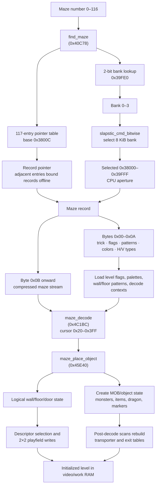

# Gauntlet II — Complete Maze Catalog

*All 117 mazes (numbers 0–116) with bank assignments, ROM offsets, secret tricks, random food counts, and base flags. **Confidence: Verified.** Evidence is the `row10.bin` pointer/header data and the secret-room selection code at `0x44DB4`.*

---

## 1. How Maze Lookup Works

`find_maze` (0x40C78) maps a maze number to a data pointer and slapstic bank:

1. Reads a **bank lookup table** at hardware address `0x39FE0` (slapstic bank 3, file offset 0x7FE0). Each byte packs four 2-bit bank numbers (one per maze, LSB first).
2. Reads the **117-entry pointer table** starting at the address stored at `0x38000` (which points to `0x3800C`). In the raw split Slapstic chips, each entry is an address in the selected bank's `0x38000–0x39FFF` CPU aperture; an offline extractor must normalize it as `raw_pointer + bank × 0x2000` before indexing the interleaved 32 KB image. The supplied normalized `row10.bin` has those 2-bit bank offsets already folded into the pointer high bytes, so entries 0–116 are linear addresses in `0x38000–0x3FFFF` and must not be adjusted again. Entry 116 normalizes to `0x3FE48` and is the second secret-room maze, not an end-only sentinel. **Confidence: Verified.**

The lookup result drives both the Slapstic selection and the record decoder.
Header bytes configure level behavior and presentation, while the compressed
stream produces logical objects that are materialized as MOB state and 2×2
playfield graphics.



---

## 2. Slapstic ROM Bank Layout

**Confidence: Verified** by the bank table, all 117 live pointer entries, and
the generated catalog.

The slapstic ROM (`row10.bin`, 32 KB) is divided into 4 banks of 8 KB each:

| Bank | File Offset | Address Range | Maze Range |
|------|------------|---------------|------------|
| 0 | 0x0000 | 0x38000–0x39FFF | Mazes 0–32 |
| 1 | 0x2000 | 0x3A000–0x3BFFF | Mazes 33–62 |
| 2 | 0x4000 | 0x3C000–0x3DFFF | Mazes 63–88 |
| 3 | 0x6000 | 0x3E000–0x3FFFF | Mazes 89–116 + bank table |

---

## 3. Maze Number Ranges and Level Selection

**Confidence: Verified** for stored record numbers and game selection paths.
Descriptive group names follow their live callers and rendered content.

| Range | Count | Purpose |
|-------|-------|---------|
| 0–4 | 5 | Opening act — played in fixed order as levels 1–5 of every session |
| 5–101 | 97 | Rotation mazes — levels 6 and up; the level→maze mapping is cabinet state, not a formula |
| 102 | 1 | Demo level (attract mode) |
| 103 | 1 | Legend/high-scores screen |
| 104–114 | 11 | Treasure rooms (T1–T11) |
| 115–116 | 2 | Secret-room layouts selected by challenge code |

There is **no fixed level→maze relationship**. Mazes 0–4 are ordinary,
fully live levels, and mazes 5–101 are selected by a rotation whose state
lives in the cabinet's EEPROM and survives power-off. The former
`Level N = Maze N+4` rule and the "unused" label on mazes 0–4 were both
wrong. **Confidence: Verified.**

`show_level_start_screen` (0x44DB4) first selects a random challenge code
0x50–0x5D. Codes 0x50–0x56 leave maze number 115 in `ram.os_flag`; codes
0x57–0x5D increment it to 116 before calling `maze_select_bank_special`
(0x40D4E). Thus both records are live, with seven of the fourteen challenges
mapped to each layout. **Confidence: Verified.**

### 3.1 Session start — levels 1 to 5

`start_attract_to_game` (0x44204) begins a session with
`mazenum_current` (0x904000) = 0 and `levelnum_current` (0x904004) = 1,
then runs the level-start pipeline directly (0x442AC/0x442B2) rather than
through `main_start_game`. `start_attract_screen` (0x44414) does the same
reset at 0x4445A/0x44462 for every attract screen.

Because the ordinary-exit path advances by exactly 1 whenever the current
maze is below 5 (§3.2), levels 1–5 always play mazes 0, 1, 2, 3, 4 in that
order. Those five records have secret-trick ID 0 — the game's only levels
with no secret objective — but their random-food counts and base flags are
live and applied normally. **Confidence: Verified.**

### 3.2 The rotation — level 6 and up

Two EEPROM-backed words hold the rotation state. Both are loaded and
range-checked by `eeprom_load_config` (0x42F86) and written back by
`eeprom_periodic_write` (0x431EE) from the cache bytes at 0x904B8E/0x904B8F.

| Word | Name | Role | Fresh-EEPROM default |
|------|------|------|----------------------|
| 0x904010 | `mazerand_num` | **Resume position** — where this cabinet's rotation through mazes 5–101 currently stands | 5 |
| 0x90400E | `mazerand_adder` | **Stride**, masked to 0–7 — extra mazes advanced per level | 0 |

`player_exit_sequence` (0x52B40) computes the next level and maze in its
tail at 0x52DB2–0x52E56, using `maze_checknum` (0x52ECA) to validate each
candidate. For an ordinary exit (`exit_type` = 0x10 = `MAZEOBJ_EXIT`) taken
while `mazenum_current` < 104:

```text
level_next = levelnum_current + 1              # 0x52DC6-0x52DD0
if level_next > 999: level_next -= 994         # 0x52DD6-0x52DE0  (level 1000 -> 6)

maze_next = mazenum_current                    # 0x52DE8
steps = 1                                      # 0x52DF2
if mazenum_current >= 5: steps += stride       # 0x52DF4-0x52DFE

repeat steps times:                            # 0x52E04-0x52E16
    maze_next += 1
    maze_checknum():
        if maze_next == 5:                     # 0x52ED8-0x52EDE (once, on entry)
            maze_next = resume
        loop:                                  # 0x52EE4-0x52F1A
            if pointer-table entry for maze_next is live and maze_next <= 101:
                return
            if maze_next > 101:
                maze_next = 5
                eeprom_write_timer (0x904012) = 1   # force a save next tick
            else:
                maze_next += 1

if maze_next == 5: stride = (stride + 1) & 7   # 0x52E18-0x52E30
```

`maze_checknum`'s `maze_next == 5` substitution is the hinge: exiting maze 4
makes the candidate 5, which is replaced by the resume position, so **level 6
is wherever the cabinet's rotation stands**. The validity loop re-checks the
117-entry pointer table (base `[0x38000]`, §1); all 117 entries are live, so
in practice only the `> 101` wrap fires. That wrap forces an EEPROM save by
setting the write countdown to 1, and because it re-enters the loop *after*
the substitution point, a wrapped value of 5 stays 5.

The stride bump fires whenever a step sequence ends on maze 5 — either a
lap wrap or a resume value that is still 5 — so each lap of the catalog
advances in coarser steps, up to 8 mazes per level.

A factory-fresh cabinet therefore plays mazes 0, 1, 2, 3, 4, 5 as levels
1–6. Landing on 5 raises the stride to 1, so that first session continues
7, 9, 11, … **Confidence: Verified.**

### 3.3 When the resume position is recorded

`main_health_countdown` (0x466F6) updates the persistent state in its
player-removal path, after `level_players_active` (0x904928) is decremented
at 0x469DA. Both updates require the counter to have reached zero — that
is, **the last player has died and the game is over**:

- 0x469E8–0x469FE: if `mazenum_current` >= 104 (a treasure room), restore
  `mazenum_current` from `maze_next` (0x904B54), so the recorded position is
  a rotation maze rather than a treasure room.
- 0x46A00–0x46A16: if `levelnum_current` >= 6, `resume` (0x904010) =
  `mazenum_current`.

This is the only gameplay write to the resume word. The next session
replays mazes 0–4, then resumes at the maze where the previous game ended.
The normal end-of-level path (`main_move_players` 0x4A6E6) does **not**
touch it. **Confidence: Verified.**

### 3.4 `MAZEOBJ_EXITTO6` — the shortcut out of the opening act

`player_tile_interact` (0x511AC) reads the tile object type from
`mob_link` bits 15–10 and dispatches types 0x0A–0x11 through the jump table
at 0x51200. Types 0x10 (`MAZEOBJ_EXIT`) and 0x11 (`MAZEOBJ_EXITTO6`) share
the handler at 0x513DA, which passes the type through as
`player_exit_sequence`'s `exit_type` argument. `main_exit_move` (0x52958)
always passes 0x10.

Any `exit_type` other than 0x10 takes the second branch at 0x52E38:

```text
level_next = 6                                 # 0x52E38
maze_next  = level_next - 1 = 5                # 0x52E40-0x52E4A
maze_checknum()                                # 0x52E50  -> 5 becomes resume
```

So an `EXITTO6` tile jumps straight to level 6 at the current resume
position, skipping the rest of the opening act. Note that it does not
consult the stride and does not bump it.

Decoding all 117 records shows tile type 0x11 occurs exactly once in the
whole Slapstic ROM: **maze 0 has one `EXITTO6` tile beside its single
ordinary exit**, and no other maze has one. The shortcut is therefore
available only on level 1. **Confidence: Verified.**

### 3.5 Treasure-room scheduling

Treasure rooms run the same design on a second EEPROM-backed pair, also
loaded by `eeprom_load_config` and cached at 0x904B90/0x904B91.

| Word | Name | Role | Load-time range check | Fresh default |
|------|------|------|-----------------------|---------------|
| 0x904018 | `treas_mazerand_num` | Next treasure maze | forced to 104 if outside 104–114 (0x4303E–0x43054) | 104 |
| 0x904016 | `treas_mazerand_adder` | Treasure stride, masked to 0–3 (0x43062) | — | 0 |

`maze_new_level_setup` seeds the level countdown `level_next_treasure`
(0x904B80) with `getrandom(3) + 3` when `levelnum_current` reaches 6
(0x438E4–0x438FC). `main_move_players` decrements it once per level, on
the end-of-level path, only while `mazenum_current` < 104 and
`level_next` > 6 (0x4A756–0x4A788).

The zero test precedes the decrement, but the live sequence reaches zero by
decrementing one on the transition that immediately calls
`show_level_start_screen`; that routine interleaves the treasure room without a
pre-room tally. The room's exit/timeout later reaches
`show_level_end_bonus_screen` through the separate `mazenum_current >= 104`
branch. The 0x4A77A already-zero ordinary-state arm exists in the image but is
not a state normal level setup produces.

`show_level_start_screen` (0x44E92–0x44F38) fires when the countdown is
zero:

```text
level_next_treasure = getrandom(3) + 3         # 0x44E9C-0x44EAC  (3..5)
mazenum_current = treas_mazerand_num           # 0x44EB2-0x44EB8, then bank-select
treas_mazerand_num += treas_mazerand_adder + 1 # 0x44ECA-0x44ED2  (advance 1..4)
if treas_mazerand_num > 114:                   # 0x44ED8-0x44EF6
    treas_mazerand_num -= 11                   # back into 104..114
    if treas_mazerand_num == 104:              # 0x44EFC-0x44F14
        treas_mazerand_adder = (treas_mazerand_adder + 1) & 3
treasure_timer (0x9049E8) =                    # 0x44F1A-0x44F32
    treasure_room_duration[player_activecount() - 1] + 1
```

The duration table at 0x57358 holds 1200/1440/1500/1560 frames — 20, 24,
25 and 26 seconds for one to four active players. `player_exit_sequence`
clears `treasure_timer` at 0x52E88 once no player still has status 1 in a
maze ≥ 104, and the maze restore at 0x469F6 covers the everybody-died case.
**Confidence: Verified.**

---

## 4. Flag Randomization Note

**Confidence: Verified** from `maze_setup` masking and randomization logic.

The flags listed in the table below are the **base flags** stored in each maze's header. At runtime, `maze_load_pickup_config` (0x436FE) **randomly adds additional flags** based on the current level number and a frame-count seed. Higher levels get progressively more aggressive random modifiers — fast monsters, odd-angle movement, invisible walls, etc. — layered on top of the base flags. Late-game levels can have nearly any combination of flags active regardless of what's in the maze header.

---

## 5. Flag Key

**Confidence: Verified** for bit positions and tested game branches.

| Abbreviation | Meaning |
|-------------|---------|
| OddX | Monster type X moves at odd angles (X = Ghost/Grunt/Demon/Lobber/Sorc/AuxGrunt/Death) |
| FastX | Monster type X moves at double speed (same type list) |
| InvisTrap | Trap walls are invisible |
| InvisWalls | All walls invisible |
| CyclicWalls | Walls cycle open/closed |
| DelWalls1/2 | Destructible walls (two tiers of destructibility) |
| ExitMoves | Exit relocates periodically |
| Exit1of | Only one exit of several is real |
| ShotStun | Player shots stun other players |
| ShotHurt | Player shots damage other players |
| TrapLocal | Trap behavior — local variant |
| TrapRand | Trap behavior — random variant |
| WrapV | Maze wraps vertically |
| WrapH | Maze wraps horizontally |
| FakeExit | One or more exits are fake |
| Offscreen | Players can go off-screen |
| RndFood N | N random food items placed after level setup (0–7) |

---

## 6. Complete Maze Table

Every rotation maze (5–101) has exactly one secret trick. Mazes 0–4 — the
fixed opening levels 1–5 — store trick ID 0 and have no secret objective.

The **Level** column is the level number a maze is played as. It is fixed
only for mazes 0–4. Mazes 5–101 are reached from level 6 onward through the
EEPROM-backed rotation of §3.2, so their level number depends on cabinet
state and differs between sessions; `6+` marks them. Treasure rooms
(T1–T11) are interleaved by the countdown of §3.5 and do not consume a
level number.

The raw pointer/header/boundary fields are also checked into `generated/maze_catalog.csv`, generated by `generated/generate_maze_catalog.py`. Run `python3 doc/generated/generate_maze_catalog.py --check` from the repository root for the regression check. **Confidence: Verified.**

| Maze | Level | Bank | ROM Offset | Secret Trick | RndFood | Base Flags |
|-----:|------:|-----:|-----------:|:-------------|--------:|:-----------|
| 0 | 1 | 0 | 0x01E0 | *(none)* | 0 | (none) |
| 1 | 2 | 0 | 0x0262 | *(none)* | 0 | (none) |
| 2 | 3 | 0 | 0x02F4 | *(none)* | 2 | (none) |
| 3 | 4 | 0 | 0x037E | *(none)* | 2 | FastGhost, FastDeath, ExitMoves |
| 4 | 5 | 0 | 0x0404 | *(none)* | 0 | CyclicWalls |
| 5 | 6+ | 0 | 0x04CC | WatchShoot2 (walls) | 0 | InvisWalls |
| 6 | 6+ | 0 | 0x0555 | No Greedy (treasure) | 0 | WrapH |
| 7 | 6+ | 0 | 0x0631 | No Greedy (treasure) | 4 | Exit1of, TrapLocal |
| 8 | 6+ | 0 | 0x07AB | Be Pushy | 0 | DelWalls1 |
| 9 | 6+ | 0 | 0x0858 | Transport3 (into exit) | 0 | (none) |
| 10 | 6+ | 0 | 0x08D5 | Transport3 (into exit) | 4 | OddGhost, FastGrunt, CyclicWalls, Exit1of |
| 11 | 6+ | 0 | 0x097E | WatchShoot1 (food) | 0 | Exit1of |
| 12 | 6+ | 0 | 0x0A76 | No Invulnerability | 6 | FastGrunt, FastDeath, Exit1of |
| 13 | 6+ | 0 | 0x0B48 | No Hit (dragon) | 0 | (none) |
| 14 | 6+ | 0 | 0x0CA0 | No Invulnerability | 2 | OddGrunt, OddAuxGrunt, FastGrunt, CyclicWalls |
| 15 | 6+ | 0 | 0x0D6F | Don't Be Fooled | 0 | OddGhost, FastGrunt, Exit1of, TrapLocal, WrapH, FakeExit |
| 16 | 6+ | 0 | 0x0EB8 | Transport2 (onto death) | 2 | ExitMoves, ShotStun, TrapLocal, WrapH |
| 17 | 6+ | 0 | 0x1011 | Transport4 (into exit) | 3 | WrapH |
| 18 | 6+ | 0 | 0x10D0 | No Greedy (keys/pots) | 6 | CyclicWalls, ExitMoves |
| 19 | 6+ | 0 | 0x11A0 | Diet (no food) | 0 | (none) |
| 20 | 6+ | 0 | 0x12B3 | Save Super Shots | 5 | CyclicWalls |
| 21 | 6+ | 0 | 0x13A6 | No Hurt Friends | 2 | Exit1of |
| 22 | 6+ | 0 | 0x14FC | Transport2 (onto death) | 1 | InvisWalls, Exit1of |
| 23 | 6+ | 0 | 0x15A4 | Transport3 (into exit) | 0 | CyclicWalls, WrapH |
| 24 | 6+ | 0 | 0x1689 | WatchShoot1 (food) | 3 | DelWalls1 |
| 25 | 6+ | 0 | 0x1789 | No Greedy (keys/pots) | 0 | ExitMoves, WrapH |
| 26 | 6+ | 0 | 0x1895 | WatchShoot1 (food) | 2 | DelWalls1, Exit1of |
| 27 | 6+ | 0 | 0x197D | Save Super Shots | 0 | WrapH |
| 28 | 6+ | 0 | 0x1A88 | No Invulnerability | 3 | ShotStun |
| 29 | 6+ | 0 | 0x1B3A | Transport2 (onto death) | 0 | WrapH |
| 30 | 6+ | 0 | 0x1C21 | Be Pushy | 2 | (none) |
| 31 | 6+ | 0 | 0x1D25 | No Hurt Friends | 0 | TrapLocal |
| 32 | 6+ | 0 | 0x1E9B | Transport3 (into exit) | 0 | WrapH |
| 33 | 6+ | 1 | 0x2000 | Don't Be Fooled | 2 | Exit1of, ShotHurt, FakeExit |
| 34 | 6+ | 1 | 0x20B2 | WatchShoot1 (food) | 0 | (none) |
| 35 | 6+ | 1 | 0x21FF | IT Could Be Nice | 0 | (none) |
| 36 | 6+ | 1 | 0x22C1 | No Hurt Friends | 0 | WrapH |
| 37 | 6+ | 1 | 0x2447 | IT Could Be Nice | 5 | Exit1of |
| 38 | 6+ | 1 | 0x24FC | Push a Wall | 0 | (none) |
| 39 | 6+ | 1 | 0x262D | Don't Be Fooled | 4 | FastDemon, Exit1of, ShotHurt, FakeExit |
| 40 | 6+ | 1 | 0x2706 | Push a Wall | 0 | Exit1of, WrapH |
| 41 | 6+ | 1 | 0x282D | No Hit (dragon) | 4 | (none) |
| 42 | 6+ | 1 | 0x2906 | No Hurt Friends | 0 | DelWalls1, Exit1of, WrapV, WrapH |
| 43 | 6+ | 1 | 0x2A90 | Transport4 (into exit) | 0 | OddAuxGrunt, WrapH |
| 44 | 6+ | 1 | 0x2C0D | No Greedy (treasure) | 0 | WrapH |
| 45 | 6+ | 1 | 0x2D6C | Diet (no food) | 2 | ShotHurt, WrapH |
| 46 | 6+ | 1 | 0x2E39 | IT Could Be Nice | 0 | OddGhost, OddGrunt, OddDeath, FastGhost, FastSorc |
| 47 | 6+ | 1 | 0x2F57 | No Hurt Friends | 1 | OddAuxGrunt, DelWalls1, Exit1of |
| 48 | 6+ | 1 | 0x30A9 | WatchShoot1 (food) | 0 | (none) |
| 49 | 6+ | 1 | 0x31DA | Save Super Shots | 0 | OddGrunt, OddAuxGrunt, Exit1of, ShotStun |
| 50 | 6+ | 1 | 0x328B | IT Could Be Nice | 0 | WrapH |
| 51 | 6+ | 1 | 0x337F | Push a Wall | 0 | FastGhost, FastGrunt, Exit1of |
| 52 | 6+ | 1 | 0x342D | Diet (no food) | 0 | Exit1of, WrapH, FakeExit |
| 53 | 6+ | 1 | 0x3530 | No Hurt Friends | 0 | OddAuxGrunt |
| 54 | 6+ | 1 | 0x361B | No Invulnerability | 5 | (none) |
| 55 | 6+ | 1 | 0x37F3 | Be Pushy | 1 | FastGrunt, FastDemon |
| 56 | 6+ | 1 | 0x388C | Transport1 (beside Acid) | 0 | (none) |
| 57 | 6+ | 1 | 0x3966 | No Hurt Friends | 0 | Exit1of, ShotHurt |
| 58 | 6+ | 1 | 0x3A55 | Transport1 (beside Acid) | 0 | DelWalls1 |
| 59 | 6+ | 1 | 0x3B4F | Transport1 (beside Acid) | 0 | OddGrunt |
| 60 | 6+ | 1 | 0x3C63 | Don't Be Fooled | 0 | FastSorc, Exit1of, FakeExit |
| 61 | 6+ | 1 | 0x3D90 | No Greedy (keys/pots) | 0 | Exit1of, WrapH |
| 62 | 6+ | 1 | 0x3EB9 | Push a Wall | 0 | WrapH |
| 63 | 6+ | 2 | 0x4000 | No Greedy (keys/pots) | 0 | (none) |
| 64 | 6+ | 2 | 0x417C | Transport4 (into exit) | 0 | FastAuxGrunt, FastDeath, CyclicWalls, Exit1of |
| 65 | 6+ | 2 | 0x4294 | Transport2 (onto death) | 0 | (none) |
| 66 | 6+ | 2 | 0x4382 | No Greedy (treasure) | 0 | ShotHurt, TrapLocal |
| 67 | 6+ | 2 | 0x44DB | No Hit (dragon) | 0 | FastAuxGrunt |
| 68 | 6+ | 2 | 0x45B9 | Transport3 (into exit) | 0 | WrapH |
| 69 | 6+ | 2 | 0x46E1 | Don't Be Fooled | 0 | Exit1of, TrapRand, WrapV, WrapH, FakeExit |
| 70 | 6+ | 2 | 0x47CB | WatchShoot2 (walls) | 0 | WrapH |
| 71 | 6+ | 2 | 0x4932 | WatchShoot2 (walls) | 0 | Exit1of, FakeExit |
| 72 | 6+ | 2 | 0x4A45 | Transport1 (beside Acid) | 0 | FastAuxGrunt |
| 73 | 6+ | 2 | 0x4B68 | Transport4 (through secret wall) | 0 | TrapLocal |
| 74 | 6+ | 2 | 0x4D14 | Save Super Shots | 0 | ExitMoves, WrapV, WrapH |
| 75 | 6+ | 2 | 0x4EB5 | Transport1 (beside Acid) | 0 | WrapV, WrapH |
| 76 | 6+ | 2 | 0x4FDD | No Greedy (treasure) | 0 | TrapRand, WrapH |
| 77 | 6+ | 2 | 0x50F7 | Don't Be Fooled | 3 | FastGhost–FastDeath (all), CyclicWalls, Exit1of, FakeExit |
| 78 | 6+ | 2 | 0x5254 | No Hit (dragon) | 0 | OddGhost, FastGrunt, FastLobber, FastSorc, TrapLocal |
| 79 | 6+ | 2 | 0x535B | Push a Wall | 0 | TrapRand, WrapH |
| 80 | 6+ | 2 | 0x546C | Transport2 (onto death) | 0 | ShotHurt, TrapLocal, WrapH |
| 81 | 6+ | 2 | 0x55F7 | No Greedy (keys/pots) | 0 | WrapH |
| 82 | 6+ | 2 | 0x5789 | Save Super Shots | 0 | WrapH |
| 83 | 6+ | 2 | 0x5917 | Transport1 (beside Acid) | 0 | FastGrunt, FastSorc |
| 84 | 6+ | 2 | 0x5A2F | No Invulnerability | 0 | FastGhost, TrapRand |
| 85 | 6+ | 2 | 0x5B41 | Save Super Shots | 0 | FastGrunt |
| 86 | 6+ | 2 | 0x5C36 | Transport3 (into exit) | 0 | (none) |
| 87 | 6+ | 2 | 0x5D73 | IT Could Be Nice | 0 | WrapH |
| 88 | 6+ | 2 | 0x5EAD | No Invulnerability | 1 | DelWalls1 |
| 89 | 6+ | 3 | 0x6000 | Be Pushy | 0 | (none) |
| 90 | 6+ | 3 | 0x612E | No Hit (dragon) | 0 | DelWalls2 |
| 91 | 6+ | 3 | 0x6291 | Push a Wall | 0 | FastAuxGrunt, CyclicWalls |
| 92 | 6+ | 3 | 0x63A0 | No Greedy (keys/pots) | 0 | OddAuxGrunt, FastAuxGrunt, FastDeath, DelWalls2, Exit1of, ShotHurt |
| 93 | 6+ | 3 | 0x64B7 | Push a Wall | 0 | InvisTrap, WrapV, WrapH |
| 94 | 6+ | 3 | 0x65A6 | IT Could Be Nice | 4 | DelWalls1, ExitMoves |
| 95 | 6+ | 3 | 0x669B | Transport2 (onto death) | 0 | ShotStun, TrapRand, WrapH |
| 96 | 6+ | 3 | 0x6786 | No Greedy (treasure) | 4 | InvisTrap, ShotStun, TrapLocal |
| 97 | 6+ | 3 | 0x68A3 | No Greedy (keys/pots) | 0 | ShotHurt |
| 98 | 6+ | 3 | 0x69F4 | Diet (no food) | 0 | WrapH |
| 99 | 6+ | 3 | 0x6B16 | No Hit (dragon) | 0 | OddGhost, WrapH |
| 100 | 6+ | 3 | 0x6C3F | WatchShoot1 (food) | 0 | InvisTrap, InvisWalls |
| 101 | 6+ | 3 | 0x6D35 | Transport4 (into exit) | 4 | Exit1of |
| | | | | | | |
| 102 | — | 3 | 0x6DF2 | **Demo Level** | 0 | OddGrunt, OddAuxGrunt, FastAuxGrunt |
| 103 | — | 3 | 0x6E6C | **Legend/Scores** | 0 | (none) |
| | | | | | | |
| 104 | T1 | 3 | 0x6ED1 | Diet (no food) | 0 | CyclicWalls, Exit1of, WrapH |
| 105 | T2 | 3 | 0x6FAA | Be Pushy | 0 | CyclicWalls, Exit1of |
| 106 | T3 | 3 | 0x7081 | WatchShoot2 (walls) | 0 | ExitMoves |
| 107 | T4 | 3 | 0x715B | Diet (no food) | 0 | DelWalls1, Exit1of |
| 108 | T5 | 3 | 0x7231 | Be Pushy | 1 | Exit1of, TrapLocal, WrapH |
| 109 | T6 | 3 | 0x7424 | Diet (no food) | 0 | DelWalls2, Exit1of |
| 110 | T7 | 3 | 0x7590 | WatchShoot2 (walls) | 0 | Exit1of, WrapH |
| 111 | T8 | 3 | 0x7715 | Be Pushy | 0 | Exit1of, WrapH |
| 112 | T9 | 3 | 0x7886 | WatchShoot2 (walls) | 0 | CyclicWalls, Exit1of |
| 113 | T10 | 3 | 0x79EF | WatchShoot2 (walls) | 0 | Exit1of |
| 114 | T11 | 3 | 0x7BC9 | Diet (no food) | 0 | InvisTrap, Exit1of, TrapLocal |
| | | | | | | |
| 115 | — | 3 | 0x7D29 | **Secret Room 1 (tasks 0x50–0x56)** | 0 | (none) |
| 116 | — | 3 | 0x7E48 | **Secret Room 2 (tasks 0x57–0x5D)** | 0 | CyclicWalls |

Neither compressed record stores an exit. `maze_new_level_setup`
0x43C20–0x43D10 selects a generator type from the task-indexed table at
0x57056 and replaces every matching generator with an exit before rebuilding
the live exit table. The same pass clears the other eligible generators and
turns ordinary monsters into hidden potions.

---

## 7. Secret Trick Distribution

**Confidence: Verified** from the first header byte of all 117 records.

Every rotation maze has exactly one secret trick. Distribution across the 97
rotation mazes (5–101); mazes 0–4 store trick ID 0 and are excluded:

| Secret Trick | Count | Description |
|:-------------|------:|:------------|
| Push a Wall | 7 | Push a movable wall into an exit |
| No Greedy (keys/pots) | 7 | Complete without collecting keys or potions |
| No Hurt Friends | 7 | Hit no player with a shot, including reflected self-hits |
| Transport1 (beside Acid) | 6 | Use Transportability to land beside Acid |
| Transport2 (onto death) | 6 | Teleport onto Death |
| Transport3 (into exit) | 6 | Teleport into the exit |
| WatchShoot1 (food) | 6 | Shoot two food items |
| Save Super Shots | 6 | Exit with at least 11 super shots |
| No Invulnerability | 6 | Collect invulnerability, then avoid hits while protected |
| No Hit (dragon) | 6 | Exit with the dragon-progress byte's low two bits clear |
| Don't Be Fooled | 6 | Avoid fake exits |
| No Greedy (treasure) | 6 | Complete without collecting treasure |
| IT Could Be Nice | 6 | Exit while IT |
| Transport4 (through secret wall) | 5 | Corner-transport through a secret wall |
| WatchShoot2 (walls) | 3 | Shoot two secret walls |
| Diet (no food) | 4 | Complete without eating food |
| Be Pushy | 4 | Enter the exit on a recursive collision-response move |

---

## 8. Maze Data Structure

**Confidence: Verified** for header offsets, compression contexts, pointer
boundaries, and trailing delimiter behavior.

Each maze in the slapstic ROM has this header format:

| Offset | Size | Name | Description |
|--------|------|------|-------------|
| 0x00 | 1 B | `secret_trick` | Secret trick ID (see Secret Tricks enum in `05_data_reference.md`). 0 = none. |
| 0x01 | 1 B | `level_flags_1` | Monster odd-angle and invisible-trap flags |
| 0x02 | 1 B | `level_flags_2` | Monster fast-movement flags |
| 0x03 | 1 B | `level_flags_3` | Random food count + cyclic/destructible walls + exit behavior |
| 0x04 | 1 B | `level_flags_4` | Shot behavior + trap behavior + wrap + fake exit + offscreen |
| 0x05 | 1 B | `playfield_patterns` | Wall and floor pattern index for visual style |
| 0x06 | 1 B | `playfield_colors` | Packed palette selectors: high nibble = main playfield palette index; low nibble = special-palette variant |
| 0x07 | 1 B | `horizontal_type_1` | RLE horizontal span type 1 (see Maze Compression Bytecodes enum) |
| 0x08 | 1 B | `horizontal_type_2` | RLE horizontal span type 2 |
| 0x09 | 1 B | `vertical_type_1` | RLE vertical span type 1 |
| 0x0A | 1 B | `vertical_type_2` | RLE vertical span type 2 |
| 0x0B | variable | `level_data` | RLE-compressed tile data |

The four `level_flags` bytes are assembled by `maze_load_pickup_config` (0x436FE) into the 32-bit `level_flags` longword at `0x90491C` (historical alias `ram.maze_pickup_config`). **Confidence: Verified.**

Mazes 0–115 end with a zero delimiter. For 113 of those records the delimiter
is immediately followed by the next pointer target; bank-final mazes 32, 62,
and 88 have padding before the next bank's first record. Maze 116 is the one
exception: it begins at `0x3FE48`, has no delimiter, and its decoder consumes
423 bytes through `0x3FFEE`. The final 15 compressed bytes therefore overlap
the start of the live 32-byte bank lookup table at `0x3FFE0–0x3FFFF`; 17 table
bytes remain after decoding stops. This is safe because the game decoder does
not search for a delimiter—it stops when its output cursor reaches `0x400`.
`0x3FE48` is consequently both the boundary after maze 115 and the address of
live maze 116 data. **Confidence: Verified.**
