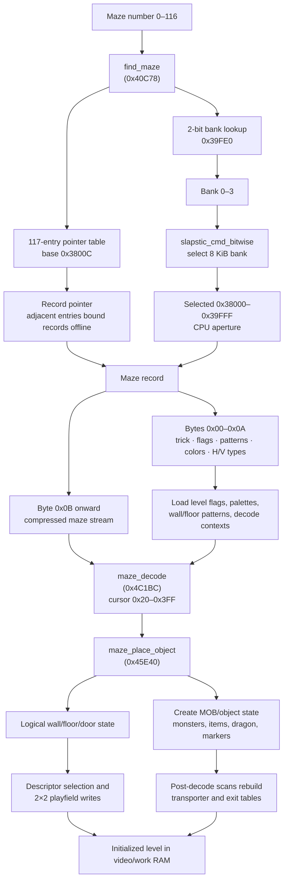

# Gauntlet II — Complete Maze Catalog

*All 117 mazes (numbers 0–116) with bank assignments, ROM offsets, secret tricks, random food counts, and base flags. **Confidence: Verified.** Evidence is the `row10.bin` pointer/header data and the secret-room selection code at `0x44DB4`.*

---

## 1. How Maze Lookup Works

`find_maze` (0x40C78) maps a maze number to a data pointer and slapstic bank:

1. Reads a **bank lookup table** at hardware address `0x39FE0` (slapstic bank 3, file offset 0x7FE0). Each byte packs four 2-bit bank numbers (one per maze, LSB first).
2. Reads the **117-entry pointer table** starting at the address stored at `0x38000` (which points to `0x3800C`). In the raw split Slapstic chips, each entry is an address in the selected bank's `0x38000–0x39FFF` CPU aperture; an offline extractor must normalize it as `raw_pointer + bank × 0x2000` before indexing the interleaved 32 KB image. The supplied normalized `row10.bin` has those 2-bit bank offsets already folded into the pointer high bytes, so entries 0–116 are linear addresses in `0x38000–0x3FFFF` and must not be adjusted again. Entry 116 normalizes to `0x3FE48` and is the second secret-room maze, not an end-only sentinel. **Confidence: Verified.**

The lookup result drives both the Slapstic selection and the record decoder.
Header bytes configure level behavior and presentation, while the compressed
stream produces logical objects that are materialized as MOB state and 2×2
playfield graphics.

---

## 2. Slapstic ROM Bank Layout

**Confidence: Verified** by the bank table, all 117 live pointer entries, and
the generated catalog.

The slapstic ROM (`row10.bin`, 32 KB) is divided into 4 banks of 8 KB each:

| Bank | File Offset | Address Range | Maze Range |
|------|------------|---------------|------------|
| 0 | 0x0000 | 0x38000–0x39FFF | Mazes 0–32 |
| 1 | 0x2000 | 0x3A000–0x3BFFF | Mazes 33–62 |
| 2 | 0x4000 | 0x3C000–0x3DFFF | Mazes 63–88 |
| 3 | 0x6000 | 0x3E000–0x3FFFF | Mazes 89–116 + bank table |

---

## 3. Maze Number Ranges

**Confidence: Verified** for stored record numbers and game selection paths.
Descriptive group names follow their live callers and rendered content.

| Range | Count | Purpose |
|-------|-------|---------|
| 0–4 | 5 | Unused/placeholder |
| 5–101 | 97 | Gameplay levels (Level N = Maze N+4) |
| 102 | 1 | Demo level (attract mode) |
| 103 | 1 | Legend/high-scores screen |
| 104–114 | 11 | Treasure rooms (T1–T11) |
| 115–116 | 2 | Secret-room layouts selected by challenge code |

`show_level_start_screen` (0x44DB4) first selects a random challenge code
0x50–0x5D. Codes 0x50–0x56 leave maze number 115 in `ram.os_flag`; codes
0x57–0x5D increment it to 116 before calling `maze_select_bank_special`
(0x40D4E). Thus both records are live, with seven of the fourteen challenges
mapped to each layout. **Confidence: Verified.**

---

## 4. Flag Randomization Note

**Confidence: Verified** from `maze_setup` masking and randomization logic.

The flags listed in the table below are the **base flags** stored in each maze's header. At runtime, `maze_load_pickup_config` (0x436FE) **randomly adds additional flags** based on the current level number and a frame-count seed. Higher levels get progressively more aggressive random modifiers — fast monsters, odd-angle movement, invisible walls, etc. — layered on top of the base flags. Late-game levels can have nearly any combination of flags active regardless of what's in the maze header.

---

## 5. Flag Key

**Confidence: Verified** for bit positions and tested game branches.

| Abbreviation | Meaning |
|-------------|---------|
| OddX | Monster type X moves at odd angles (X = Ghost/Grunt/Demon/Lobber/Sorc/AuxGrunt/Death) |
| FastX | Monster type X moves at double speed (same type list) |
| InvisTrap | Trap walls are invisible |
| InvisWalls | All walls invisible |
| CyclicWalls | Walls cycle open/closed |
| DelWalls1/2 | Destructible walls (two tiers of destructibility) |
| ExitMoves | Exit relocates periodically |
| Exit1of | Only one exit of several is real |
| ShotStun | Player shots stun other players |
| ShotHurt | Player shots damage other players |
| TrapLocal | Trap behavior — local variant |
| TrapRand | Trap behavior — random variant |
| WrapV | Maze wraps vertically |
| WrapH | Maze wraps horizontally |
| FakeExit | One or more exits are fake |
| Offscreen | Players can go off-screen |
| RndFood N | N random food items placed after level setup (0–7) |

---

## 6. Complete Maze Table

Every gameplay level (Levels 1–97) has a secret trick — there are no levels without one.

The raw pointer/header/boundary fields are also checked into `maze_catalog.csv`, generated by `generate_maze_catalog.py`. Run `python3 doc/generate_maze_catalog.py --check` from the repository root for the regression check. **Confidence: Verified.**

| Maze | Level | Bank | ROM Offset | Secret Trick | RndFood | Base Flags |
|-----:|------:|-----:|-----------:|:-------------|--------:|:-----------|
| 0 | — | 0 | 0x01E0 | *(unused)* | 0 | (none) |
| 1 | — | 0 | 0x0262 | *(unused)* | 0 | (none) |
| 2 | — | 0 | 0x02F4 | *(unused)* | 2 | (none) |
| 3 | — | 0 | 0x037E | *(unused)* | 2 | FastGhost, FastDeath, ExitMoves |
| 4 | — | 0 | 0x0404 | *(unused)* | 0 | CyclicWalls |
| 5 | 1 | 0 | 0x04CC | WatchShoot2 (walls) | 0 | InvisWalls |
| 6 | 2 | 0 | 0x0555 | No Greedy (treasure) | 0 | WrapH |
| 7 | 3 | 0 | 0x0631 | No Greedy (treasure) | 4 | Exit1of, TrapLocal |
| 8 | 4 | 0 | 0x07AB | Be Pushy | 0 | DelWalls1 |
| 9 | 5 | 0 | 0x0858 | Transport3 (into exit) | 0 | (none) |
| 10 | 6 | 0 | 0x08D5 | Transport3 (into exit) | 4 | OddGhost, FastGrunt, CyclicWalls, Exit1of |
| 11 | 7 | 0 | 0x097E | WatchShoot1 (food) | 0 | Exit1of |
| 12 | 8 | 0 | 0x0A76 | No Invulnerability | 6 | FastGrunt, FastDeath, Exit1of |
| 13 | 9 | 0 | 0x0B48 | No Hit (dragon) | 0 | (none) |
| 14 | 10 | 0 | 0x0CA0 | No Invulnerability | 2 | OddGrunt, OddAuxGrunt, FastGrunt, CyclicWalls |
| 15 | 11 | 0 | 0x0D6F | Don't Be Fooled | 0 | OddGhost, FastGrunt, Exit1of, TrapLocal, WrapH, FakeExit |
| 16 | 12 | 0 | 0x0EB8 | Transport2 (onto death) | 2 | ExitMoves, ShotStun, TrapLocal, WrapH |
| 17 | 13 | 0 | 0x1011 | Transport4 (into exit) | 3 | WrapH |
| 18 | 14 | 0 | 0x10D0 | No Greedy (keys/pots) | 6 | CyclicWalls, ExitMoves |
| 19 | 15 | 0 | 0x11A0 | Diet (no food) | 0 | (none) |
| 20 | 16 | 0 | 0x12B3 | Save Super Shots | 5 | CyclicWalls |
| 21 | 17 | 0 | 0x13A6 | No Hurt Friends | 2 | Exit1of |
| 22 | 18 | 0 | 0x14FC | Transport2 (onto death) | 1 | InvisWalls, Exit1of |
| 23 | 19 | 0 | 0x15A4 | Transport3 (into exit) | 0 | CyclicWalls, WrapH |
| 24 | 20 | 0 | 0x1689 | WatchShoot1 (food) | 3 | DelWalls1 |
| 25 | 21 | 0 | 0x1789 | No Greedy (keys/pots) | 0 | ExitMoves, WrapH |
| 26 | 22 | 0 | 0x1895 | WatchShoot1 (food) | 2 | DelWalls1, Exit1of |
| 27 | 23 | 0 | 0x197D | Save Super Shots | 0 | WrapH |
| 28 | 24 | 0 | 0x1A88 | No Invulnerability | 3 | ShotStun |
| 29 | 25 | 0 | 0x1B3A | Transport2 (onto death) | 0 | WrapH |
| 30 | 26 | 0 | 0x1C21 | Be Pushy | 2 | (none) |
| 31 | 27 | 0 | 0x1D25 | No Hurt Friends | 0 | TrapLocal |
| 32 | 28 | 0 | 0x1E9B | Transport3 (into exit) | 0 | WrapH |
| 33 | 29 | 1 | 0x2000 | Don't Be Fooled | 2 | Exit1of, ShotHurt, FakeExit |
| 34 | 30 | 1 | 0x20B2 | WatchShoot1 (food) | 0 | (none) |
| 35 | 31 | 1 | 0x21FF | IT Could Be Nice | 0 | (none) |
| 36 | 32 | 1 | 0x22C1 | No Hurt Friends | 0 | WrapH |
| 37 | 33 | 1 | 0x2447 | IT Could Be Nice | 5 | Exit1of |
| 38 | 34 | 1 | 0x24FC | Push a Wall | 0 | (none) |
| 39 | 35 | 1 | 0x262D | Don't Be Fooled | 4 | FastDemon, Exit1of, ShotHurt, FakeExit |
| 40 | 36 | 1 | 0x2706 | Push a Wall | 0 | Exit1of, WrapH |
| 41 | 37 | 1 | 0x282D | No Hit (dragon) | 4 | (none) |
| 42 | 38 | 1 | 0x2906 | No Hurt Friends | 0 | DelWalls1, Exit1of, WrapV, WrapH |
| 43 | 39 | 1 | 0x2A90 | Transport4 (into exit) | 0 | OddAuxGrunt, WrapH |
| 44 | 40 | 1 | 0x2C0D | No Greedy (treasure) | 0 | WrapH |
| 45 | 41 | 1 | 0x2D6C | Diet (no food) | 2 | ShotHurt, WrapH |
| 46 | 42 | 1 | 0x2E39 | IT Could Be Nice | 0 | OddGhost, OddGrunt, OddDeath, FastGhost, FastSorc |
| 47 | 43 | 1 | 0x2F57 | No Hurt Friends | 1 | OddAuxGrunt, DelWalls1, Exit1of |
| 48 | 44 | 1 | 0x30A9 | WatchShoot1 (food) | 0 | (none) |
| 49 | 45 | 1 | 0x31DA | Save Super Shots | 0 | OddGrunt, OddAuxGrunt, Exit1of, ShotStun |
| 50 | 46 | 1 | 0x328B | IT Could Be Nice | 0 | WrapH |
| 51 | 47 | 1 | 0x337F | Push a Wall | 0 | FastGhost, FastGrunt, Exit1of |
| 52 | 48 | 1 | 0x342D | Diet (no food) | 0 | Exit1of, WrapH, FakeExit |
| 53 | 49 | 1 | 0x3530 | No Hurt Friends | 0 | OddAuxGrunt |
| 54 | 50 | 1 | 0x361B | No Invulnerability | 5 | (none) |
| 55 | 51 | 1 | 0x37F3 | Be Pushy | 1 | FastGrunt, FastDemon |
| 56 | 52 | 1 | 0x388C | Transport1 (onto demon) | 0 | (none) |
| 57 | 53 | 1 | 0x3966 | No Hurt Friends | 0 | Exit1of, ShotHurt |
| 58 | 54 | 1 | 0x3A55 | Transport1 (onto demon) | 0 | DelWalls1 |
| 59 | 55 | 1 | 0x3B4F | Transport1 (onto demon) | 0 | OddGrunt |
| 60 | 56 | 1 | 0x3C63 | Don't Be Fooled | 0 | FastSorc, Exit1of, FakeExit |
| 61 | 57 | 1 | 0x3D90 | No Greedy (keys/pots) | 0 | Exit1of, WrapH |
| 62 | 58 | 1 | 0x3EB9 | Push a Wall | 0 | WrapH |
| 63 | 59 | 2 | 0x4000 | No Greedy (keys/pots) | 0 | (none) |
| 64 | 60 | 2 | 0x417C | Transport4 (into exit) | 0 | FastAuxGrunt, FastDeath, CyclicWalls, Exit1of |
| 65 | 61 | 2 | 0x4294 | Transport2 (onto death) | 0 | (none) |
| 66 | 62 | 2 | 0x4382 | No Greedy (treasure) | 0 | ShotHurt, TrapLocal |
| 67 | 63 | 2 | 0x44DB | No Hit (dragon) | 0 | FastAuxGrunt |
| 68 | 64 | 2 | 0x45B9 | Transport3 (into exit) | 0 | WrapH |
| 69 | 65 | 2 | 0x46E1 | Don't Be Fooled | 0 | Exit1of, TrapRand, WrapV, WrapH, FakeExit |
| 70 | 66 | 2 | 0x47CB | WatchShoot2 (walls) | 0 | WrapH |
| 71 | 67 | 2 | 0x4932 | WatchShoot2 (walls) | 0 | Exit1of, FakeExit |
| 72 | 68 | 2 | 0x4A45 | Transport1 (onto demon) | 0 | FastAuxGrunt |
| 73 | 69 | 2 | 0x4B68 | Transport4 (into exit) | 0 | TrapLocal |
| 74 | 70 | 2 | 0x4D14 | Save Super Shots | 0 | ExitMoves, WrapV, WrapH |
| 75 | 71 | 2 | 0x4EB5 | Transport1 (onto demon) | 0 | WrapV, WrapH |
| 76 | 72 | 2 | 0x4FDD | No Greedy (treasure) | 0 | TrapRand, WrapH |
| 77 | 73 | 2 | 0x50F7 | Don't Be Fooled | 3 | FastGhost–FastDeath (all), CyclicWalls, Exit1of, FakeExit |
| 78 | 74 | 2 | 0x5254 | No Hit (dragon) | 0 | OddGhost, FastGrunt, FastLobber, FastSorc, TrapLocal |
| 79 | 75 | 2 | 0x535B | Push a Wall | 0 | TrapRand, WrapH |
| 80 | 76 | 2 | 0x546C | Transport2 (onto death) | 0 | ShotHurt, TrapLocal, WrapH |
| 81 | 77 | 2 | 0x55F7 | No Greedy (keys/pots) | 0 | WrapH |
| 82 | 78 | 2 | 0x5789 | Save Super Shots | 0 | WrapH |
| 83 | 79 | 2 | 0x5917 | Transport1 (onto demon) | 0 | FastGrunt, FastSorc |
| 84 | 80 | 2 | 0x5A2F | No Invulnerability | 0 | FastGhost, TrapRand |
| 85 | 81 | 2 | 0x5B41 | Save Super Shots | 0 | FastGrunt |
| 86 | 82 | 2 | 0x5C36 | Transport3 (into exit) | 0 | (none) |
| 87 | 83 | 2 | 0x5D73 | IT Could Be Nice | 0 | WrapH |
| 88 | 84 | 2 | 0x5EAD | No Invulnerability | 1 | DelWalls1 |
| 89 | 85 | 3 | 0x6000 | Be Pushy | 0 | (none) |
| 90 | 86 | 3 | 0x612E | No Hit (dragon) | 0 | DelWalls2 |
| 91 | 87 | 3 | 0x6291 | Push a Wall | 0 | FastAuxGrunt, CyclicWalls |
| 92 | 88 | 3 | 0x63A0 | No Greedy (keys/pots) | 0 | OddAuxGrunt, FastAuxGrunt, FastDeath, DelWalls2, Exit1of, ShotHurt |
| 93 | 89 | 3 | 0x64B7 | Push a Wall | 0 | InvisTrap, WrapV, WrapH |
| 94 | 90 | 3 | 0x65A6 | IT Could Be Nice | 4 | DelWalls1, ExitMoves |
| 95 | 91 | 3 | 0x669B | Transport2 (onto death) | 0 | ShotStun, TrapRand, WrapH |
| 96 | 92 | 3 | 0x6786 | No Greedy (treasure) | 4 | InvisTrap, ShotStun, TrapLocal |
| 97 | 93 | 3 | 0x68A3 | No Greedy (keys/pots) | 0 | ShotHurt |
| 98 | 94 | 3 | 0x69F4 | Diet (no food) | 0 | WrapH |
| 99 | 95 | 3 | 0x6B16 | No Hit (dragon) | 0 | OddGhost, WrapH |
| 100 | 96 | 3 | 0x6C3F | WatchShoot1 (food) | 0 | InvisTrap, InvisWalls |
| 101 | 97 | 3 | 0x6D35 | Transport4 (into exit) | 4 | Exit1of |
| | | | | | | |
| 102 | — | 3 | 0x6DF2 | **Demo Level** | 0 | OddGrunt, OddAuxGrunt, FastAuxGrunt |
| 103 | — | 3 | 0x6E6C | **Legend/Scores** | 0 | (none) |
| | | | | | | |
| 104 | T1 | 3 | 0x6ED1 | Diet (no food) | 0 | CyclicWalls, Exit1of, WrapH |
| 105 | T2 | 3 | 0x6FAA | Be Pushy | 0 | CyclicWalls, Exit1of |
| 106 | T3 | 3 | 0x7081 | WatchShoot2 (walls) | 0 | ExitMoves |
| 107 | T4 | 3 | 0x715B | Diet (no food) | 0 | DelWalls1, Exit1of |
| 108 | T5 | 3 | 0x7231 | Be Pushy | 1 | Exit1of, TrapLocal, WrapH |
| 109 | T6 | 3 | 0x7424 | Diet (no food) | 0 | DelWalls2, Exit1of |
| 110 | T7 | 3 | 0x7590 | WatchShoot2 (walls) | 0 | Exit1of, WrapH |
| 111 | T8 | 3 | 0x7715 | Be Pushy | 0 | Exit1of, WrapH |
| 112 | T9 | 3 | 0x7886 | WatchShoot2 (walls) | 0 | CyclicWalls, Exit1of |
| 113 | T10 | 3 | 0x79EF | WatchShoot2 (walls) | 0 | Exit1of |
| 114 | T11 | 3 | 0x7BC9 | Diet (no food) | 0 | InvisTrap, Exit1of, TrapLocal |
| | | | | | | |
| 115 | — | 3 | 0x7D29 | **Secret Room 1 (tasks 0x50–0x56)** | 0 | (none) |
| 116 | — | 3 | 0x7E48 | **Secret Room 2 (tasks 0x57–0x5D)** | 0 | CyclicWalls |

---

## 7. Secret Trick Distribution

**Confidence: Verified** from the first header byte of all 117 records.

Every gameplay level has exactly one secret trick. Distribution across Levels 1–97:

| Secret Trick | Count | Description |
|:-------------|------:|:------------|
| Push a Wall | 7 | Try pushing a movable wall |
| No Greedy (keys/pots) | 7 | Complete without collecting keys or potions |
| No Hurt Friends | 7 | Don't damage other players |
| Transport1 (onto demon) | 6 | Use Transportability to teleport onto a demon |
| Transport2 (onto death) | 6 | Teleport onto Death |
| Transport3 (into exit) | 6 | Teleport into the exit |
| WatchShoot1 (food) | 6 | Avoid shooting food items |
| Save Super Shots | 6 | Don't waste super shot power-ups |
| No Invulnerability | 6 | Complete without using invulnerability |
| No Hit (dragon) | 6 | Kill the dragon without getting hit |
| Don't Be Fooled | 6 | Avoid fake exits |
| No Greedy (treasure) | 6 | Complete without collecting treasure |
| IT Could Be Nice | 6 | Use the IT mechanic strategically |
| Transport4 (into exit) | 5 | Teleport into the exit (variant) |
| WatchShoot2 (walls) | 3 | Shoot secret/destructible walls |
| Diet (no food) | 4 | Complete without eating food |
| Be Pushy | 4 | Push movable walls aggressively |

---

## 8. Maze Data Structure

**Confidence: Verified** for header offsets, compression contexts, pointer
boundaries, and trailing delimiter behavior.

Each maze in the slapstic ROM has this header format:

| Offset | Size | Name | Description |
|--------|------|------|-------------|
| 0x00 | 1 B | `secret_trick` | Secret trick ID (see Secret Tricks enum in `05_data_reference.md`). 0 = none. |
| 0x01 | 1 B | `level_flags_1` | Monster odd-angle and invisible-trap flags |
| 0x02 | 1 B | `level_flags_2` | Monster fast-movement flags |
| 0x03 | 1 B | `level_flags_3` | Random food count + cyclic/destructible walls + exit behavior |
| 0x04 | 1 B | `level_flags_4` | Shot behavior + trap behavior + wrap + fake exit + offscreen |
| 0x05 | 1 B | `playfield_patterns` | Wall and floor pattern index for visual style |
| 0x06 | 1 B | `playfield_colors` | Packed palette selectors: high nibble = main playfield palette index; low nibble = special-palette variant |
| 0x07 | 1 B | `horizontal_type_1` | RLE horizontal span type 1 (see Maze Compression Bytecodes enum) |
| 0x08 | 1 B | `horizontal_type_2` | RLE horizontal span type 2 |
| 0x09 | 1 B | `vertical_type_1` | RLE vertical span type 1 |
| 0x0A | 1 B | `vertical_type_2` | RLE vertical span type 2 |
| 0x0B | variable | `level_data` | RLE-compressed tile data |

The four `level_flags` bytes are assembled by `maze_load_pickup_config` (0x436FE) into the 32-bit `level_flags` longword at `0x90491C` (historical alias `ram.maze_pickup_config`). **Confidence: Verified.**

Mazes 0–115 end with a zero delimiter. For 113 of those records the delimiter
is immediately followed by the next pointer target; bank-final mazes 32, 62,
and 88 have padding before the next bank's first record. Maze 116 is the one
exception: it begins at `0x3FE48`, has no delimiter, and its decoder consumes
423 bytes through `0x3FFEE`. The final 15 compressed bytes therefore overlap
the start of the live 32-byte bank lookup table at `0x3FFE0–0x3FFFF`; 17 table
bytes remain after decoding stops. This is safe because the game decoder does
not search for a delimiter—it stops when its output cursor reaches `0x400`.
`0x3FE48` is consequently both the boundary after maze 115 and the address of
live maze 116 data. **Confidence: Verified.**
