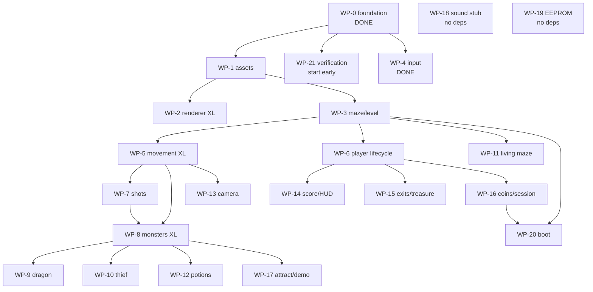

# gauntpy — Implementation Plan

A Python reimplementation of Gauntlet II, built from this repository's
reverse-engineering documentation. This document is the work breakdown: it is
written so that each work package can be handed to a separate agent with no
context beyond this file, the referenced docs, and the existing skeleton.

---

## 1. Goal and non-goals

**Goal.** A playable Gauntlet II that keeps the *structure* of the original: the
same main-loop call order, the same object model, the same tables, thresholds,
and state machines. Someone who knows the disassembly should be able to find
their way around this codebase by name.

**In scope**

- The full 60 Hz simulation: players, monsters, generators, the dragon, the
  thief, the living maze, shots, potions, doors, transporters, forcefields,
  exits, treasure rooms, scoring, attract mode, demo playback.
- Graphics read from the original ROMs through `gex`, composited in software.
- Deterministic, headless-testable simulation.

**Out of scope**

- **Audio synthesis.** WP-18 models the command queue, speech gates, retries,
  and deterministic host log; waveform generation remains a host concern.
- **CPU or hardware emulation.** We reimplement behaviour, not instructions.
  No 68010, no MMU, no cycle counting.
- **The OS ROM's operator UI**, self-test screens, and diagnostics. The EEPROM
  options *word* matters (it feeds difficulty and pricing); the menus to edit
  it do not.
- **Bit-exact video timing.** We composite a frame; we do not model the beam.

**Non-negotiable:** no ROM images, ROM-derived data tables, or copyrighted
assets get committed to this repository. Tables are transcribed from the
documentation as source code with citations; pixels are read from the user's own
ROMs at runtime.

---

## 2. Why this is tractable

Two facts shape the whole plan:

1. **The graphics half is already solved.** `../python-gex` extracts and renders
   tiles, stamps, floors, walls, items, monsters, and all 117 mazes from the
   ROMs, with a comprehensive regression suite and pixel-exact golden images. We
   consume it as a library and do not reinvent any of it.
2. **The logic half is documented at specification depth.** `doc/08_known_issues.md`
   has an empty active backlog. What is documented is pinned to exact addresses,
   tables, and thresholds — enough to port from, not merely to summarize.

The completed port translates that specification into simulation subsystems and
a software compositor for the original hardware's video behavior.

---

## 3. Architecture

```
                 host shell (pygame)            WP-2
                        │            ▲
   player_input_raw     │            │ framebuffer
                        ▼            │
        ┌──────────────────────────────────────┐
        │  tick(state)                         │  mainloop.py  (DONE)
        │    game_frame(state):                │
        │      3 calls, always                 │
        │      if dialog_timer == 0:           │
        │          16 gameplay calls           │
        │      9 calls, always                 │
        │    check_frame_overflow(state)       │
        └──────────────────────────────────────┘
                        │            ▲
                        ▼            │
        ┌──────────────────────────────────────┐
        │  GameState                           │  state.py     (DONE)
        │   MobTable  ── depth chain / SLIPs   │  mob.py       (DONE)
        │   Player[4]                          │
        │   GameRandom (LCG)                   │  rng.py       (DONE)
        └──────────────────────────────────────┘
                        │
                        ▼
        ┌──────────────────────────────────────┐
        │  assets  ──►  gex                    │  WP-1
        └──────────────────────────────────────┘
```

`game_frame` is a plain function that calls subsystems **by name, directly** —
not a table something walks. The call order is load-bearing and is expressed as
ordinary sequential code, so a stack trace names real functions and a reader can
follow a frame top to bottom. ROM addresses live in comments beside each call.

### Ground rules

These exist so twenty work packages can land without merge conflicts or
architectural drift. They are not style preferences.

1. **Reuse subsystem APIs.** The temporary implementation-wave isolation rule
   has been lifted. Shared persistent state still belongs in `GameState`;
   behavior owned by another subsystem should be called rather than copied.
2. **Every main-loop call is implemented** in `subsystems/`, with the ROM's
   name, address, and references. `mainloop.py` wires all 28 calls directly in
   ROM order.
3. **Use the documentation's names.** See §4 — this is the rule most likely to
   be broken by accident, so it has its own section.
4. **Cite every non-obvious constant** in a comment: the doc section, the ROM
   address, or both. A magic number without a citation is a bug report.
5. **Integers only.** No floats anywhere in the simulation. The original is
   fixed-point and integer throughout; a float will diverge silently.
6. **Mask on write where width is observable.** Health and score are 32-bit;
   nearly everything else is a 16-bit word that wraps.
7. **The simulation core imports nothing.** No pygame, no gex, no PIL inside
   `state.py`/`mob.py`/`coords.py`/`rng.py`/subsystem logic. Rendering reads
   state; it is never read *by* state.
8. **When the docs and the ROM disagree, the ROM wins** — and you file the
   correction back into `doc/`. See §8.

### Repository layout

```
gauntpy/
  PLAN.md              this file
  README.md
  pyproject.toml
  src/gauntpy/
    constants.py       enums, slot map, timing         DONE
    coords.py          three coordinate systems        DONE
    rng.py             the game's LCG                  DONE
    mob.py             slot table + depth chain        DONE
    state.py           GameState / Player              DONE
    mainloop.py        g2mainloop / game_frame / tick  DONE
    assets.py          gex bridge                      WP-1
    maze.py            gex maze/ROM-data bridge        WP-3
    render/            compositor + host shell         WP-2
    subsystems/
      __init__.py      subsystem package               DONE
      input.py         WP-4, the worked example        DONE
      players.py       WP-5 + WP-6                     DONE
      shots.py         WP-7                            DONE
      monsters.py      WP-8                            DONE
      dragon.py        WP-9                            DONE
      thief.py         WP-10                           DONE
      maze_objects.py  WP-11                           DONE
      potions.py       WP-12                           DONE
      camera.py        WP-13                           DONE
      score.py         WP-14                           DONE
      exits.py         WP-15                           DONE
      session.py       WP-16                           DONE
      attract.py       WP-17                           DONE
      sound.py         WP-18                           DONE
      eeprom.py        WP-19                           DONE
      boot.py          WP-20                           DONE
  tests/
```

---

## 4. Names

**Use the names from `doc/` and `book/`.** Functions, variables, data tables,
constants, enum members. If the documentation calls it `main_move_monsters`,
`resolve_shot_hit`, `mob_state_link`, `forcefield_damage_table`, or
`monster_slowmo_timer`, so do we. A reader with the disassembly open should
never have to translate, and a `grep` for a documented name should find its
implementation.

This is the rule most easily broken by accident — plausible-sounding synonyms
(`MobType` for `MazeObjIds`, `raw_input` for `player_input_raw`, `bonus_mult`
for `player_bonusmult`) creep in when you are writing from memory rather than
from the page. Several did during the skeleton and were corrected. **Check the
doc's spelling before you invent one.**

### The one systematic transformation

Where a container already supplies the prefix, drop it — and only then:

| Documentation | In code | Because |
|---------------|---------|---------|
| `player_health`, `player_score`, `player_keysnum` | `Player.health`, `.score`, `.keysnum` | the `Player` is the `player_` |
| `mob_picture`, `mob_hpos`, `mob_link`, `mob_state_link` | `MobTable.picture`, `.hpos`, `.link`, `.state_link` | the `MobTable` is the `mob_` |
| `mob_depth_list_head` | `MobTable.depth_list_head` | same |
| `GAMEMODE_NORMAL`, `GAMEMODE_TREAS_EXIT` | `GameMode.NORMAL`, `.TREAS_EXIT` | the enum is the `GAMEMODE_` |

Everything that lives directly on `GameState` keeps its documented name in
full: `game_mode`, `dialog_timer`, `frame_overflow`, `frame_counter`,
`player_input_raw`, `debounce_shift_magic`, `monster_slowmo_timer`,
`monster_iter_ptr`, `death_hits`, `levelnum_current`, `mazenum_current`.

### Deliberate deviations

Only two, both recorded here so they do not look like drift:

| Ours | Docs | Why |
|------|------|-----|
| `MobTable.slip_heads` | `priority_bucket_heads` | "SLIP" is Atari's own term, used by Ed Logg and by MAME's motion-object device; `book/08` uses it throughout and notes `priority_bucket_heads` as the documentation/r2-loader alias. |
| `MazeObjIds` | `MAZEOBJ_*` | Matches `gex.constants.MazeObjIds` value-for-value. Existing Python in this repository wins over the C-style prefix. |

Anything you name that has **no** documented equivalent (helpers, coordinate
conversions, test fixtures) is yours to name well — just don't collide with a
documented name that means something else.

---

## 5. Current status

**Landed (WP-0).** The skeleton is real code, not pseudocode: 71 tests pass.

- Three coordinate systems and the packed MOB word layouts.
- `MobTable`: five parallel arrays, the doubly linked depth chain, 64
  cumulative SLIP band heads, `insert`/`unlink`/`unlink_and_clear`/`move_slot`/
  `create`.
- `GameRandom`: the LCG from `random_core` (0x5FC2C), bit-exact for bounds
  ≤ 0x7FFF.
- `game_frame`: all 28 calls in ROM order as straight-line code, the dialog
  gate as a literal `if`, and `check_frame_overflow`'s set-and-decay.
- All subsystem modules and main-loop calls, carrying their ROM addresses and
  documentation references.
- `subsystems/input.py`: `input_debounce` implemented — the worked example.

Run it:

```bash
cd gauntpy && PYTHONPATH=src python -m gauntpy
```

```bash
cd gauntpy && PYTHONPATH=src python -m pytest tests -q
```

**Three classes of error were already caught while writing the skeleton**, which
is a fair preview of the work:

- The `GameMode` values — SCORES/TITLE/DEMO/LEGEND are −1/−2/−3/−4, not a
  contiguous block.
- Input polarity — the switches are **active low**, so `0x1C` is three frames
  released then two held, not the reverse.
- Naming drift — `MobType`/`raw_input`/`bonus_mult` invented where
  `MazeObjIds`/`player_input_raw`/`player_bonusmult` already existed. Hence §4.

The first two read plausibly wrong and break everything downstream; the third
is silent and only hurts the next reader.

---

## 6. Work packages

Each package lists the main-loop calls it **owns** — no two packages own the
same call, which is what keeps them independent.

Effort: **S** ≈ a focused session · **M** ≈ a few · **L** ≈ substantial ·
**XL** ≈ the hard ones.

### Phase A — foundations (unblocks everything)

---

#### WP-1 · ROM and asset bridge · **M** · deps: none

**Owns:** no loop calls. Delivers `src/gauntpy/assets.py`.

Wrap `gex` behind an interface the renderer and subsystems can use, so gex's
CLI-oriented API never leaks into game code.

- `AssetStore.tile(number)` → decoded 8×8 tile pixels; `stamp(...)` for
  multi-tile sprites; `palette(kind, index)`.
- Sprite lookup **by MOB picture number**, which is what the simulation stores.
  gex is organized by name (`ghost-walk-up`); build the number→sprite mapping
  from the animation tables in `doc/05_data_reference.md` §7.
- Cache aggressively: decode each tile once.
- Fail with a clear, actionable error when `GEX_ROM_DIR` is unset or ROMs are
  missing — this is the first thing a new contributor will hit.

**References:** `../python-gex/README.md`, `src/gex/{roms,render,palettes}.py`;
`doc/05_data_reference.md` §7 (animation tables).

**Acceptance:** given ROMs, round-trip a known tile and compare against a gex
reference image byte-for-byte. Given no ROMs, every test in this package skips
cleanly rather than erroring.

---

#### WP-2 · Display compositor and host shell · **XL** · deps: WP-1

**Owns:** no loop calls (rendering happens after `tick()`, not inside it).
Delivers `src/gauntpy/render/`.

**This is the single largest piece of genuinely new work**, because the
original's compositor was hardware. Everything else in this plan is
translation; this is design.

Build, in order:

1. **Playfield layer.** 64×64 grid of 8×8 tiles, column-first, from the tile
   descriptors. Camera scroll applied at blit time.
2. **MOB layer.** Walk the depth chain and draw in chain order — that ordering
   *is* the draw priority. Use the SLIP band heads to skip MOBs outside the
   visible bands, which is what the hardware did and what keeps this fast.
3. **Alpha/HUD layer.** The text overlay: scores, health, player names, the
   message box.
4. **Priority and shadowing** between layers, per `doc/01_hardware.md` §8.
5. **Host shell.** pygame window, 336×240 logical resolution scaled up, input
   mapped into `state.player_input_raw` (active low!), and a 60 Hz pump that
   calls `tick(state)` then presents. Supplying `wait_for_vblank`/`present` lets
   you use `g2mainloop(state, host)` directly; anything else should call
   `tick()` itself.

Keep the compositor a pure function of `GameState` + `AssetStore` → framebuffer.
That makes it testable headlessly and lets a future contributor swap pygame for
something else without touching game code.

**References:** `doc/01_hardware.md` §8 (display composition, MOB shadowing,
layer priority); `book/04_display_system.md`; `doc/04_game_subsystems.md` §13
(tile rendering pipeline), §23.3 (playfield RAM mapping), §24 (SLIPs).

**Acceptance:** render a decoded maze with no MOBs and match a gex `genpfimage`
reference. Place overlapping sprites at known depths and assert draw order
matches chain order. Sustain 60 fps with 100+ MOBs on a normal laptop.

---

#### WP-3 · Maze and level system · **L** · deps: WP-1

**Owns:** no loop calls; provides `load_level(state, level_number)` called at
level transitions.

- `find_maze` (0x40C78): level → maze number → Slapstic bank + pointer. The
  EEPROM-backed selection algorithm and the full 117-maze table are in
  `doc/06_maze_catalog.md`; **reuse gex's decoder** rather than porting it.
- `maze_new_level_setup` (0x438AE): the full setup order.
- `maze_place_object(start_slot, object_type, count)` → next slot in D0.
- **Row 0 fill.** Decode starts at slot 0x20; setup then calls
  `maze_place_object(0, 2, 0x20)` to fill slots 0–31 with solid-wall markers,
  keeping the playable maze off the reserved block. Verified by MAME write
  watches (SOL-02).
- `maze_load_pickup_config` (0x436FE): level flags load and randomization.
- Populate `MobTable` from the decoded maze: **slot number = packed cell
  address**, so placement is arithmetic.

**References:** `doc/04_game_subsystems.md` §5; `doc/06_maze_catalog.md`;
`../python-gex/src/gex/mazedecode.py`; `book/09_mazes_and_slapstic.md`.

**Acceptance:** all 117 mazes load without error; decoded cell contents match
gex's decoder exactly for every maze; slots 0–31 are wall markers after setup;
level→maze selection reproduces the documented table.

---

#### WP-4 · Input · **DONE**

**Owns:** `input_debounce`. See `subsystems/input.py` — the reference for what
a finished package looks like: ROM names, cited constants, the polarity pinned
down in tests, and no empty implementation body.

---

### Phase B — the world moves (needs A)

---

#### WP-5 · Player movement and collision · **XL** · deps: WP-3

**Owns:** the movement half of `main_move_players` (0x4A53A). Coordinate with
WP-6, which owns the rest of that call; agree on a single entry point and split
internally.

The most intricate geometry in the game.

- `player_try_move(player_index, delta, movement_flags)` → `0x00F0` means no
  movement; anything else means it moved.
- The four `mob_probe_*` leaves (up 0x406B6, down 0x40732, left 0x4083A,
  right 0x408A0) → first blocking slot, or −1 when clear. **Each branches to
  the shared candidate helper exactly three times**: the cell ahead plus its two
  flanking neighbours, which covers everything a 24-pixel body can overlap while
  crossing a 16-pixel cell. Up/down can also return `0x0400` at the vertical
  boundary — callers must not treat every non-negative value as a slot.
- Diagonal movement, the squeeze-through corner check, the four ray marchers.
- Door traversal (`door_traverse_{left,right,up,down}`) and the per-player door
  endpoint records.
- Wraparound levels (LFLAG4 bits 4–5) — the maze is a torus.

Ignore the original's register-passing conventions; they are an artifact of
68010 codegen. Port the *logic*, use normal Python arguments.

**References:** `doc/04_game_subsystems.md` §4.2, §23.4;
`doc/generated/player_collision_contracts.csv` (26 checked contracts);
`book/10_players.md`.

**Acceptance:** a player cannot enter a wall from any of eight directions;
diagonal movement into a corner behaves per the squeeze rule; a door with a key
opens and without one does not; wraparound levels wrap on both axes.

---

#### WP-6 · Player lifecycle, health, powers, tile interaction · **L** · deps: WP-3

**Owns:** `main_health_countdown` (0x466F6), `main_handle_death` (0x4664C), and
the lifecycle half of `main_move_players`.

- **Health drain is flat**: `subq.l #1` gated on `frame_counter & 0x3F` — one
  point per player per 64 frames, in every mode, with **no class or difficulty
  term**. The table formerly called `health_drain_table` is not this; see WP-7.
- Health is a **32-bit longword** at 0x904980, stride 4.
- Low-health warning cadence, the seven-word mask table at 0x576A8 selected by
  `health >> 5`, and the 8-frames-dim/8-frames-normal number pulse (whose
  cadence does *not* change with health).
- `player_damage_sample_update` (0x50E34): the signed 60-frame damage window,
  saturating at 0x7D00.
- Per-player status machine (`PlayerStatus`): selecting → alive → dying →
  respawn wait → removed, plus secret-room name entry.
- `player_join` (0x48BB6) → `player_start_inner` → `player_join_finalize`.
- `player_tile_interact` (0x511AC): the big dispatch — food (+100 health), keys,
  treasure, doors, transporters, exits, stun tiles, acid, slow-motion.
- Power-ups: `powerup_bit_masks` (0x59B64), invisibility flicker, IT mechanic
  (0x9049DC, 0xFFFF = nobody).
- Forcefield contact damage: `forcefield_damage_table` (0x5813C), indexed
  `character + 4 × armor-power` — values `{2,2,6,4}` unarmored, `{1,1,5,3}`
  armored.

**References:** `doc/04_game_subsystems.md` §4.1, §4.3–4.7; §21;
`doc/generated/player_runtime_contracts.csv`,
`player_lifecycle_contracts.csv`; `book/10_players.md`.

**Acceptance:** health drains at exactly one point per 64 frames regardless of
class or difficulty; food adds exactly 100; the forcefield table is indexed
correctly for all 8 combinations; a dying player runs the documented status
sequence and triggers the continue prompt when the last player leaves.

---

#### WP-7 · Shots and hit resolution · **L** · deps: WP-5

**Owns:** `main_handle_shots` (0x474F6).

- Twelve fixed projectile channels: player shots 1–4, demon 5–8, lobber 9–12.
  Fixed slots mean **no allocation and no search** — this is the design.
- Per-class motion, animation, lifetime, collision, removal.
- `resolve_shot_hit(target, shooter)` (0x4AF50) → 0 = shot survives
  (pierce/reflect), −1 = consumed. `target` is a MOB slot, or 0x400–0x7FF for a
  playfield tile.
- Damage: `shot_damage_base_tbl` (0x596B6) indexed by character (+8 with the
  shot-power upgrade): Warrior 2, others 1, upgraded 2; classes 2 and 8 add
  `getrandom(2)`. Supershot forces damage 3 and pierces everything except Death
  and IT.
- **Monster health is the target's own hpos low nibble.** Subtract damage from
  it; if the nibble leaves `[base−2, base]` from `mazeobj_hsize_tier_tbl`
  (0x5864C) the monster dies, otherwise it survives as a weaker tier. Ghost/
  grunt/aux 4, demon 8, lobber/sorc/supersorc 0xB, generators 5.
- Score = damage × class multiplier (ghost 10, grunt-class 5, Death/IT 1).
- Player victims: LFLAG4 bit 0 stuns (+0x28, clamp 0x5A), bit 1 hurts (−2 HP);
  monster shots index `monstshot_damage_tbl` (0x596CE) by
  `character + 4×armor + shot-tier + 8×(class ≥ 8)`.
- Death: every player shot bumps the global `death_hits`; a supershot adds 25
  to the per-player counter, Death contact adds 4 (3 with the power bit). The
  Death MOB is dismissed only when the counter exceeds 200 **strictly**.
- Movable walls: hit accumulator in units of 0x400, dissolving at 0x6400
  (25 hits).

The 62-entry dispatch table at 0x4B338 is a computed jump; a dict keyed by
object type is the natural Python equivalent.

**References:** `doc/04_game_subsystems.md` §26, §3.6;
`doc/generated/monster_combat_contracts.csv`; `book/11_monsters.md`.

**Acceptance:** every monster type dies after the documented number of hits at
each tier; supershot pierces but not through Death or IT; a wall takes exactly
25 hits; score awards match the multiplier table.

---

#### WP-8 · Monsters and generators · **XL** · deps: WP-5, WP-7

**Owns:** `main_move_monsters` (0x49034).

- `monsters_everything` (0x40E6A): walk the chain from `monster_iter_ptr`
  (0x904A60), which **rotates the entry point each frame** so no creature is
  permanently first. The walk runs to completion — it does **not** leave
  monsters unprocessed.
- **No jump table.** One shared handler (0x4119A) with branches: generators
  (types 28–45) → spawn code; super sorcerer (26) → placement/teleport; all
  others (18–25, 27) → shared handler.
- State from `mob_hpos` flag bits: bit 5 = moving, bit 4 = attacking, neither =
  idle. Both idle and attacking reach `monster_find_and_shoot` and both fall
  through to the same movement/collision body.
- Idle turn stagger: `((slot | 2) ^ frame) & 0x1E`.
- **`D6` is `monster_index × 4`, not an object type** — a byte offset with a
  four-byte stride into the ten-record tables. This is the single easiest thing
  in the whole project to get wrong; the docs flag it explicitly.
- Four special cases: Sorcerer (skips shooting, not movement — its moving-anim
  pointer is NULL, which is why it *looks* stationary), Acid (acts once every
  32 frames via mask 0x1E), IT (rate mask from `monster_oddangle_table`),
  Lobber (different attack animation table).
- Speeds: all families start at 0x80; LFLAG2 fast bits raise to 0x100 **only on
  frames where bit 1 of the working frame word is set**, so "fast" averages
  ~1.5×, not 2×. Odd-angle overrides from 0x40E02 under mask 0x73.
- `monster_slowmo_timer` (0x9048B2): while nonzero, the **entire monster pass is
  skipped on even frames**. Global, not a player debuff.
- Generators: turn stagger (one turn per 16 frames), then spawn probability
  `monster_spawn_probability_table[((settings & 0xE0) >> 3) + players − 1]` plus
  the signed bonus byte, clamped to `level × 2` except level 1, **forced to zero
  while `frame_overflow` is set**, compared against `getrandom(32)`.
- `handle_generate` (0x492C0): random starting cardinal direction, scan up to
  eight neighbours, require a traversable empty cell.
- `supersorc_place` (0x5FDE0): relocates rather than allocates; tries all four
  players cyclically, three directions behind each player's facing, with
  direction biases `{0,−1,+1}` and clear runs `{4,3,3}`.
- Culling rectangle (0x904A62/0x904A64) gates expensive behaviour like shooting
  for offscreen monsters — it does not skip their movement.

**References:** `doc/04_game_subsystems.md` §3 (all of it);
`doc/generated/monster_combat_contracts.csv`; `book/11_monsters.md`.

**Acceptance:** 60+ monsters simulate within frame budget; generators respect
the probability table for every difficulty × player-count combination; slow-mo
halves monster update rate without touching players; each of the four special
cases behaves per its documented branch.

---

#### WP-9 · Dragon · **M** · deps: WP-8

**Owns:** `main_handle_dragon` (0x54454). State machine, movement and attacks,
the fully decoded path system, and the dragon ROM data tables. Note it occupies
a 2-cell stride at decode time (gex's `expand` steps by 2 for `MONST_DRAGON`).

**References:** `doc/04_game_subsystems.md` §8;
`doc/generated/dragon_thief_exit_contracts.csv`; `book/12_dragon_thief_mugger.md`.

**Acceptance:** the state machine reaches every documented state; path following
matches the decoded path data.

---

#### WP-10 · Thief and mugger · **M** · deps: WP-8

**Owns:** `main_thief_anim` (0x4E8DC), `main_start_thief` (0x4DEB8).

- State machine, targeting (`thief_target_calc` 0x4DFF6), timer
  (`thief_timer_set` 0x4E4D8), scheduling (`thief_setup` 0x4E432).
- **Wealth calculation** picks the victim: shot power +0x3E8, extra speed
  +0x2BC, extra shot speed +0x1F4, extra magic +0x12C, extra armor +0xC8,
  extra fight +0x64, potions +3 each, bonus multiplier +1 each, keys +2 each.
- Scheduling gate: `game_mode` non-negative, maze < 0x73, level ≥ 6, and
  `getrandom(8) < level >> 3`.
- Entry time `(0xA − base + random) × 60` frames where
  `base = (player_score >> 13) / player_coincount`.
- `thief_stealable_power_masks` (0x5B62E): `{0x10,1,8,0x20,2,4}`, tested in
  order.
- The thief uses the **high nibble** of the direction grid for its private
  pathing.

**Open question:** the thief-mode enum names are unverified — no thief appeared
in the bounded level-1 attract corpus. Implement from disassembly and flag any
guess in a comment.

**References:** `doc/04_game_subsystems.md` §9, §23.4;
`doc/generated/thief_secret_contracts.csv`; `book/12_dragon_thief_mugger.md`.

**Acceptance:** targeting picks the wealthiest player by the exact formula; the
thief never appears before level 6; stolen powers follow the mask order.

---

#### WP-11 · The living maze · **L** · deps: WP-3, WP-5

**Owns:** `main_walls_cyclic_move` (0x5E62A), `main_walls_random_move`
(0x5E41A), `main_open_doors` (0x45C00), `main_cycle_tport_and_ffield` (0x40528).

- Cyclic and random wall movement, trap walls, the invisible-wall level flags.
- Wall connectivity/adjacency for rendering — **reuse gex's adjacency module**.
- Door opening, timers, and the idle-timeout `open_timed_doors` (removes every
  active type 0x0D/0x0E door and plays sound 0x12); trap-wall conversion at
  step counter 21000.
- Transporter animation and the teleportation sequence; route tables.
- Forcefield segment format and colour cycling.

**Note** (resolved SOL-10): transporter route cells and character portraits
share a padded region. Route IDs 1–32 reach offsets 0x02–0x2A and 0x00–0x14;
portraits start at 0x36. Spatial reuse of unreachable padding — not aliasing.

**References:** `doc/04_game_subsystems.md` §7, §18, §19;
`doc/generated/wall_door_contracts.csv`, `tport_forcefield_contracts.csv`;
`book/13_living_maze.md`.

**Acceptance:** cyclic walls follow their documented cycle; a transporter moves
a player to a valid destination on every route; forcefield colour cycling
matches the documented period.

---

#### WP-12 · Potions and magic · **M** · deps: WP-7, WP-8

**Owns:** `main_handle_potions` (0x46FEA).

The `potion_effect_matrix` (0x5DA98) is 28 records × 16 bytes for object types
0x12–0x2D, indexed
`(object_type << 4) + character + trigger_flags`, where bit 2 marks a
shot-triggered potion and bit 3 the enhanced-magic variant.

**A zero entry destroys the target outright** — this supersedes any "zero means
no effect" reading. For generators the byte *replaces* the type field and the
picture refreshes; for monsters it is damage against the hpos tier nibble. There
is no "no effect" encoding for monsters at all. Type 0x1B (IT) is filtered out
before the lookup, so its row is unreachable filler.

**References:** `doc/05_data_reference.md` (0x5DA98 entry — read it in full);
`doc/04_game_subsystems.md` §4.6.

**Acceptance:** all four characters × all reachable object types produce the
documented outcome; a potion always kills Death.

---

#### WP-13 · Camera · **S** · deps: WP-5

**Owns:** `main_scroll_playfield` (0x46CAA).

1. Bounding extent of active players, honouring wraparound.
2. **Rubber band:** extent may not expand more than 200 pixels (±0xC8); past
   that the far player is held at the screen edge.
3. Target the midpoint, offset so the maze viewport centres (not the screen).
4. Move 2 px per axis per frame, snap within a couple of pixels, clamp to the
   legal scroll range.

**References:** `doc/04_game_subsystems.md` §17; `book/08_world_in_memory.md`.

**Acceptance:** one player running away stops dragging the camera at 200 px;
camera never exceeds the playfield scroll clamps; wraparound levels track
correctly across the seam.

---

### Phase C — the game around the game (needs B)

---

#### WP-14 · Scoring, HUD, dialogs · **M** · deps: WP-6

**Owns:** `main_score_update` (0x4715E), `main_score_display` (0x457C0),
`main_msgbox_countdown` (0x4CCBC).

- Three indexed loops per frame plus the inline thief/effect transition pass
  (§25) — popup timers, per-player transition MOBs, effect animation counters.
- `player_add_score_with_mult` (0x5214C): adds `base × bonus_mult` to the 32-bit
  accumulator. It does **not** call `highscore_check`.
- Info panel, score display, floating score popups (fixed slots 17–20).
- Dialogs: first-encounter advice, the continue prompt, `dialog_timer`
  (a value of 1 forces immediate cleanup during transitions).

**References:** `doc/04_game_subsystems.md` §10, §14, §25;
`doc/generated/score_coin_dialog_contracts.csv`;
`book/14_score_and_economics.md`.

---

#### WP-15 · Exits, treasure rooms, secret rooms · **M** · deps: WP-6, WP-11

**Owns:** `main_exit_move` (0x5287C), `main_treasure_timer` (0x4D29E).

Exit sequence and animation (fixed slots 21–24), the moving exit and the fake
exit (LFLAG3/4), the exit position table, the treasure-room countdown and bonus
transition, and the two secret rooms (mazes 115/116 — challenge tasks 0x50–0x56
select 115, 0x57–0x5D select 116).

**References:** `doc/04_game_subsystems.md` §12, §16, §10.6;
`doc/06_maze_catalog.md`.

---

#### WP-16 · Coins, credits, session lifecycle · **M** · deps: WP-6

**Owns:** `coincheck` (0x42B6A), `main_start_game` (0x4800C),
`character_select_input_update` (0x42DF4).

- Coin detection and credit accounting; coins for an active player add health
  from the table at 0x57862 indexed by `game_settings & 0x1F`.
- Character selection and the join flow.
- **The start/join/commit press is on the Magic line**, matching
  `(debounce_magic & 0x1F) == 0x1C`. Not Fire — this was a documented
  correction. `subsystems/input.py` already provides `magic_press_edge`.
- First active player's class indexes the four bytes at 0x40E66: Warrior→3,
  Valkyrie→0, Wizard→4, Elf→0 and writes the result to
  `monster_spawn_probability_bonus`; later joins clear that byte. It does not
  initialize `player_bonusmult`, which remains at the reset value 1.

**References:** `doc/04_game_subsystems.md` §10.1, §22, §6.4;
`book/07_session_lifecycle.md`.

---

#### WP-17 · Attract mode and demo playback · **L** · deps: WP-5, WP-8

**Owns:** `main_attract` (0x44562), `main_logo_updcolors` (0x4DCBA).

The four attract screens (SCORES −1, TITLE −2, DEMO −3, LEGEND −4), their
timers, and the one-second input lockout (thresholds are exactly 60 frames below
each loaded timer, and gate **screen switching only**).

**Demo playback is the engine running on recorded inputs** — the same
`main_move_players` path, fed from per-player streams of `[timer, joystick]`
pairs, with `0xFF` = speech and `0xFE` = player switch/end. Demo bytes are
active low, like the hardware.

The five attract-interruption test blocks are tabulated in §6.4 — note they
restart *attract screens*; entering gameplay is a separate path with exactly
three callers.

**References:** `doc/04_game_subsystems.md` §6 (all), §14.3;
`doc/generated/startup_attract_contracts.csv`; `book/15_attract_and_demo.md`.

**Acceptance:** the demo plays a recognizable level-1 run from the recorded
stream; screens rotate on their documented timers; the input lockout blocks
screen switches but never blocks a coin.

---

#### WP-18 · Sound · **DONE**

**Owns:** `sound_response` (0x42D0A), `main_update_sound` (0x4AE20).

Implement the **command engine**, not the audio: `sound_play(id)` follows §11.1
exactly — with the recovery holdoff clear it hands the byte straight to the
board through `try_send_sound_command` and does *not* queue it; a busy latch or
a nonzero holdoff falls back to the seven-entry ring that the drain call
consumes. Either way the command is logged. This keeps the call sites honest so
real audio can land later without touching gameplay.

*Corrected:* the first pass read this brief as "`sound_play(id)` appends, the
drain call consumes" and always took the ring path. `doc/04_game_subsystems.md`
§11.1 (Verified) documents the immediate-send fast path, so `sound_log` — not
`sound_queue` — is the record of what the board was told, and tests assert
against the log.

- 219 command IDs (0x00–0xDA); command 0x00 = reinitialize/stop-all.
- Speech via `sound_speech_play`.
- `refs/soundcmds.csv` is the ID catalog.

**Acceptance:** an emitted-sound log lets other packages assert "this event
plays sound 0x37" — which turns sound into a *test oracle* rather than dead
weight.

---

#### WP-19 · EEPROM and configuration · **S** · deps: none

**Owns:** `eeprom_periodic_write` (0x431EE).

Persist to a local file. The options word (0x904A24) matters: bits 5–7 are
operator "Game Difficulty" (feeding generator spawn probability), bits 8–9 coins
to start. High-score tables and per-level maze selection read from here.

**References:** `doc/04_game_subsystems.md` §20; `doc/02_os_rom.md` (EEPROM
codec); `nvram/` for the real layout.

---

#### WP-20 · Boot and orchestration · **M** · deps: WP-3, WP-16

**Owns:** `one_time_init` (0x4327A).

RAM initialization (default characters `{0,1,2,3}`), display setup, the palette
init, the boot handoff (`game_start` 0x4014C), and level-transition
orchestration. Ties the packages into something you can actually launch into.

**References:** `doc/03_game_rom_structure.md` §5, §2.2;
`book/05_boot_and_os.md`.

---

### Phase D — verification (continuous, start early)

---

#### WP-21 · Verification harness · **L** · deps: WP-0 (start now)

**Owns:** no loop calls. The highest-leverage package after the foundations —
**do not leave it until the end.**

1. **Contract tests from the CSVs.** `tests/test_mainloop.py` already parses
   `game_frame` with `ast` and diffs the call order against
   `doc/generated/main_loop_contracts.csv` — fidelity without turning the loop
   into a data structure. Extend the pattern: every table transcribed into
   Python gets a test that checks it against the documented values.
2. **Golden frame traces.** Serialize `GameState` (chain order, positions,
   health, RNG seed) to a compact digest each frame; store goldens; diff on
   change. This catches "monsters now move one pixel differently" instantly.
3. **MAME cross-check.** The repository already has this workflow (see the
   2026-08-12 trace pass). For a fixed seed and scripted inputs, compare our
   per-frame values against MAME RAM watches at the documented addresses. This
   is how open thresholds get resolved.
4. **Property tests.** The chain is never cyclic; a slot is never in the chain
   twice; SLIP heads always point into the chain; health never exceeds bounds.

**Note:** the original's RNG seed is never initialized and free-runs, so nothing
in the real machine is reproducible by re-entering a mode. We seed explicitly.
When cross-checking against MAME, force the seed on both sides.

---

## 7. Dependency graph



**Suggested parallel waves**

| Wave | Packages | Notes |
|------|----------|-------|
| 1 | WP-1, WP-18, WP-19, WP-21 | No cross-dependencies; start all four at once. |
| 2 | WP-2, WP-3 | The two long poles. WP-2 is the biggest single risk. |
| 3 | WP-5, WP-6, WP-11 | Coordinate WP-5/WP-6 on the `main_move_players` split. |
| 4 | WP-7, WP-13, WP-16 | |
| 5 | WP-8, WP-14, WP-15 | WP-8 is the other XL. |
| 6 | WP-9, WP-10, WP-12, WP-17, WP-20 | Leaf packages; highly parallel. |

**First playable** ≈ WP-1, 2, 3, 5, 6, 13, 20: a hero walking a real maze with a
working camera. **First recognizable Gauntlet** adds WP-7, 8, 11.

---

## 8. Working with the documentation

**The docs are the specification.** `doc/` is authoritative and current; `book/`
is the same material in narrative form and is the better place to *start* a
package. `refs/GAME_ROM_KNOWN.md` is older and has been superseded where the two
disagree.

Read the confidence labels. **Verified** means checked against disassembly or
traces. **Contradicted** entries are corrections of earlier wrong claims — those
paragraphs are load-bearing and usually mark exactly the trap you were about to
fall into.

**When you need the ROM.** Some thresholds and branch conditions live only in
the disassembly. Load it with:

```bash
r2 -q -n -i doc/gauntlet_loader.r2 malloc://1
```

Prefer `pdf` over `pd n`, use plain-text output, and scan with Python rather
than r2's `/x` for large sweeps.

**When you find a discrepancy** between the docs and the ROM: the ROM wins.
Fix the code, then file the correction into the relevant `doc/` chapter with a
confidence label and evidence, exactly as the existing corrections are written.
That feedback loop is a first-class deliverable of this project, not a chore —
it is also how `doc/` got as good as it is.

**Do not** run `doc/make check` as part of this work unless you changed `doc/`;
it needs an r2 shim and `PYTHONUTF8` set on Windows.

---

## 9. Known risks and open questions

| Risk | Assessment |
|------|-----------|
| **The renderer (WP-2)** | The only component with no reference implementation. Everything else is translation. Budget accordingly and build it first among the large packages. |
| **Performance** | Pure-Python at 60 Hz with 100+ MOBs is plausible but not free. Keep the hot loops flat, avoid per-object allocation, and profile before optimizing. `MobTable.rebuild_slips()` is the known O(chain) shortcut and the first thing to make incremental if it shows up in a profile. |
| **Exact thresholds** | The docs cover behaviour thoroughly, but a handful of `≤` vs `<` questions will need the disassembly. Expect this and budget MAME/r2 time per package. |
| **Sprite number → gex asset mapping** | gex is organized by name; the simulation stores picture numbers. WP-1 must build this bridge from the animation tables, and it is more work than it sounds. |
| **Thief-mode enum names** | Explicitly unverified in `doc/08_known_issues.md` — no thief appeared in the bounded attract corpus. Implement from disassembly, flag guesses. |
| **RNG divergence** | Any accidental use of Python's `random`, a float, or a differently-ordered call sequence silently diverges the whole simulation. Route every random draw through `state.getrandom()`. |
| **Level flags** | Four flag words with many bits, several affecting subtle behaviour (odd-angle monsters, invisible walls, fake exits, wraparound). Easy to under-implement and hard to notice. Test flags explicitly rather than incidentally. |

---

## 10. Brief template for a subagent

> **Task: implement WP-N (<title>) for gauntpy.**
>
> Working directory: `<repo>/gauntpy`. Read `PLAN.md` §3 (ground rules), §4
> (names), and your package's entry in §6 before writing any code.
>
> Your module already exists: `src/gauntpy/subsystems/<name>.py`. Preserve its
> ROM-addressed contracts, reuse existing subsystem APIs and `GameState`, and
> do not alter `mainloop.py`'s ROM-ordered call sequence.
>
> Also write `tests/test_<name>.py`.
>
> You own these calls and no others: `<list>`. Do not modify `mainloop.py`,
> `mob.py`, `coords.py`, `rng.py`, or another package's subsystem module — if
> you believe one is wrong, say so rather than editing it. If you need new
> fields on `GameState`, add them to `state.py` with a doc-name and address
> comment; that file is shared, so keep additions minimal and additive.
>
> Primary references: `<doc sections>`. **Read the "Contradicted and corrected"
> notes in those sections before writing code** — they mark places where an
> earlier, plausible-looking reading was proven wrong, and they are usually
> exactly the trap your package is about to fall into.
>
> Rules: use the documentation's names for functions, variables, and data
> tables (§4) — check the doc's spelling rather than inventing a synonym; cite
> every non-obvious constant with its doc section or ROM address; integers
> only, no floats; route all randomness through `state.getrandom()`; do not
> import other subsystem modules.
>
> Acceptance criteria: `<from the WP entry>`. All existing tests must still
> pass: `PYTHONPATH=src python -m pytest tests -q`.
>
> If the documentation is ambiguous or contradicts the ROM, stop and report it
> rather than guessing. A flagged unknown is worth more than a plausible
> invention.

---

## 11. License

GPL-3.0, matching the rest of the repository. No ROM data is included or may be
committed.
